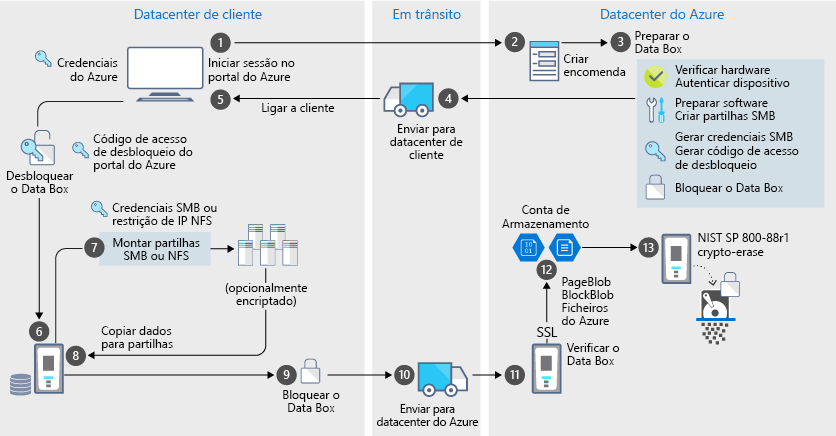

# Proteção de dados e segurança do Azure Data Box

O Data Box oferece uma solução segura para proteção de dados ao garantir que apenas as entidades autorizadas podem ver, modificar ou eliminar os seus dados. Este artigo descreve as funcionalidades de segurança do Azure Data Box que ajudam a proteger todos os componentes da solução Data Box e os respetivos dados armazenados. 

[!INCLUDE [GDPR-related guidance](../../includes/gdpr-intro-sentence.md)]

## Fluxo de dados através dos componentes

A solução Microsoft Azure Data Box é composta por quatro componentes principais que interagem entre si:

- **Serviço Azure Data Box alojado no Azure** – O serviço de gestão que utiliza para criar a encomenda dos dispositivos, configurar os dispositivos e, em seguida, controlar a encomenda até à conclusão.
- **Dispositivo Data Box** – O dispositivo de transferência que é enviado para si para importar os dados no local para o Azure. 
- **Clientes/anfitriões ligados ao dispositivo** – Os clientes na sua infraestrutura que ligam ao dispositivo Data Box e contêm dados que precisam de ser protegidos.
- **Armazenamento na cloud** – A localização na cloud do Azure onde os dados são armazenados. Normalmente, trata-se da conta de armazenamento ligada ao recurso do Azure Data Box que criou.

O diagrama seguinte indica o fluxo de dados através da solução Azure Data Box do local para o Azure.

## Funcionalidades de segurança

O Data Box oferece uma solução segura para proteção de dados ao garantir que apenas as entidades autorizadas podem ver, modificar ou eliminar os seus dados. As funcionalidades de segurança desta solução destinam-se ao disco e ao serviço associado para garantir a segurança dos dados armazenados nos mesmos. 

### Proteção do dispositivo do Data Box

O dispositivo do Data Box está protegido pelas seguintes funcionalidades:

- Uma caixa robusta para o dispositivo resistente a choques, transporte adverso e condições ambientais. 
- Selos invioláveis para garantir que nenhum dispositivo é adulterado durante o envio.
- Deteção de adulteração de hardware e software que impede outras operações do dispositivo.
- Executa apenas o software específico do Data Box.
- Arranca num estado bloqueado.
- Controla o acesso do dispositivo através da palavra-passe de desbloqueio do dispositivo.
- Credenciais de acesso para copiar dados dentro e fora do dispositivo.

### Proteção de dados do Data Box

O fluxo de dados de entrada e saída do Data Box está protegido pelas seguintes funcionalidades:

- Encriptação AES de 256 bits para Dados inativos. 
- Os protocolos encriptados podem ser utilizados para dados em trânsito.
- Eliminação segura de dados do dispositivo após a conclusão do carregamento de dados para o Azure. A eliminação de dados está em conformidade com as normas 800-88r1 do NIST.

### Proteção do serviço Data Box

O serviço Data Box está protegido pelas seguintes funcionalidades.

- O acesso ao serviço Data Box requer que a sua organização tenha uma subscrição do Azure que inclua o Data Box. A subscrição controla as funcionalidades a que pode aceder no portal do Azure.
- Uma vez que o serviço Data Box está alojado no Azure, é protegido pelas funcionalidades de segurança do Azure. Para obter mais informações sobre as funcionalidades de segurança fornecidas pelo Microsoft Azure, aceda ao [Centro de Fidedignidade do Microsoft Azure](https://www.microsoft.com/TrustCenter/Security/default.aspx). 
- O serviço Data Box armazena a palavra-passe desbloqueada que serve para desbloquear o dispositivo no serviço. 
- O serviço Data Box armazena os detalhes da encomenda e o estado no serviço. Estas informações são eliminadas quando a encomenda é eliminada. 

## Gerir dados pessoais

O Azure Data Box recolhe e apresenta informações pessoais nas seguintes instâncias-chave no serviço:

- **Definições de notificação** – Quando cria uma encomenda, pode configurar o endereço de e-mail dos utilizadores nas definições de notificação. Estas informações podem ser visualizadas pelo administrador. Estas informações são eliminadas pelo serviço quando a tarefa atinge o estado terminal ou ao eliminar a encomenda.

- **Detalhes da encomenda** – Depois de criada a encomenda, o endereço de envio, o e-mail e as informações de contacto dos utilizadores são armazenados no portal do Azure. As informações guardadas incluem:

    - Nome do contacto
    - Número de telefone
    - Email
    - Morada
    - Localidade
    - Código postal
    - Estado
    - País/Província/Região
    - Número de conta da operadora
    - Número de controlo de envio

    Os detalhes da encomenda são eliminados pelo serviço Data Box quando a tarefa é concluída ou ao eliminar a encomenda.

- **Endereço de envio** – Depois de realizada a encomenda, o serviço Data Box oferece o endereço de envio a operadoras de terceiros, como UPS ou DHL. 

Para obter mais informações, reveja a política de privacidade da Microsoft no [Centro de Fidedignidade](https://www.microsoft.com/trustcenter).

## Referência das diretrizes de segurança

As seguintes diretrizes de segurança são implementadas no Data Box: 

|Diretriz   |Descrição   |
|---------|---------|
|[IEC 60529 IP52](http://www.iec.ch/)    | Para proteção contra água e poeira         |
|[ISTA 2A](https://ista.org/docs/2Aoverview.pdf)     | Para resistir a condições de transporte adversas          |
|[NIST SP 800-147](http://nvlpubs.nist.gov/nistpubs/Legacy/SP/nistspecialpublication800-147.pdf)      | Para a atualização de firmware seguro         |
|[FIPS 140-2 Level 2](https://csrc.nist.gov/csrc/media/publications/fips/140/2/final/documents/fips1402.pdf)      | Para proteção de dados         |
|[NIST SP 800-88r1](http://nvlpubs.nist.gov/nistpubs/SpecialPublications/NIST.SP.800-88r1.pdf)      | Para a limpeza de dados         |

## Passos seguintes

- Reveja os [Requisitos do Data Box](data-box-system-requirements.md).
- Compreenda os [limites do Data Box](data-box-limits.md).
- Implemente rapidamente o [Azure Data Box](data-box-quickstart-portal.md) no portal do Azure.
