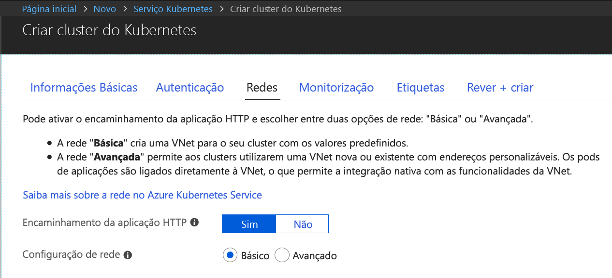
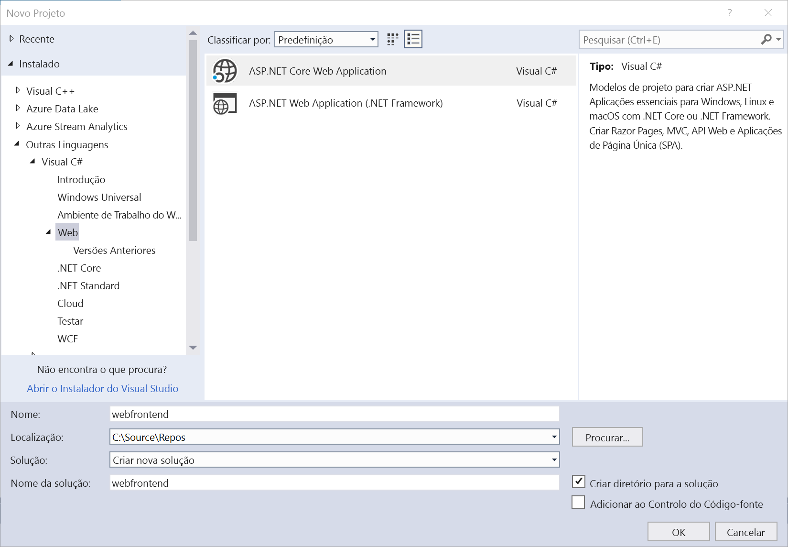
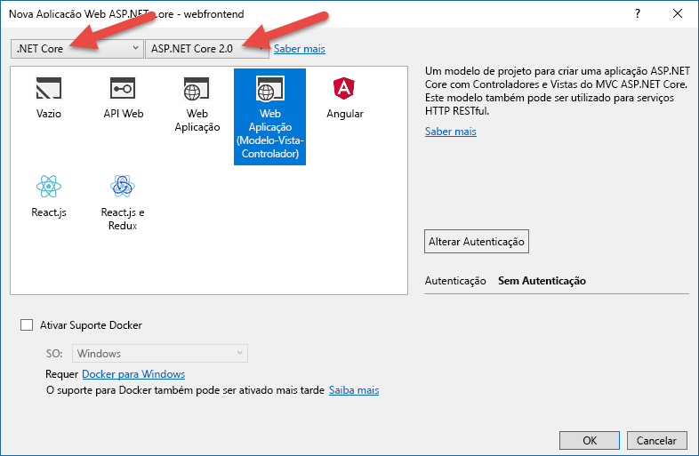
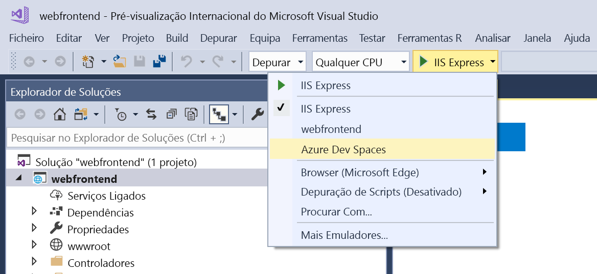
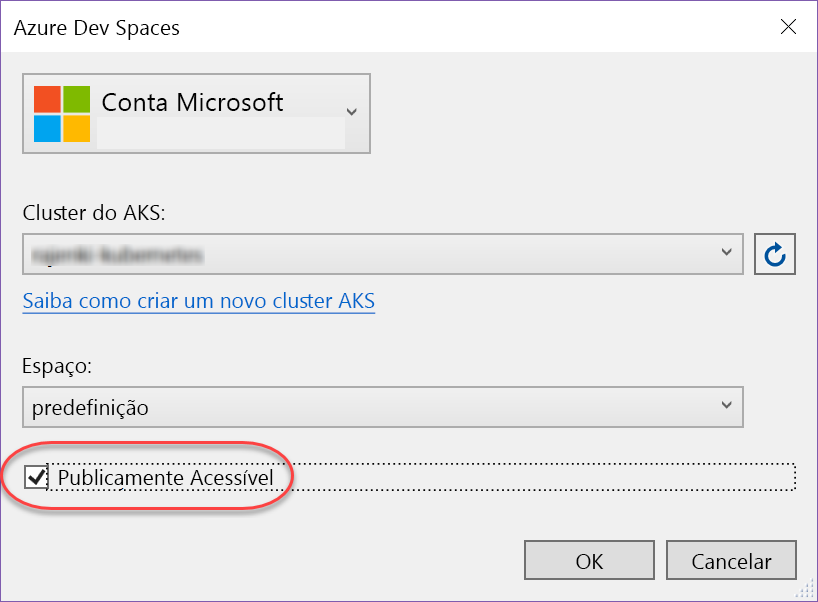
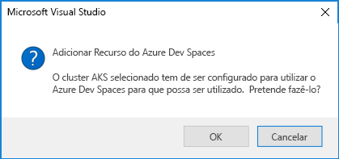
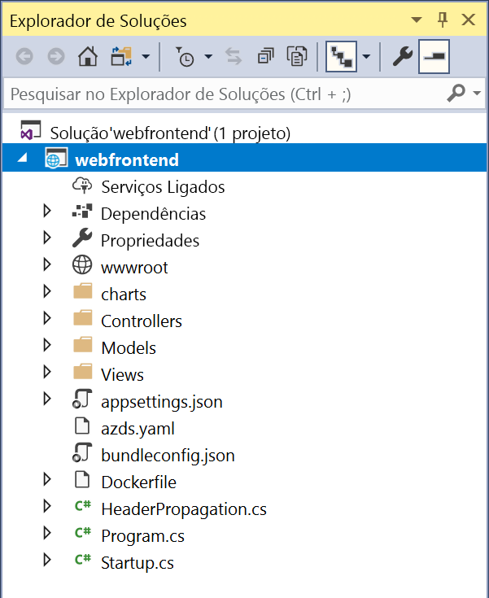

# Introdução ao Azure Dev Spaces com o .NET Core e o Visual Studio

Neste guia, vai aprender a:

- Configurar os Espaços de Programador do Azure com um cluster Kubernetes gerido no Azure.
- Utilizar o Visual Studio para desenvolver iterativamente código em contentores.
- Desenvolver de modo independente dois serviços separados e utilizar a deteção do serviço DNS de Kubernetes para fazer uma chamada para outro serviço.
- Desenvolver e testar de forma produtiva o seu código num ambiente de equipa.

> [!Note]
> **Se ficar bloqueado** em qualquer altura, veja a secção [Resolução de problemas](troubleshooting.md) ou publique um comentário nesta página.

## Criar um cluster do Kubernetes ativado para os Espaços de Programador do Azure

1. Inicie sessão no portal do Azure em http://portal.azure.com.
1. Escolha **Criar um recurso** > procure **Kubernetes** > selecione **Serviço Kubernetes** > **Criar**.

   Conclua os passos seguintes, descritos abaixo de cada um dos títulos do formulário para criar o cluster de AKS.

    - **DETALHES DO PROJETO**: selecione uma subscrição do Azure e um grupo de recursos, novo ou existente, do Azure.
    - **DETALHES DO CLUSTER**: introduza um nome, região (atualmente, tem de escolher EUALeste, EUALeste2, EUACentral, EuropaOcidental, EUAOcidental2, SudesteAsiático, CanadaCentral ou CanadaLeste), a versão e o prefixo de nome de DNS para o cluster do AKS.
    - **DIMENSIONAMENTO**: selecione um tamanho da VM para os nós de agente do AKS e o número de nós. Se está a começar de utilizar os Espaços de Programador do Azure, basta um nó para explorar todas as funcionalidades. A contagem de nós pode ser facilmente ajustada em qualquer altura depois de o cluster ser implementado. Note que o tamanho da VM não pode ser alterado após a criação de um cluster de AKS. No entanto, depois de um cluster de AKS ser implementado, pode criar facilmente um novo cluster de AKS com VMs maiores e utilizar Espaços de Programador para voltar a implementar para esse cluster maior, se precisar de aumentar verticalmente.

   Certifique-se de que escolhe a versão 1.9.6 ou posterior do Kubernetes.

   

   Selecione **Seguinte: Autenticação** quando terminar.

1. Escolha a definição pretendida para controlo de acesso baseado em funções (RBAC). Os espaços de desenvolvimento do Azure suportam clusters com RBAC ativado ou desativado.

    

1. Certifique-se de que o Encaminhamento de Aplicações Http está ativado.

   

    > [!Note]
    > Para habilitar o [Encaminhamento de Aplicações Http](/azure/aks/http-application-routing) num cluster existente, utilize o comando: `az aks enable-addons --resource-group myResourceGroup --name myAKSCluster --addons http_application_routing`

1. Selecione **Rever + criar** e, em seguida, selecione **Criar** quando terminar.

## Obter as ferramentas do Visual Studio
1. Instale a versão mais recente do [Visual Studio 2017](https://www.visualstudio.com/vs/)
1. No instalador do Visual Studio, certifique-se de que a seguinte Carga de Trabalho está selecionada:
    * Desenvolvimento ASP.NET e Web
1. Instale as [Ferramentas do Visual Studio para Kubernetes](https://aka.ms/get-azds-visualstudio)

## Criar uma aplicação Web em execução num contentor

Nesta secção, vai criar uma aplicação Web em ASP.NET Core e executá-la num contentor no Kubernetes.

### Criar uma aplicação Web ASP.NET

No Visual Studio 2017, crie um projeto novo. Atualmente, o projeto tem de ser uma **aplicação Web ASP.NET Core**. Atribua o nome "**webfrontend**" ao projeto.

Selecione o modelo **Web Application (Model-View-Controller)** (Aplicação Web (Controlador de Vista de Modelo)) e certifique-se de que está a apontar para **.NET Core** e **ASP.NET Core 2.0** nos dois menus pendentes na parte superior da caixa de diálogo. Clique em **OK** para criar o projeto.

### Ativar os Espaços de Programador para um cluster do AKS

Com o projeto que acabou de criar, selecione **Azure Dev Spaces** no menu pendente de definições de início, conforme mostrado abaixo.

Na caixa de diálogo apresentada a seguir, certifique-se de que tem sessão iniciada com a conta adequada e, em seguida, selecione um cluster Kubernetes existente.

Por agora, mantenha a predefinição `default` no menu pendente **Space** (Espaço). Vai aprender mais sobre esta opção posteriormente. Selecione a caixa de verificação **Publicly Accessible** (Acessível Publicamente) para que a aplicação Web seja acessível a partir de um ponto final público. Esta definição não é obrigatória, mas será útil para demonstrar alguns conceitos mais adiante nestas instruções. Mas não se preocupe. Em qualquer caso, poderá depurar o seu site com o Visual Studio.

Clique em **OK** para selecionar ou criar o cluster.

Se optar por um cluster que não tenha sido preparado para funcionar com o Azure Dev Spaces, ser-lhe-á apresentada uma mensagem a perguntar se pretende configurá-lo.

Escolha **OK**.

> [!IMPORTANT]
> O processo de configuração de espaços de desenvolvimento do Azure irá remover o `azds` espaço de nomes do cluster, se existir.

 Será iniciada uma tarefa em segundo plano para executar essa configuração. Esta operação demorará alguns minutos a ser concluída. Para ver se ainda está a ser criado, faça pairar o ponteiro sobre o ícone **Background tasks** (Tarefas em segundo plano) no canto inferior esquerdo da barra de tarefas, conforme mostrado na imagem abaixo.

> [!Note]
> Não pode depurar a sua aplicação enquanto o espaço não estiver criado.

### Ver os ficheiros adicionados ao projeto
Enquanto aguarda pela criação do espaço de programador, veja os ficheiros que foram adicionados ao projeto quando optou por utilizar o espaço de programador.

Em primeiro lugar, pode ver que foi adicionada uma pasta com o nome `charts` e que, dentro desta, foi estruturado um [gráfico de Helm](https://docs.helm.sh) para a sua aplicação. Estes ficheiros são utilizados para implementar a aplicação no espaço de programador.

Verá que foi adicionado um ficheiro com o nome `Dockerfile`. Este ficheiro tem as informações necessárias para empacotar a aplicação no formato padrão do Docker.

Por último, verá um ficheiro denominado `azds.yaml`, que contém a configuração em tempo de desenvolvimento que é exigida pelo espaço de programador.

## Depurar um contentor no Kubernetes
Assim que o ambiente de programador estiver criado, pode depurar a aplicação. Defina um ponto de interrupção no código, por exemplo, na linha 20 do ficheiro `HomeController.cs` no qual está definida a variável `Message`. Clique em **F5** para iniciar a depuração. 

O Visual Studio vai comunicar com o espaço de programador para criar e implementar a aplicação e, em seguida, vai abrir um browser com a aplicação Web em execução. Poderá parecer que o contentor está a ser executado localmente. Contudo, na verdade, está a ser executado no espaço de programador no Azure. O motivo para o endereço localhost deve-se ao facto de o Azure Dev Spaces criar um túnel SSH temporário para o contentor que está a ser executado no AKS.

Clique na ligação **About** (Acerca de) na parte superior da página para acionar o ponto de interrupção. Tem acesso total às informações de depuração, tal como aconteceria se o código estivesse a ser executado localmente, como, por exemplo, a pilha de chamadas, as variáveis locais, informações de exceção, etc.

## Desenvolver código de forma iterativa

O Azure Dev Spaces não se limita apenas a pôr o código em execução no Kubernetes. Tem que ver com permitir-lhe ver, de forma rápida e iterativa, as alterações ao código serem aplicadas num ambiente do Kubernetes na cloud.

### Atualizar um ficheiro de conteúdo
1. Localize o ficheiro `./Views/Home/Index.cshtml` e faça uma edição ao HTML. Por exemplo, altere a linha 70 que lê `<h2>Application uses</h2>` para algo semelhante a `<h2>Hello k8s in Azure!</h2>`
1. Guarde o ficheiro.
1. Aceda ao seu browser e atualize a página. Deverá ver a página Web mostrar o código HTML atualizado.

O que aconteceu? As edições aos ficheiros de conteúdos, como HTML e CSS, não requerem a recompilação numa aplicação Web .NET Core, pelo que uma sessão F5 ativa sincroniza automaticamente qualquer ficheiro de conteúdos modificado com o contentor em execução no AKS, de modo a que possa ver as edições aos conteúdos de imediato.

### Atualizar um ficheiro de código
A atualização de ficheiros de código exige mais algum trabalho, porque a aplicação .NET Core tem de ser recompilada e produzir binários de aplicação atualizados.

1. Pare o depurador no Visual Studio.
1. Abra o ficheiro de código com o nome `Controllers/HomeController.cs` e edite a mensagem que a página About (Sobre) vai apresentar: `ViewData["Message"] = "Your application description page.";`
1. Guarde o ficheiro.
1. Prima **F5** para iniciar novamente a depuração. 

Em vez de reconstruir e reimplementar uma imagem de contentor nova sempre que forem feitas edições ao código, o que, muitas vezes, irá demorar um tempo considerável, o Azure Dev Spaces recompilará incrementalmente o código dentro do contentor existente para proporcionar um ciclo de edição/depuração mais rápido.

Atualize a aplicação Web no browser e aceda à página About (Sobre). Deverá ver a mensagem personalizada apresentada na IU.

## Passos Seguintes

> [!div class="nextstepaction"]
> [Saiba mais sobre desenvolvimento em equipa](team-development-netcore-visualstudio.md)
