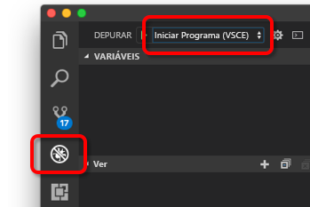

# <a name="get-started-on-azure-dev-spaces-with-nodejs"></a>Introdução ao Azure Dev Spaces com o Node.js

[!INCLUDE[](includes/learning-objectives.md)]

[!INCLUDE[](includes/see-troubleshooting.md)]

Está agora pronto para criar um ambiente de desenvolvimento baseado no Kubernetes no Azure.

[!INCLUDE[](includes/portal-aks-cluster.md)]

## <a name="install-the-azure-cli"></a>Instalar a CLI do Azure
O Azure Dev Spaces só precisa de configuração mínima do computador local. A maior parte da configuração do ambiente de desenvolvimento é armazenada na cloud e é partilhável com outros utilizadores. Comece por transferir e executar a [CLI do Azure](/cli/azure/install-azure-cli?view=azure-cli-latest).

> [!IMPORTANT]
> Se já tiver a CLI do Azure instalada, certifique-se de que está a utilizar a versão 2.0.32 ou superior.

[!INCLUDE[](includes/sign-into-azure.md)]

[!INCLUDE[](includes/use-dev-spaces.md)]

[!INCLUDE[](includes/install-vscode-extension.md)]

Enquanto aguarda pela criação do cluster, pode começar a escrever código.

## <a name="create-a-nodejs-container-in-kubernetes"></a>Criar um contentor de Node.js no Kubernetes

Nesta secção, vai criar uma aplicação Web em Node.js e executá-la num contentor no Kubernetes.

### <a name="create-a-nodejs-web-app"></a>Criar uma aplicação Web em Node.js
Transfira o código do GitHub ao navegar para https://github.com/Azure/dev-spaces e selecione **Clone or Download** (Clonar ou Transferir) para transferir o repositório do GitHub para o seu ambiente local. O código para este guia está em `samples/nodejs/getting-started/webfrontend`.

[!INCLUDE[](includes/azds-prep.md)]

[!INCLUDE[](includes/build-run-k8s-cli.md)]

### <a name="update-a-content-file"></a>Atualizar um ficheiro de conteúdo
O Azure Dev Spaces não se limita apenas a pôr o código em execução no Kubernetes. Tem que ver com permitir-lhe ver, de forma rápida e iterativa, as alterações ao código serem aplicadas num ambiente do Kubernetes na cloud.

1. Localize o ficheiro `./public/index.html` e faça uma edição ao HTML. Por exemplo, altere a cor de fundo da página para um tom de azul:

    ```html
    <body style="background-color: #95B9C7; margin-left:10px; margin-right:10px;">
    ```

2. Guarde o ficheiro. Pouco depois, na janela do terminal, verá uma mensagem que diz que um ficheiro no contentor em execução foi atualizado.
1. Aceda ao seu browser e atualize a página. Deverá ver a cor atualizada.

O que aconteceu? As edições aos ficheiros de conteúdos, como HTML e CSS, não requerem o reinício do processo de Node.js, pelo que um comando `azds up` ativo irá sincronizar, de forma automática, qualquer ficheiro de conteúdo modificado diretamente com o contentor em execução no Azure, oferecendo-lhe, assim, um modo rápido de ver as edições aos seus conteúdos.

### <a name="test-from-a-mobile-device"></a>Testar num dispositivo móvel
Se abrir a aplicação Web num dispositivo móvel, irá reparar que a IU não aparece corretamente num dispositivo pequeno.

Para corrigir este problema, vai adicionar uma etiqueta mega `viewport`:
1. Abra o ficheiro `./public/index.html`
1. Adicione a etiqueta meta `viewport` ao elemento `head` existente:

    ```html
    <head>
        <!-- Add this line -->
        <meta name="viewport" content="width=device-width, initial-scale=1">
    </head>
    ```

1. Guarde o ficheiro.
1. Atualize o browser do dispositivo. Deverá ver a aplicação Web composta corretamente. 

Este é um exemplo de como alguns problemas só são detetados quando testa nos dispositivos nos quais a aplicação deve ser utilizada. Com o Azure Dev Spaces, pode iterar rapidamente o seu código e validar todas as alterações nos dispositivos de destino.

### <a name="update-a-code-file"></a>Atualizar um ficheiro de código
Atualizar os ficheiros de código do lado do servidor requer um pouco mais trabalho, porque a aplicação Node.js tem de ser reiniciada.

1. Na janela de terminal, prima `Ctrl+C` (para parar `azds up`).
1. Abra o ficheiro de código com o nome `server.js` e edite a mensagem “hello” do serviço: 

    ```javascript
    res.send('Hello from webfrontend running in Azure!');
    ```

3. Guarde o ficheiro.
1. Execute `azds up` na janela de terminal. 

Isto recria a imagem do contentor e reimplementa o gráfico Helm. Recarregue a página do browser para ver as alterações ao código entrarem em vigor.

Mas existe um *método ainda mais rápido* para programar código, que vai explorar na próxima secção. 

## <a name="debug-a-container-in-kubernetes"></a>Depurar um contentor no Kubernetes

[!INCLUDE[](includes/debug-intro.md)]

[!INCLUDE[](includes/init-debug-assets-vscode.md)]

### <a name="select-the-azds-debug-configuration"></a>Selecionar a configuração de depuração do AZDS
1. Para abrir a vista Debug (Depuração), clique no ícone Debug em **Activity Bar** (Barra de Atividades), no lado do VS Code.
1. Selecione **Launch Program (AZDS)** (Iniciar Programa [AZDS]) como a configuração de depuração ativa.



> [!Note]
> Se não vir nenhum comando do Azure Dev Spaces em Command Palette (Paleta de Comandos), confirme que tem [instalada a extensão do VS Code para o Azure Dev Spaces](get-started-nodejs.md#get-kubernetes-debugging-for-vs-code).

### <a name="debug-the-container-in-kubernetes"></a>Depurar o contentor no Kubernetes
Prima **F5** para depurar o código no Kubernetes.

Semelhante ao comando `up`, o código é sincronizado com o ambiente de desenvolvimento quando iniciar a depuração e é criado e implementado um contentor no Kubernetes. Desta vez, o depurador é ligado ao contentor remoto.

[!INCLUDE[](includes/tip-vscode-status-bar-url.md)]

Defina um ponto de interrupção num ficheiro de código do lado do servidor, como, por exemplo, dentro de `app.get('/api'...` em `server.js`. Atualize a página do browser ou prima o botão “Say It Again” (“Repetir”) e deverá atingir o ponto de interrupção e conseguir aceder ao código.

Tem acesso total às informações da depuração, tal como aconteceria se o código estivesse a ser executado localmente, como, por exemplo, a pilha de chamadas, as variáveis locais, as informações de exceção, etc.

### <a name="edit-code-and-refresh-the-debug-session"></a>Editar o código e atualizar a sessão de depuração
Com o depurador ativo, faça uma edição ao código. Por exemplo, modifique outra vez a mensagem “hello”:

```javascript
app.get('/api', function (req, res) {
    res.send('**** Hello from webfrontend running in Azure! ****');
});
```

Guarde o ficheiro e, no **painel Debug actions** (Ações de depuração), clique no botão **Refresh** (Atualizar). 


Em vez de reconstruir e reimplementar uma imagem de contentor nova sempre que são feitas edições ao código, o que, muitas vezes, demorará tempo considerável, o Azure Dev Spaces irá reiniciar o processo de Node.js entre sessões de depuração para proporcionar um ciclo de edição/depuração mais rápido.

Atualize a aplicação Web no browser ou prima o botão *Say It Again* (Repetir). Deverá ver a mensagem personalizada apresentada na IU.

### <a name="use-nodemon-to-develop-even-faster"></a>Utilizar Nodemon para desenvolver ainda mais depressa
O *Nodemon* é uma ferramenta popular que os programadores de Node.js utilizam para o desenvolvimento rápido. Em vez de reiniciar manualmente o processo de Node sempre que é feita uma edição ao código do lado do servidor, os programadores irão, muitas vezes, configurar os projetos de Node de modo a que o *nodemon* monitorize as alterações aos ficheiros e reinicie automaticamente o processo do servidor. Neste estilo de trabalho, o programador só tem de atualizar o browser e fazer uma edição ao código.

Com o Azure Dev Spaces, pode utilizar muitos dos fluxos de trabalho de desenvolvimento que utiliza quando desenvolve localmente. Para ilustrar isto, o projeto de exemplo `webfrontend` foi configurado para utilizar o *nodemon* (está configurado como dependência de desenvolvimento em `package.json`).

Experimente os passos seguintes:
1. Pare o depurador do VS Code.
1. Clique no ícone de Depuração em **Activity Bar** (Barra de Atividade), no lado do VS Code. 
1. Selecione **Attach (AZDS)** (Anexar [AZDS] como a configuração ativa do depurador.
1. Prima F5.

Nesta configuração, o contentor é configurado para iniciar o *nodemon*. Quando forem feitas edições ao código, o *nodemon* reinicia automaticamente o processo de Node, tal como acontece quando desenvolve localmente. 
1. Edite a mensagem “hello” novamente em `server.js`e guarde o ficheiro.
1. Atualize o browser ou clique no botão *Say It Again* (Repetir) para ver as alterações a entrarem em vigor.

**Agora, tem um método para iterar rapidamente no código e depurar diretamente no Kubernetes.** Em seguida, irá ver como pode criar e chamar um segundo contentor.

## <a name="call-a-service-running-in-a-separate-container"></a>Chamar um serviço em execução num contentor separado

Nesta secção, vai criar um segundo serviço, `mywebapi` a ser chamado por `webfrontend`. Cada serviço vai ser executado em contentores separados. Em seguida, vai realizar a depuração em ambos os contentores.


### <a name="open-sample-code-for-mywebapi"></a>Abra o código de exemplo para *mywebapi*
Já deverá ter o código de exemplo para `mywebapi` deste guia sob uma pasta denominada `samples` (caso contrário, aceda a https://github.com/Azure/dev-spaces e selecione **Clonar ou Transferir** para transferir o repositório do GitHub.) O código para esta secção está em `samples/nodejs/getting-started/mywebapi`.

### <a name="run-mywebapi"></a>Execute *mywebapi*
1. Abra a pasta `mywebapi` numa *janela separada do VS Code*.
1. Prima F5 e aguarde que o serviço seja criado e implementado. Saberá que está pronto quando for apresentada a barra de depuração do VS Code.
1. Tome nota do URL do ponto final, algo semelhante a http://localhost:\<portnumber\>. **Sugestão: a barra de estado do VS Code apresentará um URL clicável.** Poderá parecer que o contentor está a ser executado localmente. Contudo, na verdade, está a ser executado no nosso ambiente de desenvolvimento no Azure. O motivo para o endereço localhost é porque `mywebapi` não definiu quaisquer pontos finais públicos e apenas pode ser acedido a partir da instância do Kubernetes. Para sua comodidade e para facilitar a interação com o serviço privado da sua máquina local, o Azure Dev Spaces cria um túnel SSH temporário para o contentor em execução no Azure.
1. Quando `mywebapi` estiver pronto, abra o browser no endereço localhost. Deverá ver uma resposta a partir do serviço `mywebapi` ("Hello from mywebapi").


### <a name="make-a-request-from-webfrontend-to-mywebapi"></a>Efetue um pedido de *webfrontend* para *mywebapi*
Vamos agora escrever código em `webfrontend` que efetua um pedido a `mywebapi`.
1. Mude para a janela do VS Code para `webfrontend`.
1. Adicione estas linhas de código no topo de `server.js`:
    ```javascript
    var request = require('request');
    var propagateHeaders = require('./propagateHeaders');
    ```

3. *Substitua* o código para o processador GET `/api`. Ao processar um pedido, ele faz uma chamada para `mywebapi` e, em seguida, devolve os resultados de ambos os serviços.

    ```javascript
    app.get('/api', function (req, res) {
        request({
            uri: 'http://mywebapi',
            headers: propagateHeaders.from(req) // propagate headers to outgoing requests
        }, function (error, response, body) {
            res.send('Hello from webfrontend and ' + body);
        });
    });
    ```

Tenha em atenção a forma como a deteção do serviço DNS do Kubernetes é utilizada para fazer referência ao serviço como `http://mywebapi`. **O código no seu ambiente de desenvolvimento está a ser executado da mesma forma que será executado na produção**.

O exemplo de código acima utiliza um módulo de programa auxiliar denominado `propagateHeaders`. Este programa auxiliar foi adicionado à sua pasta de código no momento em que executou `azds prep`. A função `propagateHeaders.from()` propaga cabeçalhos específicos a partir de um objeto http.IncomingMessage existente num objeto de cabeçalhos para um pedido de envio. Verá posteriormente como isto ajuda as equipas de desenvolvimento de colaboração.

### <a name="debug-across-multiple-services"></a>Depurar em vários serviços
1. Neste momento, `mywebapi` ainda deve estar em execução com o depurador anexado. Se não for esse o caso, prima F5 no projeto `mywebapi`.
1. Defina um ponto de interrupção no processador GET `/` predefinido.
1. No projeto `webfrontend`, defina um ponto de interrupção antes de ser enviado um pedido GET para `http://mywebapi`.
1. Prima F5 no projeto `webfrontend`.
1. Abra a aplicação Web e siga o código em ambos os serviços. A aplicação Web deve apresentar uma mensagem concatenada pelos dois serviços: "Hello from webfrontend and Hello from mywebapi."

Já está! Tem agora uma aplicação com vários contentores, na qual cada contentor pode ser desenvolvido e implementado separadamente.

## <a name="learn-about-team-development"></a>Saiba mais sobre desenvolvimento em equipa

[!INCLUDE[](includes/team-development-1.md)]

Agora veja-o em ação:
1. Vá para a janela do VS Code para `mywebapi` e faça uma edição de código no processador GET `/` predefinido, por exemplo:

    ```javascript
    app.get('/', function (req, res) {
        res.send('mywebapi now says something new');
    });
    ```

[!INCLUDE[](includes/team-development-2.md)]

[!INCLUDE[](includes/well-done.md)]

[!INCLUDE[](includes/clean-up.md)]


