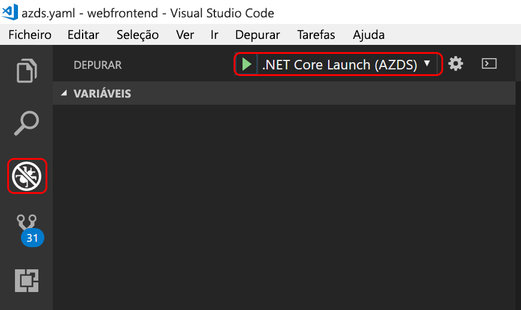

# <a name="quickstart-create-a-kubernetes-dev-space-with-azure-dev-spaces-net-core-and-vs-code"></a>Início Rápido: Criar um espaço de programador do Kubernetes com os Espaços de Programador do Azure (.NET Core e VS Code)

Neste guia, vai aprender a:

- Configurar os Espaços de Programador do Azure com um cluster Kubernetes gerido no Azure.
- Utilizar o VS Code e a linha de comandos para desenvolver iterativamente código em contentores.
- Depurar o código no espaço de programador do VS Code

> [!Note]
> **Se ficar bloqueado** em qualquer altura, veja a secção [Resolução de problemas](troubleshooting.md) ou publique um comentário nesta página. Também pode consultar o [tutorial](get-started-netcore.md) mais detalhado.

## <a name="prerequisites"></a>Pré-requisitos

- Uma subscrição do Azure. Se não tiver uma, poderá [criar uma conta gratuita](https://azure.microsoft.com/free).
- Um [cluster Kubernetes](https://ms.portal.azure.com/#create/microsoft.aks) a executar o Kubernetes 1.9.6 ou posterior, na região EUA Leste, E.U.A. Central, E.U.A. Central 2, 	Europa Ocidental, Canadá Central ou Leste do Canadá, com o **Encaminhamento de Aplicações de Http** ativado.

  

- [Visual Studio Code](https://code.visualstudio.com/download).

## <a name="set-up-azure-dev-spaces"></a>Configurar os Espaços de Programador do Azure

A CLI do Azure e a extensão Azure Dev Spaces podem ser instaladas e executadas em computadores Windows, Mac ou Linux. Para Linux, são suportadas as seguintes distribuições: Ubuntu (18.04, 16.04 e 14.04), Debian 8 e 9, RHEL 7, Fedora 26+, CentOS 7, openSUSE 42.2 e SLES 12.

Siga estes passos para configurar o Azure Dev Spaces:

1. Instale a [CLI do Azure](/cli/azure/install-azure-cli?view=azure-cli-latest) (versão 2.0.43 ou superior).
1. Configure Espaços de Programador no cluster AKS: `az aks use-dev-spaces -g MyResourceGroup -n MyAKS`
1. Transfira a [extensão dos Espaços de Programador do Azure](https://marketplace.visualstudio.com/items?itemName=azuredevspaces.azds) para o VS Code. Clique em Instalar uma vez na página do Marketplace da extensão e, novamente, no VS Code.

## <a name="build-and-run-code-in-kubernetes"></a>Criar e executar códigos no Kubernetes

1. Transfira o código de exemplo do GitHub: [https://github.com/Azure/dev-spaces](https://github.com/Azure/dev-spaces) 
1. Altere o diretório para a pasta de webfrontend: `cd dev-spaces/samples/dotnetcore/getting-started/webfrontend`
1. Gere elementos de gráfico do Docker e do Helm: `azds prep --public`
1. Compile e execute o código no AKS. Na janela do terminal, na **pasta webfrontend**, execute este comando: `azds up`
1. Analise o resultado da consola para obter informações sobre o URL que foi criado pelo comando `up`. Estará na forma: 

   `(pending registration) Service 'webfrontend' port 'http' will be available at <url>\r\nService 'webfrontend' port 80 (TCP) is available at http://localhost:<port>` 

   Abra este URL numa janela do browser e deve ver o carregamento da aplicação Web. 
   
   > [!Note]
   > Na primeira execução, pode demorar alguns minutos para que o DNS público esteja pronto. Se o URL público não resolver, pode utilizar o URL alternativo http://localhost:<portnumber> apresentado no resultado da consola. Se utilizar o URL de anfitrião local, poderá parecer que o contentor está a ser executado localmente, contudo, está a ser executado no AKS. Para sua comodidade e para facilitar a interação com o serviço da sua máquina local, os Espaços de Programador do Azure criam um túnel SSH temporário para o contentor em execução no Azure. Pode voltar atrás e tentar o URL público mais tarde, quando o registo DNS estiver pronto.

### <a name="update-a-content-file"></a>Atualizar um ficheiro de conteúdo

1. Localize um ficheiro, como, por exemplo, `./Views/Home/Index.cshtml` e faça uma edição ao HTML. Por exemplo, altere a linha 70 que lê `<h2>Application uses</h2>` para algo semelhante a `<h2>Hello k8s in Azure!</h2>`
1. Guarde o ficheiro. Pouco depois, na janela do terminal, verá uma mensagem que diz que um ficheiro no contentor em execução foi atualizado.
1. Aceda ao seu browser e atualize a página. Deverá ver a página Web mostrar o código HTML atualizado.

O que aconteceu? As edições aos ficheiros de conteúdos, como HTML e CSS, não requerem a recompilação numa aplicação Web .NET Core, pelo que um comando `azds up` ativo sincroniza automaticamente qualquer ficheiro de conteúdos modificado com o contentor em execução no Azure, de modo a que possa ver as edições aos conteúdos de imediato.

### <a name="update-a-code-file"></a>Atualizar um ficheiro de código
A atualização de ficheiros de código exige mais algum trabalho, porque a aplicação .NET Core tem de ser recompilada e produzir binários de aplicação atualizados.

1. Na janela de terminal, prima `Ctrl+C` (para parar `azds up`).
1. Abra o ficheiro de código com o nome `Controllers/HomeController.cs` e edite a mensagem que a página About (Sobre) vai apresentar: `ViewData["Message"] = "Your application description page.";`
1. Guarde o ficheiro.
1. Execute `azds up` na janela de terminal. 

Este comando recria a imagem do contentor e reimplementa o gráfico Helm. Para ver as alterações ao código entrarem em vigor na aplicação em execução, aceda ao menu About (Sobre) na aplicação Web.

Mas existe um *método ainda mais rápido* para programar código, que vai explorar na próxima secção. 

## <a name="debug-a-container-in-kubernetes"></a>Depurar um contentor no Kubernetes

Nesta secção, vai utilizar o VS Code para depurar diretamente o contentor em execução no Azure. Também vai aprender como obter um ciclo de edição-execução-teste mais rápido.


### <a name="initialize-debug-assets-with-the-vs-code-extension"></a>Inicializar ativos de depuração com a extensão do VS Code
Primeiro tem de configurar o projeto de código para que o VS Code comunique com o espaço de programador no Azure. A extensão do VS Code para Espaços de Programação do Azure oferece um comando auxiliar para contribuir para a configuração da depuração. 

Abra a **Paleta de Comandos** (através do menu **Ver | Paleta de Comandos**), e utilize o preenchimento automático para escrever e selecione este comando: `Azure Dev Spaces: Prepare configuration files for Azure Dev Spaces`. 

Esta ação adiciona a configuração de depuração para os Espaços de Programação do Azure na pasta `.vscode`. Este comando não deve ser confundido com o comando `azds prep`, que configura o projeto para implementação.


### <a name="select-the-azds-debug-configuration"></a>Selecionar a configuração de depuração do AZDS
1. Para abrir a vista Debug (Depuração), clique no ícone Debug em **Activity Bar** (Barra de Atividades), no lado do VS Code.
1. Selecione **.NET Core Launch (AZDS)** (Iniciar .NET Core [AZDS]) como a configuração de depuração ativa.



> [!Note]
> Se não vir nenhum comando do Azure Dev Spaces em Command Palette (Paleta de Comandos), confirme que tem instalada a extensão do VS Code para o Azure Dev Spaces. Lembre-se de que a área de trabalho que abriu no VS Code é a pasta que contém azds.yaml.


### <a name="debug-the-container-in-kubernetes"></a>Depurar o contentor no Kubernetes
Prima **F5** para depurar o código no Kubernetes.

Tal como sucede com o comando `up`, o código é sincronizado com o espaço de programador e é criado e implementado um contentor no Kubernetes. Desta vez, obviamente, o depurador está ligado ao contentor remoto.

> [!Tip]
> A barra de estado do VS Code apresentará um URL clicável.

Defina um ponto de interrupção num ficheiro de código do lado do servidor, como, por exemplo, a função `Index()` no ficheiro de origem `Controllers/HomeController.cs`. Atualizar a página do browser faz com que o ponto de interrupção seja atingido.

Tem acesso total às informações da depuração, tal como aconteceria se o código estivesse a ser executado localmente, como, por exemplo, a pilha de chamadas, as variáveis locais, as informações de exceção, etc.

### <a name="edit-code-and-refresh"></a>Editar o código e atualizar
Com o depurador ativo, faça uma edição ao código. Por exemplo, modifique a mensagem da página About (Sobre), em `Controllers/HomeController.cs`. 

```csharp
public IActionResult About()
{
    ViewData["Message"] = "My custom message in the About page.";
    return View();
}
```

Guarde o ficheiro e, no **painel Debug actions** (Ações de depuração), clique no botão **Refresh** (Atualizar). 


Em vez de reconstruir e reimplementar uma imagem de contentor nova sempre que forem feitas edições ao código, o que, muitas vezes, irá demorar um tempo considerável, o Azure Dev Spaces recompilará incrementalmente o código dentro do contentor existente para proporcionar um ciclo de edição/depuração mais rápido.

Atualize a aplicação Web no browser e aceda à página About (Sobre). Deverá ver a mensagem personalizada apresentada na IU.

**Agora, tem um método para iterar rapidamente no código e depurar diretamente no Kubernetes.**

## <a name="next-steps"></a>Passos seguintes

Saiba como os Espaços de Programador do Azure ajudam a desenvolver aplicações mais complexas em vários contentores e como pode simplificar o desenvolvimento de colaboração ao trabalhar com diferentes versões ou ramos do seu código em diferentes espaços. 

> [!div class="nextstepaction"]
> [Working with multiple containers and team development](team-development-netcore.md) (Trabalhar com vários contentores e o desenvolvimento em equipa)
