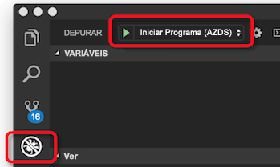
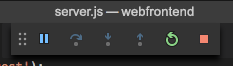

# <a name="quickstart-create-a-kubernetes-dev-space-with-azure-dev-spaces-nodejs"></a>Início Rápido: Criar um espaço de programador do Kubernetes com os Espaços de Programador do Azure (Node.js)

Neste guia, vai aprender a:

- Configurar os Espaços de Programador do Azure com um cluster Kubernetes gerido no Azure.
- Utilizar o VS Code e a linha de comandos para desenvolver iterativamente código em contentores.
- Depurar o código em execução no cluster.

> [!Note]
> **Se ficar bloqueado** em qualquer altura, veja a secção [Resolução de problemas](troubleshooting.md) ou publique um comentário nesta página. Também pode consultar o [tutorial](get-started-nodejs.md) mais detalhado.

## <a name="prerequisites"></a>Pré-requisitos

- Uma subscrição do Azure. Se não tiver uma subscrição do Azure, pode [criar uma conta gratuita](https://azure.microsoft.com/free).
- Um [cluster Kubernetes](https://ms.portal.azure.com/#create/microsoft.aks) a executar Kubernetes 1.9.6, na região EUA Leste, Europa Ocidental ou Leste do Canadá, com o **Encaminhamento de Aplicações de Http** ativado.

  

- Visual Studio Code, que pode transferir [aqui](https://code.visualstudio.com/download).

## <a name="set-up-azure-dev-spaces"></a>Configurar os Espaços de Programador do Azure

1. Instale a [CLI do Azure](/cli/azure/install-azure-cli?view=azure-cli-latest) (versão 2.0.38 ou superior).
1. Configure Espaços de Programador no cluster AKS: `az aks use-dev-spaces -g MyResourceGroup -n MyAKS`
1. Transfira a [extensão dos Espaços de Programador do Azure](https://aka.ms/get-azds-code) para o VS Code.
1. Instale a extensão: `code --install-extension path-to-downloaded-extension/azds-0.1.1.vsix`

## <a name="build-and-run-code-in-kubernetes"></a>Criar e executar códigos no Kubernetes

1. Transfira o código de exemplo do GitHub: [https://github.com/Azure/dev-spaces](https://github.com/Azure/dev-spaces) 
1. Altere o diretório para a pasta de webfrontend: `cd dev-spaces/samples/nodejs/getting-started/webfrontend`
1. Gere elementos de gráfico do Docker e do Helm: `azds prep --public`
1. Compile e execute o código no AKS. Na janela do terminal, na **pasta webfrontend**, execute este comando: `azds up`
1. Analise o resultado da consola para obter informações sobre o URL que foi criado pelo comando `up`. Estará na forma: 

   `Service 'webfrontend' port 'http' is available at <url>` 

   Abra este URL numa janela do browser e deve ver o carregamento da aplicação Web. À medida que o contentor é executado, os resultados `stdout` e `stderr` são transmitidos para a janela do terminal.
   
   > [!Note]
   > Na primeira execução, pode demorar alguns minutos para que o DNS público esteja pronto. Se o URL público não resolver, pode utilizar o URL alternativo http://localhost:<portnumber> apresentado no resultado da consola. Se utilizar o URL de anfitrião local, poderá parecer que o contentor está a ser executado localmente, contudo, está a ser executado no AKS. Para sua comodidade e para facilitar a interação com o serviço da sua máquina local, os Espaços de Programador do Azure criam um túnel SSH temporário para o contentor em execução no Azure. Pode voltar atrás e tentar o URL público mais tarde, quando o registo DNS estiver pronto.

### <a name="update-a-content-file"></a>Atualizar um ficheiro de conteúdo
O Azure Dev Spaces não se limita apenas a pôr o código em execução no Kubernetes. Tem que ver com permitir-lhe ver, de forma rápida e iterativa, as alterações ao código serem aplicadas num ambiente do Kubernetes na cloud.

1. Localize o ficheiro `./public/index.html` e faça uma edição ao HTML. Por exemplo, altere a cor de fundo da página para um tom de azul:

    ```html
    <body style="background-color: #95B9C7; margin-left:10px; margin-right:10px;">
    ```

1. Guarde o ficheiro. Pouco depois, na janela do terminal, verá uma mensagem que diz que um ficheiro no contentor em execução foi atualizado.
1. Aceda ao seu browser e atualize a página. Deverá ver a cor atualizada.

O que aconteceu? As edições aos ficheiros de conteúdos, como HTML e CSS, não requerem o reinício do processo de Node.js, pelo que um comando `azds up` ativo irá sincronizar, de forma automática, qualquer ficheiro de conteúdo modificado diretamente com o contentor em execução no Azure, oferecendo-lhe, assim, um modo rápido de ver as edições aos seus conteúdos.

### <a name="test-from-a-mobile-device"></a>Testar num dispositivo móvel
Abra a aplicação Web num dispositivo móvel através do URL público para webfrontend. Pode copiar e enviar o URL da sua área de trabalho para o dispositivo, para não ter de inserir o endereço comprido. Quando a aplicação Web é carregada no dispositivo móvel, irá reparar que a IU não aparece corretamente num dispositivo pequeno.

Para corrigir este problema, vai adicionar uma etiqueta mega `viewport`:
1. Abra o ficheiro `./public/index.html`
1. Adicione a etiqueta meta `viewport` ao elemento `head` existente:

    ```html
    <head>
        <!-- Add this line -->
        <meta name="viewport" content="width=device-width, initial-scale=1">
    </head>
    ```

1. Guarde o ficheiro.
1. Atualize o browser do dispositivo. Deverá ver a aplicação Web composta corretamente. 

Este é um exemplo de como alguns problemas só são detetados quando testa nos dispositivos nos quais a aplicação deve ser utilizada. Com o Azure Dev Spaces, pode iterar rapidamente o seu código e validar todas as alterações nos dispositivos de destino.

### <a name="update-a-code-file"></a>Atualizar um ficheiro de código
Atualizar os ficheiros de código do lado do servidor requer um pouco mais trabalho, porque a aplicação Node.js tem de ser reiniciada.

1. Na janela de terminal, prima `Ctrl+C` (para parar `azds up`).
1. Abra o ficheiro de código com o nome `server.js` e edite a mensagem “hello” do serviço: 

    ```javascript
    res.send('Hello from webfrontend running in Azure!');
    ```

3. Guarde o ficheiro.
1. Execute `azds up` na janela de terminal. 

Isto recria a imagem do contentor e reimplementa o gráfico Helm. Recarregue a página do browser para ver as alterações ao código entrarem em vigor.

Mas existe um *método ainda mais rápido* para programar código, que vai explorar na próxima secção. 

## <a name="debug-a-container-in-kubernetes"></a>Depurar um contentor no Kubernetes

Nesta secção, ai utilizar o VS Code para depurar diretamente o nosso contentor em execução no Azure. Também vai aprender como obter um ciclo de edição-execução-teste mais rápido.


### <a name="initialize-debug-assets-with-the-vs-code-extension"></a>Inicializar ativos de depuração com a extensão do VS Code
Primeiro tem de configurar o seu projeto de código para que o VS Code comunique com o nosso espaço de programação no Azure. A extensão do VS Code para Espaços de Programação do Azure oferece um comando auxiliar para contribuir para a configuração da depuração. 

Abra a **Paleta de Comandos** (através do menu **Ver | Paleta de Comandos**), e utilize o preenchimento automático para escrever e selecione este comando: `Azure Dev Spaces: Prepare configuration files for Azure Dev Spaces`.

Esta ação adiciona a configuração de depuração para os Espaços de Programação do Azure na pasta `.vscode`.


### <a name="select-the-azds-debug-configuration"></a>Selecionar a configuração de depuração do AZDS
1. Para abrir a vista Debug (Depuração), clique no ícone Debug em **Activity Bar** (Barra de Atividades), no lado do VS Code.
1. Selecione **Launch Program (AZDS)** (Iniciar Programa [AZDS]) como a configuração de depuração ativa.



> [!Note]
> Se não vir nenhum comando do Azure Dev Spaces em Command Palette (Paleta de Comandos), confirme que tem instalada a extensão do VS Code para o Azure Dev Spaces.

### <a name="debug-the-container-in-kubernetes"></a>Depurar o contentor no Kubernetes
Prima **F5** para depurar o código no Kubernetes.

Semelhante ao comando `up`, o código é sincronizado com o espaço de programador quando iniciar a depuração e é criado e implementado um contentor no Kubernetes. Desta vez, o depurador é ligado ao contentor remoto.

> [!Tip]
> A barra de estado do VS Code apresentará um URL clicável.

Defina um ponto de interrupção num ficheiro de código do lado do servidor, como, por exemplo, dentro de `app.get('/api'...` em `server.js`. Atualize a página do browser ou prima o botão “Say It Again” (“Repetir”) e deverá atingir o ponto de interrupção e conseguir aceder ao código.

Tem acesso total às informações da depuração, tal como aconteceria se o código estivesse a ser executado localmente, como, por exemplo, a pilha de chamadas, as variáveis locais, as informações de exceção, etc.

### <a name="edit-code-and-refresh-the-debug-session"></a>Editar o código e atualizar a sessão de depuração
Com o depurador ativo, faça uma edição ao código. Por exemplo, modifique outra vez a mensagem “hello”:

```javascript
app.get('/api', function (req, res) {
    res.send('**** Hello from webfrontend running in Azure! ****');
});
```

Guarde o ficheiro e, no **painel Debug actions** (Ações de depuração), clique no botão **Refresh** (Atualizar). 



Em vez de reconstruir e reimplementar uma imagem de contentor nova sempre que são feitas edições ao código, o que, muitas vezes, demorará tempo considerável, o Azure Dev Spaces irá reiniciar o processo de Node.js entre sessões de depuração para proporcionar um ciclo de edição/depuração mais rápido.

Atualize a aplicação Web no browser ou prima o botão *Say It Again* (Repetir). Deverá ver a mensagem personalizada apresentada na IU.

### <a name="use-nodemon-to-develop-even-faster"></a>Utilizar Nodemon para desenvolver ainda mais depressa

O projeto `webfrontend` de exemplo foi configurado para utilizar [nodemon](https://nodemon.io/), uma ferramenta popular para acelerar a programação de Node.js que é totalmente compatível com os espaços de programador do Azure.

Experimente os passos seguintes:
1. Pare o depurador do VS Code.
1. Clique no ícone de Depuração em **Activity Bar** (Barra de Atividade), no lado do VS Code. 
1. Selecione **Attach (AZDS)** (Anexar [AZDS] como a configuração ativa do depurador.
1. Prima F5.

Nesta configuração, o contentor é configurado para iniciar o *nodemon*. Quando forem feitas edições ao código, o *nodemon* reinicia automaticamente o processo de Node, tal como acontece quando desenvolve localmente. 
1. Edite a mensagem “hello” novamente em `server.js`e guarde o ficheiro.
1. Atualize o browser ou clique no botão *Say It Again* (Repetir) para ver as alterações a entrarem em vigor.

**Agora, tem um método para iterar rapidamente no código e depurar diretamente no Kubernetes.**

## <a name="next-steps"></a>Passos seguintes

> [!div class="nextstepaction"]
> [Working with multiple containers and team development](get-started-nodejs.md#call-a-service-running-in-a-separate-container) (Trabalhar com vários contentores e o desenvolvimento em equipa)