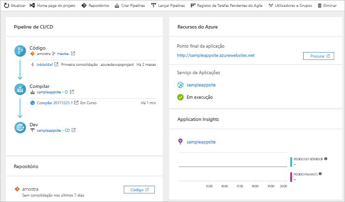

# Criar um pipeline CI/CD para o PHP com projetos de DevOps do Azure

Projetos de DevOps do Azure apresenta uma experiência simplificada que cria os recursos do Azure e configura uma integração contínua (CI) e o pipeline de entrega contínua (CD) para a sua aplicação PHP em Pipelines do Azure.  

Se não tiver uma subscrição do Azure, pode obter uma gratuitamente através de [Visual Studio Dev Essentials](https://visualstudio.microsoft.com/dev-essentials/).

## Iniciar sessão no portal do Azure

 Projetos de DevOps cria um pipeline CI/CD em Pipelines do Azure. Pode criar uma nova organização de DevOps do Azure gratuita ou utilizar uma organização existente. Projetos de DevOps também cria os recursos do Azure na subscrição do Azure à sua escolha.

1. Inicie sessão no [Portal do Microsoft Azure](https://portal.azure.com).

1. No painel esquerdo, selecione o **criar um recurso** ícone e procure **projetos de DevOps**.  

3. Selecione **Criar**.

    

## Selecione um exemplo de aplicação e serviço do Azure

1. Selecione a aplicação de exemplo PHP.  
        Os exemplos PHP incluem uma opção de várias estruturas de aplicativo. A estrutura de exemplo do padrão é o Laravel. 
        
2. Deixe a predefinição e, em seguida, selecione **seguinte**.  

1. Aplicação Web para contentores é o destino de implementação do padrão.  
    A estrutura da aplicação, que escolheu anteriormente, dita o tipo de destino de implementação de serviço do Azure está disponível aqui.  Deixe o serviço predefinido e, em seguida, selecione **seguinte**.
 
## Configurar o Azure DevOps e uma subscrição do Azure 

1. Crie uma nova organização do Azure DevOps ou selecione uma organização existente. 

    a. Escolha um nome para o seu projeto de DevOps do Azure. 
    
    b. Selecione a subscrição do Azure e a localização, introduza um nome para a sua aplicação e, em seguida, selecione **feito**.   
        Após alguns minutos, é apresentado o dashboard de projetos de DevOps no portal do Azure. Um aplicativo de exemplo está configurado num repositório na sua organização de DevOps do Azure, uma compilação é executada e sua aplicação é implementada para o Azure. Este dashboard fornece visibilidade para o repositório de código, seu pipeline CI/CD e a sua aplicação no Azure.  
        
2. Selecione **procurar** para ver a sua aplicação em execução.

     
    
 Projetos de DevOps configurado automaticamente uma compilação CI e a versão de Acionador.  Agora está pronto para colaborar com uma equipa na sua aplicação PHP, com um processo de CI/CD que implementa automaticamente o seu trabalho mais recente no seu site.

## Consolidar as alterações de código e executar o CI/CD

 Projetos de DevOps cria um repositório de Git em repositórios do Azure ou do GitHub. Para ver o repositório e fazer alterações de código para a sua aplicação, siga os passos seguintes:

1. À esquerda do dashboard de projetos de DevOps, selecione a ligação para o ramo principal.   
    Esta ligação abre uma vista para o repositório Git recentemente criado.

1. Para ver o URL de clone do repositório, selecione **Clone** na parte superior direita do browser.   
    Pode clonar o repositório Git no seu IDE preferido. Em alguns passos que se seguem, utilize o browser para fazer e consolidar as alterações de código diretamente para o ramo principal.

1. À esquerda, vá para o **resources/views/welcome.blade.php** ficheiro.

1. Selecione **editar**e, em seguida, faça uma alteração a algumas do texto.  Por exemplo, altere algum texto para uma das etiquetas div.

1. Selecione **consolidar**e, em seguida, guarde as alterações.

1. No seu browser, aceda ao dashboard de projetos de DevOps.  
Deverá ver uma compilação em curso. As alterações que acabou de criar são automaticamente criadas e implementadas através de um pipeline CI/CD.

## Examine o pipeline de CI/CD

 Projetos de DevOps configura automaticamente um pipeline de CI/CD completo nos Pipelines do Azure. Explore e personalize o pipeline, conforme necessário. Para se familiarizar com os pipelines de compilação e versão, faça o seguinte:

1. Na parte superior do dashboard de projetos de DevOps, selecione **criar Pipelines**.  
    Esse link abre um separador do browser e o pipeline de compilação para o novo projeto.

1. Aponte para o **Status** campo e, em seguida, selecione a **reticências** (...).  
    Um menu apresenta várias opções, como enfileirar uma nova compilação, colocar em pausa uma compilação e o pipeline de compilação de edição.

1. Selecione **Editar**.

1. Neste painel, pode examinar as várias tarefas para o seu pipeline de compilação.  
    A compilação é executada uma variedade de tarefas, como a obtenção de origens do repositório Git, a restauração de dependências e a publicação de saídas que são utilizadas para implementações.

1. Na parte superior do pipeline de compilação, selecione o nome do pipeline de compilação.

1. Altere o nome do seu pipeline de compilação para algo mais descritivo, select, **guardar e colocar em fila**e, em seguida, selecione **guardar**.

1. No nome do pipeline de compilação, selecione **Histórico**.   
    O **histórico** painel apresenta uma trilha de auditoria das alterações recentes para a compilação. Pipelines do Azure mantém um registro de quaisquer alterações efetuadas no pipeline de compilação e permite-lhe comparar versões.

1. Selecione **Acionadores**.  
      Projetos de DevOps criado automaticamente um acionador de CI e cada consolidação no repositório inicia uma nova compilação. Opcionalmente, pode optar por incluir ou excluir os ramos do processo de CI.

1. Selecione **Retenção**.   
    Dependendo do seu cenário, pode especificar políticas de manter ou remover um determinado número de compilações.

1. Selecione **criar e lançar**e, em seguida, selecione **versões**.  
     Projetos de DevOps cria um pipeline de lançamento para gerir implementações para o Azure.

1. Selecione as reticências (...) junto ao seu pipeline de lançamento e, em seguida, selecione **editar**.  
    O pipeline de lançamento contém um pipeline, que define o processo de liberação. 

12. Em **Artefactos**, selecione **Remover**.  
    O pipeline de compilação examinado nos passos anteriores produz a saída que é utilizada para o artefacto. 

1. Junto a **Drop** ícone, selecione a **acionador de implementação contínua**.   
    Esta versão de pipeline tem um acionador de CD ativado, o que é executada uma implantação sempre que houver um artefacto de compilação nova disponível.  Opcionalmente, pode desativar o acionador para que as suas implementações exigem execução manual. 

1. No lado esquerdo, selecione **tarefas**.  
        As tarefas são as atividades que executa o processo de implementação.  Neste exemplo, foi criada uma tarefa para implantar o App Service do Azure.

1. À direita, selecione **ver versões** para apresentar um histórico de versões.

1. Selecione as reticências (...) junto a um dos seus lançamentos e, em seguida, selecione **aberto**.  
        Estão disponíveis vários menus para explorar nesta vista, como um resumo de versões, itens de trabalho associados e testes.

1. Selecione **Consolidações**.  
        Esta vista mostra as confirmações de código que estão associadas a implementação específica. 

1. Selecionar **Registos**.  
        Os registos contêm informações úteis sobre o processo de implementação. Podem ser vistos durante e após as implementações.

## Limpar recursos

É possível eliminar o serviço de aplicações do Azure e outros recursos associados quando não precisar delas. Utilize o **eliminar** funcionalidade no dashboard de projetos de DevOps.

## Passos Seguintes

Quando configurou o seu processo de CI/CD, compilação e lançar pipelines criados automaticamente. Pode modificar estes pipelines de compilação e de lançamento para satisfazer as necessidades da sua equipa. Para saber mais sobre o pipeline de CI/CD, veja este tutorial:

> [!div class="nextstepaction"]
> [Personalizar o processo de CD](https://docs.microsoft.com/azure/devops/pipelines/release/define-multistage-release-process?view=vsts)
