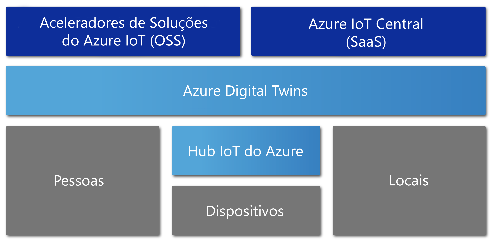

# Descrição geral do Azure Digital Twins

O Azure Digital Twins é um serviço do Azure IoT que cria modelos abrangentes do ambiente físico. De entre as suas inúmeras funcionalidades está a capacidade de criar gráficos de inteligência espacial para modelar as relações e interações entre pessoas, espaços e dispositivos.

O Azure Digital Twins permite consultar dados a partir de um espaço físico em vez de vários sensores diferentes. Este serviço ajuda-o a criar experiências reutilizáveis e altamente dimensionáveis com reconhecimento de espaço que ligam os dados em fluxo no mundo digital e físico. Quer esteja a prever necessidades de manutenção para uma fábrica, a analisar os requisitos de energia em tempo real para uma rede elétrica ou a otimizar a utilização do espaço disponível para um escritório, as suas aplicações são melhoradas por estas funcionalidades contextuais exclusivamente relevantes.

O Azure Digital Twins aplica-se a todos os tipos de ambientes, por exemplo, armazéns, escritórios, instituições de ensino, hospitais, bancos, estádios, fábricas, parques de estacionamento, parques, redes elétricas inteligentes e cidades. Pense em cenários como controlar a temperatura diária em vários estados, monitorizar os percursos congestionados de drones, identificar veículos autónomos, analisar os níveis de ocupação de um edifício ou localizar a caixa de pagamento mais ocupada na sua loja. Qualquer que seja o cenário de negócio do mundo real, é possível aprovisionar uma instância digital correspondente através do Azure Digital Twins.

O vídeo seguinte aprofunda o Digital Twins:

> [!VIDEO https://www.youtube.com/embed/TvN_NxpgyzQ]

## Principais capacidades

As principais capacidades do Azure Digital Twins incluem:

### Gráfico de inteligência espacial

O [*gráfico de inteligência espacial*](./concepts-objectmodel-spatialgraph.md) ou *gráfico espacial* é uma representação virtual do ambiente físico que permite modelar as relações entre pessoas, locais e dispositivos.

Considere uma aplicação de utilitário inteligente que possa envolver vários medidores de utilização de eletricidade ligados num bairro. Para monitorizar e prever a utilização de eletricidade e a faturação com precisão, a empresa do utilitário inteligente tem de modelar cada dispositivo e sensor com o contexto sobre a localização e o cliente que será faturado. O gráfico de inteligência espacial permite-lhe modelar estes tipos de relações complexas.

### Modelos de objetos gémeos digitais

Os [modelos de objetos gémeos digitais](./concepts-objectmodel-spatialgraph.md) são um esquema de dados e protocolos de dispositivos predefinidos que alinham as necessidades específicas do domínio da sua solução para acelerar e simplificar o desenvolvimento.

Por exemplo, uma aplicação de ocupação de divisão poderia utilizar tipos de espaços predefinidos, como um campus, edifício, piso, divisão, etc.

### Vários inquilinos aninhados

Pode criar soluções que dimensionam de forma segura e que podem ser reutilizadas para vários inquilinos. Também pode criar vários subinquilinos que podem ser acedidos e utilizados de forma isolada e segura.

Por exemplo, é possível configurar uma aplicação de utilização de espaço para isolar os dados de um inquilino dos dados de outros inquilinos num único edifício ou combinar dados de um único inquilino com vários edifícios.

### Capacidades de computação avançadas

As capacidades de computação avançadas chamadas [funções definidas pelo utilizador](./concepts-user-defined-functions.md) permitem definir e executar funções personalizadas relativamente aos [dados do dispositivo](./concepts-device-ingress.md) para enviar sinais para pontos finais predefinidos. Esta capacidade melhora a personalização e a automatização de tarefas do dispositivo.

Por exemplo, uma aplicação de agricultura inteligente pode incluir uma função definida pelo utilizador para avaliar as leituras do sensor de humidade no solo, bem como a previsão meteorológica e, em seguida, enviar sinais sobre as necessidades de irrigação.

### Controlo de acesso incorporado

As funcionalidades de gestão do acesso e de identidades, como o [controlo de acesso baseado em funções](./security-role-based-access-control.md) e o [Azure Active Directory](./security-authenticating-apis.md), permitem-lhe controlar o acesso de indivíduos e dispositivos em segurança.

Por exemplo, é possível configurar uma aplicação de gestão de instalações para permitir aos ocupantes de uma divisão definir a temperatura dentro de um intervalo especificado e aos gestores das instalações definir a temperatura em qualquer divisão para qualquer valor.

### Ecossistema

Pode ligar uma instância do Azure Digital Twins a muitos serviços avançados do Azure, incluindo: Azure Stream Analytics, Azure AI e Armazenamento, bem como Azure Maps, Microsoft Mixed Reality, Dynamics 365 ou Office 365.

Por exemplo, uma aplicação de edifícios de escritórios inteligentes pode utilizar o Azure Digital Twins para representar as equipas e os dispositivos localizados nos vários pisos. À medida que os dispositivos transmitem dados em direto para a instância aprovisionada do Digital Twin, o Azure Stream Analytics pode processar esses dados para fornecer informações-chave acionáveis. Em seguida, os dados podem ser armazenados no Armazenamento do Azure e convertidos num formato de ficheiro partilhável a distribuir por toda a organização com o Office 365.

## Soluções que tiram partido do Azure Digital Twins

O Azure Digital Twins é útil para representar o mundo físico e as suas inúmeras relações, uma vez que simplifica a modelação de IoT, o processamento de dados, o processamento de eventos e o controlo de dispositivos. Considere alguns dos cenários seguintes, em várias indústrias, que tiram partido da sua utilização:

* Mostrar a uma empresa de gestão de propriedades os níveis de ocupação de um espaço ao longo do tempo para recolher informações sobre as melhores formas de configurar o seu edifício de escritórios.
* Acionar pedidos de ordem de trabalho para uma aplicação móvel que orienta as escalas dos seguranças, agendar serviços de limpeza e quaisquer outros serviços num espaço de retalho ou instalações desportivas.
* Mostrar a um ocupante as divisões que estão ocupadas num edifício em tempo real. Em seguida, ajudar o ocupante a reservar as áreas de trabalho que se adequam às suas necessidades.
* Controlar onde os recursos estão localizados dentro de um espaço.
* Otimizar o carregamento de veículos elétricos ao modelar as preferências do utilizador e as restrições da rede energética.

## O Azure Digital Twins no contexto de outros serviços de IoT

O Azure Digital Twins utiliza o Hub IoT do Azure para ligar os dispositivos de IoT e os sensores que mantêm tudo atualizado com o mundo físico. O diagrama seguinte mostra como o Azure Digital Twins se relaciona com outros serviços do Azure IoT:

Para obter uma descrição mais detalhada sobre o restante ecossistema de IoT, veja [Tecnologias e soluções do Azure IoT](https://docs.microsoft.com/azure/iot-fundamentals/iot-services-and-technologies).

## Passos seguintes

Avance para uma breve demonstração das capacidades do Azure Digital Twins:

> [!div class="nextstepaction"]
> [Início Rápido: Encontrar salas disponíveis com o Azure Digital Twins](./quickstart-view-occupancy-dotnet.md)

Aprofundar uma aplicação de gestão de instalações com o Azure Digital Twins:

> [!div class="nextstepaction"]
> [Tutorial: Deploy Azure Digital Twins and configure a spatial graph](./tutorial-facilities-setup.md) (Tutorial: Implementar o Azure Digital Twins e configurar um gráfico espacial)

Saiba mais sobre os principais conceitos do Azure Digital Twins:

> [!div class="nextstepaction"]
> [Compreender o modelo de objetos e o gráfico de inteligência espacial do Digital Twins](./concepts-objectmodel-spatialgraph.md)
