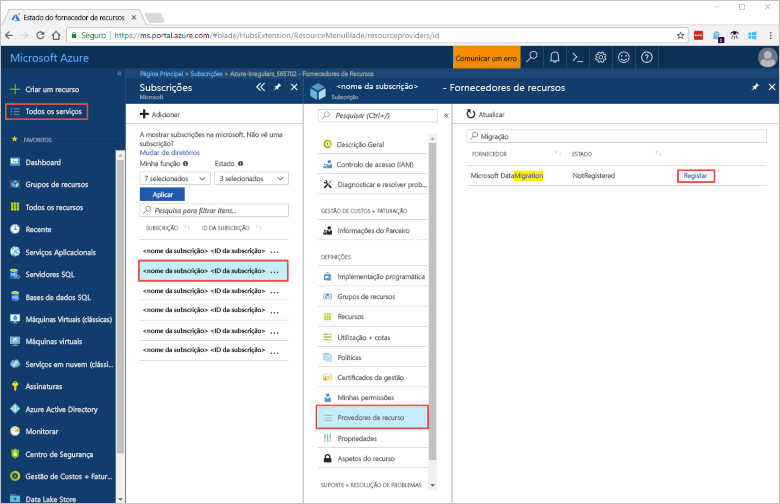
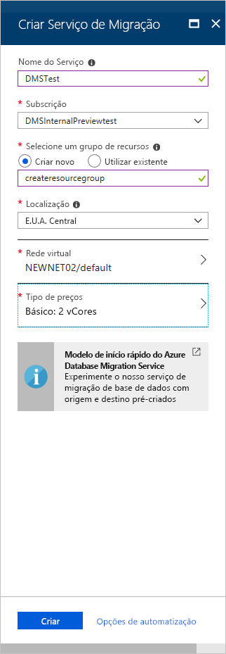
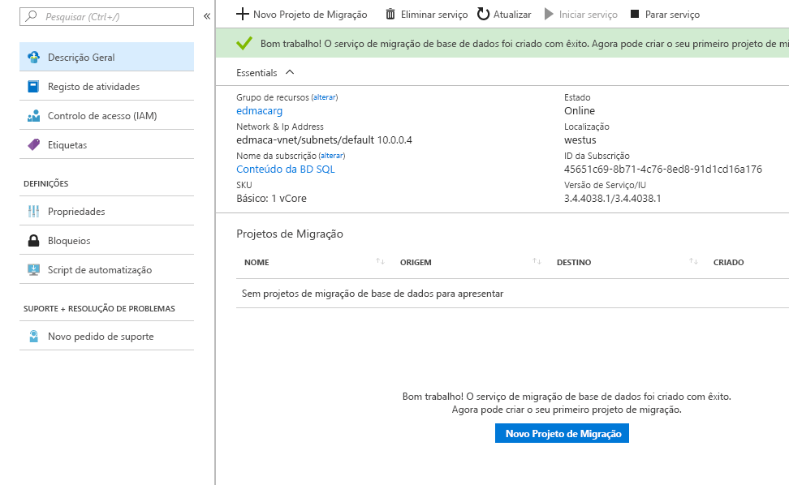

# Início rápido: Criar uma instância do Azure Database Migration Service com o portal do Azure
Neste Início Rápido, utiliza o portal do Azure para criar uma instância do Azure Database Migration Service.  Depois de criar o serviço, pode utilizá-lo para migrar dados do SQL Server no local para uma base de dados SQL do Azure.

Se não tiver uma subscrição do Azure, crie uma conta [gratuita](https://azure.microsoft.com/free/) antes de começar.

## Iniciar sessão no portal do Azure
Abra o browser, navegue para o [portal do Microsoft Azure](https://portal.azure.com/) e, em seguida, introduza as suas credenciais para iniciar sessão no portal.

A vista predefinida é o dashboard de serviço.

## Registar o fornecedor de recursos
Registe o fornecedor de recursos Microsoft.DataMigration antes de criar a primeira instância do Database Migration Service.

1. No portal do Azure, selecione **Todos os serviços** e, em seguida, selecione **Subscrições**.

2. Selecione a subscrição na qual pretende criar a instância do Database Migration Service do Azure e, em seguida, selecione **Fornecedores de recursos**.

3. Procure por migração e, à direita de **Microsoft.DataMigration**, selecione **Registar**.

    

## Criar uma instância do serviço
1. Selecione +**Criar um recurso** para criar uma instância do Azure Database Migration Service.

2. Procure "migração" no marketplace, selecione **Azure Database Migration Service** e, em seguida, no ecrã **Azure Database Migration Service** selecione **Criar**.

3. No ecrã **Criar Serviço de Migração**: 

    - Escolha um **Nome de Serviço** que seja recordável e exclusivo para identificar a sua instância do Azure Database Migration Service.
    - Selecione a sua **Subscrição** do Azure, na qual pretende criar a instância.
    - Selecione um **Grupo de Recursos** existente ou crie um novo.
    - Escolha a **Localização** que esteja mais próxima do seu servidor de origem ou de destino.
    - Selecione uma **Rede virtual** (VNET) já existente ou crie uma.

        A VNET concede ao Azure Database Migration Service acesso à instância da base de dados de origem e ao ambiente de destino.

        Para obter mais informações sobre como criar uma VNET no portal do Azure, veja o artigo [Criar uma rede virtual com o portal do Azure](https://aka.ms/vnet).

    - Selecione básico: 1 vCore para o **escalão de preço**.

        

4. Selecione **Criar**.

    Após alguns momentos, a sua instância do serviço Azure Database Migration está criado e pronto para utilizar. O Database Migration Service aparece conforme mostrado na seguinte imagem:

    

## Limpar recursos
Pode limpar os recursos criados neste Início Rápido ao eliminar o [grupo de recursos do Azure](../azure-resource-manager/resource-group-overview.md). Para eliminar o grupo de recursos, navegue para a instância do Azure Database Migration Service que criou. Selecione o nome do **Grupo de recursos** e selecione **Eliminar grupo de recursos**. Esta ação elimina todos os recursos no grupo de recursos, bem como o próprio grupo.

## Passos Seguintes
> [!div class="nextstepaction"]
> [Migrar o SQL Server local para a Base de Dados SQL do Azure](tutorial-sql-server-to-azure-sql.md)