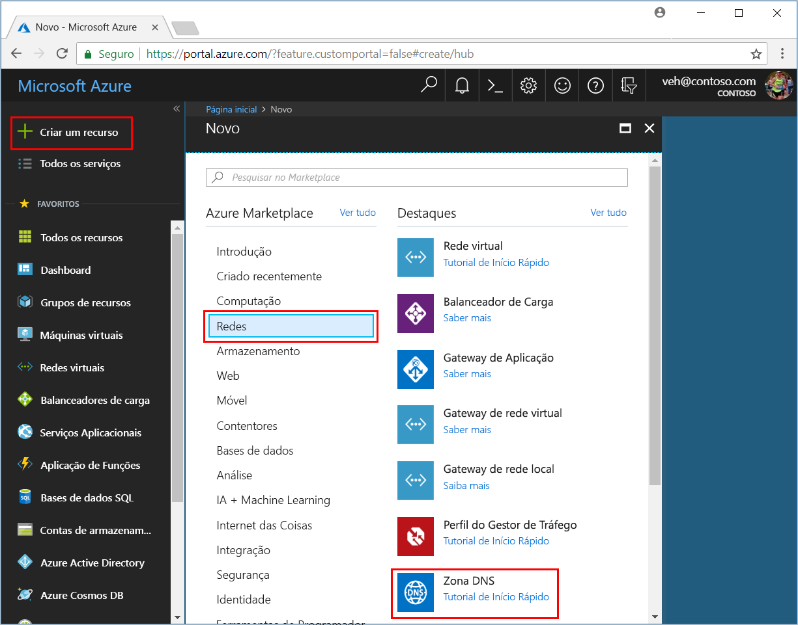
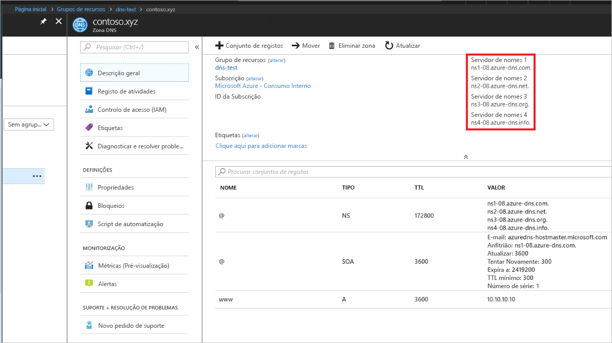

# <a name="quickstart-configure-azure-dns-for-name-resolution-using-the-azure-portal"></a>Início Rápido: configurar o DNS do Azure para resolução de nomes com o Portal do Azure

 Pode configurar o DNS do Azure para resolver os nomes de anfitrião no seu domínio público. Por exemplo, se tiver comprado o nome de domínio contoso.com de uma entidade de registo de nomes de domínio, pode configurar o DNS do Azure para alojar o domínio contoso.com e resolver www.contoso.com para o endereço IP do seu servidor Web ou aplicação Web.

Neste início rápido, vai criar um domínio de teste e, em seguida, vai criar um registo de endereço com o nome "www" para resolver para o endereço IP 10.10.10.10.

É importante saber que todos os nomes e endereços IP utilizados neste início rápido são apenas exemplos e não pretendem representar um cenário real. No entanto, quando aplicável, também estão descritos cenários reais.

<!---
You can also perform these steps using [Azure PowerShell](dns-getstarted-powershell.md) or the cross-platform [Azure CLI 2.0](dns-getstarted-cli.md).
--->

Uma zona DNS é utilizada para conter as entradas de DNS para um determinado domínio. Para começar a alojar o seu domínio no DNS do Azure, tem de criar uma zona DNS para esse nome de domínio. Cada entrada (ou registo) de DNS para o seu domínio é então criada no interior desta zona DNS. Os passos seguintes mostram como fazê-lo.

Se não tiver uma subscrição do Azure, crie uma [conta gratuita](https://azure.microsoft.com/free/?WT.mc_id=A261C142F) antes de começar.

## <a name="create-a-dns-zone"></a>Criar uma zona DNS

1. Inicie sessão no Portal do Azure.
2. No canto superior esquerdo, clique em **+ Criar um recurso**, **Redes** e, em seguida, clique em **Zona DNS**, para abrir a página **Criar zona DNS**.

    

4. Na página **Criar zona DNS**, introduza os valores seguintes e clique em **Criar**:


   | **Definição** | **Valor** | **Detalhes** |
   |---|---|---|
   |**Nome**|contoso.xyz|O nome da zona DNS para este exemplo. Pode utilizar qualquer valor que quiser neste início rápido, desde que ainda não tenha sido configurado nos servidores DNS do Azure. Um valor real seria um domínio que comprou de uma entidade de registo de nomes de domínio.|
   |**Subscrição**|[A sua subscrição]|Selecione uma subscrição para criar a zona DNS.|
   |**Grupo de recursos**|**Criar nova:** dns-test|Crie um grupo de recursos. O nome do grupo de recursos tem de ser exclusivo dentro da subscrição que selecionou. |
   |**Localização**|EUA Leste||

A criação da zona pode demorar alguns minutos.

## <a name="create-a-dns-record"></a>Criar um registo DNS

Agora, crie um novo registo de endereço (registo "A"). Os registos "A" são utilizados para resolver um nome de anfitrião para um endereço IP v4.

1. No painel **Favoritos** do portal do Azure, clique em **Todos os recursos**. Clique na zona DNS **contoso.xyz**, na página Todos os recursos. Se a subscrição que selecionou já tiver vários recursos, pode introduzir **contoso.xyz** na caixa **Filtrar por nome...** para aceder facilmente à zona DNS.

1. No topo da página **Zona DNS**, selecione **+ Conjunto de registos**, para abrir a página **Adicionar conjunto de registos**.

1. Na página **Adicionar conjunto de registos**, introduza os valores seguintes e clique em **OK**. Neste exemplo, vai criar um registo "A".

   |**Definição** | **Valor** | **Detalhes** |
   |---|---|---|
   |**Nome**|www|Nome do registo. Este é o nome que quer utilizar para o anfitrião que pretende resolver para um endereço IP.|
   |**Tipo**|A| Tipo de registo DNS a criar. Os registos "A" são as mais comuns, mas existem outros tipos de registo para servidores de e-mail (MX), endereços IP v6 (AAAA) e assim por diante. |
   |**TTL**|1|Tempo de vida do pedido DNS. Especifica durante quanto tempo os clientes e servidores DNS podem colocar uma resposta em cache.|
   |**Unidade de TTL**|hours|Medida de tempo do valor TTL.|
   |**Endereço IP**|10.10.10.10| Este valor é o endereço IP para o qual o registo "A" resolve. Este é apenas um valor de teste para este início rápido. Para obter um exemplo real, deve introduzir o endereço IP público do seu servidor Web.|


Dado que, neste início rápido, não compra mesmo um nome de domínio real, não é necessário configurar o DNS do Azure como o nome de servidor junto da entidade de registo de nomes de domínio. No entanto, num cenário real, iria querer que qualquer pessoas na Internet conseguisse resolver o nome do anfitrião para ligar ao servidor ou à aplicação Web. Para obter mais informações sobre esse cenário real, veja [Delegar um domínio ao DNS do Azure](dns-delegate-domain-azure-dns.md).


## <a name="test-the-name-resolution"></a>Testar a resolução de nomes

Agora que tem uma zona de teste, com um registo "A" de teste, pode testar a resolução de nomes com uma ferramenta denominada nslookup. 

1. Primeiro, deve anotar os servidores de nomes DNS do Azure a utilizar com o nslookup. 

   Os servidores de nomes para a sua zona estão listados na página **Descrição Geral** da zona DNS. Copie o nome de um dos servidores de nomes:

   

2. Agora, abra uma linha de comandos e execute o seguinte comando:

   ```
   nslookup <host name> <name server>
   
   For example:

   nslookup www.contoso.xyz ns1-08.azure-dns.com
   ```

Deverá ver algo semelhante à seguinte captura de ecrã:


Isto verifica se a resolução de nomes está a funcionar corretamente. www.contoso.xyz resolve para 10.10.10.10, tal como configurou!

## <a name="clean-up-resources"></a>Limpar recursos

Quando já não for necessário, elimine o grupo de recursos**dns-test** para eliminar os recursos criados neste início rápido. Para tal, clique no grupo de recursos **dns-test** e clique em **Eliminar grupo de recursos**.


## <a name="next-steps"></a>Passos seguintes

> [!div class="nextstepaction"]
> [Criar registos DNS para uma aplicação Web num domínio personalizado](./dns-web-sites-custom-domain.md)