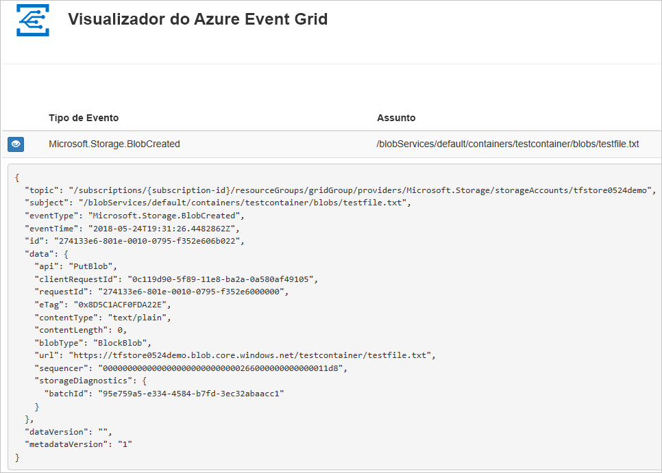
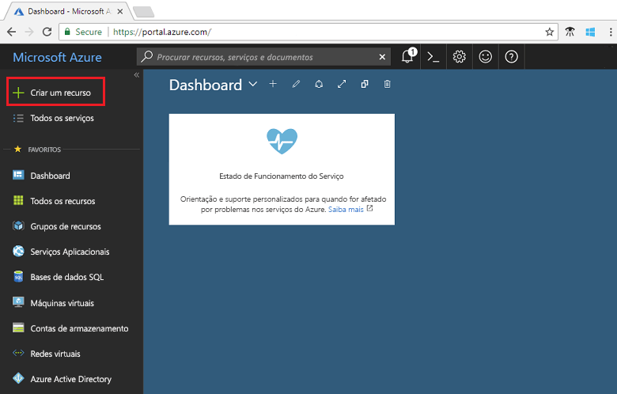
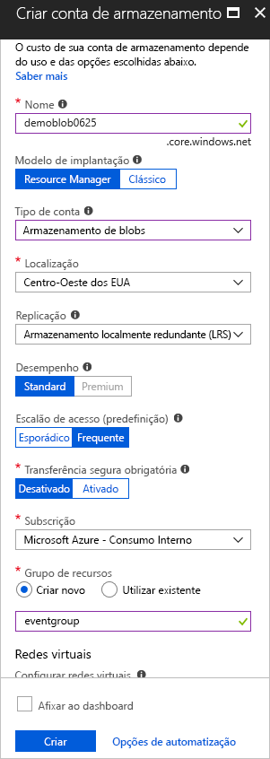
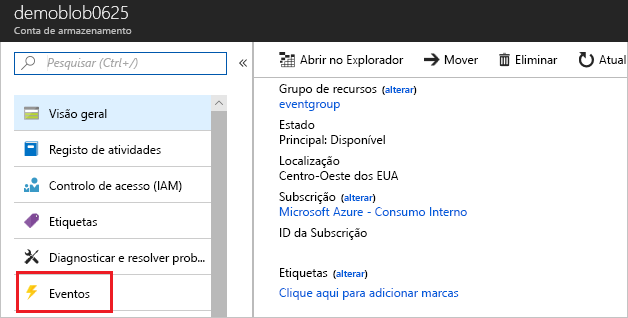
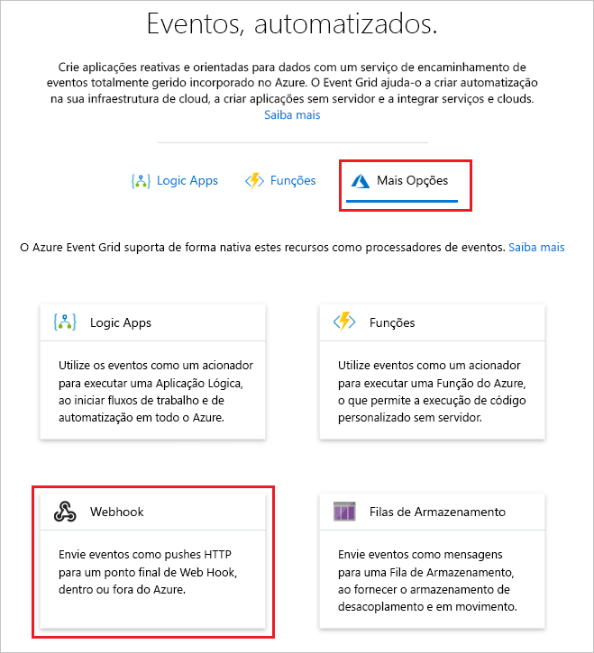
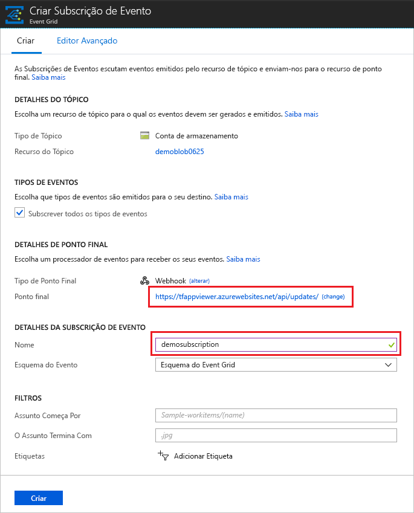
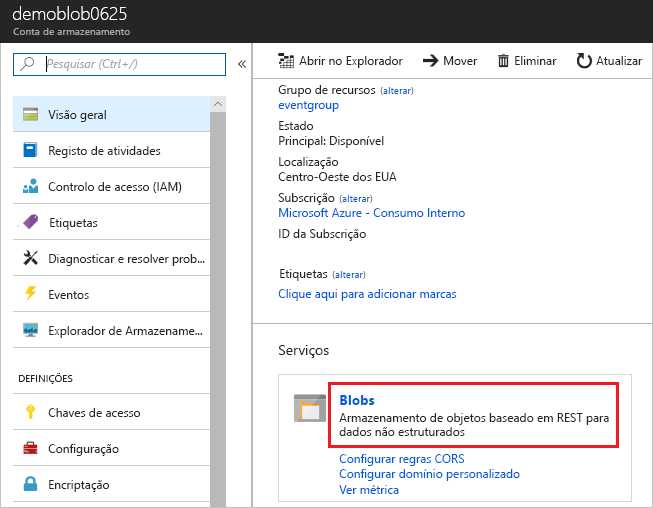
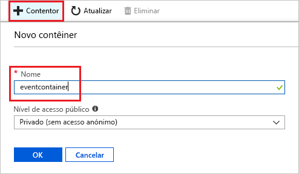
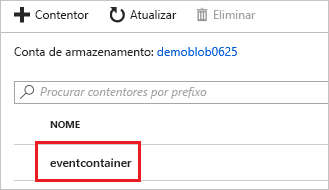
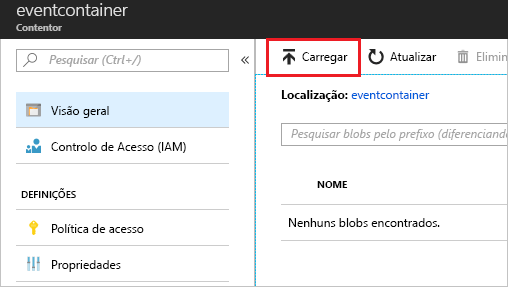

# <a name="create-and-route-blob-storage-events-with-the-azure-portal-and-event-grid"></a>Criar e encaminhar eventos de armazenamento de Blobs com o portal do Azure e o Event Grid

O Azure Event Grid é um serviço de eventos para a cloud. Neste artigo, irá utilizar o portal do Azure para criar uma conta de armazenamento de Blobs, subscrever eventos nesse armazenamento de blobs e acionar um evento para ver o resultado. Normalmente, envia eventos para um ponto final que processa os dados de eventos e efetua ações. No entanto, para simplificar este artigo, vai enviar eventos para uma aplicação Web que recolhe e apresenta as mensagens.

[!INCLUDE [quickstarts-free-trial-note.md](../../includes/quickstarts-free-trial-note.md)]

Quando tiver terminado, verá que os dados do evento foram enviados para a aplicação Web.



## <a name="create-a-storage-account"></a>Criar uma conta de armazenamento

Para utilizar eventos de armazenamento de Blobs, precisa de uma [conta de armazenamento de Blobs](../storage/common/storage-create-storage-account.md?toc=%2fazure%2fstorage%2fblobs%2ftoc.json#blob-storage-accounts) ou uma [conta de armazenamento de Fins Gerais v2](../storage/common/storage-account-options.md#general-purpose-v2). As contas de **Fins Gerais v2 (GPv2)** são contas de armazenamento que suportam todas as funcionalidades de todos os serviços de armazenamento, incluindo Blobs, Ficheiros, Filas e Tabelas. Uma **conta de armazenamento de Blobs** é uma conta de armazenamento especializada para armazenar os seus dados não estruturados como blobs (objetos) no Armazenamento do Azure. As contas de armazenamento de Blobs são semelhantes às contas de armazenamento para fins gerais e partilham todas as excelentes características de durabilidade, disponibilidade, escalabilidade e desempenho que utiliza atualmente, incluindo 100% de consistência com a API dos blobs de blocos e dos blobs de acréscimo. Para aplicações que requerem apenas armazenamento de blobs de blocos ou de blobs de acréscimo, recomendamos a utilização das contas de armazenamento de Blobs. 

1. Inicie sessão no [portal do Azure](https://portal.azure.com/).

1. Para criar um armazenamento de Blobs, selecione **Criar um recurso**. 

   

1. Selecione o **Armazenamento** para filtrar as opções disponíveis e selecione **Conta de armazenamento - blob, ficheiro, tabela, fila**.

   

1. Apresenta valores para o armazenamento de Blobs, incluindo um nome exclusivo para a conta. Para o tipo de conta, selecione **Armazenamento de blobs**. Para a localização, selecione uma das [localizações](overview.md) que suporte o Event Grid. Quando terminar de indicar os valores, selecione **Criar**.

   

## <a name="create-a-message-endpoint"></a>Criar um ponto final de mensagem

Antes de subscrever aos eventos do armazenamento de Blobs, vamos criar o ponto final para a mensagem de evento. Normalmente, o ponto final executa as ações com base nos dados do evento. Para simplificar este início rápido, vai implementar uma [aplicação Web pré-criada](https://github.com/dbarkol/azure-event-grid-viewer) para apresentar as mensagens de evento. A solução implementada inclui um plano do Serviço de Aplicações, uma aplicação Web do Serviço de Aplicações e o código de origem do GitHub.

1. Selecione **Implementar no Azure** para implementar a solução para a sua subscrição. No portal do Azure, indique os valores para os parâmetros.

   <a href="https://portal.azure.com/#create/Microsoft.Template/uri/https%3A%2F%2Fraw.githubusercontent.com%2Fdbarkol%2Fazure-event-grid-viewer%2Fmaster%2Fazuredeploy.json" target="_blank"></a>

1. A implementação pode demorar alguns minutos. Após a implementação ter sido concluída com êxito, verifique a aplicação Web para verificar se está em execução. Num browser, navegue para: `https://<your-site-name>.azurewebsites.net`

1. Vê o site, mas ainda não foram publicados eventos no mesmo.

   

[!INCLUDE [event-grid-register-provider-portal.md](../../includes/event-grid-register-provider-portal.md)]

## <a name="subscribe-to-the-blob-storage"></a>Subscrever a conta de armazenamento de Blobs

Subscreva um tópico para comunicar ao Event Grid os eventos que pretende controlar e para onde enviar os eventos.

1. No portal, selecione o armazenamento de blobs e selecione **Eventos**.

   

1. Para enviar eventos para a sua aplicação de visualizador, utilize um webhook para o ponto final. Selecione **Mais Opções**, e **Webhook**.

   

1. A subscrição de evento é pré-preenchida com os valores do armazenamento de Blobs. Para o ponto final do webhook, indique o URL da sua aplicação Web e adicione `api/updates` ao URL da home page. Nomeie a subscrição. Quando terminar, selecione **Criar**.

   

1. Verifique a aplicação Web novamente e repare que um evento de validação de subscrição foi enviado para a mesma. Selecione o ícone do olho para expandir os dados do evento. O Event Grid envia o evento de validação para que o ponto final possa verificar que pretende receber dados de eventos. A aplicação Web inclui código para validar a subscrição.

   

Agora, vamos acionar um evento para ver como o Event Grid distribui a mensagem para o ponto final.

## <a name="send-an-event-to-your-endpoint"></a>Enviar um evento para o seu ponto final

Aciona um evento para o armazenamento de Blobs ao carregar um ficheiro. O ficheiro não precisa de qualquer conteúdo específico. Os artigos partem do princípio de que tem um ficheiro denominado testfile.txt, mas pode utilizar qualquer ficheiro.

1. Para o armazenamento de Blobs, selecione **Blobs**.

   

1. Selecionar **+ Contentor**. Nomeie o contentor e utilize qualquer nível de acesso.

   

1. Selecione o novo contentor.

   

1. Para carregar um ficheiro, selecione **Carregar**.

   

1. Navegue para o ficheiro de teste e carregue-o.

1. Acionou o evento e o Event Grid enviou a mensagem para o ponto final que configurou ao subscrever. Veja a sua aplicação Web e repare que foi recebido um evento criado por um blob. 

  ```json
  {
    "topic": "/subscriptions/{subscription-id}/resourceGroups/eventgroup/providers/Microsoft.Storage/storageAccounts/demoblob0625",
    "subject": "/blobServices/default/containers/eventcontainer/blobs/testfile.txt",
    "eventType": "Microsoft.Storage.BlobCreated",
    "eventTime": "2018-06-25T22:50:41.1823131Z",
    "id": "89a2f9da-c01e-00bb-13d6-0c599506e4e3",
    "data": {
      "api": "PutBlockList",
      "clientRequestId": "41341a9b-e977-4a91-9000-c64125039047",
      "requestId": "89a2f9da-c01e-00bb-13d6-0c5995000000",
      "eTag": "0x8D5DAEE13C8F9ED",
      "contentType": "text/plain",
      "contentLength": 4,
      "blobType": "BlockBlob",
      "url": "https://demoblob0625.blob.core.windows.net/eventcontainer/testfile.txt",
      "sequencer": "00000000000000000000000000001C24000000000004712b",
      "storageDiagnostics": {
        "batchId": "ef633252-32fd-464b-8f5a-0d10d68885e6"
      }
    },
    "dataVersion": "",
    "metadataVersion": "1"
  }
  ```

## <a name="clean-up-resources"></a>Limpar recursos

Se quiser continuar a trabalhar com este evento, não limpe os recursos criados neste artigo. Caso contrário, elimine os recursos que criou neste artigo.

Selecione o grupo de recursos e selecione **Eliminar grupo de recursos**.

## <a name="next-steps"></a>Passos seguintes

Agora que sabe como criar tópicos personalizados e subscrições de eventos, saiba mais sobre o que o Event Grid pode ajudá-lo a fazer:

- [Sobre o Event Grid](overview.md)
- [Encaminhar eventos de armazenamento de Blobs para um ponto final Web personalizado](../storage/blobs/storage-blob-event-quickstart.md?toc=%2fazure%2fevent-grid%2ftoc.json)
- [Monitorizar alterações de máquina virtual com o Azure Event Grid e Logic Apps](monitor-virtual-machine-changes-event-grid-logic-app.md)
- [Transmitir macrodados em fluxo para um armazém de dados](event-grid-event-hubs-integration.md)
