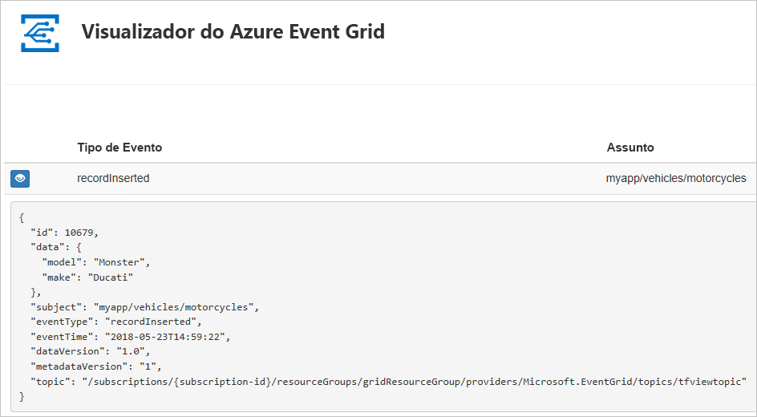
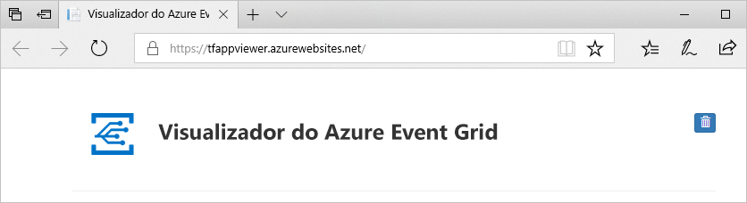
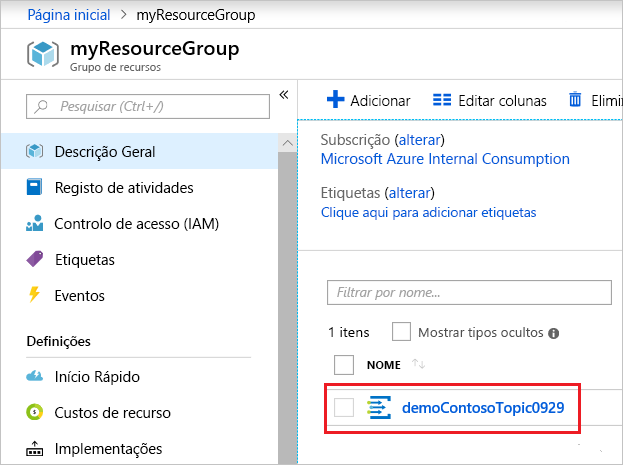
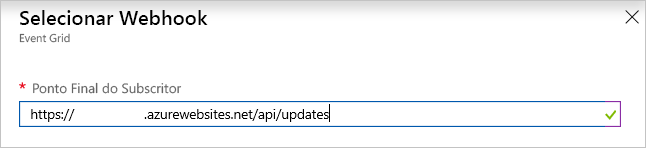
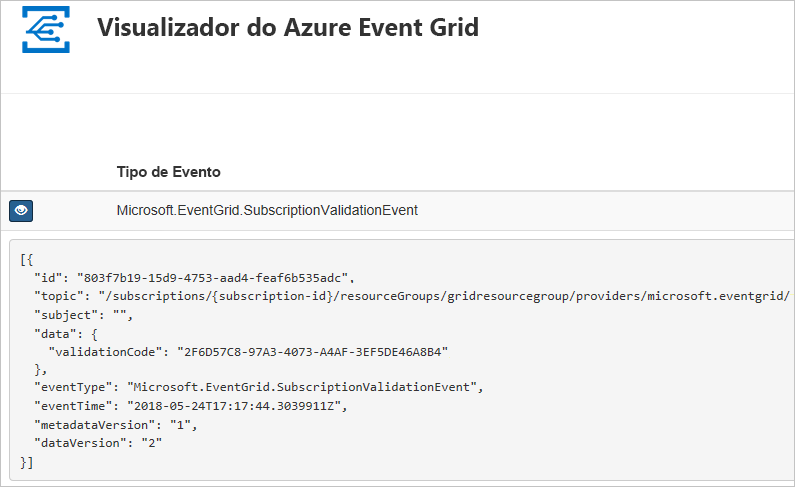

# <a name="quickstart-route-custom-events-to-web-endpoint-with-the-azure-portal-and-event-grid"></a>Início rápido: Encaminhar eventos personalizados para o ponto final da web com o portal do Azure e o Event Grid

O Azure Event Grid é um serviço de eventos para a cloud. Neste artigo, o portal do Azure serve para criar um tópico personalizado, subscrever o tópico personalizado e acionar o evento para ver o resultado. Normalmente, envia eventos para um ponto final que processa os dados de eventos e efetua ações. No entanto, para simplificar este artigo, vai enviar eventos para uma aplicação Web que recolhe e apresenta as mensagens.

Quando tiver terminado, verá que os dados do evento foram enviados para a aplicação Web.



[!INCLUDE [quickstarts-free-trial-note.md](../../includes/quickstarts-free-trial-note.md)]

[!INCLUDE [event-grid-register-provider-portal.md](../../includes/event-grid-register-provider-portal.md)]

## <a name="create-a-custom-topic"></a>Criar um tópico personalizado

Um tópico do Event Grid fornece um ponto final definido pelo utilizador no qual publica os eventos. 

1. Inicie sessão no [portal do Azure](https://portal.azure.com/).

1. Para criar um tópico personalizado, selecione **Criar um recurso**. 

   

1. Procure *Tópico do Event Grid* e selecione-o nas opções disponíveis.

   

1. Selecione **Criar**.

   

1. Forneça um nome exclusivo para o tópico personalizado. O nome do tópico deve ser exclusivo, porque este é representado por uma entrada DNS. Não utilize o nome apresentado na imagem. Em vez disso, criar seu próprio nome - tem de ter entre 3 e 50 carateres e conter apenas valores-z, A-Z, 0-9, e "-". Forneça um nome para o grupo de recursos. Selecione **Criar**.

   

1. Depois de o tópico personalizado ter sido criado, verá a notificação de êxito.

   

   Se a implementação não teve êxito, descubra o que causou o erro. Selecione **Falha na implementação**.

   

   Selecione a mensagem de erro.

   

   A imagem seguinte mostra uma implementação que falhou porque o nome para o tópico personalizado já está em utilização. Se vir este erro, tente novamente a implementação com um nome diferente.

   

## <a name="create-a-message-endpoint"></a>Criar um ponto final de mensagem

Antes de subscrever o tópico personalizado, vamos criar o ponto final para a mensagem de evento. Normalmente, o ponto final executa as ações com base nos dados do evento. Para simplificar este início rápido, vai implementar uma [aplicação Web pré-criada](https://github.com/Azure-Samples/azure-event-grid-viewer) para apresentar as mensagens de evento. A solução implementada inclui um plano do Serviço de Aplicações, uma aplicação Web do Serviço de Aplicações e o código de origem do GitHub.

1. Selecione **Implementar no Azure** para implementar a solução para a sua subscrição. No portal do Azure, indique os valores para os parâmetros.

   <a href="https://portal.azure.com/#create/Microsoft.Template/uri/https%3A%2F%2Fraw.githubusercontent.com%2FAzure-Samples%2Fazure-event-grid-viewer%2Fmaster%2Fazuredeploy.json" target="_blank"></a>

1. A implementação pode demorar alguns minutos. Após a implementação ter sido concluída com êxito, verifique a aplicação Web para verificar se está em execução. Num browser, navegue para: `https://<your-site-name>.azurewebsites.net`

1. Vê o site, mas ainda não foram publicados eventos no mesmo.

   

## <a name="subscribe-to-custom-topic"></a>Subscrever um tópico personalizado

Subscreva um tópico do Event Grid para comunicar ao Event Grid os eventos que pretende controlar e para onde enviar os eventos.

1. No portal, selecione o seu tópico personalizado.

   

1. Selecione **+ Subscrição de Eventos**.

   

1. Selecione **Webhook** para o tipo de ponto final. Indique um nome para a subscrição de evento.

   

1. Selecione **Selecionar um ponto final**. 

1. Para o ponto final do webhook, indique o URL da sua aplicação Web e adicione `api/updates` ao URL da home page. Selecione **Confirmar a Seleção**.

   

1. Quando terminar de indicar os valores da subscrição de evento, selecione **Criar**.

Verifique a aplicação Web novamente e repare que um evento de validação de subscrição foi enviado para a mesma. Selecione o ícone do olho para expandir os dados do evento. O Event Grid envia o evento de validação para que o ponto final possa verificar que pretende receber dados de eventos. A aplicação Web inclui código para validar a subscrição.



## <a name="send-an-event-to-your-topic"></a>Enviar um evento para o seu tópico

Agora, vamos acionar um evento para ver como o Event Grid distribui a mensagem para o ponto final. Utilize a CLI do Azure ou o PowerShell para enviar um evento de teste para o seu tópico personalizado. Normalmente, uma aplicação ou serviço do Azure enviaria os dados do evento.

O primeiro exemplo utiliza a CLI do Azure. Obtém o URL e a chave para o tópico personalizado e os dados do evento de exemplo. Utilize o nome do tópico personalizado de `<topic_name>`. Este cria dados do evento de exemplo. O elemento `data` do JSON é o payload do evento. Qualquer JSON bem formado pode ir para este campo. Também pode utilizar o campo do assunto para encaminhamento e filtragem avançados. CURL é um utilitário que envia os pedidos HTTP.

```azurecli-interactive
endpoint=$(az eventgrid topic show --name <topic_name> -g myResourceGroup --query "endpoint" --output tsv)
key=$(az eventgrid topic key list --name <topic_name> -g myResourceGroup --query "key1" --output tsv)

event='[ {"id": "'"$RANDOM"'", "eventType": "recordInserted", "subject": "myapp/vehicles/motorcycles", "eventTime": "'`date +%Y-%m-%dT%H:%M:%S%z`'", "data":{ "make": "Ducati", "model": "Monster"},"dataVersion": "1.0"} ]'

curl -X POST -H "aeg-sas-key: $key" -d "$event" $endpoint
```

O segundo exemplo utiliza o PowerShell para efetuar passos semelhantes.

```azurepowershell-interactive
$endpoint = (Get-AzureRmEventGridTopic -ResourceGroupName gridResourceGroup -Name <topic-name>).Endpoint
$keys = Get-AzureRmEventGridTopicKey -ResourceGroupName gridResourceGroup -Name <topic-name>

$eventID = Get-Random 99999

#Date format should be SortableDateTimePattern (ISO 8601)
$eventDate = Get-Date -Format s

#Construct body using Hashtable
$htbody = @{
    id= $eventID
    eventType="recordInserted"
    subject="myapp/vehicles/motorcycles"
    eventTime= $eventDate   
    data= @{
        make="Ducati"
        model="Monster"
    }
    dataVersion="1.0"
}

#Use ConvertTo-Json to convert event body from Hashtable to JSON Object
#Append square brackets to the converted JSON payload since they are expected in the event's JSON payload syntax
$body = "["+(ConvertTo-Json $htbody)+"]"

Invoke-WebRequest -Uri $endpoint -Method POST -Body $body -Headers @{"aeg-sas-key" = $keys.Key1}
```

Acionou o evento e o Event Grid enviou a mensagem para o ponto final que configurou ao subscrever. Verifique a aplicação Web para ver o evento que acabámos de enviar.

```json
[{
  "id": "1807",
  "eventType": "recordInserted",
  "subject": "myapp/vehicles/motorcycles",
  "eventTime": "2017-08-10T21:03:07+00:00",
  "data": {
    "make": "Ducati",
    "model": "Monster"
  },
  "dataVersion": "1.0",
  "metadataVersion": "1",
  "topic": "/subscriptions/{subscription-id}/resourceGroups/{resource-group}/providers/Microsoft.EventGrid/topics/{topic}"
}]
```


## <a name="clean-up-resources"></a>Limpar recursos

Se quiser continuar a trabalhar com este evento, não limpe os recursos criados neste artigo. Caso contrário, elimine os recursos que criou neste artigo.

Selecione o grupo de recursos e selecione **Eliminar grupo de recursos**.

## <a name="next-steps"></a>Passos Seguintes

Agora que sabe como criar tópicos personalizados e subscrições de eventos, saiba mais sobre o que o Event Grid pode ajudá-lo a fazer:

- [Sobre o Event Grid](overview.md)
- [Encaminhar eventos de armazenamento de Blobs para um ponto final Web personalizado](../storage/blobs/storage-blob-event-quickstart.md?toc=%2fazure%2fevent-grid%2ftoc.json)
- [Monitorizar alterações de máquina virtual com o Azure Event Grid e Logic Apps](monitor-virtual-machine-changes-event-grid-logic-app.md)
- [Transmitir macrodados em fluxo para um armazém de dados](event-grid-event-hubs-integration.md)
