# <a name="create-and-route-custom-events-with-the-azure-portal-and-event-grid"></a>Criar e encaminhar eventos personalizados com o portal do Azure e o Event Grid

O Azure Event Grid é um serviço de eventos para a cloud. Neste artigo, o portal do Azure é utilizado para criar um tópico personalizado, subscrever o tópico e acionar o evento para ver o resultado. Vai enviar o evento para uma Função do Azure que regista os dados do evento. Quando tiver terminado, verá que os dados do evento foram enviados para um ponto final e registados.

[!INCLUDE [quickstarts-free-trial-note.md](../../includes/quickstarts-free-trial-note.md)]

## <a name="create-a-custom-topic"></a>Criar um tópico personalizado

Um tópico do Event Grid fornece um ponto final definido pelo utilizador no qual publica os eventos. 

1. Inicie sessão no [portal do Azure](https://portal.azure.com/).

1. Para criar um tópico personalizado, selecione **Criar um recurso**. 

   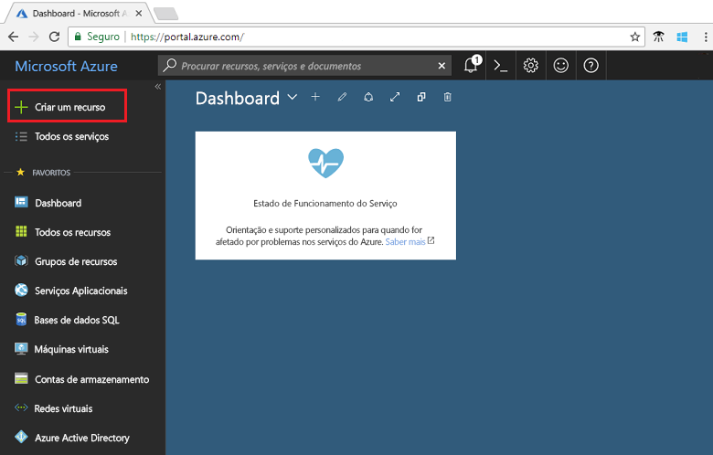

1. Procure *Tópico do Event Grid* e selecione-o nas opções disponíveis.

   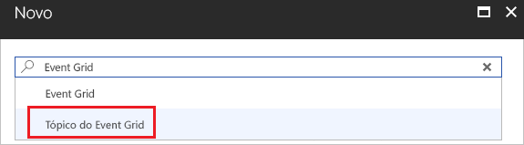

1. Selecione **Criar**.

   

1. Forneça um nome exclusivo para o tópico personalizado. O nome do tópico deve ser exclusivo, porque este é representado por uma entrada DNS. Não utilize o nome apresentado na imagem. Em vez disso, crie o seu próprio nome. Selecione uma das [regiões suportadas](overview.md). Forneça um nome para o grupo de recursos. Selecione **Criar**.

   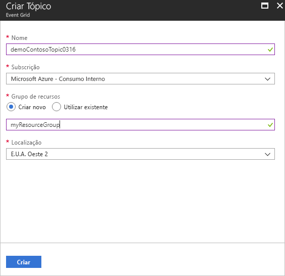

1. Depois de o tópico personalizado ter sido criado, verá a notificação de êxito.

   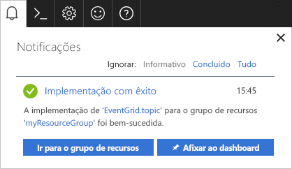

   Se a implementação não teve êxito, descubra o que causou o erro. Selecione **Falha na implementação**.

   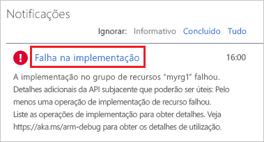

   Selecione a mensagem de erro.

   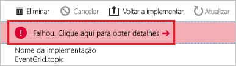

   A imagem seguinte mostra uma implementação que falhou porque o nome para o tópico personalizado já está em utilização. Se vir este erro, tente novamente a implementação com um nome diferente.

   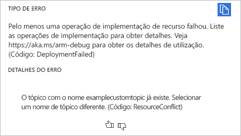

## <a name="create-an-azure-function"></a>Criar uma Função do Azure

Antes de subscrever o tópico, vamos criar o ponto final para a mensagem de evento. Neste artigo, pode utilizar as Funções do Azure para criar uma aplicação de funções para o ponto final.

1. Para criar uma função, selecione **Criar um recurso**.

   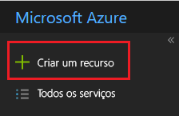

1. Selecione **Computação** e **Function App**.

   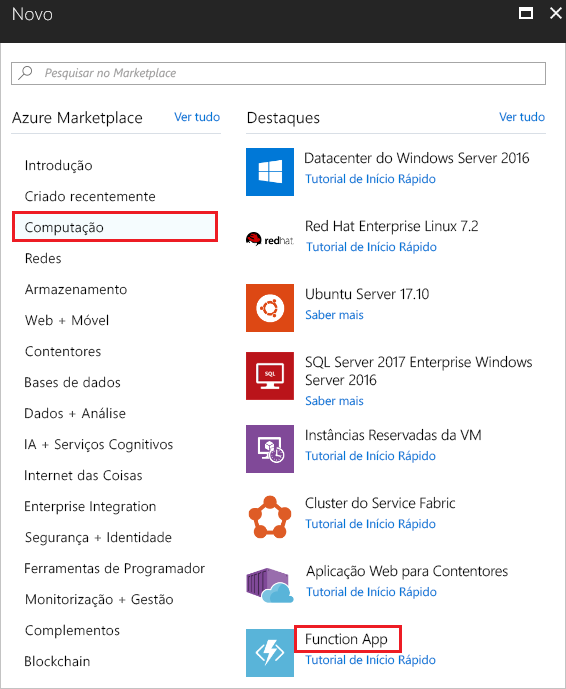

1. Forneça um nome exclusivo para a Função do Azure. Não utilize o nome apresentado na imagem. Selecione o grupo de recursos que criou neste artigo. Para o plano de alojamento, utilize o **Plano de Consumo**. Utilize a nova conta de armazenamento sugerida. Pode desativar o Application Insights. Depois de fornecer os valores, selecione **Criar**.

   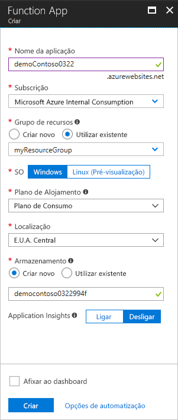

1. Quando a implementação estiver concluída, selecione **Ir para recurso**.

   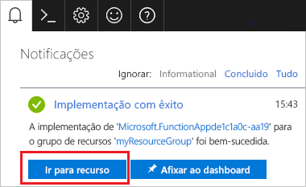

1. Junto a **Funções**, selecione **+**.

   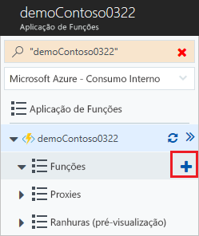

1. Entre as opções disponíveis, selecione **Função personalizada**.

   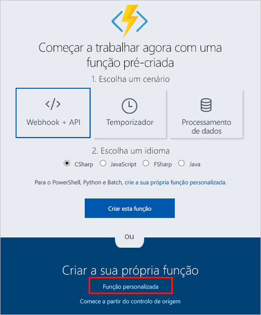

1. Desloque para baixo até encontrar **Acionador do Event Grid**. Selecione **C#**.

   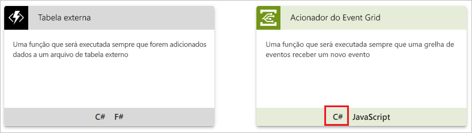

1. Aceite os valores predefinidos e selecione **Criar**.

   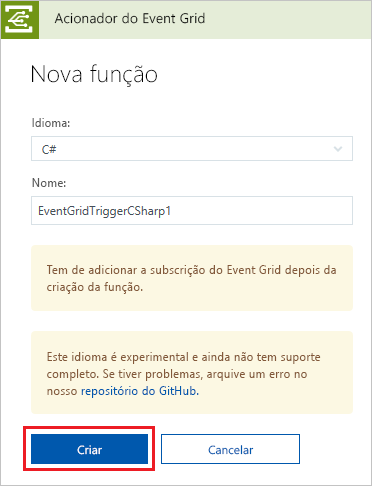

A função está agora pronta para receber eventos.

## <a name="subscribe-to-a-topic"></a>Subscrever um tópico

Subscreva um tópico para comunicar ao Event Grid os eventos que pretende controlar e para onde enviar os eventos.

1. Na sua função do Azure, selecione **Adicionar Subscrição do Event Grid**.

   

1. Forneça valores para a subscrição. Selecione **Tópicos do Event Grid** para obter o tipo de tópico. Para a subscrição e o grupo de recursos, selecione a subscrição e o grupo de recursos onde criou o seu tópico personalizado. Por exemplo, selecione o nome do seu tópico personalizado. O ponto final de subscritor é pré-preenchido com o URL para a função.

   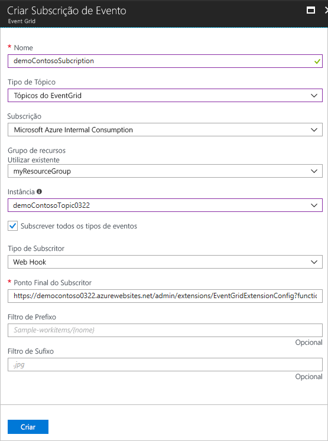

1. Antes de acionar o evento, abra os registos para a função, para que possa ver os dados de eventos quando são enviados. Na parte inferior da sua função do Azure, selecione **Registos**.

   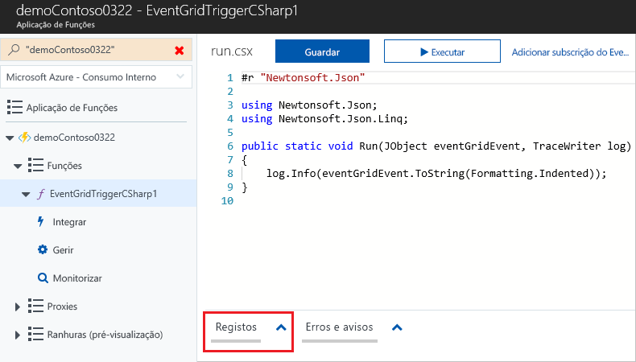

Agora, vamos acionar um evento para ver como o Event Grid distribui a mensagem para o ponto final. Para simplificar este artigo, utilize o Cloud Shell para enviar os dados do evento de exemplo para o tópico personalizado. Normalmente, uma aplicação ou serviço do Azure enviaria os dados do evento.

[!INCLUDE [cloud-shell-try-it.md](../../includes/cloud-shell-try-it.md)]

## <a name="send-an-event-to-your-topic"></a>Enviar um evento para o seu tópico

Utilize a CLI do Azure ou o PowerShell para enviar um evento de teste para o seu tópico personalizado.

O primeiro exemplo utiliza a CLI do Azure. Obtém o URL e a chave para o tópico e os dados de eventos de exemplo. Utilize o nome do tópico para `<topic_name>`. Para ver o evento completo, utilize `echo "$body"`. O elemento `data` do JSON é o payload do evento. Qualquer JSON bem formado pode ir para este campo. Também pode utilizar o campo do assunto para encaminhamento e filtragem avançados. CURL é um utilitário que envia os pedidos HTTP.

```azurecli-interactive
endpoint=$(az eventgrid topic show --name <topic_name> -g myResourceGroup --query "endpoint" --output tsv)
key=$(az eventgrid topic key list --name <topic_name> -g myResourceGroup --query "key1" --output tsv)

body=$(eval echo "'$(curl https://raw.githubusercontent.com/Azure/azure-docs-json-samples/master/event-grid/customevent.json)'")

curl -X POST -H "aeg-sas-key: $key" -d "$body" $endpoint
```

O segundo exemplo utiliza o PowerShell para efetuar passos semelhantes.

```azurepowershell-interactive
$endpoint = (Get-AzureRmEventGridTopic -ResourceGroupName gridResourceGroup -Name <topic-name>).Endpoint
$keys = Get-AzureRmEventGridTopicKey -ResourceGroupName gridResourceGroup -Name <topic-name>

$eventID = Get-Random 99999

#Date format should be SortableDateTimePattern (ISO 8601)
$eventDate = Get-Date -Format s

#Construct body using Hashtable
$htbody = @{
    id= $eventID
    eventType="recordInserted"
    subject="myapp/vehicles/motorcycles"
    eventTime= $eventDate   
    data= @{
        make="Ducati"
        model="Monster"
    }
    dataVersion="1.0"
}

#Use ConvertTo-Json to convert event body from Hashtable to JSON Object
#Append square brackets to the converted JSON payload since they are expected in the event's JSON payload syntax
$body = "["+(ConvertTo-Json $htbody)+"]"

Invoke-WebRequest -Uri $endpoint -Method POST -Body $body -Headers @{"aeg-sas-key" = $keys.Key1}
```

Acionou o evento e o Event Grid enviou a mensagem para o ponto final que configurou ao subscrever. Consulte os registos para ver os dados do eventos.

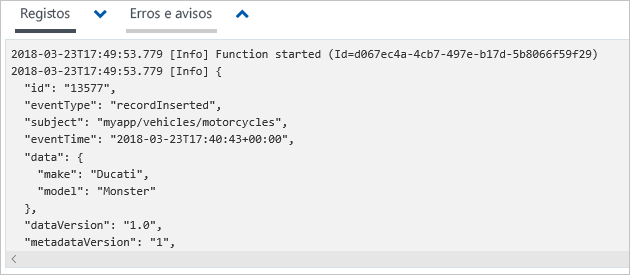

## <a name="clean-up-resources"></a>Limpar recursos

Se quiser continuar a trabalhar com este evento, não limpe os recursos criados neste artigo. Caso contrário, elimine os recursos que criou neste artigo.

Selecione o grupo de recursos e selecione **Eliminar grupo de recursos**.

## <a name="next-steps"></a>Passos seguintes

Agora que sabe como criar tópicos personalizados e subscrições de eventos, saiba mais sobre o que o Event Grid pode ajudá-lo a fazer:

- [Sobre o Event Grid](overview.md)
- [Encaminhar eventos de armazenamento de Blobs para um ponto final Web personalizado](../storage/blobs/storage-blob-event-quickstart.md?toc=%2fazure%2fevent-grid%2ftoc.json)
- [Monitorizar alterações de máquina virtual com o Azure Event Grid e Logic Apps](monitor-virtual-machine-changes-event-grid-logic-app.md)
- [Transmitir macrodados em fluxo para um armazém de dados](event-grid-event-hubs-integration.md)
