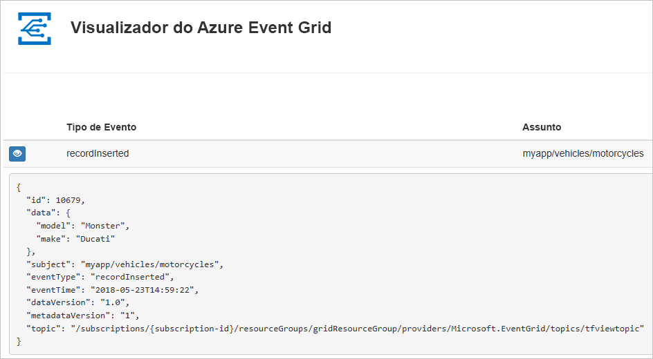
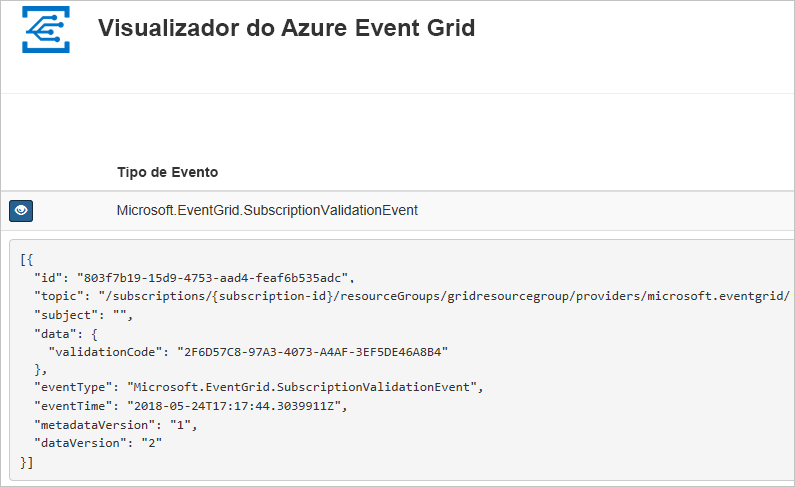

# <a name="create-and-route-custom-events-with-azure-powershell-and-event-grid"></a>Criar e encaminhar eventos personalizados com o Azure PowerShell e o Event Grid

O Azure Event Grid é um serviço de eventos para a cloud. Neste artigo, o Azure PowerShell é utilizado para criar um tópico personalizado, subscrever o tópico e acionar o evento para ver o resultado. Normalmente, envia eventos para um ponto final que processa os dados de eventos e efetua ações. No entanto, para simplificar este artigo, vai enviar eventos para uma aplicação Web que recolhe e apresenta as mensagens.

Quando tiver terminado, verá que os dados do evento foram enviados para a aplicação Web.



[!INCLUDE [quickstarts-free-trial-note.md](../../includes/quickstarts-free-trial-note.md)]

Este artigo requer a utilização da versão mais recente do Azure PowerShell. Se precisar de instalar ou atualizar, veja [Instalar e configurar o Azure PowerShell](/powershell/azure/install-azurerm-ps).

## <a name="create-a-resource-group"></a>Criar um grupo de recursos

Os tópicos do Event Grid são recursos do Azure e têm de ser colocados num grupo de recursos do Azure. Um grupo de recursos é uma coleção lógica na qual os recursos do Azure são implementados e geridos.

Crie um grupo de recursos com o comando [New-AzureRmResourceGroup](/powershell/module/azurerm.resources/new-azurermresourcegroup).

O exemplo seguinte cria um grupo de recursos com o nome *gridResourceGroup* na localização *westus2*.

```powershell-interactive
New-AzureRmResourceGroup -Name gridResourceGroup -Location westus2
```

[!INCLUDE [event-grid-register-provider-powershell.md](../../includes/event-grid-register-provider-powershell.md)]

## <a name="create-a-custom-topic"></a>Criar um tópico personalizado

Um tópico do Event Grid fornece um ponto final definido pelo utilizador no qual publica os eventos. O exemplo seguinte cria o tópico personalizado no seu grupo de recursos. Substitua `<your-topic-name>` por um nome exclusivo para o seu tópico. O nome do tópico deve ser exclusivo, porque faz parte da entrada DNS.

```powershell-interactive
$topicname="<your-topic-name>"

New-AzureRmEventGridTopic -ResourceGroupName gridResourceGroup -Location westus2 -Name $topicname
```

## <a name="create-a-message-endpoint"></a>Criar um ponto final de mensagem

Antes de subscrever o tópico, vamos criar o ponto final para a mensagem de evento. Normalmente, o ponto final executa as ações com base nos dados do evento. Para simplificar este início rápido, vai implementar uma [aplicação Web pré-criada](https://github.com/Azure-Samples/azure-event-grid-viewer) para apresentar as mensagens de evento. A solução implementada inclui um plano do Serviço de Aplicações, uma aplicação Web do Serviço de Aplicações e o código de origem do GitHub.

Substitua `<your-site-name>` por um nome exclusivo para a aplicação Web. O nome da aplicação Web deve ser exclusivo, porque faz parte da entrada DNS.

```powershell-interactive
$sitename="<your-site-name>"

New-AzureRmResourceGroupDeployment `
  -ResourceGroupName gridResourceGroup `
  -TemplateUri "https://raw.githubusercontent.com/Azure-Samples/azure-event-grid-viewer/master/azuredeploy.json" `
  -siteName $sitename `
  -hostingPlanName viewerhost
```

A implementação pode demorar alguns minutos. Após a implementação ter sido concluída com êxito, verifique a aplicação Web para verificar se está em execução. Num browser, navegue para: `https://<your-site-name>.azurewebsites.net`

Deverá ver o site sem mensagens atualmente apresentadas.

## <a name="subscribe-to-a-topic"></a>Subscrever um tópico

Subscreva um tópico para comunicar ao Event Grid os eventos que pretende controlar e para onde enviar esses eventos. O exemplo seguinte subscreve o tópico que criou e transmite o URL da aplicação Web como o ponto final para notificação de eventos.

O ponto final para a aplicação Web tem de incluir o sufixo `/api/updates/`.

```powershell-interactive
$endpoint="https://$sitename.azurewebsites.net/api/updates"

New-AzureRmEventGridSubscription `
  -EventSubscriptionName demoViewerSub `
  -Endpoint $endpoint `
  -ResourceGroupName gridResourceGroup `
  -TopicName $topicname
```

Verifique a aplicação Web novamente e repare que um evento de validação de subscrição foi enviado para a mesma. Selecione o ícone do olho para expandir os dados do evento. O Event Grid envia o evento de validação para que o ponto final possa verificar que pretende receber dados de eventos. A aplicação Web inclui código para validar a subscrição.



## <a name="send-an-event-to-your-topic"></a>Enviar um evento para o seu tópico

Vamos acionar um evento para ver como o Event Grid distribui a mensagem para o ponto final. Em primeiro lugar, vamos obter o URL e a chave do tópico.

```powershell-interactive
$endpoint = (Get-AzureRmEventGridTopic -ResourceGroupName gridResourceGroup -Name $topicname).Endpoint
$keys = Get-AzureRmEventGridTopicKey -ResourceGroupName gridResourceGroup -Name $topicname
```

Para simplificar este artigo, vamos configurar dados do evento de exemplo para enviar para o tópico personalizado. Normalmente, uma aplicação ou serviço do Azure enviaria os dados do evento. O seguinte exemplo utiliza Hashtable para construir os dados do evento `htbody` e, em seguida, converte-os num objeto de payload JSON bem formado `$body`:

```powershell-interactive
$eventID = Get-Random 99999

#Date format should be SortableDateTimePattern (ISO 8601)
$eventDate = Get-Date -Format s

#Construct body using Hashtable
$htbody = @{
    id= $eventID
    eventType="recordInserted"
    subject="myapp/vehicles/motorcycles"
    eventTime= $eventDate   
    data= @{
        make="Ducati"
        model="Monster"
    }
    dataVersion="1.0"
}

#Use ConvertTo-Json to convert event body from Hashtable to JSON Object
#Append square brackets to the converted JSON payload since they are expected in the event's JSON payload syntax
$body = "["+(ConvertTo-Json $htbody)+"]"
```

Se visualizar o `$body`, pode ver o evento completo. O elemento `data` do JSON é o payload do evento. Qualquer JSON bem formado pode ir para este campo. Também pode utilizar o campo do assunto para encaminhamento e filtragem avançados.

Agora, envie um evento para o seu tópico.

```powershell-interactive
Invoke-WebRequest -Uri $endpoint -Method POST -Body $body -Headers @{"aeg-sas-key" = $keys.Key1}
```

Acionou o evento e o Event Grid enviou a mensagem para o ponto final que configurou ao subscrever. Verifique a aplicação Web para ver o evento que acabámos de enviar.

```json
[{
  "id": "1807",
  "eventType": "recordInserted",
  "subject": "myapp/vehicles/motorcycles",
  "eventTime": "2018-01-25T15:58:13",
  "data": {
    "make": "Ducati",
    "model": "Monster"
  },
  "dataVersion": "1.0",
  "metadataVersion": "1",
  "topic": "/subscriptions/{subscription-id}/resourceGroups/{resource-group}/providers/Microsoft.EventGrid/topics/{topic}"
}]
```

## <a name="clean-up-resources"></a>Limpar recursos

Se quiser continuar a trabalhar com este evento ou com a aplicação de visualizador de eventos, não limpe os recursos criados neste artigo. Caso contrário, utilize o comando seguinte para eliminar os recursos que criou neste artigo.

```powershell
Remove-AzureRmResourceGroup -Name gridResourceGroup
```

## <a name="next-steps"></a>Passos seguintes

Agora que sabe como criar tópicos e subscrições de eventos, saiba mais sobre o que o Event Grid pode ajudá-lo a fazer:

- [Sobre o Event Grid](overview.md)
- [Encaminhar eventos de armazenamento de Blobs para um ponto final Web personalizado](../storage/blobs/storage-blob-event-quickstart.md?toc=%2fazure%2fevent-grid%2ftoc.json)
- [Monitorizar alterações de máquina virtual com o Azure Event Grid e Logic Apps](monitor-virtual-machine-changes-event-grid-logic-app.md)
- [Transmitir macrodados em fluxo para um armazém de dados](event-grid-event-hubs-integration.md)
