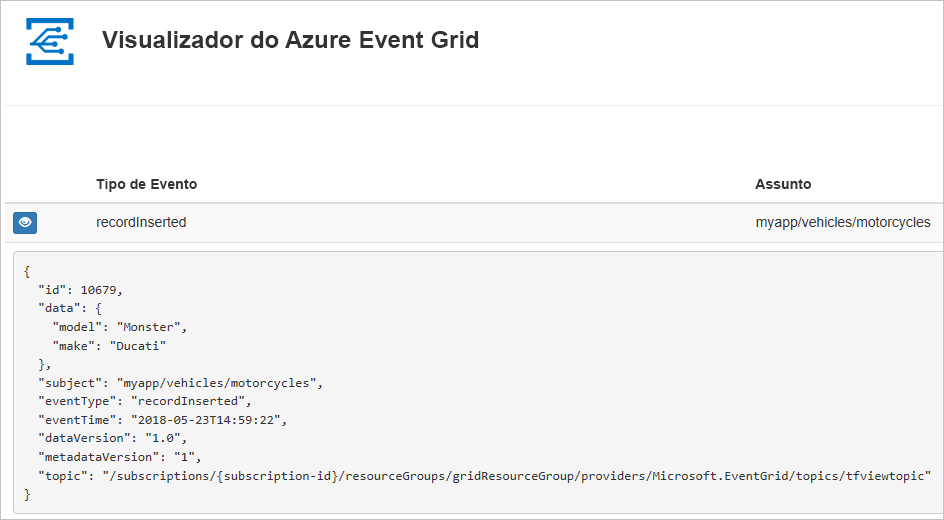
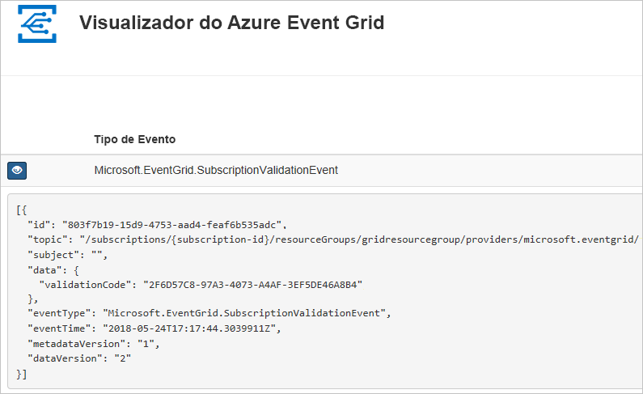

# <a name="create-and-route-custom-events-with-azure-cli-and-event-grid"></a>Criar e encaminhar eventos personalizados com a CLI do Azure e o Event Grid

O Azure Event Grid é um serviço de eventos para a cloud. Neste artigo, a CLI do Azure serve para criar um tópico personalizado, subscrever o tópico personalizado e acionar o evento para ver o resultado. Normalmente, envia eventos para um ponto final que processa os dados de eventos e efetua ações. No entanto, para simplificar este artigo, vai enviar eventos para uma aplicação Web que recolhe e apresenta as mensagens.

Quando tiver terminado, verá que os dados do evento foram enviados para a aplicação Web.



[!INCLUDE [quickstarts-free-trial-note.md](../../includes/quickstarts-free-trial-note.md)]

[!INCLUDE [cloud-shell-try-it.md](../../includes/cloud-shell-try-it.md)]

Se optar por instalar e utilizar a CLI localmente, este artigo requer a execução da versão mais recente da CLI do Azure (2.0.24 ou posterior). Para localizar a versão, execute `az --version`. Se precisar de instalar ou atualizar, veja [Instalar a CLI do Azure](/cli/azure/install-azure-cli).

Se não estiver a utilizar o Cloud Shell, primeiro tem de iniciar sessão com `az login`.

## <a name="create-a-resource-group"></a>Criar um grupo de recursos

Os tópicos do Event Grid são recursos do Azure e têm de ser colocados num grupo de recursos do Azure. Um grupo de recursos é uma coleção lógica na qual os recursos do Azure são implementados e geridos.

Crie um grupo de recursos com o comando [az group create](/cli/azure/group#az-group-create). 

O exemplo seguinte cria um grupo de recursos com o nome *gridResourceGroup* na localização *westus2*.

```azurecli-interactive
az group create --name gridResourceGroup --location westus2
```

[!INCLUDE [event-grid-register-provider-cli.md](../../includes/event-grid-register-provider-cli.md)]

## <a name="create-a-custom-topic"></a>Criar um tópico personalizado

Um tópico do Event Grid fornece um ponto final definido pelo utilizador no qual publica os eventos. O exemplo seguinte cria o tópico personalizado no seu grupo de recursos. Substitua `<your-topic-name>` por um nome exclusivo para o seu tópico. O nome do tópico personalizado deve ser exclusivo, porque faz parte da entrada DNS.

```azurecli-interactive
topicname=<your-topic-name>

az eventgrid topic create --name $topicname -l westus2 -g gridResourceGroup
```

## <a name="create-a-message-endpoint"></a>Criar um ponto final de mensagem

Antes de subscrever o tópico personalizado, vamos criar o ponto final para a mensagem de evento. Normalmente, o ponto final executa as ações com base nos dados do evento. Para simplificar este início rápido, vai implementar uma [aplicação Web pré-criada](https://github.com/Azure-Samples/azure-event-grid-viewer) para apresentar as mensagens de evento. A solução implementada inclui um plano do Serviço de Aplicações, uma aplicação Web do Serviço de Aplicações e o código de origem do GitHub.

Substitua `<your-site-name>` por um nome exclusivo para a aplicação Web. O nome da aplicação Web deve ser exclusivo, porque faz parte da entrada DNS.

```azurecli-interactive
sitename=<your-site-name>

az group deployment create \
  --resource-group gridResourceGroup \
  --template-uri "https://raw.githubusercontent.com/Azure-Samples/azure-event-grid-viewer/master/azuredeploy.json" \
  --parameters siteName=$sitename hostingPlanName=viewerhost
```

A implementação pode demorar alguns minutos. Após a implementação ter sido concluída com êxito, verifique a aplicação Web para verificar se está em execução. Num browser, navegue para: `https://<your-site-name>.azurewebsites.net`

Deverá ver o site sem mensagens atualmente apresentadas.

## <a name="subscribe-to-a-custom-topic"></a>Subscrever um tópico personalizado

Subscreva um tópico de grelha de eventos para comunicar ao Event Grid os eventos que pretende controlar e para onde enviar esses eventos. O exemplo seguinte subscreve o tópico personalizado que criou e transmite o URL da aplicação Web como o ponto final para a notificação de eventos.

O ponto final para a aplicação Web tem de incluir o sufixo `/api/updates/`.

```azurecli-interactive
endpoint=https://$sitename.azurewebsites.net/api/updates

az eventgrid event-subscription create \
  -g gridResourceGroup \
  --topic-name $topicname \
  --name demoViewerSub \
  --endpoint $endpoint
```

Verifique a aplicação Web novamente e repare que um evento de validação de subscrição foi enviado para a mesma. Selecione o ícone do olho para expandir os dados do evento. O Event Grid envia o evento de validação para que o ponto final possa verificar que pretende receber dados de eventos. A aplicação Web inclui código para validar a subscrição.



## <a name="send-an-event-to-your-custom-topic"></a>Enviar um evento para o tópico personalizado

Vamos acionar um evento para ver como o Event Grid distribui a mensagem para o ponto final. Em primeiro lugar, vamos obter o URL e a chave do tópico personalizado.

```azurecli-interactive
endpoint=$(az eventgrid topic show --name $topicname -g gridResourceGroup --query "endpoint" --output tsv)
key=$(az eventgrid topic key list --name $topicname -g gridResourceGroup --query "key1" --output tsv)
```

Para simplificar este artigo, vai utilizar dados do evento de exemplo para enviar para o tópico personalizado. Normalmente, uma aplicação ou serviço do Azure enviaria os dados do evento. O exemplo seguinte cria dados do evento de exemplo:

```azurecli-interactive
event='[ {"id": "'"$RANDOM"'", "eventType": "recordInserted", "subject": "myapp/vehicles/motorcycles", "eventTime": "'`date +%Y-%m-%dT%H:%M:%S%z`'", "data":{ "make": "Ducati", "model": "Monster"},"dataVersion": "1.0"} ]'
```

O elemento `data` do JSON é o payload do evento. Qualquer JSON bem formado pode ir para este campo. Também pode utilizar o campo do assunto para encaminhamento e filtragem avançados.

CURL é um utilitário que envia os pedidos HTTP. Neste artigo, utilize o CURL para enviar o evento para o tópico. 

```azurecli-interactive
curl -X POST -H "aeg-sas-key: $key" -d "$event" $endpoint
```

Acionou o evento e o Event Grid enviou a mensagem para o ponto final que configurou ao subscrever. Verifique a aplicação Web para ver o evento que acabámos de enviar.

```json
[{
  "id": "1807",
  "eventType": "recordInserted",
  "subject": "myapp/vehicles/motorcycles",
  "eventTime": "2017-08-10T21:03:07+00:00",
  "data": {
    "make": "Ducati",
    "model": "Monster"
  },
  "dataVersion": "1.0",
  "metadataVersion": "1",
  "topic": "/subscriptions/{subscription-id}/resourceGroups/{resource-group}/providers/Microsoft.EventGrid/topics/{topic}"
}]
```

## <a name="clean-up-resources"></a>Limpar recursos
Se quiser continuar a trabalhar com este evento ou com a aplicação de visualizador de eventos, não limpe os recursos criados neste artigo. Caso contrário, utilize o comando seguinte para eliminar os recursos que criou neste artigo.

```azurecli-interactive
az group delete --name gridResourceGroup
```

## <a name="next-steps"></a>Passos seguintes

Agora que sabe como criar tópicos e subscrições de eventos, saiba mais sobre o que o Event Grid pode ajudá-lo a fazer:

- [Sobre o Event Grid](overview.md)
- [Encaminhar eventos de armazenamento de Blobs para um ponto final Web personalizado](../storage/blobs/storage-blob-event-quickstart.md?toc=%2fazure%2fevent-grid%2ftoc.json)
- [Monitorizar alterações de máquina virtual com o Azure Event Grid e Logic Apps](monitor-virtual-machine-changes-event-grid-logic-app.md)
- [Transmitir macrodados em fluxo para um armazém de dados](event-grid-event-hubs-integration.md)
