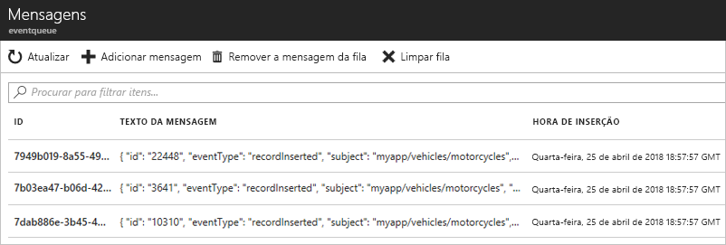

# <a name="route-custom-events-to-azure-queue-storage-with-azure-cli-and-event-grid"></a>Encaminhar eventos personalizados para o armazenamento de Filas do Azure com a CLI do Azure e o Event Grid

O Azure Event Grid é um serviço de eventos para a cloud. O armazenamento de Filas do Azure é um dos processadores de eventos suportados. Neste artigo, a CLI do Azure é utilizada para criar um tópico personalizado, subscrever o tópico e acionar o evento para ver o resultado. Os eventos são enviados para o armazenamento de Filas.

[!INCLUDE [quickstarts-free-trial-note.md](../../includes/quickstarts-free-trial-note.md)]

[!INCLUDE [event-grid-preview-feature-note.md](../../includes/event-grid-preview-feature-note.md)]

## <a name="create-a-resource-group"></a>Criar um grupo de recursos

Os tópicos do Event Grid são recursos do Azure e têm de ser colocados num grupo de recursos do Azure. Um grupo de recursos é uma coleção lógica na qual os recursos do Azure são implementados e geridos.

Crie um grupo de recursos com o comando [az group create](/cli/azure/group#az_group_create). 

O exemplo seguinte cria um grupo de recursos com o nome *gridResourceGroup* na localização *westus2*.

```azurecli-interactive
az group create --name gridResourceGroup --location westus2
```

## <a name="create-a-custom-topic"></a>Criar um tópico personalizado

Um tópico do Event Grid fornece um ponto final definido pelo utilizador no qual publica os eventos. O exemplo seguinte cria o tópico personalizado no seu grupo de recursos. Substitua `<topic_name>` por um nome exclusivo para o seu tópico. O nome do tópico deve ser exclusivo, porque este é representado por uma entrada DNS.

```azurecli-interactive
# if you have not already installed the extension, do it now.
# This extension is required for preview features.
az extension add --name eventgrid

az eventgrid topic create --name <topic_name> -l westus2 -g gridResourceGroup
```

## <a name="create-queue-storage"></a>Criar armazenamento de Filas

Antes de subscrever o tópico, vamos criar o ponto final para a mensagem de evento. Cria um armazenamento de Filas para a recolha de eventos.

```azurecli-interactive
storagename="<unique-storage-name>"
queuename="eventqueue"

az storage account create -n $storagename -g gridResourceGroup -l westus2 --sku Standard_LRS
az storage queue create --name $queuename --account-name $storagename
```

## <a name="subscribe-to-a-topic"></a>Subscrever um tópico

Subscreva um tópico para comunicar ao Event Grid os eventos que pretende controlar. O exemplo seguinte subscreve o tópico que criou e transmite o ID do recurso do armazenamento de Filas para o ponto final. Com a CLI do Azure, transmite o ID de armazenamento da Fila como ponto final. O ponto final está no formato:

`/subscriptions/<subscription-id>/resourcegroups/<resource-group-name>/providers/Microsoft.Storage/storageAccounts/<storage-name>/queueservices/default/queues/<queue-name>`

O script seguinte obtém o ID do recurso da conta de armazenamento para a fila. Constrói o ID para o armazenamento de filas e subscreve um tópico do Event Grid. Define o tipo de ponto final `storagequeue` e utiliza o ID de fila para o ponto final.

```azurecli-interactive
storageid=$(az storage account show --name $storagename --resource-group gridResourceGroup --query id --output tsv)
queueid="$storageid/queueservices/default/queues/$queuename"

az eventgrid event-subscription create \
  --topic-name <topic_name> \
  -g gridResourceGroup \
  --name <event_subscription_name> \
  --endpoint-type storagequeue \
  --endpoint $queueid
```

Se utilizar a API REST para criar a subscrição, transmite o ID da conta de armazenamento e o nome da fila como um parâmetro separado.

```json
"destination": {
  "endpointType": "storagequeue",
  "properties": {
    "queueName":"eventqueue",
    "resourceId": "/subscriptions/<subscription-id>/resourcegroups/<resource-group-name>/providers/Microsoft.Storage/storageAccounts/<storage-name>"
  }
  ...
```

## <a name="send-an-event-to-your-topic"></a>Enviar um evento para o seu tópico

Vamos acionar um evento para ver como o Event Grid distribui a mensagem para o ponto final. Em primeiro lugar, vamos obter o URL e a chave do tópico personalizado. Novamente, utilize o nome do tópico de `<topic_name>`.

```azurecli-interactive
endpoint=$(az eventgrid topic show --name <topic_name> -g gridResourceGroup --query "endpoint" --output tsv)
key=$(az eventgrid topic key list --name <topic_name> -g gridResourceGroup --query "key1" --output tsv)
```

Para simplificar este artigo, vai utilizar dados do evento de exemplo para enviar para o tópico. Normalmente, uma aplicação ou serviço do Azure enviaria os dados do evento. CURL é um utilitário que envia os pedidos HTTP. Neste artigo, utilize o CURL para enviar o evento para o tópico.  O exemplo seguinte envia três eventos para o tópico do Event Grid:

```azurecli-interactive
for i in 1 2 3
do
   body=$(eval echo "'$(curl https://raw.githubusercontent.com/Azure/azure-docs-json-samples/master/event-grid/customevent.json)'")
   curl -X POST -H "aeg-sas-key: $key" -d "$body" $endpoint
done
```

Navegue para o armazenamento de Filas no portal e repare que o Event Grid enviou esses três eventos para a fila.




## <a name="clean-up-resources"></a>Limpar recursos
Se quiser continuar a trabalhar com este evento, não limpe os recursos criados neste artigo. Caso contrário, utilize o comando seguinte para eliminar os recursos que criou neste artigo.

```azurecli-interactive
az group delete --name gridResourceGroup
```

## <a name="next-steps"></a>Passos seguintes

Agora que sabe como criar tópicos e subscrições de eventos, saiba mais sobre o que o Event Grid pode ajudá-lo a fazer:

- [Sobre o Event Grid](overview.md)
- [Encaminhar eventos de armazenamento de Blobs para um ponto final Web personalizado](../storage/blobs/storage-blob-event-quickstart.md?toc=%2fazure%2fevent-grid%2ftoc.json)
- [Monitorizar alterações de máquina virtual com o Azure Event Grid e Logic Apps](monitor-virtual-machine-changes-event-grid-logic-app.md)
- [Transmitir macrodados em fluxo para um armazém de dados](event-grid-event-hubs-integration.md)
