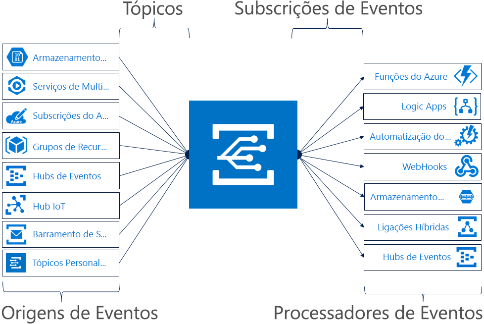

# Introdução ao Azure Event Grid

O Azure Event Grid permite-lhe criar facilmente aplicações com arquiteturas baseadas em eventos. Primeiro, selecione o recurso do Azure que pretende subscrever e, em seguida, indique o processador de eventos ou o ponto final do WebHook para o qual enviar o evento. O Event Grid tem suporte incorporado para eventos provenientes de serviços do Azure, como os blobs de armazenamento e os grupos de recursos. O Event Grid também suporta os seus próprios eventos com tópicos personalizados. 

Pode utilizar filtros para encaminhar eventos específicos para diferentes pontos finais, entregar em vários pontos finais e confirmar que os eventos são entregues com confiança.

Atualmente, a Azure Event Grid está disponível em todas as regiões públicas. Ainda não está disponível nas clouds do Azure Alemanha, Azure China ou Azure Government.

Este artigo mostra uma descrição geral do Azure Event Grid. Se quiser começar a utilizar o Event Grid, veja [Criar e encaminhar eventos personalizados com o Azure Event Grid](custom-event-quickstart.md). 

Atenção: esta imagem mostra como de que forma é que o Event Grid liga origens e processadores, e não é uma lista abrangente das opções suportadas.

## Origens de eventos

Para obter detalhes completos sobre as capacidades de cada origem, bem como artigos relacionados, veja [origens de eventos](event-sources.md). Atualmente, os seguintes serviços do Azure suportam o envio de eventos para o Event Grid:

* Subscrições do Azure (operações de gestão)
* Registo de Contentor
* Tópicos Personalizados
* Hubs de Eventos
* IoT Hub
* Serviços de Multimédia
* Grupos de Recursos (operações de gestão)
* Service Bus
* Blob de Armazenamento
* V2 de Fins Gerais de Armazenamento (GPv2)

## Processadores de eventos

Para obter detalhes completos sobre as capacidades de cada processador, bem como artigos relacionados, veja [processadores de eventos](event-handlers.md). Atualmente, os seguintes serviços do Azure suportam o processamento de eventos no Event Grid: 

* Automatização do Azure
* Funções do Azure
* Hubs de Eventos
* Ligações Híbridas
* Aplicações Lógicas
* Microsoft Flow
* Armazenamento de filas
* WebHooks

## Conceitos

Existem cinco conceitos no Azure Event Grid que lhe permitem começar:

* **Eventos** - o que aconteceu.
* **Origens dos eventos** – onde o evento aconteceu.
* **Tópicos** - o ponto final no qual os publicadores enviam eventos.
* **Subscrições de eventos** - o ponto final ou o mecanismo incorporado para encaminhar eventos, por vezes, para vários processadores. As subscrições também são utilizadas pelos processadores para filtrar inteligentemente os eventos recebidos.
* **Processadores de eventos** - a aplicação ou o serviço que reage ao evento.

Para obter mais informações sobre estes conceitos, veja [Concepts in Azure Event Grid](concepts.md) (Conceitos no Azure Event Grid).

## Capacidades

Seguem-se algumas das principais funcionalidades do Azure Event Grid:

* **Simplicidade** - aponte e clique para direcionar eventos do seu recurso do Azure para qualquer processador ou ponto final de eventos.
* **Filtragem avançada** - filtre por tipo de evento ou por caminho de publicador do evento para garantir que os processadores de eventos só recebem eventos relevantes.
* **Fan-out** - subscreva vários pontos finais para o mesmo evento, para enviar cópias do mesmo para tantos locais quanto necessário.
* **Fiabilidade** - utilize a repetição de 24 horas com término exponencial para garantir que os eventos são entregues.
* **Pagar por evento** - pague apenas pela quantidade utilizada no Event Grid.
* **Débito elevado** - crie cargas de trabalho de elevado volume no Event Grid com suporte para milhões de eventos por segundo.
* **Eventos incorporados** - comece a executar rapidamente com os eventos incorporados definidos por recursos.
* **Eventos personalizados** - utilize as rotas e o filtro do Event Grid para entregar, com confiança, eventos personalizados à sua aplicação.

Para ver uma comparação entre o Event Grid, os Hubs de Eventos e o Service Bus, veja [Choose between Azure services that deliver messages](compare-messaging-services.md) (Escolher entre serviços do Azure que entregam mensagens).

## O que posso fazer com o Event Grid?

O Azure Event Grid oferece múltiplas capacidades que melhoram largamente o trabalho sem servidores, a automatização de operações e o trabalho de integração: 

### Arquiteturas de aplicações sem servidor

O Event Grid liga as origens de dados e os processadores de eventos. Por exemplo, utilize o Event Grid para acionar instantaneamente uma função sem servidor para executar imagens de análises sempre que é adicionada uma fotografia nova a um contentor de armazenamento de blobs. 

### Automatização de operações

O Event Grid permite-lhe acelerar a automatização e simplificar a aplicação de políticas. Por exemplo, o Event Grid pode notificar a Automatização do Azure quando é criada uma máquina virtual ou quando é preparada uma Base de Dados SQL. Estes eventos podem ser utilizados para verificar automaticamente se as configurações do serviço estão em conformidade, colocar metadados em ferramentas de operações, etiquetar máquinas virtuais ou arquivar itens de trabalho.

### Integração de aplicações

O Event Grid liga a sua aplicação a outros serviços. Por exemplo, crie um tópico personalizado para enviar os dados de eventos da aplicação para o Event Grid e tire partido da entrega fiável, do encaminhamento avançado e da integração direta no Azure deste serviços. Em alternativa, pode utilizar o Event Grid com o Logic Apps para processar dados em qualquer local sem ter de escrever código. 

## Quanto custa o Event Grid?

O Azure Event Grid tem um modelo de preços “pagar por evento”, de modo que só paga pelo que utilizar. As primeiras 100 000 operações por mês são gratuitas. As operações são definidas como entrada de evento, tentativas de entrega de subscrição, chamadas de gestão e filtragem pelo sufixo do requerente. Para obter detalhes, veja a [página de preços](https://azure.microsoft.com/pricing/details/event-grid/).

## Passos seguintes

* [Route Storage Blob events](../storage/blobs/storage-blob-event-quickstart.md?toc=%2fazure%2fevent-grid%2ftoc.json) (Encaminhar eventos do Blob de Armazenamento)  
  Utilize o Event Grid para responder a eventos de blobs de armazenamento.
* [Criar e subscrever eventos personalizados](custom-event-quickstart.md)  
  Utilize o início rápido do Azure Event Grid para começar a enviar os seus próprios eventos personalizados para qualquer ponto final imediatamente.
* [Using Logic Apps as an Event Handler](monitor-virtual-machine-changes-event-grid-logic-app.md) (Utilizar o Logic Apps como Processador de Eventos)  
  Um tutorial sobre como criar uma aplicação com o Logic Apps para reagir a eventos enviados pelo Event Grid.
* [Transmitir macrodados em fluxo para um armazém de dados](event-grid-event-hubs-integration.md)  
  Um tutorial que utiliza as Funções do Azure para transmitir dados em fluxo dos Hubs de Eventos para o SQL Data Warehouse.
* [Event Grid REST API reference](/rest/api/eventgrid) (Referência da API REST do Event Grid)  
  Disponibiliza mais informações técnicas sobre o Azure Event Grid e uma referência para gerir subscrições de eventos, encaminhamento e filtragem.