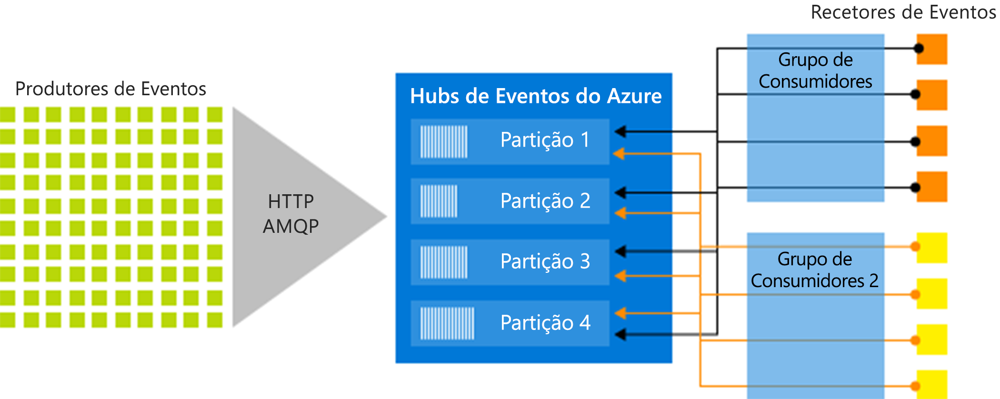

# O que são os Hubs de Eventos do Azure?

Os Hubs de Eventos do Azure são uma plataforma de fluxo de Macrodados e um serviço de ingestão de eventos capaz de receber e processar milhões de eventos por segundo. Os Hubs de Eventos podem processar e armazenar eventos, dados ou telemetria produzidos por dispositivos e software distribuído. Os dados enviados para um hub de eventos podem ser transformados e armazenados em qualquer fornecedor de análise em tempo real ou adaptadores de armazenamento/criação de batches. 

Os Hubs de Eventos são utilizados em alguns dos seguintes cenários comuns:

- Deteção de anomalias (fraude/valores atípicos)
- Registo de aplicação
- Pipelines de análise, por exemplo, clickstreams
- Dashboarding em direto
- Arquivo de dados
- Processamento de transações
- Processamento de telemetria do utilizador
- Transmissão em fluxo de telemetria do dispositivo 

## Por quê utilizar os Hubs de Eventos?

Os dados são valiosos apenas quando existe uma forma fácil de processar e obter informações atempadas de origens de dados. Os Hubs de Eventos oferecem uma plataforma de processamento de transmissão em fluxo distribuída com baixa latência e integração incorporada, com serviços de dados e análise dentro e fora do Azure para criar um pipeline completo de Macrodados.

Os Hubs de Eventos representam a "porta de entrada" para um pipeline de eventos, denominado frequentemente *ingestor de eventos* em arquiteturas de solução. Um ingestor de eventos é um componente ou serviço que se encontra entre os publicadores de eventos e os consumidores de eventos para desacoplar a produção de uma transmissão de eventos do consumo desses eventos. Os Hubs de Eventos oferecem uma plataforma de transmissão em fluxo unificada com a memória intermédia de retenção de tempo, desacoplamento de produtores de eventos dos consumidores de eventos. 

## Principais funcionalidades

Os Hubs de Eventos oferecem uma capacidade de processamento da transmissão de mensagens, mas têm características diferentes das mensagens empresariais tradicionais. As capacidades do Hubs de Eventos são criadas em torno dos cenários de alto débito e processamento de eventos. Os Hubs de Eventos contêm os seguintes [componentes principais](event-hubs-features.md):

- **Produtores de eventos**: qualquer entidade que envie dados para um hub de eventos. Os publicadores de eventos podem publicar eventos através de HTTPS ou AMQP 1.0 ou Apache Kafka (1.0 ou superior)
- **Partições**: cada consumidor só lê um subconjunto específico, ou partição do fluxo de mensagens.
- **Grupos de consumidores**: uma vista (estado, posição ou desvio) de um hub de eventos completo. Os grupos de consumidores ativam várias aplicações de consumo e cada uma tem uma vista separada do fluxo de eventos e lê o fluxo de forma independente ao seu próprio ritmo e com os seus próprios desvios.
- **Unidades de débito**: unidades de capacidade previamente compradas que controlam a capacidade de débito dos Hubs de Eventos.
- **Recetores de eventos**: qualquer entidade que leia os dados de eventos de um hub de eventos. Todos os consumidores de Hubs de Eventos ligam-se através da sessão AMQP 1.0 e os eventos são entregues durante a sessão à medida que ficam disponíveis.

A imagem seguinte mostra a arquitetura do processamento de fluxos dos Hubs de Eventos:

## PaaS totalmente gerido 

Os Hubs de Eventos são um serviço gerido com pouca sobrecarga de gestão ou configuração, para que se possa focar nas soluções empresariais. [Os Hubs de Eventos para ecossistemas do Apache Kafka](event-hubs-for-kafka-ecosystem-overview.md) oferecem-lhe experiência de PaaS Kafka sem ter de gerir, configurar ou executar os seus clusters.

## Em tempo real e a criar batches

Ingira, coloque em memória intermédia, armazene e processe a sua transmissão em fluxo em tempo real para obter informações acionáveis. Os Hubs de Eventos utilizam um [modelo de consumidor em partições](event-hubs-features.md#partitions), permitindo a várias aplicações processarem a transmissão em fluxo e permitindo-lhe controlar a velocidade de processamento.

[Recolha](event-hubs-capture-overview.md) os seus dados em tempo quase real num [armazenamento de Blobs do Azure](https://azure.microsoft.com/services/storage/blobs/) ou no [Azure Data Lake Store](https://azure.microsoft.com/services/data-lake-store/) para retenção de longo prazo ou processamento em micro lotes. Poderá fazê-lo no mesmo fluxo que utiliza para realizar a derivação de análise em tempo real. Configurar a Recolha é rápido, não existem custos administrativos para executá-la e é dimensionada automaticamente com as  [unidades de débito](event-hubs-features.md#throughput-units) dos Hubs de Eventos. A Recolha dos Hubs de Eventos permite-lhe concentrar-se no processamento de dados, em vez da respetiva captura.

Os Hubs de Eventos do Azure também se integram nas [Funções do Azure](/azure/azure-functions/) para uma arquitetura sem servidor.

## Escalável 

Com os Hubs de Eventos, pode começar com fluxos de dados em megabytes e aumentar para gigabytes ou terabytes. A funcionalidade [Ampliação automática](event-hubs-auto-inflate.md) é uma das muitas opções disponíveis para dimensionar o número de unidades de débito para satisfazer as necessidades de utilização. 

## Ecossistema avançado

[Os Hubs de Eventos para ecossistemas do Apache Kafka](event-hubs-for-kafka-ecosystem-overview.md) permitem aos clientes e aplicações [Apache Kafka (1.0 e superior)](https://kafka.apache.org/) comunicarem com os Hubs de Eventos sem terem de gerir quaisquer clusters.
 
Com um ecossistema abrangente disponível em várias [linguagens (.NET, Java, Python, Go, Node.js)](https://github.com/Azure/azure-event-hubs), pode começar facilmente a processar transmissões em fluxo dos Hubs de Eventos. Todas as linguagens de cliente suportadas oferecem integração de nível baixo.

## Passos seguintes

Para começar a utilizar os Hubs de Eventos, veja os seguintes artigos:

* [Ingerir para os Hubs de Eventos](event-hubs-quickstart-powershell.md)
* [Descrição geral das funcionalidades dos Hubs de Eventos](event-hubs-features.md)

