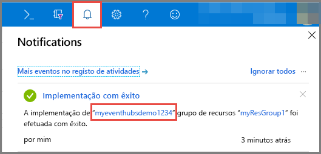
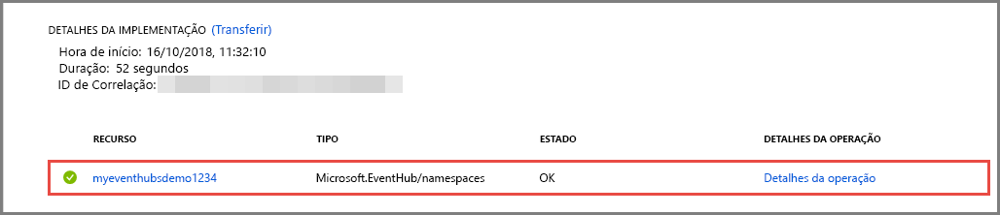

# Início Rápido: Criar um hub de eventos com o portal do Azure
Os Hubs de Eventos do Azure são uma plataforma de fluxo de Macrodados e um serviço de ingestão de eventos capaz de receber e processar milhões de eventos por segundo. Os Hubs de Eventos podem processar e armazenar eventos, dados ou telemetria produzidos por dispositivos e software distribuído. Os dados enviados para um hub de eventos podem ser transformados e armazenados em qualquer fornecedor de análise em tempo real ou adaptadores de armazenamento/criação de batches. Para uma descrição geral detalhada dos Hubs de Eventos, veja [Descrição geral dos Hubs de Eventos](event-hubs-about.md) e [Funcionalidades dos Hubs de Eventos](event-hubs-features.md).

Neste início rápido, vai criar um hub de eventos com o [portal do Azure](https://portal.azure.com).

## Pré-requisitos

Para concluir este início rápido, certifique-se de que tem:

- Subscrição do Azure. Se não tiver uma, [crie uma conta gratuita](https://azure.microsoft.com/free/) antes de começar.
- [Visual Studio 2017 Atualização 3 (versão 15.3, 26730.01)](https://www.visualstudio.com/vs) ou posterior.
- [SDK .NET Standard](https://www.microsoft.com/net/download/windows), versão 2.0 ou posterior.

## Criar um grupo de recursos

Um grupo de recursos é uma coleção lógica de recursos do Azure. Todos os recursos são implementados e geridos num grupo de recursos. Faça o seguinte para criar um grupo de recursos:

1. Inicie sessão no [portal do Azure](https://portal.azure.com).
2. Na navegação à esquerda, clique em **Grupos de recursos**. Em seguida, clique em **Adicionar**.

   

2. Escreva um nome exclusivo para o grupo de recursos. O sistema verifica imediatamente a disponibilidade do nome na subscrição do Azure atualmente selecionada.

3. Em **Subscrição**, clique no nome da subscrição do Azure na qual quer criar o grupo de recursos.

4. Selecione uma localização geográfica para o grupo de recursos.

5. Clique em **Criar**.

   

## Criar um espaço de nomes dos Hubs de Eventos

Um espaço de nomes dos Hubs de Eventos fornece um contentor de âmbito exclusivo, referenciado pelo respetivo nome de domínio completamente qualificado, no qual cria um ou mais hubs de eventos. Para criar um espaço de nomes no seu grupo de recursos com o portal, faça as ações seguintes:

1. No portal do Azure, clique em **Criar um recurso** na parte superior esquerda do ecrã.

2. Clique em **Internet das Coisas** e, em seguida, clique em **Hubs de Eventos**.

3. Em **Criar espaço de nomes**, introduza um nome de espaço de nomes. O sistema verifica imediatamente a disponibilidade do nome.

   

4. Após se certificar de que o espaço de nomes está disponível, selecione o escalão de preço (Básico ou Standard). Escolha também uma subscrição do Azure, um grupo de recursos e a localização na qual quer criar o recurso.
 
5. Clique em **Criar** para criar o espaço de nomes. Poderá ter de aguardar alguns minutos para que o sistema aprovisione totalmente os recursos.
6. Selecione **Alertas** e, em seguida, selecione a **implementação** com o mesmo nome do espaço de nomes do hub de eventos. 

   
6. Selecione o espaço de nomes do hub de eventos na lista de recursos criados na implementação. 

   
7. Na página **Espaço de Nomes dos Hubs de Eventos**, selecione **Políticas de acesso partilhado** e, em seguida, clique em **RootManageSharedAccessKey**.
    
8. Clique no botão Copiar para copiar a cadeia de ligação **RootManageSharedAccessKey** para a área de transferência. Guarde esta cadeia de ligação numa localização temporária, como o Bloco de Notas, para utilizar mais tarde.
    
## Criar um hub de eventos

Para criar um hub de eventos no espaço de nomes, faça as ações seguintes:

1. Na página Espaços de Nomes dos Hubs de Eventos, selecione **Hubs de Eventos**.
   
    

1. Na parte superior da janela, clique em **+ Hub de Eventos**.
   
    
1. Escreva um nome para o seu hub de eventos e, em seguida, clique em **Criar**.
   
    

Parabéns! Utilizou o portal para criar um espaço de nomes dos Hubs de Eventos e um hub de eventos nesse espaço de nomes. 

## Passos Seguintes

Neste artigo, criou um grupo de recursos, um espaço de nomes de Hubs de Eventos e um hub de eventos. Para obter instruções passo a passo para enviar eventos para (ou) receber eventos de um hub de eventos, veja os seguintes tutoriais:  

- **Enviar eventos para um hub de eventos**: [.NET Core](event-hubs-dotnet-standard-getstarted-send.md), [.NET Framework](event-hubs-dotnet-framework-getstarted-send.md), [Java](event-hubs-java-get-started-send.md), [Python](event-hubs-python-get-started-send.md), [denode.js](event-hubs-node-get-started-send.md), [Vá](event-hubs-go-get-started-send.md), [C](event-hubs-c-getstarted-send.md)
- **Receber eventos de um hub de eventos**: [.NET Core](event-hubs-dotnet-standard-getstarted-receive-eph.md), [.NET Framework](event-hubs-dotnet-framework-getstarted-receive-eph.md), [Java](event-hubs-java-get-started-receive-eph.md), [Python](event-hubs-python-get-started-receive.md), [node. js ](event-hubs-node-get-started-receive.md), [Vá](event-hubs-go-get-started-receive-eph.md), [Apache Storm](event-hubs-storm-getstarted-receive.md)

[Azure portal]: https://portal.azure.com/
[3]: ./media/event-hubs-quickstart-portal/sender1.png
[4]: ./media/event-hubs-quickstart-portal/receiver1.png
