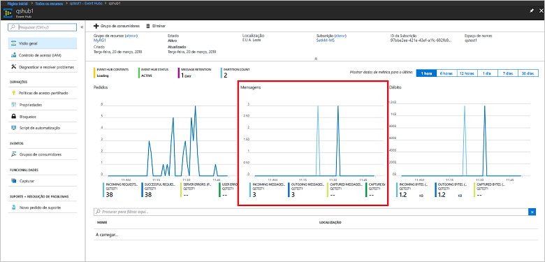

# <a name="quickstart-process-event-streams-using-azure-cli-and-java"></a>Início Rápido: Processar fluxos de eventos com a CLI do Azure e Java

Os Hubs de Eventos do Azure são uma plataforma de fluxo de dados altamente dimensionável e um serviço de ingestão capaz de receber e processar milhões de eventos por segundo. Este início rápido mostra como criar recursos dos Hubs de Eventos com a CLI do Azure e, em seguida, enviar e receber fluxos de eventos de um hub de eventos com código Java.

Para concluir este início rápido, precisa de uma subscrição do Azure. Se não tiver uma, [Criar uma conta gratuita][] antes de começar.

## <a name="prerequisites"></a>Pré-requisitos

[!INCLUDE [cloud-shell-try-it.md](../../includes/cloud-shell-try-it.md)]

Se optar por instalar e utilizar a CLI do Azure localmente, este tutorial requer a execução da versão 2.0.4 ou posterior da CLI do Azure. Execute `az --version` para verificar a sua versão. Se precisar de instalar ou atualizar, veja [Instalar a CLI 2.0 do Azure]( /cli/azure/install-azure-cli).

## <a name="log-on-to-azure"></a>Iniciar sessão no Azure

Os passos seguintes não são necessários se estiver a executar comandos no Cloud Shell. Se estiver a executar a CLI localmente, efetue os seguintes passos para iniciar sessão no Azure e definir a sua subscrição atual:

Execute o seguinte comando para iniciar sessão no Azure:

```azurecli-interactive
az login
```

Defina o contexto da subscrição atual. Substitua `MyAzureSub` pelo nome da subscrição do Azure que quer utilizar:

```azurecli-interactive
az account set --subscription MyAzureSub
``` 

## <a name="provision-resources"></a>Recursos de aprovisionamento

Indique os seguintes comandos para aprovisionar recursos dos Hubs de Eventos. Não se esqueça de substituir os marcadores de posição `myResourceGroup`, `namespaceName`, `eventHubName` e `storageAccountName` pelos valores apropriados:

```azurecli-interactive
# Create a resource group
az group create --name myResourceGroup --location eastus

# Create an Event Hubs namespace
az eventhubs namespace create --name namespaceName --resource-group myResourceGroup -l eastus2

# Create an event hub
az eventhubs eventhub create --name eventHubName --resource-group myResourceGroup --namespace-name namespaceName

# Create a general purpose standard storage account
az storage account create --name storageAccountName --resource-group myResourceGroup --location eastus2 --sku Standard_RAGRS --encryption blob

# List the storage account access keys
az storage account keys list --resource-group myResourceGroup --account-name storageAccountName

# Get namespace connection string
az eventhubs namespace authorization-rule keys list --resource-group myResourceGroup --namespace-name namespaceName --name RootManageSharedAccessKey
```

Copie e cole a cadeia de ligação numa localização temporária, como o Bloco de Notas, para utilizar mais tarde.

## <a name="stream-into-event-hubs"></a>Transmitir em fluxo para os Hubs de Eventos

O próximo passo é transferir o código de exemplo que transmite eventos para um hub de eventos e recebe esses eventos com o Anfitrião do Processador de Eventos. Primeiro, envie as mensagens:

Clone o [repositório do GitHub dos Hubs de Eventos](https://github.com/Azure/azure-event-hubs) ao emitir o comando seguinte:

```bash
git clone https://github.com/Azure/azure-event-hubs.git
```

Navegue para a pasta **SimpleSend**: `\azure-event-hubs\samples\Java\Basic\SimpleSend\src\main\java\com\microsoft\azure\eventhubs\samples\SimpleSend`. Abra o ficheiro SimpleSend.java e substitua a cadeia `"Your Event Hubs namaspace name"` pelo espaço de nomes dos Hubs de Eventos que obteve na secção "Criar um espaço de nomes dos Hubs de Eventos" deste artigo.

Substitua `"Your event hub"` pelo nome do hub de eventos que criou nesse espaço de nomes e `"Your policy name"` pelo nome da política de acesso partilhado do espaço de nomes. A menos que tenha criado uma nova política, a predefinição é **RootManageSharedAccessKey**. 

Por fim, substitua `"Your primary SAS key"` pelo valor da chave SAS da política no passo anterior.

### <a name="build-the-application"></a>Criar a aplicação 

Navegue de volta para a pasta `\azure-event-hubs\samples\Java\Basic\SimpleSend` e emita o seguinte comando de criação:

```shell
mvn clean package -DskipTests
```

### <a name="receive"></a>Receber

Transfira agora o exemplo de Anfitrião do Processador de Eventos, que recebe as mensagens que acabou de enviar. Navegue para a pasta **EventProcessorSample**: `\azure-event-hubs\samples\Java\Basic\EventProcessorSample\src\main\java\com\microsoft\azure\eventhubs\samples\eventprocessorsample`.

No ficheiro EventProcessorSample.java, substitua o valor `----EventHubsNamespaceName-----` pelo espaço de nomes dos Hubs de Eventos que obteve na secção "Criar um espaço de nomes dos Hubs de Eventos" deste artigo. 

Substitua os outros valores de cadeia neste ficheiro: substitua `----EventHubName-----` pelo nome do hub de eventos que criou nesse espaço de nomes e `-----SharedAccessSignatureKeyName-----` pelo nome da política de acesso partilhado do espaço de nomes. A menos que tenha criado uma nova política, a predefinição é **RootManageSharedAccessKey**.

Substitua `---SharedAccessSignatureKey----` pelo valor da chave SAS da política no passo anterior, `----AzureStorageConnectionString----` pela cadeia de ligação da conta de armazenamento que criou e `----StorageContainerName----` pelo nome do contentor na conta de armazenamento que criou. 

Por fim, substitua `----HostNamePrefix----` pelo nome da conta de armazenamento.

### <a name="build-the-receiver"></a>Criar o recetor 

Para criar a aplicação de receção, navegue para a pasta `\azure-event-hubs\samples\Java\Basic\EventProcessorSample` e emita o seguinte comando:

```shell
mvn clean package -DskipTests
```

### <a name="run-the-apps"></a>Executar as aplicações

Se as criações forem concluídas com êxito, está pronto para enviar e receber eventos. Primeiro, execute a aplicação **SimpleSend** e observar os eventos a serem enviados. Para executar o programa, navegue para a pasta `\azure-event-hubs\samples\Java\Basic\SimpleSend` e emita o seguinte comando:

```shell
java -jar ./target/simplesend-1.0.0-jar-with-dependencies.jar
```

Em seguida, execute a aplicação **EventProcessorSample** e observe os eventos a serem recebidos. Para executar o programa, navegue para a pasta `\azure-event-hubs\samples\Java\Basic\EventProcessorSample` e emita o seguinte comando:
   
```shell
java -jar ./target/eventprocessorsample-1.0.0-jar-with-dependencies.jar
```

Depois de executar ambos os programas, pode verificar a página de descrição geral do portal do Azure do hub de eventos para ver o número de mensagens de entrada e saída:



## <a name="clean-up-resources"></a>Limpar recursos

Execute o seguinte comando para remover o grupo de recursos, o espaço de nomes, a conta de armazenamento e todos os recursos relacionados. Substitua `myResourceGroup` pelo nome do grupo de recursos que criou:

```azurecli
az group delete --resource-group myResourceGroup
```

## <a name="understand-the-sample-code"></a>Compreender o código de exemplo

Esta secção contém mais detalhes sobre o que faz o código de exemplo.

### <a name="send"></a>Enviar

No ficheiro SimpleSend.java, a maior parte do trabalho é feita no método main(). Primeiro, o código utiliza uma instância `ConnectionStringBuilder` para construir a cadeia de ligação com os valores definidos pelo utilizador para o espaço de nomes, o nome do hub de eventos, o nome da chave SAS e a própria chave SAS:

```java
final ConnectionStringBuilder connStr = new ConnectionStringBuilder()
        .setNamespaceName("Your Event Hubs namespace name")
        .setEventHubName("Your event hub")
        .setSasKeyName("Your policy name")
        .setSasKey("Your primary SAS key");
```

O objeto de Java que contém o payload do evento é convertido em JSON:

```java
final Gson gson = new GsonBuilder().create();

final PayloadEvent payload = new PayloadEvent(1);
byte[] payloadBytes = gson.toJson(payload).getBytes(Charset.defaultCharset());
EventData sendEvent = EventData.create(payloadBytes);  
```

O cliente dos Hubs de Eventos é criado nesta linha de código:

```java
final EventHubClient ehClient = EventHubClient.createSync(connStr.toString(), executorService);
```

O bloco try/finally envia um evento round robin para uma partição não especificada:

```java
try {
    for (int i = 0; i < 100; i++) {

        String payload = "Message " + Integer.toString(i);
        //PayloadEvent payload = new PayloadEvent(i);
        byte[] payloadBytes = gson.toJson(payload).getBytes(Charset.defaultCharset());
        EventData sendEvent = EventData.create(payloadBytes);

        // Send - not tied to any partition
        // Event Hubs service will round-robin the events across all EventHubs partitions.
        // This is the recommended & most reliable way to send to EventHubs.
        ehClient.sendSync(sendEvent);
    }

    System.out.println(Instant.now() + ": Send Complete...");
    System.in.read();
} finally {
    ehClient.closeSync();
    executorService.shutdown();
}
```

### <a name="receive"></a>Receber 

A operação de receção ocorre no ficheiro EventProcessorSample.java. Primeiro, declara as constantes para manter o espaço de nomes dos Hubs de Eventos e outras credenciais:

```java
String consumerGroupName = "$Default";
String namespaceName = "----NamespaceName----";
String eventHubName = "----EventHubName----";
String sasKeyName = "----SharedAccessSignatureKeyName----";
String sasKey = "----SharedAccessSignatureKey----";
String storageConnectionString = "----AzureStorageConnectionString----";
String storageContainerName = "----StorageContainerName----";
String hostNamePrefix = "----HostNamePrefix----";
```

Semelhante ao programa SimpleSend, o código cria uma instância ConnectionStringBuilder para construir a cadeia de ligação:

```java
ConnectionStringBuilder eventHubConnectionString = new ConnectionStringBuilder()
    .setNamespaceName(namespaceName)
    .setEventHubName(eventHubName)
    .setSasKeyName(sasKeyName)
    .setSasKey(sasKey);
```

O *Anfitrião do Processador de Eventos* é uma classe que simplifica a receção de eventos provenientes dos hubs de eventos ao gerir pontos de verificação persistentes e receções em paralelo desses hubs de eventos. O código cria agora uma instância de `EventProcessorHost`:

```java
EventProcessorHost host = new EventProcessorHost(
    EventProcessorHost.createHostName(hostNamePrefix),
    eventHubName,
    consumerGroupName,
    eventHubConnectionString.toString(),
    storageConnectionString,
    storageContainerName);
```

Depois de declarar algum código de processamento de erros, a aplicação define a classe `EventProcessor`, uma implementação da interface `IEventProcessor`. Essa classe processa os eventos recebidos:

```java
public static class EventProcessor implements IEventProcessor
{
    private int checkpointBatchingCount = 0;
    ...
```

O método `onEvents()` é chamado quando os eventos são recebidos nesta partição do hub de eventos:

```java
@Override
public void onEvents(PartitionContext context, Iterable<EventData> events) throws Exception
{
    System.out.println("SAMPLE: Partition " + context.getPartitionId() + " got event batch");
    int eventCount = 0;
    for (EventData data : events)
    {
        try
        {
         System.out.println("SAMPLE (" + context.getPartitionId() + "," + data.getSystemProperties().getOffset() + "," +
                data.getSystemProperties().getSequenceNumber() + "): " + new String(data.getBytes(), "UTF8"));
             eventCount++;
                
         // Checkpointing persists the current position in the event stream for this partition and means that the next
         // time any host opens an event processor on this event hub+consumer group+partition combination, it will start
         // receiving at the event after this one. Checkpointing is usually not a fast operation, so there is a tradeoff
         // between checkpointing frequently (to minimize the number of events that will be reprocessed after a crash, or
         // if the partition lease is stolen) and checkpointing infrequently (to reduce the impact on event processing
         // performance). Checkpointing every five events is an arbitrary choice for this sample.
         this.checkpointBatchingCount++;
         if ((checkpointBatchingCount % 5) == 0)
         {
            System.out.println("SAMPLE: Partition " + context.getPartitionId() + " checkpointing at " +
                    data.getSystemProperties().getOffset() + "," + data.getSystemProperties().getSequenceNumber());
            // Checkpoints are created asynchronously. It is important to wait for the result of checkpointing
            // before exiting onEvents or before creating the next checkpoint, to detect errors and to ensure proper ordering.
            context.checkpoint(data).get();
         }
    }
        catch (Exception e)
        {
            System.out.println("Processing failed for an event: " + e.toString());
        }
    }
    System.out.println("SAMPLE: Partition " + context.getPartitionId() + " batch size was " + eventCount + " for host " + context.getOwner());
}
```

## <a name="next-steps"></a>Passos seguintes

Neste artigo, criou o espaço de nomes dos Hubs de Eventos e outros recursos necessários para enviar e receber eventos do hub de eventos. Para obter mais informações, avance para o próximo tutorial:

> [!div class="nextstepaction"]
> [Visualizar anomalias de dados nas transmissões de dados dos Hubs de Eventos](event-hubs-tutorial-visualize-anomalies.md)

[Criar uma conta gratuita]: https://azure.microsoft.com/free/?ref=microsoft.com&utm_source=microsoft.com&utm_medium=docs&utm_campaign=visualstudio
[Install Azure CLI 2.0]: /cli/azure/install-azure-cli
[az group create]: /cli/azure/group#az_group_create
[fully qualified domain name]: https://wikipedia.org/wiki/Fully_qualified_domain_name
