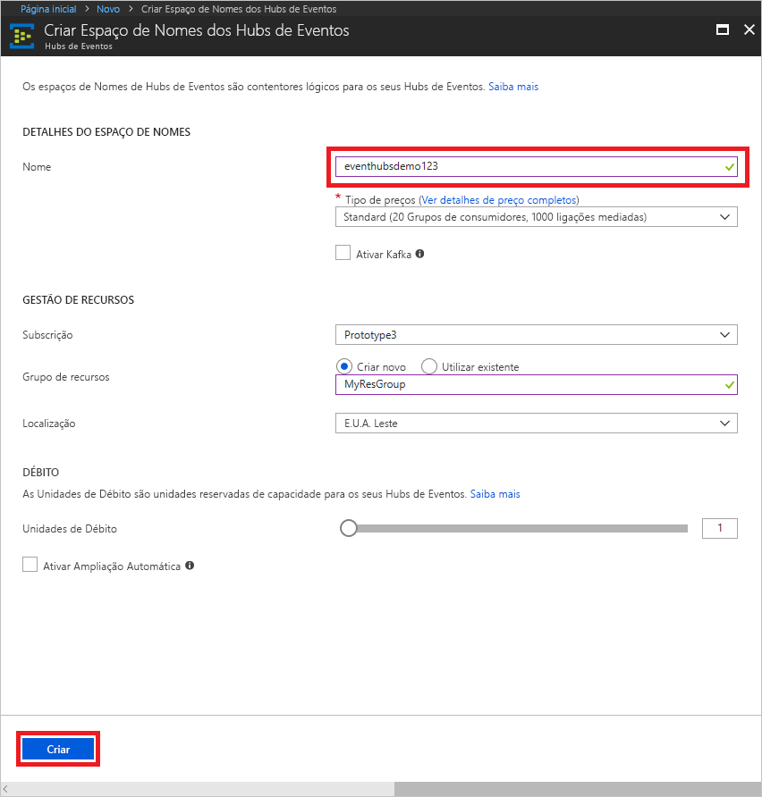
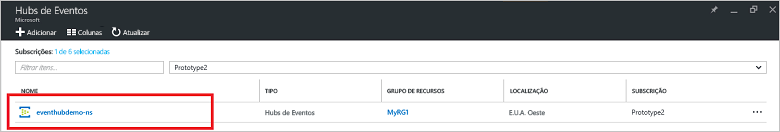
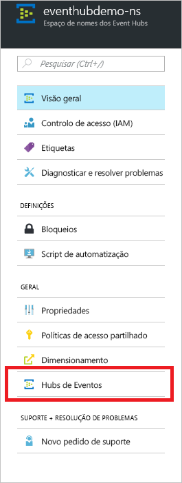
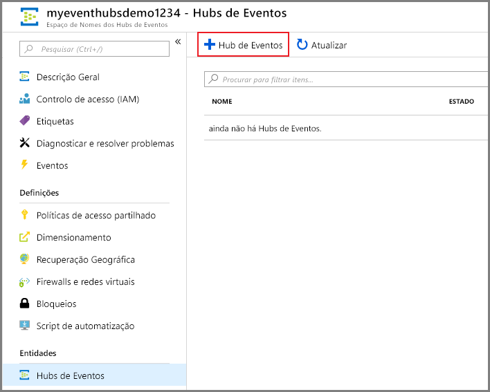
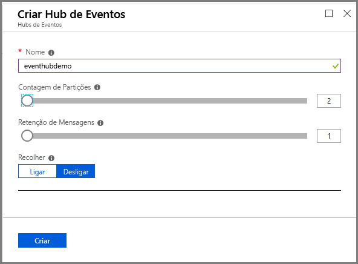
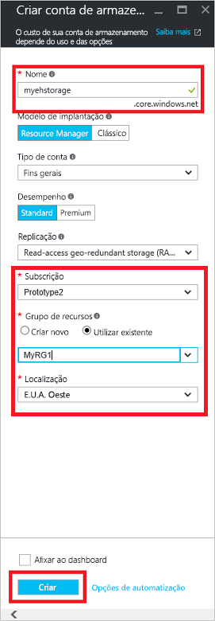
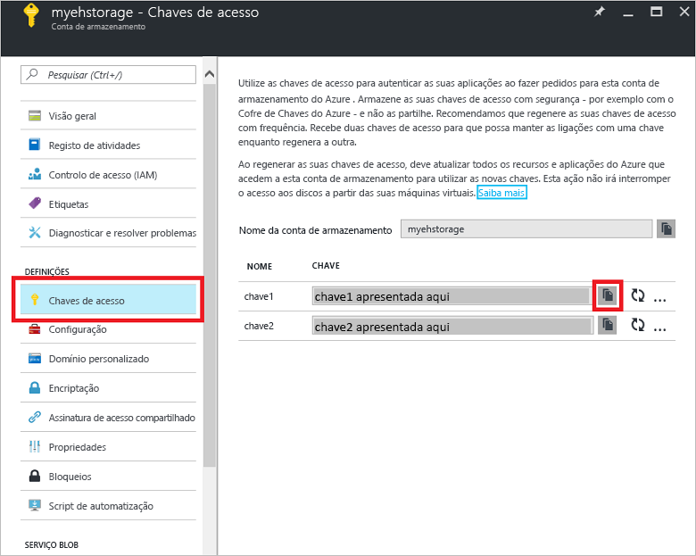

# Início Rápido: Criar um hub de eventos com o portal do Azure

Os Hubs de Eventos do Azure são uma plataforma de fluxo de dados altamente dimensionável e um serviço de ingestão capaz de receber e processar milhões de eventos por segundo. Este início rápido mostra como criar um hub de eventos com o [portal do Azure](https://portal.azure.com) e enviar e receber a partir de um hub de eventos com o SDK .NET Standard.

Para concluir este início rápido, precisa de uma subscrição do Azure. Se não tiver uma, [crie uma conta gratuita][] antes de começar.

## Pré-requisitos

Para concluir este início rápido, certifique-se de que tem:

- [Visual Studio 2017 Atualização 3 (versão 15.3, 26730.01)](http://www.visualstudio.com/vs) ou posterior.
- [SDK .NET Standard](https://www.microsoft.com/net/download/windows), versão 2.0 ou posterior.

## Criar um grupo de recursos

Um grupo de recursos é uma coleção lógica de recursos do Azure. Todos os recursos são implementados e geridos num grupo de recursos. Faça o seguinte para criar um grupo de recursos:

1. Na navegação à esquerda, clique em **Grupos de recursos**. Em seguida, clique em **Adicionar**.

   ![][1]

2. Escreva um nome exclusivo para o grupo de recursos. O sistema verifica imediatamente a disponibilidade do nome na subscrição do Azure atualmente selecionada.

3. Em **Subscrição**, clique no nome da subscrição do Azure na qual quer criar o grupo de recursos.

4. Selecione uma localização geográfica para o grupo de recursos.

5. Clique em **Criar**.

   ![][2]

## Criar um espaço de nomes dos Hubs de Eventos

Um espaço de nomes dos Hubs de Eventos fornece um contentor de âmbito exclusivo, referenciado pelo respetivo nome de domínio completamente qualificado, no qual cria um ou mais hubs de eventos. Para criar um espaço de nomes no seu grupo de recursos com o portal, faça o seguinte:

1. Inicie sessão no [Portal do Azure][] e clique em **Criar um recurso** na parte superior esquerda do ecrã.

2. Clique em **Internet das Coisas** e, em seguida, clique em **Hubs de Eventos**.

3. Em **Criar espaço de nomes**, introduza um nome de espaço de nomes. O sistema verifica imediatamente a disponibilidade do nome.

   

4. Após se certificar de que o espaço de nomes está disponível, selecione o escalão de preço (Básico ou Standard). Escolha também uma subscrição do Azure, um grupo de recursos e a localização na qual quer criar o recurso.
 
5. Clique em **Criar** para criar o espaço de nomes. Poderá ter de aguardar alguns minutos para que o sistema aprovisione totalmente os recursos.

6. Na lista de espaços de nomes do portal, clique no nome do espaço de nomes criado recentemente.

7. Clique em **Políticas de acesso partilhado** e, em seguida, clique em **RootManageSharedAccessKey**.
    
8. Clique no botão Copiar para copiar a cadeia de ligação **RootManageSharedAccessKey** para a área de transferência. Guarde esta cadeia de ligação numa localização temporária, como o Bloco de Notas, para utilizar mais tarde.
    
## Criar um hub de eventos

Para criar um hub de eventos no espaço de nomes, faça o seguinte:

1. Na lista de espaços de nomes dos Hubs de Eventos, clique no espaço de nome criado recentemente.      
   
     

2. Na janela de espaço de nomes, clique em **Hubs de Eventos**.
   
    

1. Na parte superior da janela, clique em **+ Adicionar Hub de Eventos**.
   
    
1. Escreva um nome para o seu hub de eventos e, em seguida, clique em **Criar**.
   
    

Parabéns! Utilizou o portal para criar um espaço de nomes dos Hubs de Eventos e um hub de eventos nesse espaço de nomes.

## Criar uma conta de armazenamento para o Anfitrião do Processador de Eventos

O Anfitrião do Processador de Eventos é um agente inteligente que simplifica a receção de eventos provenientes dos Hubs de Eventos ao gerir pontos de verificação persistentes e receções em paralelo. Para o ponto de verificação, o Anfitrião do Processador de Eventos requer uma conta de armazenamento. O exemplo seguinte mostra como criar uma conta de armazenamento e como obter as chaves de acesso:

1. Inicie sessão no [Portal do Azure][Portal do Azure] e clique em **Novo** na parte superior esquerda do ecrã.

2. Clique em **Armazenamento** e, em seguida, clique em **Conta de armazenamento**.
   
    

3. Em **Criar conta de armazenamento**, escreva um nome para a conta de armazenamento. Escolha uma subscrição do Azure, um grupo de recursos e uma localização na qual quer criar o recurso. Em seguida, clique em **Criar**.
   
    

4. Na lista de contas de armazenamento, clique na conta de armazenamento criada recentemente.

5. Na janela da conta de armazenamento, clique em **Chaves de acesso**. Copie o valor de **key1** para utilizar mais tarde.
   
    

## Transferir e executar os exemplos

O próximo passo é executar o código de exemplo que envia eventos para um hub de eventos e recebe esses eventos com o Anfitrião do Processador de Eventos. 

Primeiro, transfira os exemplos [SampleSender](https://github.com/Azure/azure-event-hubs/tree/master/samples/DotNet/Microsoft.Azure.EventHubs/SampleSender) e [SampleEphReceiver](https://github.com/Azure/azure-event-hubs/tree/master/samples/DotNet/Microsoft.Azure.EventHubs/SampleEphReceiver) do GitHub ou clone [azure-event-hubs repo](https://github.com/Azure/azure-event-hubs).

### Remetente

1. Abra o Visual Studio e, no menu **Ficheiro**, clique em **Abrir** e, em seguida, em **Projeto/Solução**.

2. Localize a pasta de exemplo **SampleSender** que transferiu anteriormente e faça duplo clique no ficheiro SampleSender.sln para carregar o projeto no Visual Studio.

3. No Explorador de Soluções, faça duplo clique no ficheiro Program.cs para abri-lo no editor do Visual Studio.

4. Substitua o valor `EventHubConnectionString` pela cadeia de ligação que obteve quando criou o espaço de nomes.

5. Substitua `EventHubName` pelo nome do hub de eventos que criou nesse espaço de nomes.

6. No menu **Compilar**, clique em **Compilar Solução** para assegurar que não existem erros.

### Recetor

1. Abra o Visual Studio e, no menu **Ficheiro**, clique em **Abrir** e, em seguida, em **Projeto/Solução**.

2. Localize a pasta de exemplo **SampleEphReceiver** que transferiu no passo 1 e faça duplo clique no ficheiro SampleEphReceiver.sln para carregar o projeto no Visual Studio.

3. No Explorador de Soluções, faça duplo clique no ficheiro Program.cs para abri-lo no editor do Visual Studio.

4. Substitua os valores das variáveis seguintes:
    1. `EventHubConnectionString`: substitua pela cadeia de ligação que obteve quando criou o espaço de nomes.
    2. `EventHubName`: o nome do hub de eventos que criou nesse espaço de nomes.
    3. `StorageContainerName`: o nome de um contentor de armazenamento. Atribua um nome exclusivo e o contentor é criado quando executar a aplicação.
    4. `StorageAccountName`: o nome da conta de armazenamento que criou.
    5. `StorageAccountKey`: a chave da conta de armazenamento que obteve a partir do portal do Azure.

5. No menu **Compilar**, clique em **Compilar Solução** para assegurar que não existem erros.

### Executar as aplicações

Primeiro, execute a aplicação **SampleSender** e observe 100 mensagens a serem enviadas. Prima **Enter** para terminar o programa.

![][3]

Em seguida, execute a aplicação **SampleEphReceiver** e observe as mensagens a serem recebidas no Anfitrião do Processador de Eventos.

![][4]
 
## Limpar recursos

Pode utilizar o portal para remover a conta de armazenamento, o espaço de nomes e o hub de eventos. 

1. No portal do Azure, clique em **Todos os recursos** no painel esquerdo. 
2. Clique na conta de armazenamento ou no espaço de nomes que quer eliminar. A eliminação do espaço de nomes também remove todos os hubs de eventos no interior do mesmo.
3. Na barra de menus na parte superior do ecrã, clique em **Eliminar**. Confirme a eliminação. 

## Passos seguintes

Neste artigo, criou o espaço de nomes dos Hubs de Eventos e outros recursos necessários para enviar e receber eventos do hub de eventos. Para obter mais informações, avance para o próximo tutorial:

> [!div class="nextstepaction"]
> [Visualizar anomalias de dados nas transmissões de dados dos Hubs de Eventos](event-hubs-tutorial-visualize-anomalies.md)

[crie uma conta gratuita]: https://azure.microsoft.com/free/?ref=microsoft.com&utm_source=microsoft.com&utm_medium=docs&utm_campaign=visualstudio
[Portal do Azure]: https://portal.azure.com/
[1]: ./media/event-hubs-quickstart-portal/resource-groups1.png
[2]: ./media/event-hubs-quickstart-portal/resource-groups2.png
[3]: ./media/event-hubs-quickstart-portal/sender1.png
[4]: ./media/event-hubs-quickstart-portal/receiver1.png
