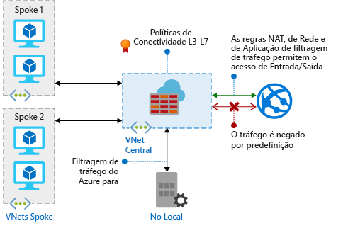

# O que é o Azure Firewall?

O Azure Firewall é um serviço de segurança de rede gerido e com base na cloud que protege os recursos da Rede Virtual do Azure. É uma firewall com total monitoração de estado como um serviço com elevada disponibilidade incorporada e escalabilidade da cloud sem restrições. 

[!INCLUDE [firewall-preview-notice](../../includes/firewall-preview-notice.md)]

Pode criar, impor e registar centralmente políticas de conectividade de rede e aplicações entre subscrições e redes virtuais. O Azure Firewall utiliza um endereço IP público estático para os recursos de rede virtual que permite às firewalls externas identificar o tráfego com origem na sua rede virtual.  O serviço está totalmente integrado no Azure Monitor para fins de registo e análise.

## Funcionalidades

A pré-visualização pública do Azure Firewall fornece as seguintes funcionalidades:

### Elevada disponibilidade incorporada
A elevada disponibilidade está incorporada, pelo que não são necessários balanceadores de carga adicionais e não existe nada que tenha de configurar.

### Escalabilidade da cloud sem restrições 
O Azure Firewall pode aumentar verticalmente conforme as suas necessidades para acomodar fluxos de tráfego de rede em alteração, pelo que não precisa de orçamentar o tráfego de pico.

### Filtragem FQDN 
Pode limitar o tráfego HTTP/S de saída a uma lista especificada de nomes de domínio completamente qualificados (FQDN), incluindo carateres universais. Esta funcionalidade não requer terminação de SSL.

### Regras de filtragem de tráfego de rede

Pode criar centralmente regras de filtragem de rede de *permissão* ou *negação* por endereço IP de origem e destino, porta e protocolo. O Azure Firewall tem total monitoração de estado, para conseguir distinguir pacotes legítimos para diferentes tipos de ligações. As regras são impostas e registadas em várias subscrições e redes virtuais.

### Suporte SNAT de saída

Todos os endereços IP de tráfego de rede virtual de saída são convertidos no IP público do Azure Firewall (Tradução de Endereços de Rede de Origem). Pode identificar e permitir tráfego com origem na sua rede virtual para destinos de Internet remotos.

### Registo do Azure Monitor

Todos os eventos estão integrados o Azure Monitor, o que lhe permite arquivar registos numa conta de armazenamento, transmitir eventos para o Hub de Eventos ou enviá-los para o Log Analytics.

## Problemas conhecidos

A pré-visualização pública do Azure Firewall tem os seguintes problemas conhecidos:

|Problema  |Descrição  |Mitigação  |
|---------|---------|---------|
|Interoperabilidade com NSGs     |Se um grupo de segurança de rede (NSG) for aplicado à sub-rede da firewall, pode bloquear a conectividade de Internet de saída mesmo que o NSG esteja configurado para permitir o acesso de Internet de saída. As ligações de Internet de saída são marcadas como provenientes de uma VirtualNetwork e o destino é Internet. Por predefinição, um NSG tem *permissão* VirtualNetwork a VirtualNetwork, mas não quando o destino é Internet.|Para mitigar, adicione a seguinte regra de entrada ao NSG aplicado à sub-rede da firewall:  Origem: portas de origem VirtualNetwork: Qualquer   Destino: Qualquer Porta de Destino: Qualquer   Protocolo: Acesso Total: Permitir|
|Conflito com a funcionalidade Just-in-Time (JIT) do Centro de Segurança do Azure (ASC)|Se uma máquina virtual for acedida por JIT e estiver numa sub-rede com uma rota definida pelo utilizador que aponta para o Azure Firewall como um gateway predefinido, o JIT do ASC não funciona. Isto resulta do encaminhamento assimétrico: um pacote entra através do IP público da máquina virtual (o JIT abriu o acesso), mas o caminho de retorno é através da firewall, o que remove o pacote por não existir nenhuma sessão estabelecida na firewall.|Para contornar este problema, coloque as máquinas virtuais JIT numa sub-rede separada que não tenha uma rota definida pelo utilizador para a firewall.|
|O hub-and-spoke com peering global não funciona|O modelo de hub-and-spoke, em que o hub e a firewall estão implementados numa região do Azure e os spokes noutra região do Azure, ligado ao hub através de Peering de VNet Global não é suportado.|Para obter mais informações, veja [Criar, alterar ou eliminar um peering de rede virtual](https://docs.microsoft.com/azure/virtual-network/virtual-network-manage-peering#requirements-and-constraints)|
As regras de filtragem de rede para protocolos não TCP/UDP (por exemplo, ICMP) não funcionam para o tráfego vinculado à Internet|As regras de filtragem de rede para protocolos não TCP/UDP não funcionam com SNAT para o seu endereço IP público. Os protocolos não TCP/UDP são suportados entre VNets e sub-redes spoke.|O Azure Firewall utiliza o Balanceador de Carga Standard [que não suporta atualmente SNAT para protocolos IP](https://docs.microsoft.com/azure/load-balancer/load-balancer-standard-overview#limitations). Estamos a explorar opções para suportar este cenário numa versão futura.

## Passos seguintes

- [Tutorial: Implementar e configurar o Azure Firewall com o portal do Azure](tutorial-firewall-deploy-portal.md)
- [Implementar o Azure Firewall através de um modelo](deploy-template.md)
- [Criar um ambiente de teste do Azure Firewall](scripts/sample-create-firewall-test.md)

