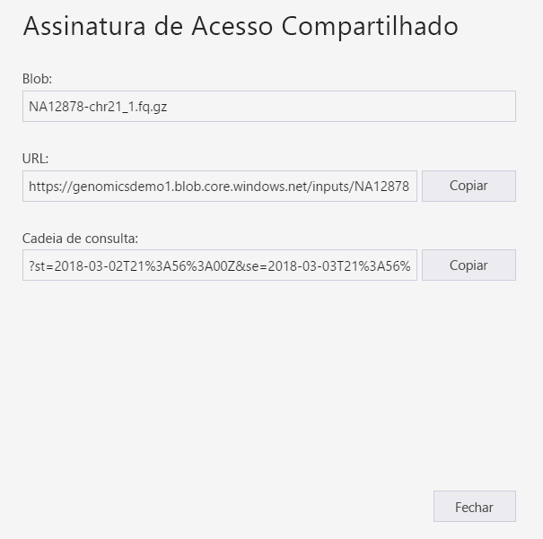
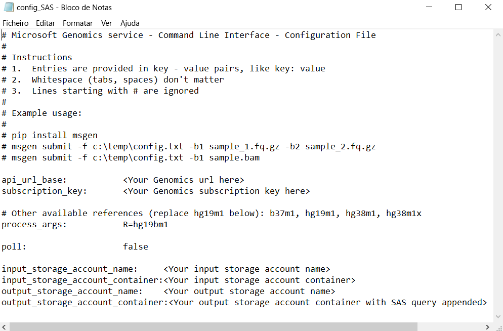

# <a name="submit-a-workflow-to-microsoft-genomics-using-a-sas-instead-of-a-storage-account-key"></a>Submeter um fluxo de trabalho ao Microsoft Genomics com uma SAS em vez de uma chave de conta de armazenamento 

Este início rápido demonstra como submeter um fluxo de trabalho para o serviço Microsoft Genomics com um ficheiro config.txt que contém [assinaturas de acesso partilhado (SAS)](https://docs.microsoft.com/azure/storage/common/storage-dotnet-shared-access-signature-part-1) em vez de chaves de conta de armazenamento. Esta funcionalidade pode ser útil se existirem problemas de segurança relacionados com a chave da conta de armazenamento visível no ficheiro config.txt. Este artigo pressupõe que já instalou e executou o cliente `msgen` e está familiarizado com a utilização do Armazenamento do Microsoft Azure. Se tiver submetido um fluxo de trabalho com êxito com os dados de exemplo fornecidos, está pronto para continuar este início rápido. 

## <a name="what-is-a-sas"></a>O que é uma SAS?
As [assinaturas de acesso partilhado (SAS)](https://docs.microsoft.com/azure/storage/common/storage-dotnet-shared-access-signature-part-1) disponibilizam acesso delegado a recursos na sua conta de armazenamento. Com uma SAS, pode conceder acesso a recursos na sua conta de armazenamento sem partilhar as chaves da conta. Este é o ponto fundamental da utilização de assinaturas de acesso partilhado nas suas aplicações – uma SAS é uma forma segura de partilhar os seus recursos de armazenamento sem comprometer as chaves da conta.

A SAS que for submetida ao Microsoft Genomics deve ser uma [SAS de Serviço](https://docs.microsoft.com/rest/api/storageservices/Constructing-a-Service-SAS) que delega o acesso apenas ao blob ou contentor onde estão armazenados os ficheiros de entrada e de saída. 

O URI de um token de assinatura de acesso partilhado (SAS) ao nível de serviço é constituído pelo URI do recurso para o qual a SAS irá delegar o acesso, seguido do token SAS. O token SAS é a cadeia de consulta que inclui todas as informações necessárias para autenticar a SAS, bem como para especificar os recursos, as permissões disponíveis para acesso, o intervalo de tempo durante o qual a assinatura é válida, o endereço IP suportado ou o intervalo de endereços a partir dos quais os pedidos podem ter origem, o protocolo suportado com o qual pode ser feito um pedido, um identificador de política de acesso opcional associado ao pedido e a própria assinatura. 

## <a name="sas-needed-for-submitting-a-workflow-to-the-microsoft-genomics-service"></a>SAS necessária para submeter um fluxo de trabalho para o serviço Microsoft Genomics
São necessários dois ou mais tokens SAS para cada fluxo de trabalho que for submetido ao serviço Microsoft Genomics, um para cada ficheiro de entrada e outro para o contentor de saída.

A SAS para os ficheiros de entrada deve ter as seguintes propriedades:
1.  Âmbito (conta, contentor, blob): blob
2.  Expiração: 48 horas a partir de agora
3.  Permissões: leitura

A SAS para o contentor de saída deve ter as seguintes propriedades:
1.  Âmbito (conta, contentor, blob): contentor
2.  Expiração: 48 horas a partir de agora
3.  Permissões: leitura, escrita e eliminação


## <a name="create-a-sas-for-the-input-files-and-the-output-container"></a>Criar uma SAS para os ficheiros de entrada e o contentor de saída
Existem duas formas de criar um token SAS, utilizando o Explorador de Armazenamento do Azure ou através de programas.  Se escrever código, pode construir a SAS por si ou utilizar o SDK do Armazenamento do Azure na sua linguagem preferencial.


### <a name="set-up-create-a-sas-using-azure-storage-explorer"></a>Configure: Criar uma SAS com o Explorador de armazenamento do Azure

O [Explorador de Armazenamento do Azure](https://azure.microsoft.com/features/storage-explorer/) é uma ferramenta para gerir os recursos armazenados no Armazenamento do Azure.  Pode saber mais sobre como utilizar o Explorador de Armazenamento do Azure [aqui](https://docs.microsoft.com/azure/vs-azure-tools-storage-manage-with-storage-explorer).

A SAS para os ficheiros de entrada deve ser confinada ao ficheiro de entrada específico (blob). Para criar um token SAS, siga [estas instruções](https://docs.microsoft.com/azure/storage/blobs/storage-quickstart-blobs-storage-explorer). Após criar a SAS, o URL completo com a cadeia de consulta, bem como a cadeia de consulta por si só, são fornecidos e podem ser copiados do ecrã.

 


### <a name="set-up-create-a-sas-programattically"></a>Configure: Criar uma SAS através de programas

Para criar uma SAS com o SDK do Armazenamento do Azure, consulte a documentação existente em várias linguagens, incluindo [.NET](https://docs.microsoft.com/azure/storage/blobs/storage-dotnet-shared-access-signature-part-2#generate-a-shared-access-signature-uri-for-a-blob), [Python](https://docs.microsoft.com/azure/storage/blobs/storage-python-how-to-use-blob-storage), e [Node.js](https://docs.microsoft.com/azure/storage/blobs/storage-nodejs-how-to-use-blob-storage). 

Para criar uma SAS sem um SDK, a cadeia de consulta SAS pode ser construída diretamente, incluindo todas as informações necessárias para autenticar a SAS. Estas [instruções](https://docs.microsoft.com/rest/api/storageservices/constructing-a-service-sas) descrevem mais pormenorizadamente os componentes da cadeia de consulta SAS e como construí-la. A assinatura SAS necessária é criada através da geração de um HMAC, utilizando as informações de autenticação de blob/contentor, conforme descrito nestas [instruções](https://docs.microsoft.com/rest/api/storageservices/service-sas-examples).


## <a name="add-the-sas-to-the-configtxt-file"></a>Adicionar a SAS ao ficheiro config.txt
Para executar um fluxo de trabalho através do serviço Microsoft Genomics com uma cadeia de consulta SAS, edite o ficheiro config.txt para remover as chaves do ficheiro config.txt. Em seguida, anexe a cadeia de consulta SAS (que começa com um `?`) ao nome do contentor de saída, conforme mostrado. 



Utilize o cliente Python do Microsoft Genomics para submeter o seu fluxo de trabalho com o comando seguinte, anexando a cadeia de consulta SAS correspondente a cada um dos nomes dos blobs de entrada:

```python
msgen submit -f [full path to your config file] -b1 [name of your first paired end read file, SAS query string appended] -b2 [name of your second paired end read file, SAS query string appended]
```

### <a name="if-adding-the-input-file-names-to-the-configtxt-file"></a>Se estiver a adicionar os nomes dos ficheiros de entrada ao ficheiro config.txt
Em alternativa, os nomes dos ficheiros de leitura finais emparelhados podem ser adicionados diretamente ao ficheiro config.txt, com os tokens de consulta SAS anexados conforme mostrado:


Neste caso, utilize o cliente Python do Microsoft Genomics para submeter o seu fluxo de trabalho com o seguinte comando, omitindo os comandos `-b1` e `-b2`:

```python
msgen submit -f [full path to your config file] 
```

## <a name="next-steps"></a>Passos seguintes
Neste artigo, utilizou tokens SAS em vez das chaves de conta para submeter um fluxo de trabalho ao serviço Microsoft Genomics através do cliente Python `msgen`. Para obter informações adicionais sobre a submissão de fluxos de trabalho e outros comandos que pode utilizar com o serviço Microsoft Genomics, veja as nossas [FAQ](frequently-asked-questions-genomics.md). 
