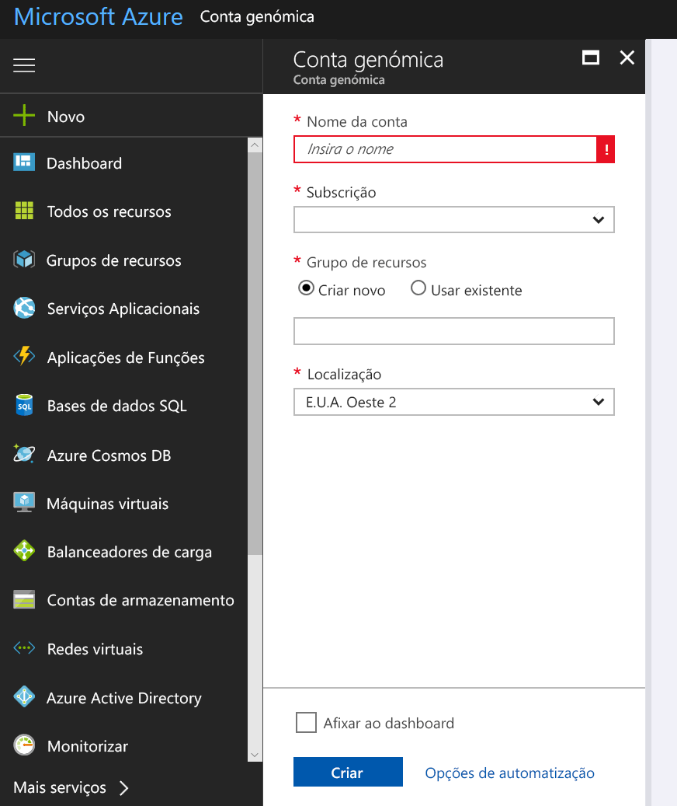
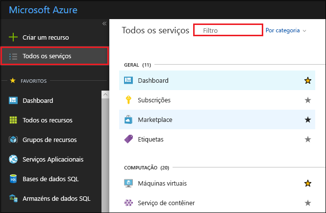
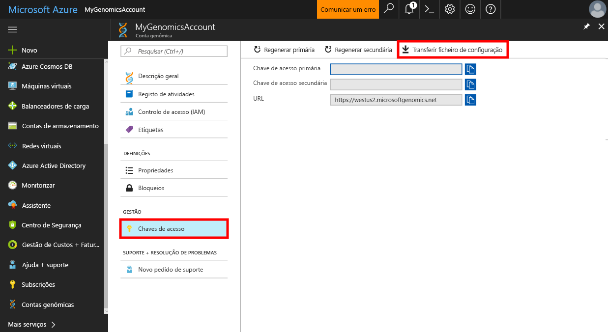

# <a name="quickstart-run-a-workflow-through-the-microsoft-genomics-service"></a>Início rápido: Executar um fluxo de trabalho através do serviço Microsoft Genomics

Este início rápido mostra como carregar dados de entrada para o Armazenamento de Blobs do Azure e executar um fluxo de trabalho através do serviço Microsoft Genomics. O Microsoft Genomics é um serviço dimensionável e seguro para análise secundária que consegue processar rapidamente um genoma, a partir de leituras não processadas e ao produzir leituras alinhadas e chamadas variantes. 

Começar em apenas alguns passos: 
1.  Configure: Criar uma conta do Microsoft Genomics através do portal do Azure e instalar o cliente Microsoft Genomics Python no seu ambiente local. 
2.  Carregar dados de entrada: Criar uma conta de armazenamento do Microsoft Azure através do portal do Azure e carregar os ficheiros de entrada. Os ficheiros de entrada devem ser leituras finais emparelhadas (ficheiros fastq ou bam).
3.  Execute: Utilize a interface de linha de comandos do Microsoft Genomics para executar fluxos de trabalho através do serviço Microsoft Genomics. 

Para obter mais informações sobre o Microsoft Genomics, veja [Novidades do Microsoft Genomics](overview-what-is-genomics.md)

## <a name="set-up-create-a-microsoft-genomics-account-in-the-azure-portal"></a>Configure: Criar uma conta do Microsoft Genomics no portal do Azure

Para criar uma conta do Microsoft Genomics, navegue para o [portal do Azure](https://portal.azure.com/#create/Microsoft.Genomics). Se ainda não tiver uma subscrição do Azure, crie uma antes de criar uma conta do Microsoft Genomics. 




Configure a conta do Genomics com as informações seguintes, conforme mostrado na imagem anterior. 

 |**Definição**          |  **Valor sugerido**  | **Descrição do campo** |
 |:-------------       |:-------------         |:----------            |
 |Subscrição         | Nome da sua subscrição|Trata-se da unidade de faturação dos serviços do Azure. Para obter detalhes sobre a sua subscrição, veja [Subscrições](https://account.azure.com/Subscriptions) |      
 |Grupo de recursos       | MyResourceGroup       |  Os grupos de recursos permitem-lhe agrupar múltiplos recursos do Azure (conta de armazenamento, conta do Genomics, etc.) num único grupo de gestão simples. Para obter mais informações, veja [Grupos de Recursos](https://docs.microsoft.com/azure/azure-resource-manager/resource-group-overview#resource-groups). Para obter os nomes de grupos de recursos válidos, veja [Regras de Nomenclatura](https://docs.microsoft.com/azure/architecture/best-practices/naming-conventions) |
 |Nome da conta         | MyGenomicsAccount     |Escolha um identificador de conta exclusivo. Para obter os nomes válidos, veja [Regras de Nomenclatura](https://docs.microsoft.com/azure/architecture/best-practices/naming-conventions) |
 |Localização                   | EUA Oeste 2                    |    O serviço está disponível nas regiões E.U.A. Oeste 2, Europa Ocidental e Sudeste Asiático |


Pode clicar em Notificações na barra de menus superior para monitorizar o processo de implementação.


## <a name="set-up-install-the-microsoft-genomics-python-client"></a>Configure: Instalar o cliente Microsoft Genomics Python

Os utilizadores têm de instalar o Python e o cliente Microsoft Genomics Python no respetivo ambiente local. 

### <a name="install-python"></a>Instalar o Python

O cliente Microsoft Genomics Python é compatível com o Python 2.7. versão 2.7.xx 12 ou posterior; 2.7.15 é a versão mais recente no momento em que este artigo foi escrito; 2.7.14 é a versão sugerida. Pode encontrar a transferência [aqui](https://www.python.org/downloads/). 

NOTA: Python 3.x não é compatível com 2.7.xx de Python.  O MSGen é uma aplicação do Python 2.7. Ao executar o MSGen, certifique-se de que o seu ambiente ativo do Python está a utilizar uma versão 2.7.xx do Python. Poderá receber erros ao tentar utilizar o MSGen com uma versão 3.x do Python.


### <a name="install-the-microsoft-genomics-client"></a>Instalar o cliente Microsoft Genomics

Utilize o pip do Python para instalar o cliente Microsoft Genomics `msgen`. As instruções seguintes partem do princípio de que o Python já se encontra no caminho do sistema. Se tiver problemas com o não reconhecimento da instalação do pip, tem de adicionar o Python e a subpasta de scripts ao caminho do sistema.


```
pip install --upgrade --no-deps msgen
pip install msgen
```


Se não quiser instalar `msgen` como um binário e modificar os pacotes do Python em todo o sistema, utilize o sinalizador `–-user` com `pip`.
Se utilizar a instalação baseada em pacotes ou setup.py, serão instalados todos os pacotes necessários. Caso contrário, os pacotes básicos necessários para msgen são 

 * [Azure-storage](https://pypi.python.org/pypi/azure-storage). 
 * [Requests](https://pypi.python.org/pypi/requests). 


Pode instalar estes pacotes com `pip`, `easy_install` ou através dos procedimentos padrão `setup.py`. 


### <a name="test-the-microsoft-genomics-client"></a>Testar o cliente Microsoft Genomics
Para testar o cliente Microsoft Genomics, transfira o ficheiro de configuração a partir da sua conta do Genomics. Navegue para a sua conta do Genomics ao clicar em **Todos os serviços** na parte superior esquerda e filtre e selecione as contas do Genomics.





Selecione a conta do Genomics que acabou de criar, navegue para **Chaves de Acesso** e transfira o ficheiro de configuração.




Teste se o cliente Microsoft Genomics Python está a funcionar com o seguinte comando


```
msgen list -f “<full path where you saved the config file>”
```

## <a name="create-a-microsoft-azure-storage-account"></a>Criar uma Conta de Armazenamento do Microsoft Azure 
O serviço Microsoft Genomics espera que as entradas sejam armazenadas como blobs de blocos numa conta de armazenamento do Azure. Também escreve os ficheiros de saída como blobs de blocos num contentor especificado pelo utilizador numa conta de armazenamento do Azure. As entradas e saídas podem residir em contas de armazenamento diferentes.
Se já tiver os dados numa conta de armazenamento do Azure, basta certificar-se de que está na mesma localização da conta do Genomics. Caso contrário, são cobradas taxas de saída quando executar o serviço Genomics. Se ainda não tiver uma conta de Armazenamento do Microsoft Azure, tem de criar uma e carregar os dados. Pode encontrar mais informações sobre contas de Armazenamento do Azure [aqui](https://docs.microsoft.com/azure/storage/common/storage-create-storage-account), incluindo o que é uma conta de armazenamento e que serviços fornece. Para criar uma conta de Armazenamento do Microsoft Azure, navegue para o [portal do Azure](https://portal.azure.com/#create/Microsoft.StorageAccount-ARM ).  


Configure a conta de Armazenamento com as informações seguintes, conforme mostrado na imagem anterior. Utilize a maioria das opções padrão de uma conta de armazenamento e especifique apenas que a conta é o armazenamento de blobs e não para fins gerais. O armazenamento de blobs pode ser entre duas e cinco vezes mais rápido para transferências e carregamentos.  O modelo de implementação do padrão, o resource manager, é recomendado.  


 |**Definição**          |  **Valor sugerido**  | **Descrição do campo** |
 |:-------------------------       |:-------------         |:----------            |
 |Subscrição         | A sua subscrição do Azure |Para obter detalhes sobre a sua subscrição, veja [Subscrições](https://account.azure.com/Subscriptions) |      
 |Grupo de recursos       | MyResourceGroup       |  Pode selecionar o mesmo grupo de recursos como a sua conta do Genomics. Para obter os nomes de grupos de recursos válidos, veja [Regras de Nomenclatura](https://docs.microsoft.com/azure/architecture/best-practices/naming-conventions) |
 |Nome da conta de armazenamento         | MyStorageAccount     |Escolha um identificador de conta exclusivo. Para obter os nomes válidos, veja [Regras de Nomenclatura](https://docs.microsoft.com/azure/architecture/best-practices/naming-conventions) |
 |Localização                  | EUA Oeste 2                  | Utilize a mesma localização como localização da sua conta do Genomics, para reduzir os custos de saída e a latência.  | 
 |Desempenho                  | Standard                   | A predefinição é Standard. Para obter mais detalhes sobre as contas de armazenamento standard e premium, veja [Introdução ao Armazenamento do Microsoft Azure](https://docs.microsoft.com/azure/storage/common/storage-introduction)    |
 |Tipo de conta       | Armazenamento de blobs       |  O armazenamento de blobs pode ser entre duas e cinco vezes mais rápido do que para fins gerais para transferências e carregamentos. |
 |Replicação                  | Armazenamento localmente redundante                  | O armazenamento localmente redundante replica os dados no datacenter na região em que foi criada a conta de armazenamento. Para obter mais informações, veja [Replicação do Armazenamento do Azure](https://docs.microsoft.com/azure/storage/common/storage-redundancy)    |
 |Escalão de acesso                  | Acesso Frequente                   | Um acesso frequente indica que os objetos na conta de armazenamento serão acedidos com mais frequência.    |


Em seguida, clique em `Review + create` para criar a conta de armazenamento. Tal como fez com a criação da sua conta do Genomics, pode clicar em Notificações na barra de menus superior para monitorizar o processo de implementação. 


## <a name="upload-input-data-to-your-storage-account"></a>Carregar dados de entrada para a conta de armazenamento

O serviço Microsoft Genomics espera leituras finais emparelhadas como ficheiros de entrada. Pode optar por carregar os seus próprios dados ou explorar através dos dados de exemplo disponíveis publicamente fornecidos por si. Se quiser utilizar os dados de exemplo disponíveis publicamente, estão alojados aqui:


[https://msgensampledata.blob.core.windows.net/small/chr21_1.fq.gz](https://msgensampledata.blob.core.windows.net/small/chr21_1.fq.gz)
[https://msgensampledata.blob.core.windows.net/small/chr21_2.fq.gz](https://msgensampledata.blob.core.windows.net/small/chr21_2.fq.gz)


Na sua conta de armazenamento, tem de criar um contentor de blobs para os dados de entrada e um segundo contentor de blobs para os dados de saída.  Carregue os dados de entrada para o contentor de blobs de entrada. Podem ser utilizadas várias ferramentas para fazer isto, incluindo o [Explorador de Armazenamento do Microsoft Azure](https://azure.microsoft.com/features/storage-explorer/), [blobporter](https://github.com/Azure/blobporter) ou [AzCopy](https://docs.microsoft.com/azure/storage/common/storage-use-azcopy?toc=%2fazure%2fstorage%2fblobs%2ftoc.json). 


## <a name="run-a-workflow-through-the-microsoft-genomics-service-using-the-python-client"></a>Executar um fluxo de trabalho através do serviço Microsoft Genomics com o cliente Python 

Para executar um fluxo de trabalho através do serviço Microsoft Genomics, edite o ficheiro config.txt para especificar o contentor de armazenamento de entrada e saída para os dados.
Abra o ficheiro config.txt que transferiu a partir da conta do Genomics. As secções que tem de especificar são a chave de subscrição e os seis itens na parte inferior, o nome da conta de armazenamento, o nome da chave e do contentor para a entrada e a saída. Pode encontrar estas informações ao navegar no portal para **Chaves de acesso** para a sua conta de armazenamento ou diretamente a partir do Explorador de Armazenamento do Azure.  


Se gostaria de executar GATK4, defina o `process_name` parâmetro gatk4 ou gatk4-promocionais. Para obter mais informações sobre a promoção de GATK4, visite [esta página](https://aka.ms/msgatk4).

Por predefinição, o serviço Genomics produz ficheiros VCF. Se teria como um gVCF de saída em vez de um VCF de saída (equivalente a `-emitRefConfidence` em GATK 3.x e `emit-ref-confidence` no GATK 4.x), adicionar o `emit_ref_confidence` parâmetro para seu `config.txt` e defina-o como `gvcf`, conforme mostrado na figura acima.  Para voltar à saída VCF, remova-o a partir do `config.txt` de ficheiros ou defina a `emit_ref_confidence` parâmetro para `none`. 

### <a name="submit-your-workflow-to-the-microsoft-genomics-service-the-microsoft-genomics-client"></a>Submeter o fluxo de trabalho para o serviço Microsoft Genomics através do cliente Python

Utilize o cliente Python do Microsoft Genomics para submeter o seu fluxo de trabalho com o seguinte comando:


```python
msgen submit -f [full path to your config file] -b1 [name of your first paired end read] -b2 [name of your second paired end read]
```


Pode ver o estado dos fluxos de trabalho com o seguinte comando: 
```python
msgen list -f c:\temp\config.txt 
```


Após a conclusão do fluxo de trabalho, pode ver os ficheiros de saída na conta de Armazenamento do Azure no contentor de saída que configurou. 


## <a name="next-steps"></a>Passos Seguintes
Neste artigo, carregou dados de entrada de exemplo para o Armazenamento do Azure e submeteu um fluxo de trabalho para o serviço Microsoft Genomics através do cliente Python `msgen`. Para obter mais informações sobre outros tipos de ficheiros de entrada que podem ser utilizados com o serviço Microsoft Genomics, veja as seguintes páginas: [FASTQ emparelhado](quickstart-input-pair-FASTQ.md) | [BAM](quickstart-input-BAM.md) | [Múltiplos ficheiros FASTQ ou BAM](quickstart-input-multiple.md). Pode também explorar este tutorial com o nosso [tutorial do bloco de notas do Azure](https://aka.ms/genomicsnotebook).
