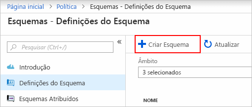
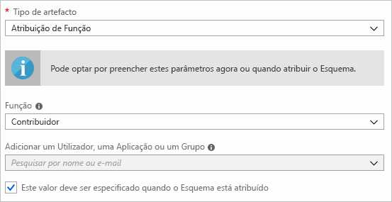
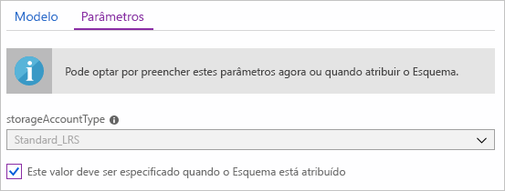
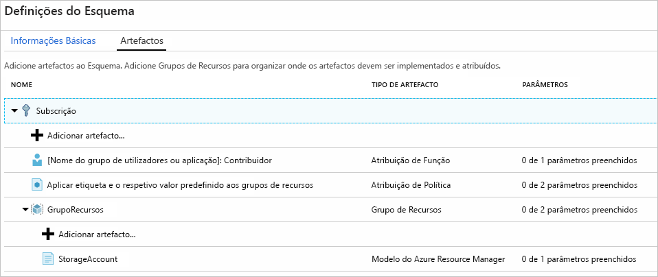
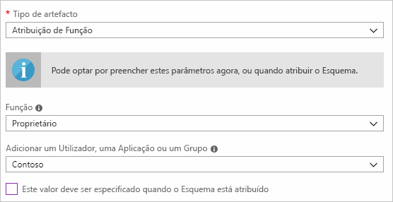
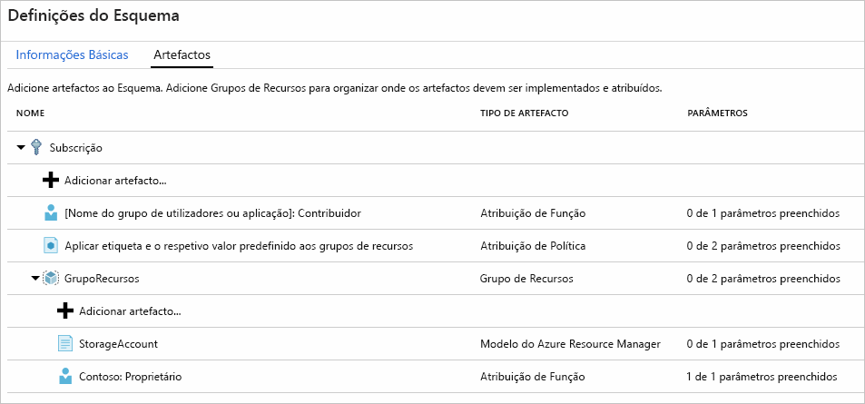
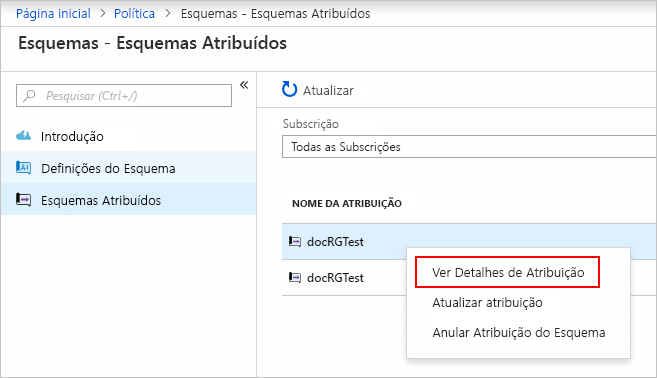

# <a name="define-and-assign-an-azure-blueprint-in-the-portal"></a>Definir e Atribuir um Azure Blueprint no portal

Compreender como criar e atribuir esquemas no Azure permite a uma organização definir padrões comuns de consistência e desenvolver configurações reutilizáveis e rapidamente implementáveis com base nos modelos do Resource Manager, política, segurança e muito mais. Neste tutorial, vai aprender a utilizar o Azure Blueprints para realizar algumas das tarefas comuns relacionadas com a criação, publicação e atribuição de um esquema na sua organização, tais como:

> [!div class="checklist"]
> - Criar um novo esquema e adicionar vários artefactos suportados
> - Fazer alterações a um esquema existente ainda no modo de **Rascunho**
> - Marcar um esquema como pronto a atribuir com o estado **Publicado**
> - Atribuir um esquema a uma subscrição existente
> - Verificar o estado e progresso de um esquema atribuído
> - Remover um esquema que foi atribuído a uma subscrição

Se não tiver uma subscrição do Azure, crie uma [conta gratuita](https://azure.microsoft.com/free) antes de começar.

## <a name="create-a-blueprint"></a>Criar um esquema

O primeiro passo na definição de um padrão de conformidade é compor um esquema a partir dos recursos disponíveis. Neste exemplo, vai criar um novo esquema com o nome “MyBlueprint” para configurar as atribuições de função e política para a subscrição, adicionar um novo grupo de recursos e criar uma atribuição de função e o modelo do Resource Manager no novo grupo de recursos.

1. Inicie o serviço Azure Blueprint no portal do Azure. Para tal, clique em **Todos os serviços** e procure e selecione **Política** no painel esquerdo. Na página **Política**, clique em **Esquemas**.

1. Selecione **Definições do Esquema** na página à esquerda e clique no botão **+ Criar Esquema** na parte superior da página.

   - Em alternativa, clique em **Criar** na página **Introdução** para ir diretamente para a criação de um esquema.

   

1. Em **Nome do Esquema**, escreva, por exemplo, “MyBlueprint” (letras e números, até 48 carateres, mas sem espaços nem carateres especiais), mas deixe a **Descrição do Esquema** em branco por agora.  Na caixa **Definir Localização**, clique nas reticências à direita, selecione o [grupo de gestão](../management-groups/overview.md) onde quer guardar o esquema e clique em **Selecionar**.

   > [!NOTE]
   > As definições do esquema só podem ser guardadas em grupos de gestão. Para criar o seu primeiro grupo de gestão, siga [estes passos](../management-groups/create.md).

1. Verifique se as informações estão corretas (os campos **Nome do Esquema** e **Localização da Definição** não poderão ser alterados posteriormente) e clique em **Seguinte: Artefactos** na parte inferior da página ou no separador **Artefactos** na parte superior da página.

1. Adicione a atribuição de função à subscrição: clique com o botão esquerdo do rato na linha **+ Adicionar artefacto...** sob **Subscrição** para abrir a janela “Adicionar artefacto” no lado direito do browser. Selecione “Atribuição de Função” para _Tipo de artefacto_. Em _Função_, selecione “Contribuidor” e deixe o campo _Adicionar Utilizador, Aplicação ou Grupo_ com a caixa de verificação a indicar um **parâmetro dinâmico**. Clique em **Adicionar** para adicionar este artefacto ao esquema.

   

   > [!NOTE]
   > A maioria dos _artefactos_ suporta parâmetros. Um parâmetro com um valor atribuído durante a criação do esquema é um **parâmetro estático**. Se o parâmetro for atribuído durante a atribuição do esquema, será um **parâmetro dinâmico**. Para obter mais informações, veja [Parâmetros de esquema](./concepts/parameters.md).

1. Adicione a atribuição de política à subscrição: clique com o botão esquerdo do rato na linha **+ Adicionar artefacto...**  diretamente sob **Subscrição**. Selecione “Atribuição de Política” para _Tipo de artefacto_. Altere _Tipo_ para “Incorporado” e, em _Pesquisar_ introduza “etiqueta”. Clique fora da caixa _Pesquisar_ para filtrar os resultados. Selecione “Aplicar etiqueta e valor predefinido aos grupos de recursos” ao clicar na opção. Clique em **Adicionar** para adicionar este artefacto ao esquema.

1. Clique na linha de atribuição de política “Aplicar etiqueta e valor predefinido aos grupos de recursos”. É apresentada a janela com os parâmetros para o artefacto como parte da definição do esquema e que permite definir os parâmetros para todas as atribuições (**parâmetros estáticos**) com base neste esquema, em vez de o fazer durante a atribuição (**parâmetros dinâmicos**). Neste exemplo, é desejável que se utilizem **parâmetros dinâmicos** durante a atribuição do esquema, assim, deixe as predefinições como estão e clique em **Cancelar**.

1. Adicione o grupo de recursos à subscrição: clique com o botão esquerdo do rato na linha **+ Adicionar artefacto...** em **Subscrição**. Selecione “Grupo de Recursos” para _Tipo de artefacto_. Deixe os campos _Nome do Grupo de Recursos_ e _Localização_ em branco, mas garanta que a caixa de verificação está marcada em cada propriedade para torná-los **parâmetros dinâmicos**. Clique em **Adicionar** para adicionar este artefacto ao esquema.

1. Adicione o modelo em grupo de recursos: clique com o botão esquerdo do rato na linha **+ Adicionar Artefacto...** diretamente sob a entrada **ResourceGroup**. Selecione “Modelo do Azure Resource Manager” para _Tipo de artefacto_, defina _Nome do artefacto a apresentar_ como “StorageAccount” e deixe _Descrição_ em branco. No separador **Modelo** na caixa do editor, cole o seguinte modelo do Resource Manager. Depois de colar o modelo, clique no separador **Parâmetros** e observe que o parâmetro de modelo **storageAccountType** e o valor predefinido **Standard_LRS** foram automaticamente detetados e preenchidos, mas configurados como um **parâmetro dinâmico**. Desmarque a caixa de verificação e observe que o menu pendente contém apenas os valores incluídos no modelo do Resource Manager em **allowedValues**. Marque a caixa para a definir de novo como um **parâmetro dinâmico**. Clique em **Adicionar** para adicionar este artefacto ao esquema.

   > [!IMPORTANT]
   > Se importar o modelo, garanta que o ficheiro é apenas JSON e não inclui HTML. Quando apontar para um URL no GitHub, garanta que clicou em **RAW** para obter o ficheiro JSON puro e não um encapsulado com HTML para apresentação no GitHub. Se o modelo importado não for JSON puro, ocorrerá um erro.

   ```json
   {
       "$schema": "https://schema.management.azure.com/schemas/2015-01-01/deploymentTemplate.json#",
       "contentVersion": "1.0.0.0",
       "parameters": {
           "storageAccountType": {
               "type": "string",
               "defaultValue": "Standard_LRS",
               "allowedValues": [
                   "Standard_LRS",
                   "Standard_GRS",
                   "Standard_ZRS",
                   "Premium_LRS"
               ],
               "metadata": {
                   "description": "Storage Account type"
               }
           }
       },
       "variables": {
           "storageAccountName": "[concat(uniquestring(resourceGroup().id), 'standardsa')]"
       },
       "resources": [{
           "type": "Microsoft.Storage/storageAccounts",
           "name": "[variables('storageAccountName')]",
           "apiVersion": "2016-01-01",
           "location": "[resourceGroup().location]",
           "sku": {
               "name": "[parameters('storageAccountType')]"
           },
           "kind": "Storage",
           "properties": {}
       }],
       "outputs": {
           "storageAccountName": {
               "type": "string",
               "value": "[variables('storageAccountName')]"
           }
       }
   }
   ```

   

1. O esquema concluído deve ter um aspeto semelhante ao seguinte. Repare que cada artefacto tem “_x_ de _y_ parâmetros preenchidos” na coluna _Parâmetros_. Os **parâmetros dinâmicos** serão definidos durante cada atribuição do esquema e o único **parâmetro estático** na função de atribuição já foi configurado.

   

1. Agora que todos os artefactos planeados foram adicionados, clique em **Guardar Rascunho** na parte inferior da página.

## <a name="edit-a-blueprint"></a>Editar um esquema

Em [Criar um esquema](#create-a-blueprint), não foi fornecida uma Descrição nem a atribuição de função foi adicionada ao novo grupo de recursos. Ambos podem ser corrigidos, ao executar os seguintes passos:

1. Selecione **Definições do Esquema** na página à esquerda.

1. Na lista de esquemas, clique com o botão direto do rato no esquema que criou anteriormente e selecione **Editar Esquema**.

1. Na **Descrição do Esquema**, forneça algumas informações sobre o esquema e os artefactos que o compõe.  Neste caso, insira algo como: “Este esquema define a política de etiquetas e a atribuição de funções na subscrição, cria um ResourceGroup e implementa um modelo de recursos e uma atribuição de função nesse ResourceGroup”.

1. Clique em **Seguinte: Artefactos** na parte inferior da página ou no separador **Artefactos** na parte superior da página.

1. Adicione a atribuição de função sob o grupo de recursos: clique com o botão esquerdo do rato na linha **+ Adicionar artefacto...**  diretamente sob a entrada **ResourceGroup**. Selecione “Atribuição de Função” para _Tipo de artefacto_. Em _Função_, selecione “Proprietário” e desmarque o campo _Adicionar Utilizador, Aplicação ou Grupo_ e procure e selecione um utilizador, aplicação ou grupo a adicionar. Este será um **parâmetro estático** e será utilizado em cada atribuição deste esquema. Clique em **Adicionar** para adicionar este artefacto ao esquema.

   

1. O esquema concluído deve ter um aspeto semelhante ao seguinte. Repare que a atribuição de função recém-adicionada mostra **1 de 1 parâmetros preenchidos**, o que significa que é um **parâmetro estático**.

   

1. Clique em **Guardar Rascunho** agora que foi atualizado.

## <a name="publish-a-blueprint"></a>Publicar um esquema

Agora que os artefactos planeados foram adicionados ao esquema, é altura de o publicar.
A publicação disponibiliza-o para ser atribuído a uma subscrição.

1. Selecione **Definições do Esquema** na página à esquerda.

1. Na lista de esquemas, clique com o botão direito do rato no esquema que criou anteriormente e selecione **Publicar Esquema**.

1. Na caixa de diálogo apresentada, indique uma **Versão** (letras, números e hífenes com um comprimento máximo de 20 carateres) como “v1” e **Alterar notas** (opcional) como “Primeira publicação”.

1. Clique em **Publicar** na parte inferior da página.

## <a name="assign-a-blueprint"></a>Atribuir um esquema

Após a publicação de um esquema, poderá atribuí-lo a uma subscrição. Atribua o esquema que criou a uma das subscrições na hierarquia do grupo de gestão.

1. Selecione **Definições do Esquema** na página à esquerda.

1. Na lista de esquemas, clique com o botão direito do rato no esquema que criou anteriormente (ou clique com o botão esquerdo do rato nas reticências) e selecione **Atribuir Esquema**.

1. Na página **Atribuir Esquema**, selecione no menu pendente **Subscrição** as subscrições nas quais quer implementar este esquema.

   > [!NOTE]
   > Será criada uma atribuição para cada subscrição selecionada, o que permite fazer alterações posteriormente numa atribuição de subscrição individual, sem forçar alterações nas restantes subscrições selecionadas.

1. Em **Nome Atribuído**, indique um nome exclusivo para esta atribuição.

1. Em **Localização**, selecione uma região para criar a identidade gerida. O Azure Blueprint utiliza esta identidade gerida para implementar todos os artefactos no esquema atribuído. Para saber mais, veja [identidades geridas dos recursos do Azure](../../active-directory/managed-identities-azure-resources/overview.md).

1. Deixe o menu pendente **Versão da definição de esquema** das versões **Publicadas** na entrada “v1” (predefinida como a última versão **Publicada**).

1. Em **Atribuição de Bloqueio**, deixe a predefinição **Não Bloquear**. Para obter mais informações, veja [bloqueio de recurso em esquemas](./concepts/resource-locking.md).

1. Para a atribuição de função ao nível da subscrição **[Grupo de utilizadores ou nome da aplicação]: Contribuidor**, procure e selecione um utilizador, uma aplicação ou um grupo.

1. Para a atribuição de política ao nível da subscrição, defina o **Nome da Etiqueta** como “CostCenter” e o **Valor da Etiqueta** como “ContosoIT”.

1. Para “ResourceGroup”, indique um **Nome** como “StorageAccount” e uma **Localização** como “EUA Leste 2” no menu pendente.

   > [!NOTE]
   > Para cada artefacto que foi adicionado sob o grupo de recursos durante a definição do esquema, esse artefacto é apresentado com avanço para ficar alinhado com o grupo de recursos ou com o objeto com o qual será implementado. Os artefactos que não aceitam parâmetros ou não têm parâmetros definidos na atribuição serão apresentados apenas para informações contextuais.

1. No modelo do Azure Resource Manager, “StorageAccount” selecione “Standard_GRS” para o parâmetro **storageAccountType**.

1. Leia a caixa de informações na parte inferior da página e, em seguida, clique em **Atribuir**.

## <a name="track-deployment-of-a-blueprint"></a>Controlar a implementação de um esquema

Após atribuir um esquema a uma ou mais subscrições, acontecem duas coisas:

- O esquema é adicionado à página **Esquemas Atribuídos** por cada subscrição atribuída
- É iniciado o processo de implementação de todos os artefactos definidos pelo esquema

Agora que o esquema foi atribuído a uma subscrição, verifique o progresso da implementação.

1. Selecione **Esquemas Atribuídos** na página à esquerda.

1. Na lista de esquemas, clique com o botão direito do rato no esquema que atribuiu anteriormente e selecione **Ver Detalhes de Atribuição**.

   

1. Na página **Detalhes de Implementação**, confirme que todos os artefactos foram implementados com êxito e que não ocorreram erros durante a implementação. Se tiver ocorrido algum erro, veja a [resolução de problemas de esquemas](./troubleshoot/general.md) para obter os passos que determinam o que correu mal.

## <a name="unassign-a-blueprint"></a>Anular a atribuição de um esquema

Os esquemas podem ser removidos de uma subscrição se já não forem necessários ou tiverem sido substituídos por esquemas mais recentes com padrões, políticas e designs atualizados. Quando um esquema é removido, os artefactos atribuídos como parte desse esquema são deixados para trás. Para remover uma atribuição de esquema, siga estes passos:

1. Selecione **Esquemas Atribuídos** na página à esquerda.

1. Na lista de esquemas, selecione o esquema para o qual quer anular a atribuição e, em seguida, clique no botão **Anular Atribuição do Esquema** na parte superior da página.

1. Leia a mensagem de confirmação e clique em **OK**.

## <a name="delete-a-blueprint"></a>Eliminar um esquema

1. Selecione **Definições do Esquema** na página à esquerda.

1. Clique com o botão direito no esquema que quer eliminar e selecione **Eliminar Esquema** e, em seguida, clique em **Sim** na caixa de diálogo de confirmação.

> [!NOTE]
> Este método de eliminação de esquema também eliminará todas as **Versões publicadas** do esquema selecionado. Para eliminar uma única versão, abra o esquema, clique no separador **Versões publicadas**, selecione e clique na versão que quer eliminar e, em seguida, clique em **Eliminar Esta Versão**. Além disso, um esquema com atribuições não pode ser eliminado até que todas as atribuições de esquemas tenham sido eliminadas.

## <a name="next-steps"></a>Passos seguintes

- Saber mais sobre o [ciclo de vida do esquema](./concepts/lifecycle.md)
- Compreender como utilizar [parâmetros estáticos e dinâmicos](./concepts/parameters.md)
- Aprender a personalizar a [ordem de sequenciação do esquema](./concepts/sequencing-order.md)
- Saber como utilizar o [bloqueio de recursos de esquema](./concepts/resource-locking.md)
- Saber como [atualizar as atribuições existentes](./how-to/update-existing-assignments.md)
- Resolver problemas durante a atribuição de um esquema com [resolução de problemas gerais](./troubleshoot/general.md)