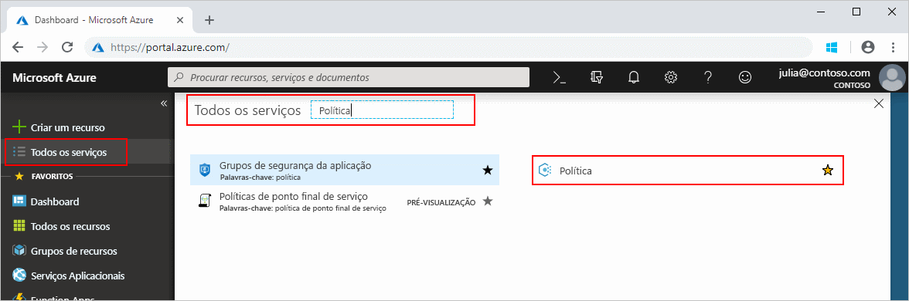
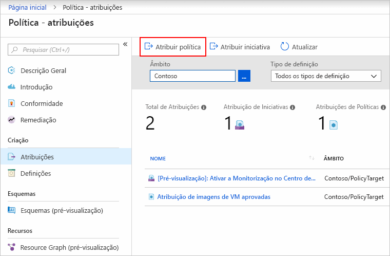
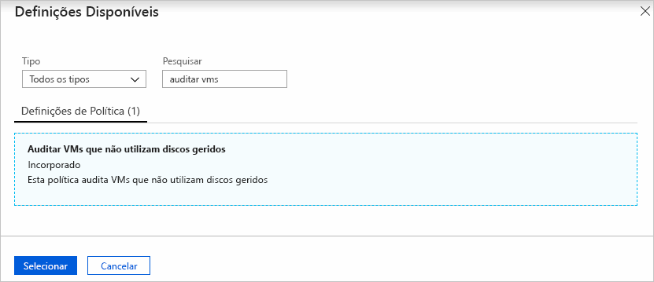
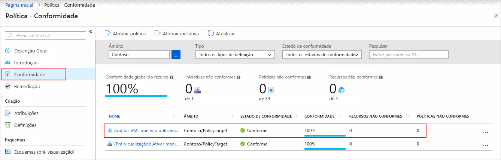
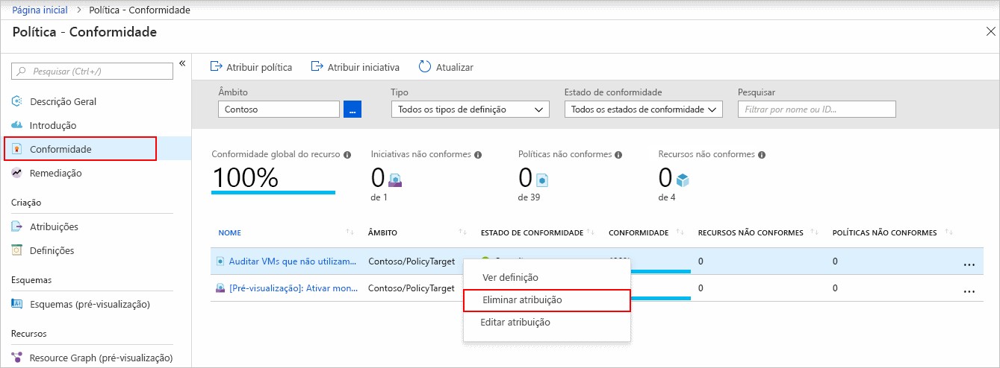

# Criar uma atribuição de política para identificar recursos incompatíveis no seu ambiente do Azure

O primeiro passo para compreender a conformidade no Azure consiste em identificar o estado dos seus recursos.
Este início rápido acompanha-o ao longo do processo de criação de uma atribuição de política para identificar máquinas virtuais que não estão a utilizar discos geridos.

No final deste processo, vai identificar com êxito as máquinas virtuais que não estão a utilizar discos geridos. Estão em *não conformidade* com a atribuição de política.

Se não tiver uma subscrição do Azure, crie uma conta [gratuita](https://azure.microsoft.com/free/) antes de começar.

## Criar uma atribuição de política

Neste início rápido, pode criar uma atribuição de política e atribuir a *VMs de auditoria que não utilizam discos geridos* definição de política.

1. Inicie o serviço Azure Policy no portal do Azure ao clicar em **Todos os serviços** e, em seguida, ao pesquisar e selecionar **Policy**.

   

1. Selecione **Atribuições** no lado esquerdo da página Azure Policy. Uma atribuição é uma política que foi atribuída para ter lugar num âmbito específico.

   

1. Selecione **Atribuir Política** na parte superior da página **Política - Atribuições**.

   

1. Na página **Atribuir Política**, selecione **Âmbito** ao clicar no botão de reticências e ao selecionar um grupo de gestão ou uma subscrição. Opcionalmente, selecione um grupo de recursos. Um âmbito determina que recursos ou agrupamento de recursos em que a atribuição de política é imposta.  Em seguida, clique em **Selecionar** na parte inferior da página **Âmbito**.

   Este exemplo utiliza a subscrição da **Contoso**. A sua subscrição vai ser diferente.

1. Os recursos podem ser excluídos com base no **Âmbito**.  As **Exclusões** começam num nível inferior ao nível do **Âmbito**. As **Exclusões** são opcionais. Por isso, deixe-as em branco por enquanto.

1. Selecione as reticências de **Definição de política** para abrir a lista de definições disponíveis. O Azure Policy já inclui as definições de política incorporadas que pode utilizar. Existem muitas disponíveis, como:

   - Impor etiqueta e o respetivo valor
   - Aplicar etiqueta e o respetivo valor
   - Requer a Versão do SQL Server 12.0

   Para obter uma lista parcial de políticas incorporadas disponíveis, consulte [exemplos de política](./samples/index.md).

1. Pesquise nas definições de política para encontrar a definição *Auditar VMs que não utilizam discos geridos*. Clique nessa política e clique em **Selecionar**.

   

1. O **Nome da atribuição** é automaticamente preenchido com o nome da política que selecionou, mas pode alterá-lo. Neste exemplo, vamos deixar *Auditar VMs que não utilizam discos geridos*. Também pode adicionar uma **Descrição** opcional. A descrição fornece detalhes sobre esta atribuição de política. **Atribuído por** será preenchido automaticamente com base em quem tem sessão iniciada. Este campo é opcional,por isso pode introduzir valores personalizados.

1. Não marque o campo **Criar uma Identidade Gerida**. Esta caixa _tem_ verificado quando a política ou iniciativa inclui uma política com o [deployIfNotExists](./concepts/effects.md#deployifnotexists) efeito. Como não a política utilizada neste início rápido, deixe em branco. Para obter mais informações, veja [identidades geridas](../../active-directory/managed-identities-azure-resources/overview.md) e [como funciona a segurança de remediação](./how-to/remediate-resources.md#how-remediation-security-works).

1. Clique em **Atribuir**.

Agora, está pronto para identificar recursos incompatíveis para compreender o estado de compatibilidade do seu ambiente.

## Identificar recursos não compatíveis

Selecione **conformidade** no lado esquerdo da página. Em seguida, localize a **VMs de auditoria que não utilizam discos geridos** atribuição de política que criou.

Se existirem quaisquer recursos existentes que não estão em conformidade com esta nova atribuição, aparecem em **recursos não compatíveis**.

Quando uma condição é avaliada em relação aos seus recursos existentes e resulta como verdadeira, esses recursos são então marcados como em não conformidade com a política. A tabela seguinte mostra como funcionam os diferentes efeitos de política com a avaliação de condição para o estado de conformidade resultante. Apesar de não ver a lógica de avaliação no portal do Azure, são mostrados os resultados do estado de conformidade. O resultado do estado de conformidade pode ser em conformidade ou em não conformidade.

| **Estado do Recurso** | **Efeito** | **Avaliação da Política** | **Estado de Compatibilidade** |
| --- | --- | --- | --- |
| Existe | Negar, Auditar, Acrescentar\*, DeployIfNotExist\*, AuditIfNotExist\* | Verdadeiro | Em Não Conformidade |
| Existe | Negar, Auditar, Acrescentar\*, DeployIfNotExist\*, AuditIfNotExist\* | Falso | Compatível |
| Novo | Audit, AuditIfNotExist\* | Verdadeiro | Em Não Conformidade |
| Novo | Audit, AuditIfNotExist\* | Falso | Compatível |

\* Os efeitos de Append, DeployIfNotExist e AuditIfNotExist requerem que a declaração IF seja TRUE. Os efeitos também necessitam que a condição de existência seja FALSE para estarem em não conformidade. Quando for TRUE, a condição IF aciona a avaliação da condição de existência dos recursos relacionados.

## Limpar recursos

Para remover a atribuição de criado, siga estes passos:

1. Selecione **Conformidade** (ou **Atribuições**) no lado esquerdo da página Azure Policy e localize a atribuição de política **Auditar VMs que não utilizam discos geridos** que criou.

1. Clique com o botão direito do rato na atribuição de política **Auditar VMs que não utilizam discos geridos** e selecione **Eliminar atribuição**

   

## Passos Seguintes

Neste início rápido, atribuiu uma definição de política a um âmbito e avaliou o respetivo relatório de conformidade. A definição de política valida que todos os recursos no âmbito estão em conformidade e identifica quais não estão.

Para saber mais sobre a atribuição de políticas para validar que os novos recursos estão em conformidade, avance para o tutorial para:

> [!div class="nextstepaction"]
> [Criar e gerir políticas](./tutorials/create-and-manage.md)