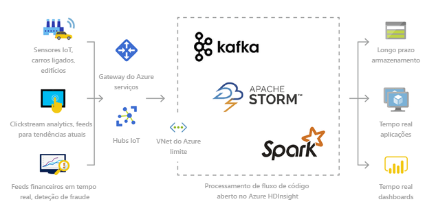
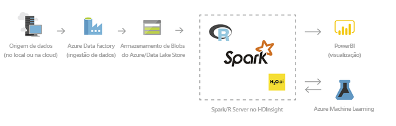
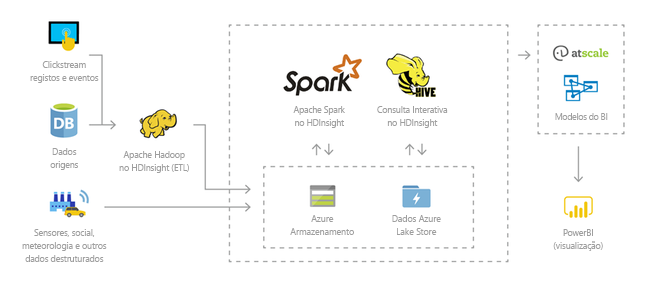
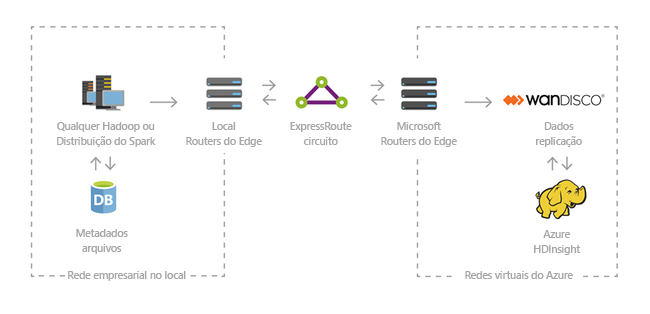

# Introdução ao Azure HDInsight e à pilha tecnológica do Hadoop e do Spark
Este artigo disponibiliza uma introdução ao Azure HDInsight. O Azure HDInsight é um serviço de análise completamente gerido, de espectro completo e open-source para empresas. Pode utilizar as estruturas de open source, como o Hadoop, o Spark, o Hive, o LLAP, o Kafka, o Storm, o R e muitos mais. 

[!INCLUDE [hdinsight-price-change](../../../includes/hdinsight-enhancements.md)]

O [Apache Hadoop](http://hadoop.apache.org/) era a arquitetura de código aberto original para processamento distribuído e análise de conjuntos de macrodados em clusters. A pilha de tecnologia do Hadoop inclui software e utilitários relacionados, entre os quais Apache Hive, HBase, Spark, Kafka e muitos outros. 

Para ver os componentes da pilha tecnológica do Hadoop disponíveis no HDInsight, veja [Componentes e versões disponíveis com o HDInsight][component-versioning]. Para ler mais sobre o Hadoop no HDInsight, veja a [página de funcionalidades do Azure para o HDInsight](https://azure.microsoft.com/services/hdinsight/).

O [Apache Spark](http://spark.apache.org) é uma arquitetura de processamento paralelo de código aberto que suporta o processamento dentro da memória para melhorar o desempenho de aplicações de análise de macrodados. Para ler mais sobre o Spark no HDInsight, veja [Introdução ao Spark no Azure HDInsight](../spark/apache-spark-overview.md). 

## O que é o HDInsight e a pilha de tecnologia do Hadoop? 
O Azure HDInsight é uma distribuição de cloud dos componentes do Hadoop da [Hortonworks Data Platform (HDP)](https://hortonworks.com/products/data-center/hdp/). O Azure HDInsight torna mais fácil, rápido e rentável processar quantidades enormes de dados. Pode utilizar as estruturas de código aberto mais populares, como o Hadoop, o Spark, o Hive, o LLAP, o Kafka, o Storm, o R, entre outras. Com estas estruturas, pode permitir um vasto leque de cenários como extrair, transformar e carregar (ETL), armazenamento de dados, machine learning e IoT.

## O que são macrodados?

Os macrodados são recolhidos em volumes cada vez maiores, a velocidades mais rápidas e numa variedade de formatos mais ampla do que nunca. Podem ser históricos (isto é, armazenados) ou em tempo real (isto é, transmitidos em fluxo a partir da origem). Veja [Scenarios for using HDInsight (Cenários para utilizar o HDInsight)](#scenarios-for-using-hdinsight) para saber mais sobre os casos de utilização mais comuns de macrodados.

## Por que motivo devo utilizar o HDInsight?

Esta secção lista as capacidades do Azure HDInsight.

|Capacidade  |Descrição  |
|---------|---------|
|Cloud nativa     |     O Azure HDInsight permite-lhe criar clusters otimizados para o [Hadoop](apache-hadoop-linux-tutorial-get-started.md), o  [Spark](../spark/apache-spark-jupyter-spark-sql.md), a  [Consulta interativa (LLAP)](../interactive-query/apache-interactive-query-get-started.md), o  [Kafka](../kafka/apache-kafka-get-started.md), o  [Storm](../storm/apache-storm-tutorial-get-started-linux.md), o  [HBase](../hbase/apache-hbase-tutorial-get-started-linux.md) e o  [R Server](../r-server/r-server-get-started.md) no Azure. O HDInsight também oferece um SLA de ponto a ponto em todas as suas cargas de trabalho de produção.  |
|Baixo custo e dimensionável     | O HDInsight permite-lhe [aumentar ou reduzir](../hdinsight-administer-use-portal-linux.md) verticalmente cargas de trabalho. Pode  [criar clusters a pedido](../hdinsight-hadoop-create-linux-clusters-adf.md) e pagar apenas o que utiliza, para reduzir custos. Também pode criar pipelines de dados para operacionalizar as tarefas. A computação e o armazenamento desassociados oferecem um melhor desempenho e flexibilidade. |
|Seguro e conforme    | O HDInsight permite-lhe proteger os seus ativos de dados empresariais com a [Rede Virtual do Azure](../hdinsight-extend-hadoop-virtual-network.md), a [encriptação](../hdinsight-hadoop-create-linux-clusters-with-secure-transfer-storage.md) e a integração no [Azure Active Directory](../domain-joined/apache-domain-joined-introduction.md). O HDInsight também cumpre os [padrões de conformidade](https://azure.microsoft.com/overview/trusted-cloud) mais populares da indústria e do governo.        |
|Monitorização    | O Azure HDInsight integra-se no [Azure Log Analytics](../hdinsight-hadoop-oms-log-analytics-tutorial.md) para oferecer uma interface única com a qual pode monitorizar todos os clusters.        |
|Disponibilidade global | O HDInsight está disponível em mais de  [regiões](https://azure.microsoft.com/regions/services/) do que qualquer outra oferta de análise de macrodados. O Azure HDInsight também está disponível no Azure Government, na China e na Alemanha, o que lhe permite satisfazer as suas necessidades empresariais nas principais áreas soberanas. |  
|Produtividade     |  O Azure HDInsight permite-lhe utilizar ferramentas produtivas avançadas para o Hadoop e o Spark com os seus ambientes de desenvolvimento preferidos. Estes ambientes de desenvolvimento incluem [Visual Studio](apache-hadoop-visual-studio-tools-get-started.md), [Eclipse](../spark/apache-spark-eclipse-tool-plugin.md) e [IntelliJ](../spark/apache-spark-intellij-tool-plugin.md) para Scala, Python, R, Java e .NET. Os cientistas de dados também podem colaborar com blocos de notas populares, como o [Jupyter](../spark/apache-spark-jupyter-notebook-kernels.md) e o [Zeppelin](../spark/apache-spark-zeppelin-notebook.md).    |
|Extensibilidade     |  Pode expandir os clusters do HDInsight com componentes instalados (Hue, Presto, etc.) através da utilização de [ações de script](../hdinsight-hadoop-customize-cluster-linux.md), ao [adicionar nós periféricos](../hdinsight-apps-use-edge-node.md) ou ao [integrar noutras aplicações certificadas de macrodados](../hdinsight-apps-install-applications.md). O HDInsight permite a integração perfeita com as soluções mais populares de macrodados com uma implementação de [um só clique](https://azure.microsoft.com/services/hdinsight/partner-ecosystem/).|

## Cenários para utilizar o HDInsight

O Azure HDInsight pode servir para uma variedade de cenários de processamento de macrodados. Podem ser dados históricos (dados já recolhidos e armazenados) ou dados em tempo real (dados transmitidos diretamente da origem). Os cenários para processar esses dados podem ser resumidos nas seguintes categorias: 

### Processamento em lotes (ETL)

A extração, transformação e carregamento (ETL) é um processo onde os dados estruturados ou não estruturados são extraídos de origens de dados heterogéneas. Depois, são transformados num formato estruturado e carregados para um arquivo de dados. Pode utilizar os dados transformados para ciência de dados ou armazenamento de dados.

### Internet das Coisas (IoT)

Pode utilizar o HDInsight para processar os dados de transmissão em fluxo recebidos em tempo real de diversos dispositivos. Para obter mais informações, [leia esta mensagem do blogue do Azure que anuncia a pré-visualização pública do Apache Kafka no HDInsight com os discos geridos do Azure](https://azure.microsoft.com/blog/announcing-public-preview-of-apache-kafka-on-hdinsight-with-azure-managed-disks/).

 

### Ciência dos dados

Pode utilizar o HDInsight para criar aplicações que extraem informações críticas dos dados. Também pode utilizar o Azure Machine Learning para prever futuras tendências para a sua empresa. Para obter mais informações, [leia esta história do cliente](https://customers.microsoft.com/story/pros).

### Armazenamento de dados

Pode utilizar o HDInsight para executar consultas interativas em escalas de petabytes sobre dados estruturados ou não estruturados em qualquer formato. Também pode criar modelos ao ligá-las a ferramentas de BI. Para obter mais informações, [leia esta história do cliente](https://customers.microsoft.com/story/milliman). 

### Híbrido

Pode utilizar o HDInsight para expandir a sua atual infraestrutura de macrodados local no Azure, para tirar partido de capacidades avançadas de análise da cloud.

## Tipos de clusters no HDInsight
O HDInsight inclui tipos de clusters específicos e capacidades de personalização de clusters, como a possibilidade de adicionar componentes, utilitários e linguagens.

### Spark, Kafka, Interactive Query, HBase, clusters personalizados e outros tipos de cluster
O HDInsight oferece os seguintes tipos de cluster:

* **[Apache Hadoop](https://wiki.apache.org/hadoop)**: uma arquitetura que utiliza o [HDFS](#hdfs), a gestão de recursos [YARN](#yarn) e um modelo de programação simples, o [MapReduce](#mapreduce), para processar e analisar dados de lotes em paralelo.

* **[Apache Spark](http://spark.apache.org/)**: uma arquitetura de processamento paralelo de código aberto que suporta o processamento dentro da memória para melhorar o desempenho de aplicações de análise de macrodados. O Spark funciona para SQL, dados de transmissão e machine learning. Veja [O que é o Apache Spark no HDInsight?](../spark/apache-spark-overview.md)

* **[Apache HBase](http://hbase.apache.org/)**: uma base de dados NoSQL incorporada no Hadoop e que proporciona acesso aleatório e consistência segura para grandes quantidades de dados não estruturados e semiestruturados -- potencialmente, biliões de linhas vezes milhões de colunas. Veja [O que é o HBase no HDInsight?](../hbase/apache-hbase-overview.md)

* **[Microsoft R Server](https://msdn.microsoft.com/microsoft-r/rserver)**: um servidor para alojar e gerir processos R paralelos distribuídos. Fornece cientistas de dados, peritos em estatística e programadores de R com acesso a pedido a métodos dimensionáveis distribuídos de análise no HDInsight. Consulte [Overview of R Server on HDInsight (Descrição geral do R Server no HDInsight)](../r-server/r-server-overview.md).

* **[Apache Storm](https://storm.incubator.apache.org/)**: um sistema de cálculo distribuído e em tempo real para o processamento rápido de grandes fluxos de dados. O Storm é fornecido como um cluster gerido no HDInsight. Consulte [Analisar dados de sensores em tempo real através do Storm e do Hadoop](../storm/apache-storm-sensor-data-analysis.md).

* **[Pré-visualização do Apache Interactive Query (também conhecido como: Live Long and Process)](https://cwiki.apache.org/confluence/display/Hive/LLAP)**: colocação em cache dentro da memória para consultas do Hive interativas e mais rápidas. Veja [Use Interactive Query in HDInsight (Utilizar o Interactive Query no HDInsight)](../interactive-query/apache-interactive-query-get-started.md).

* **[Apache Kafka](https://kafka.apache.org/)**: uma plataforma de código aberto utilizada para a criação de aplicações e pipelines de dados de transmissão. O Kafka também fornece uma funcionalidade de fila de mensagens que lhe permite publicar e subscrever transmissões de dados. Consulte [Introduction to Apache Kafka on HDInsight (Introdução ao Apache Kafka no HDInsight)](../kafka/apache-kafka-introduction.md).

## Componentes de código aberto no HDInsight

O Azure HDInsight permite-lhe criar clusters com estruturas de código aberto, como o Hadoop, o Spark, o Hive, o LLAP, o Kafka, o Storm, o HBase e o R. Estes clusters, por predefinição, são fornecidos com outros componentes de código aberto incluídos no cluster, como o [Ambari](https://github.com/apache/ambari/blob/trunk/ambari-server/docs/api/v1/index.md), o [Avro](http://avro.apache.org/docs/current/spec.html), o [Hive](http://hive.apache.org), o [HCatalog](https://cwiki.apache.org/confluence/display/Hive/HCatalog/), o [Mahout](https://mahout.apache.org/), o [MapReduce](http://wiki.apache.org/hadoop/MapReduce), o [YARN](http://hadoop.apache.org/docs/current/hadoop-yarn/hadoop-yarn-site/YARN.html), o [Phoenix](http://phoenix.apache.org/), o [Pig](http://pig.apache.org/), o [Sqoop](http://sqoop.apache.org/), o [Tez](http://tez.apache.org/), o [Oozie](http://oozie.apache.org/) e o [ZooKeeper](http://zookeeper.apache.org/).  

## Linguagens de programação no HDInsight
Os clusters do HDInsight, incluindo Spark, HBase, Kafka, Hadoop, entre outros, suportam muitas linguagens de programação. Contudo, algumas não estão instaladas por predefinição. Para bibliotecas, módulos ou pacotes não instalados por predefinição, [utilize uma ação de script para instalar o componente](../hdinsight-hadoop-script-actions-linux.md). 

### Suporte de linguagens de programação predefinidas
Por predefinição, os clusters do HDInsight suportam:

* Java
* Python

Pode utilizar [ações de script](../hdinsight-hadoop-script-actions-linux.md) para instalar linguagens adicionais.

### Linguagens de máquina virtual de Java (JVM)
Podem ser executadas muitas outras linguagens que não Java nas máquinas virtuais Java (JVM). No entanto, se executar algumas destas linguagens, poderá ter de instalar componentes adicionais no cluster.

As linguagens baseadas em JVM abaixo são suportadas nos clusters do HDInsight:

* Clojure
* Jython (Python para Java)
* Scala

### Linguagens específicas do Hadoop
Os clusters do HDInsight suportam as seguintes linguagens que são específicas da pilha de tecnologia do Hadoop:

* Pig Latin para tarefas do Pig
* HiveQL para tarefas do Hive e SparkSQL

## Business intelligence no HDInsight
As ferramentas de business intelligence (BI) familiares obtêm, analisam e reportam dados integrados no HDInsight através do suplemento Power Query ou Microsoft Hive ODBC Driver:

* [Apache Spark BI a utilizar ferramentas de visualização de dados com o Azure HDInsight](../spark/apache-spark-use-bi-tools.md)

* [Visualizar dados do Hive com o Microsoft Power BI no Azure HDInsight](apache-hadoop-connect-hive-power-bi.md) 

* [Visualizar dados de Consulta Interativa do Hive com o Power BI no Azure HDInsight](../interactive-query/apache-hadoop-connect-hive-power-bi-directquery.md)

* [Ligar o Excel ao Hadoop com o Power Query](apache-hadoop-connect-excel-power-query.md): saiba como utilizar o Microsoft Power Query para Excel para ligar o Excel à conta do Armazenamento do Azure que armazena os dados do seu cluster do HDInsight. É necessária uma estação de trabalho do Windows. 

* [Ligar o Excel ao Hadoop com o Controlador ODBC do Microsoft Hive](apache-hadoop-connect-excel-hive-odbc-driver.md): Saiba como importar dados do HDInsight com o Controlador ODBC do Microsoft Hive. É necessária uma estação de trabalho do Windows. 

* [Plataforma do Microsoft Cloud](http://www.microsoft.com/server-cloud/solutions/business-intelligence/default.aspx): Saiba mais sobre o Power BI para Office 365, transfira a versão de avaliação do SQL Server e configure o SharePoint Server 2013 e o SQL Server BI.

* [SQL Server Analysis Services](http://msdn.microsoft.com/library/hh231701.aspx)

* [SQL Server Reporting Services](http://msdn.microsoft.com/library/ms159106.aspx)

## Passos seguintes

* [Introdução ao Hadoop no HDInsight](apache-hadoop-linux-tutorial-get-started.md)
* [Introdução ao Spark no HDInsight](../spark/apache-spark-jupyter-spark-sql.md)
* [Introdução ao Kafka no HDInsight](../kafka/apache-kafka-get-started.md)
* [Introdução ao Storm no HDInsight](../storm/apache-storm-tutorial-get-started-linux.md)
* [Introdução ao HBase no HDInsight](../hbase/apache-hbase-tutorial-get-started-linux.md)
* [Get started with Interactive Query (LLAP) on HDInsight](../interactive-query/apache-interactive-query-get-started.md) (Introdução ao Interactive Query (LLAP) no HDInsight)
* [Introdução ao R Server no HDInsight](../r-server/r-server-get-started.md)
* [Gerir clusters do HDInsight](../hdinsight-administer-use-portal-linux.md)
* [Proteger os seus clusters do HDInsight](../domain-joined/apache-domain-joined-introduction.md)
* [Monitorizar clusters do HDInsight](../hdinsight-hadoop-oms-log-analytics-tutorial.md)

[component-versioning]: ../hdinsight-component-versioning.md
[zookeeper]: http://zookeeper.apache.org/
