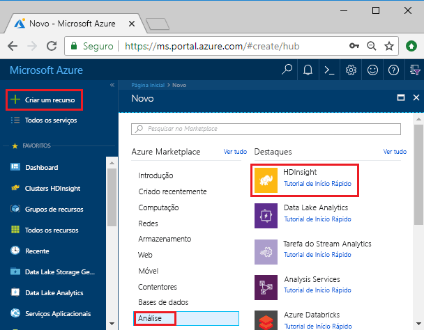
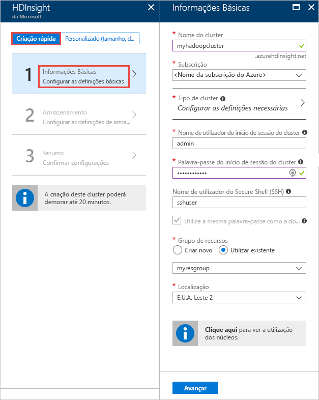
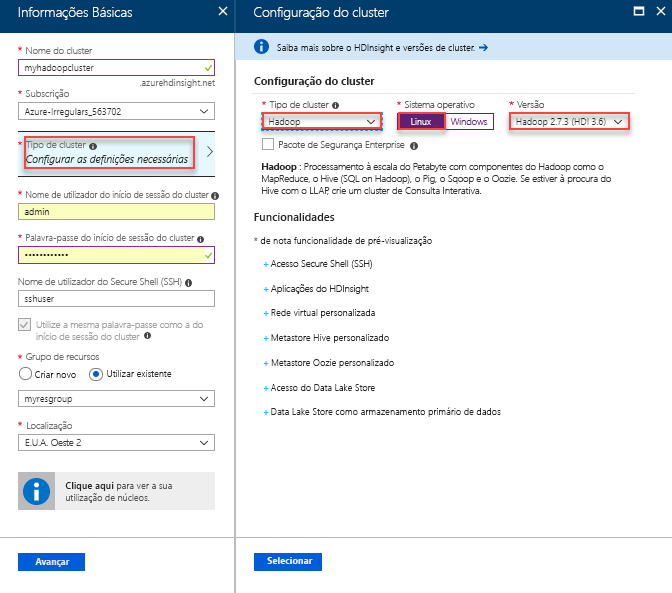
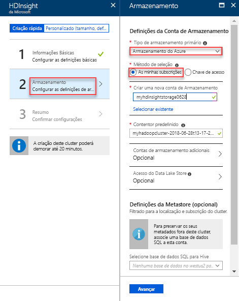
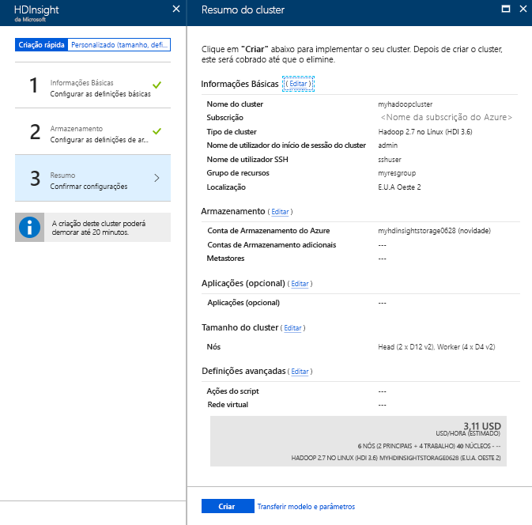
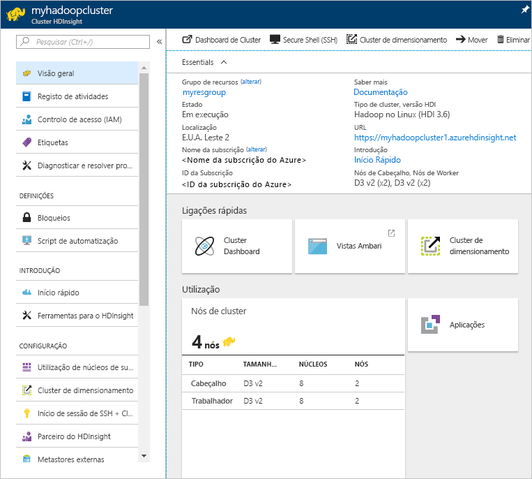

# Guia de Início Rápido: Introdução ao Hadoop e ao Hive no Azure HDInsight através do portal do Azure

Neste artigo, irá saber como criar clusters do [Hadoop](http://hadoop.apache.org/) no HDInsight através do portal do Azure e, em seguida, executar tarefas do Hive no HDInsight. A maioria das tarefas do Hadoop são tarefas de lote. Cria um cluster, executa algumas tarefas e, em seguida, elimina o cluster. Neste artigo, irá realizar as três tarefas.

Neste guia de início rápido, irá utilizar o portal do Azure para criar um cluster do Hadoop no HDInsight. Também pode criar um cluster através do [modelo Azure Resource Manager](apache-hadoop-linux-tutorial-get-started.md).

Atualmente, o HDInsight inclui [sete tipos diferentes de cluster](./apache-hadoop-introduction.md#cluster-types-in-hdinsight). Cada tipo de cluster suporta um conjunto diferente de componentes. Todos os tipos de cluster suportam o Hive. Para obter uma lista dos componentes suportados no HDInsight, consulte [Quais são as novidades nas versões de cluster do Hadoop fornecidas pelo HDInsight?](../hdinsight-component-versioning.md)  

Se não tiver uma subscrição do Azure, [crie uma conta gratuita](https://azure.microsoft.com/free/) antes de começar.

## Criar um cluster do Hadoop

Nesta secção, irá criar um cluster do Hadoop no HDInsight através do portal do Azure. 

1. Inicie sessão no [portal do Azure](https://portal.azure.com).

1. No portal do Azure, selecione **Criar um recurso** > **Dados + Análise** > **HDInsight**. 

    

2. Em **HDInsight** > **Criação Rápida** > **Básico**, introduza os valores sugeridos na seguinte captura de ecrã:

    

    Introduza ou selecione os seguintes valores:
    
    |Propriedade  |Descrição  |
    |---------|---------|
    |**Nome do cluster**     | Introduza um nome para o cluster do Hadoop. Uma vez que todos os clusters no HDInsight partilham o mesmo espaço de nomes DNS, este nome tem de ser único. O nome pode ser composto por um máximo de 59 carateres, incluindo letras, números e hífenes. O primeiro e último carateres do nome não podem ser hífenes. |
    |**Subscrição**     |  Selecione a sua subscrição do Azure. |
    |**Tipo de Cluster**     | Ignorar por agora. Irá fornecer estas informações no próximo passo deste procedimento.|
    |**Nome de utilizador e palavra-passe de início de sessão do cluster**     | O nome de início de sessão predefinido é **admin**. A palavra-passe tem de ter no mínimo 10 carateres e tem de conter, pelo menos, um número, uma letra maiúscula e uma letra minúscula, e um caráter não alfanumérico (exceto os carateres ' " `\). Certifique-se de que **não escolhe** uma palavra-passe comum, tal como "Pass@word1".|
    |**Nome de utilizador SSH** | O nome de utilizador predefinido é **sshuser**.  Pode indicar outro nome de utilizador SSH. |
    | **Utilizar a palavra-passe de início de sessão do cluster** | Selecione esta caixa de verificação para utilizar a mesma palavra-passe de utilizador SSH que forneceu para o utilizador de início de sessão do cluster.|
    |**Grupo de recursos**     | Crie um grupo de recursos ou selecione um existente.  Um grupo de recursos é um contentor de componentes do Azure.  Neste caso, o grupo de recursos contém o cluster do HDInsight e a conta de armazenamento do Azure dependente. |
    |**Localização**     | Selecione uma localização do Azure onde pretende criar o cluster.  Selecione uma localização mais próxima de si para obter um melhor desempenho. |
        
3. Selecione **Tipo de cluster** e, em seguida, selecione as opções conforme mostrado na seguinte captura de ecrã:

    

    Selecione os seguintes valores:
    
    |Propriedade  |Descrição  |
    |---------|---------|
    |**Tipo de cluster**     | Introduza um nome para o cluster do Hadoop. Uma vez que todos os clusters no HDInsight partilham o mesmo espaço de nomes DNS, este nome tem de ser único. O nome pode ser composto por um máximo de 59 carateres, incluindo letras, números e hífenes. O primeiro e último carateres do nome não podem ser hífenes. |
    |**Sistema operativo**     |  Selecione a sua subscrição do Azure. |
    |**Versão**     | Selecione **Hadoop 2.7.3 (HDI 3.6)**|

    Clique em **Selecionar** e, em seguida, clique em **Seguinte**.

4. No separador **Armazenamento**, selecione as opções conforme mostrado na seguinte captura de ecrã:

    

    Selecione os seguintes valores:
    
    |Propriedade  |Descrição  |
    |---------|---------|
    |**Tipo de armazenamento primário**     | Para este artigo, selecione **Armazenamento do Azure** para utilizar o Azure Storage Blob como a conta de armazenamento predefinida. Também pode utilizar o Azure Data Lake Store como armazenamento predefinido. |
    |**Método de seleção**     |  Para este artigo, selecione **As minhas subscrições** para utilizar uma conta de armazenamento da sua subscrição do Azure. Para utilizar a conta de armazenamento de outras subscrições, selecione **Chave de acesso** e, em seguida, forneça a chave de acesso dessa conta. |
    |**Criar uma nova conta de armazenamento**     | Indique um nome para a conta de armazenamento.|

    Aceite todos os outros valores predefinidos e, em seguida, selecione **Seguinte**.

5. No separador **Resumo**, verifique os valores que selecionou nos passos anteriores.

    
      
4. Selecione **Criar**. Verá um novo mosaico intitulado **A submeter implementação para o HDInsight** no dashboard do portal. A criação de um cluster demora cerca de 20 minutos.

    

4. Após a criação do cluster, verá a página de descrição geral do cluster no portal do Azure.
   
        
    
    Cada cluster tem uma dependência de [conta do Armazenamento do Azure](../hdinsight-hadoop-use-blob-storage.md) ou de [conta do Azure Data Lake](../hdinsight-hadoop-use-data-lake-store.md). É designada de conta de armazenamento predefinida. O cluster do HDInsight e a respetiva conta do Storage predefinida devem estar colocalizados na mesma região do Azure. A eliminação dos clusters não elimina a conta de armazenamento.

    > [!NOTE]
    > Para conhecer outros métodos de criação de clusters e compreender as propriedades utilizadas neste tutorial, consulte [Criar clusters do HDInsight](../hdinsight-hadoop-provision-linux-clusters.md).       
    > 
    >

## Executar consultas do Hive

O [Apache Hive](hdinsight-use-hive.md) é o componente mais popular utilizado no HDInsight. Existem várias formas de executar tarefas do Hive no HDInsight. Neste tutorial, irá utilizar a vista Ambari Hive do portal. Para conhecer outros métodos de submissão de tarefas do Hive, consulte [Utilizar o Hive no HDInsight](hdinsight-use-hive.md).

1. Para abrir o Ambari, a partir da captura de ecrã anterior, selecione **Dashboard de Clusters**.  Também pode procurar em **https://&lt;ClusterName>.azurehdinsight.net**, onde &lt;ClusterName> é o cluster que criou na secção anterior.

    

2. Introduza o nome de utilizador e a palavra-passe do Hadoop que especificou ao criar o cluster. O nome de utilizador predefinido é **admin**.

3. Abra a **Vista do Hive** conforme mostrado na captura de ecrã seguinte:
   
    

4. No separador **CONSULTAS**, cole as seguintes declarações HiveQL na folha de cálculo:
   
        SHOW TABLES;

    
   
   > [!NOTE]
   > O Hive requer a utilização do ponto e vírgula.       
   > 
   > 

5. Selecione **Executar**. O separador **RESULTADOS** aparece por baixo do separador **CONSULTA** e apresenta informações sobre a tarefa. 
   
    Assim que a consulta estiver concluída, o separador **CONSULTA** apresenta os resultados da operação. Deverá ver uma tabela denominada **hivesampletable**. Esta tabela do Hive de exemplo inclui todos os clusters do HDInsight.
   
    

6. Repita os passos 4 e 5 para executar a seguinte consulta:
   
        SELECT * FROM hivesampletable;
   
7. Também pode guardar os resultados da consulta. Selecione o botão de menu à direita e especifique se pretende transferir os resultados como um ficheiro CSV ou armazená-los na conta de armazenamento associada ao cluster.

    

Depois de concluir uma tarefa do Hive, pode [exportar os resultados para a SQL Database do Azure ou a base de dados do SQL Server](apache-hadoop-use-sqoop-mac-linux.md). Do mesmo modo, pode [visualizar os resultados com o Excel](apache-hadoop-connect-excel-power-query.md). Para obter mais informações sobre como utilizar o Hive no HDInsight, consulte [Utilizar o Hive e o HiveQL com o Hadoop no HDInsight para analisar um ficheiro Apache log4j de exemplo](hdinsight-use-hive.md).

## Resolução de problemas

Caso se depare com problemas com a criação de clusters do HDInsight, veja [aceder aos requisitos de controlo](../hdinsight-administer-use-portal-linux.md#create-clusters).

## Limpar recursos
Depois de concluir o tutorial, pode pretender eliminar o cluster. Com o HDInsight, os dados são armazenados no Storage do Azure, pelo que pode eliminar um cluster em segurança quando este não está a ser utilizado. Também lhe é cobrado o valor de um cluster do HDInsight mesmo quando não o está a utilizar. Uma vez que os custos do cluster são muito superiores aos custos do armazenamento, faz sentido do ponto de vista económico eliminar os clusters quando não estiverem a ser utilizados. 

> [!NOTE]
> Se avançar *imediatamente* para o tutorial seguinte para saber como executar operações de ETL com o Hadoop no HDInsight, é recomendado que mantenha o cluster em execução. Isto porque tem de voltar a criar um cluster do Hadoop no tutorial. No entanto, se não avançar já para o tutorial seguinte, tem de eliminar o cluster agora.
> 
>  

**Para eliminar o cluster e/ou a conta de armazenamento predefinida**

1. Volte ao separador do browser onde tem o portal do Azure. Deverá estar na página de descrição geral do cluster. Se apenas quiser eliminar o cluster, mas quiser manter a conta de armazenamento predefinida, selecione **Eliminar**.

    

2. Se quiser eliminar o cluster e a conta de armazenamento predefinida, selecione o nome do grupo de recursos (realçado na captura de ecrã anterior) para abrir a página do grupo de recursos.

3. Selecione **Eliminar grupo de recursos** para eliminar o grupo de recursos que contém o cluster e a conta de armazenamento predefinida. Tenha em atenção que a eliminação do grupo de recursos elimina a conta de armazenamento. Se pretender manter a conta do Storage, opte por eliminar apenas o cluster.

## Passos seguintes
Neste tutorial, aprendeu a criar um cluster do HDInsight baseado em Linux com um modelo do Resource Manager, bem como a executar consultas básicas do Hive. No artigo seguinte, irá saber como executar uma operação de ETL (extração, transformação e carregamento) com o Hadoop no HDInsight.

> [!div class="nextstepaction"]
>[Extrair, transformar e carregar dados com o Apache Hive no HDInsight](../hdinsight-analyze-flight-delay-data-linux.md)

Se estiver pronto para começar a trabalhar com os seus próprios dados e precisar de saber mais sobre a forma como o HDInsight armazena os dados ou como carregar dados para o HDInsight, consulte os seguintes artigos:

* Para obter informações sobre como o HDInsight utiliza o Armazenamento do Azure, consulte [Utilizar o Armazenamento do Azure com o HDInsight](../hdinsight-hadoop-use-blob-storage.md).
* Para obter informações sobre como carregar dados para o HDInsight, veja [Upload data to HDInsight](../hdinsight-upload-data.md) (Carregar dados para o HDInsight).

Saiba mais sobre como analisar os dados com o HDInsight, veja os seguintes artigos:

* Para saber mais sobre como utilizar o Hive com o HDInsight, incluindo como executar consultas do Hive a partir do Visual Studio, veja [Use Hive with HDInsight](hdinsight-use-hive.md) (Utilizar o Hive com o HDInsight).
* Para saber mais sobre o Pig, uma linguagem utilizada para transformar dados, veja [Use Pig with HDInsight](hdinsight-use-pig.md) (Utilizar o Pig com o HDInsight).
* Para saber mais sobre o MapReduce, uma forma de escrever programas que processam dados no Hadoop, veja [Use MapReduce with HDInsight](hdinsight-use-mapreduce.md) (Utilizar o MapReduce com o HDInsight).
* Para saber mais sobre como utilizar as Ferramentas do HDInsight para o Visual Studio para analisar dados no HDInsight, consulte [Começar a utilizar as ferramentas Hadoop do Visual Studio para o HDInsight](apache-hadoop-visual-studio-tools-get-started.md).

Se gostaria de saber mais sobre como criar ou gerir um cluster do HDInsight, consulte os seguintes artigos:

* Para saber mais sobre a gestão do seu cluster do HDInsight baseado em Linux, consulte [Gerir clusters do HDInsight com o Ambari](../hdinsight-hadoop-manage-ambari.md).
* Para saber mais sobre as opções que pode selecionar ao criar um cluster do HDInsight, consulte [Criar HDInsight no Linux utilizando opções personalizadas](../hdinsight-hadoop-provision-linux-clusters.md).

[1]: ../HDInsight/apache-hadoop-visual-studio-tools-get-started.md

[hdinsight-provision]: hdinsight-provision-linux-clusters.md
[hdinsight-upload-data]: hdinsight-upload-data.md
[hdinsight-use-hive]: hdinsight-use-hive.md
[hdinsight-use-pig]: hdinsight-use-pig.md

