# <a name="quickstart-get-started-with-hadoop-and-hive-in-azure-hdinsight-using-resource-manager-template"></a>Início Rápido: Introdução ao Hadoop e ao Hive no Azure HDInsight através de um modelo do Resource Manager

Neste artigo, vai aprender a criar clusters do [Hadoop](http://hadoop.apache.org/) no HDInsight através de um modelo do Resource Manager e, em seguida, executar tarefas do Hive no HDInsight. A maioria das tarefas do Hadoop são tarefas de lote. Cria um cluster, executa algumas tarefas e, em seguida, elimina o cluster. Neste artigo, irá realizar as três tarefas.

Neste início rápido, vai utilizar um modelo do Resource Manager para criar um cluster do Hadoop no HDInsight. Também pode criar um cluster com o [Portal do Azure](apache-hadoop-linux-create-cluster-get-started-portal.md).

Atualmente, o HDInsight inclui [sete tipos diferentes de cluster](./apache-hadoop-introduction.md#cluster-types-in-hdinsight). Cada tipo de cluster suporta um conjunto diferente de componentes. Todos os tipos de cluster suportam o Hive. Para obter uma lista dos componentes suportados no HDInsight, consulte [Quais são as novidades nas versões de cluster do Hadoop fornecidas pelo HDInsight?](../hdinsight-component-versioning.md)  

Se não tiver uma subscrição do Azure, [crie uma conta gratuita](https://azure.microsoft.com/free/) antes de começar.

<a name="create-cluster"></a>
## <a name="create-a-hadoop-cluster"></a>Criar um cluster do Hadoop

Nesta secção, vai criar um cluster do Hadoop no HDInsight com um modelo do Azure Resource Manager. Não precisa de ter experiência no modelo do Resource Manager para seguir este artigo. 

1. Clique no botão **Implementar no Azure** abaixo para iniciar sessão no Azure abrir o modelo do Resource Manager no portal do Azure. 
   
    <a href="https://portal.azure.com/#create/Microsoft.Template/uri/https%3A%2F%2Fraw.githubusercontent.com%2FAzure%2Fazure-quickstart-templates%2Fmaster%2F101-hdinsight-linux-ssh-password%2Fazuredeploy.json" target="_blank"></a>

2. Introduza ou selecione os valores conforme sugerido na seguinte captura de ecrã:

    > [!NOTE]
    > Os valores que forem fornecidos têm de ser exclusivos e devem seguir as diretrizes de nomenclatura. O modelo não realiza verificações de validação. Caso os valores fornecidos já estejam a ser utilizados ou não sigam as diretrizes, receberá um erro depois de ter submetido o modelo.       
    > 
    >
    
    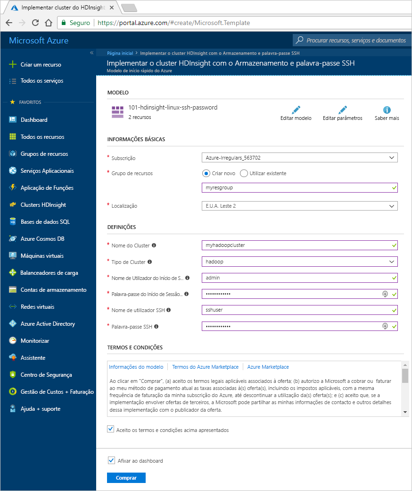

    Introduza ou selecione os seguintes valores:
    
    |Propriedade  |Descrição  |
    |---------|---------|
    |**Subscrição**     |  Selecione a sua subscrição do Azure. |
    |**Grupo de recursos**     | Crie um grupo de recursos ou selecione um existente.  Um grupo de recursos é um contentor de componentes do Azure.  Neste caso, o grupo de recursos contém o cluster do HDInsight e a conta de armazenamento do Azure dependente. |
    |**Localização**     | Selecione uma localização do Azure onde quer criar o cluster.  Selecione uma localização mais próxima de si para obter um melhor desempenho. |
    |**Tipo de Cluster**     | Selecione **hadoop**. |
    |**Nome do Cluster**     | Introduza um nome para o cluster do Hadoop. Uma vez que todos os clusters no HDInsight partilham o mesmo espaço de nomes DNS, este nome tem de ser único. O nome pode ser composto por um máximo de 59 carateres, incluindo letras, números e hífenes. O primeiro e último carateres do nome não podem ser hífenes. |
    |**Nome e palavra-passe de início de sessão no cluster**     | O nome de início de sessão predefinido é **admin**. A palavra-passe tem de ter no mínimo 10 carateres e tem de conter, pelo menos, um número, uma letra maiúscula e uma letra minúscula, e um caráter não alfanumérico (exceto os carateres ' " `\). Certifique-se de que **não escolhe** uma palavra-passe comum, tal como "Pass@word1".|
    |**Nome de utilizador e palavra-passe de SSH**     | O nome de utilizador predefinido é **sshuser**.  Pode mudar o nome de utilizador do SSH.  A palavra-passe de utilizador do SSH tem os mesmos requisitos que a palavra-passe de início de sessão do cluster.|
       
    Algumas propriedades foram codificadas no modelo.  Pode configurar estes valores a partir do modelo. Para obter mais explicações sobre estas propriedades, veja [Criar clusters Hadoop no HDInsight](../hdinsight-hadoop-provision-linux-clusters.md).

3. Selecione **Concordo com os termos e condições indicados acima** e **Afixar ao dashboard**. Em seguida, clique em **Comprar**. Irá ver um novo mosaico intitulado **A submeter a implementação** no dashboard do portal. A criação de um cluster demora cerca de 20 minutos.

    

4. Assim que o cluster for criado, a legenda do mosaico é alterada para o nome do grupo de recursos que especificou. O mosaico também indica o cluster do HDInsight que é criado no grupo de recursos. 
   
    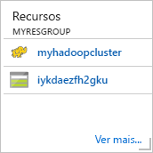
    
5. O mosaico indica igualmente o armazenamento predefinido associado ao cluster. Cada cluster tem uma dependência de [conta do Armazenamento do Azure](../hdinsight-hadoop-use-blob-storage.md) ou de [conta do Azure Data Lake](../hdinsight-hadoop-use-data-lake-store.md). É designada de conta de armazenamento predefinida. O cluster do HDInsight e a respetiva conta do Storage predefinida devem estar colocalizados na mesma região do Azure. A eliminação dos clusters não elimina a conta de armazenamento.
    

> [!NOTE]
> Para conhecer outros métodos de criação de clusters e compreender as propriedades utilizadas neste tutorial, consulte [Criar clusters do HDInsight](../hdinsight-hadoop-provision-linux-clusters.md).       
> 
>

## <a name="use-vscode-to-run-hive-queries"></a>Utilizar o VSCode para executar consultas do Hive

Para saber como obter as Ferramentas do HDInsight no VSCode, veja [Utilizar Ferramentas do HDInsight para o Visual Studio Code](../hdinsight-for-vscode.md).

### <a name="submit-interactive-hive-queries"></a>Submeter consultas interativas do Hive

Com as Ferramentas do HDInsight para o VSCode, pode submeter consultas do Hive interativas para clusters de consulta interativa do HDInsight.

1. Crie uma nova pasta de trabalho e um novo ficheiro de script do Hive, se ainda não os tiver.

2. Ligue-se à sua conta do Azure e, em seguida, configure o cluster predefinido, se ainda não o tiver feito.

3. Copie e cole o seguinte código para o ficheiro do Hive e guarde-o.

    ```hiveql
    SELECT * FROM hivesampletable;
    ```
4. Clique com o botão direito do rato no editor de scripts e, em seguida, selecione **HDInsight: Hive Interativo** para submeter a consulta. As ferramentas permitem-lhe também submeter um bloco de código em vez de todo o ficheiro de script através do menu de contexto. Logo depois, os resultados da consulta são apresentados num novo separador.

   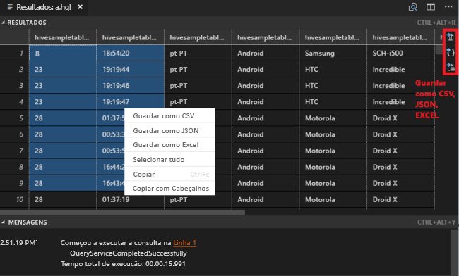

    - Painel **RESULTADOS**: pode guardar todo o resultado como ficheiro CSV, JSON ou Excel no caminho local ou apenas selecionar várias linhas.

    - Painel **MENSAGENS**: quando seleciona o número da **Linha**, passa para a primeira linha do script em execução.

A execução da consulta interativa demora muito menos tempo que [executar uma tarefa de lote do Hive](#submit-hive-batch-scripts).

### <a name="submit-hive-batch-scripts"></a>Submeter scripts de lote do Hive

1. Crie uma nova pasta de trabalho e um novo ficheiro de script do Hive, se ainda não os tiver.

2. Ligue-se à sua conta do Azure e, em seguida, configure o cluster predefinido, se ainda não o tiver feito.

3. Copie e cole o seguinte código para o ficheiro do Hive e guarde-o.

    ```hiveql
    SELECT * FROM hivesampletable;
    ```
4. Clique com o botão direito do rato no editor de scripts e, em seguida, selecione **HDInsight: Lote do Hive** para submeter a tarefa do Hive. 

5. Selecione o cluster para o qual pretende submeter.  

    Depois de submeter uma tarefa do Hive, as informações de êxito de submissão e o ID da tarefa são apresentados no painel **SAÍDA**. A tarefa do Hive também abre o **BROWSER**, que mostra o estado e os registos da tarefa em tempo real.

   

[Submeter consultas interativas do Hive](#submit-interactive-hive-queries) demora muito menos tempo que submeter uma tarefa de lote.

## <a name="use-visualstudio-to-run-hive-queries"></a>Utilizar o VisualStudio para executar consultas do Hive

Para saber como obter as Ferramentas do HDInsight no Visual Studio, veja [Utilizar as Ferramentas do Data Lake para o Visual Studio](./apache-hadoop-visual-studio-tools-get-started.md).

### <a name="run-hive-queries"></a>Executar consultas do Hive

Tem duas opções para criar e executar consultas do Hive:

* Criar consultas ad-hoc
* Criar uma aplicação do Hive

Para criar e executar consultas ad hoc:

1. No **Explorador de Servidores**, selecione **Azure** > **Clusters do HDInsight**.

2. Clique com o botão direito do rato no cluster no qual pretende executar a consulta e, em seguida, selecione **Escrever uma Consulta do Hive**.  

3. Introduza as consultas do Hive. 

    O editor do Hive suporta IntelliSense. O Data Lake Tools para Visual Studio suportam o carregamento de metadados remotos durante a edição do script do Hive. Por exemplo, quando escreve **SELECT * FROM**, o IntelliSense apresenta uma lista de todos os nomes de tabela sugeridos. Quando é especificado um nome de tabela, o IntelliSense lista os nomes das colunas. As ferramentas suportam quase todas as instruções DML do Hive, subconsultas e os UDFs incorporados.
   
    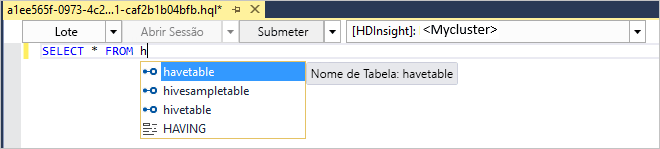
   
    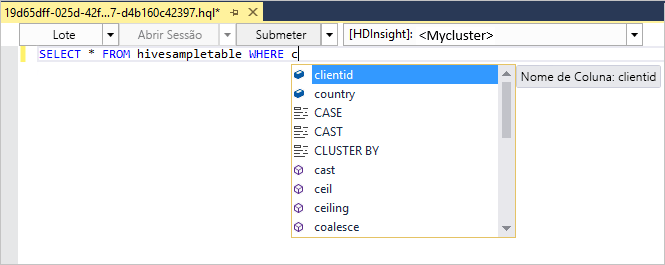
   
   > [!NOTE]
   > O IntelliSense sugere apenas os metadados do cluster selecionado na barra de ferramentas do HDInsight.
   > 
   
4. Selecione **Submeter** ou **Submeter (Avançado)**. 
   
    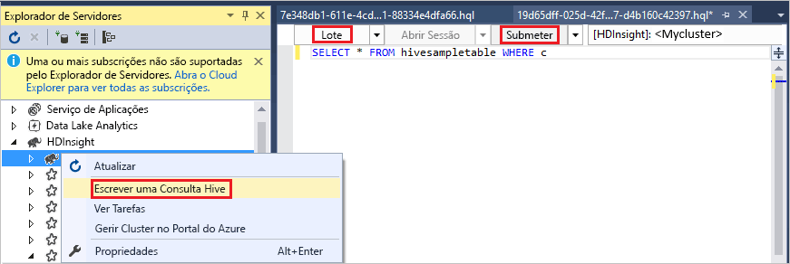

   Se selecionar a opção de submissão avançada, configura o **Nome da Tarefa**, **Argumentos**, **Configurações Adicionais** e **Diretório de Estado** para o script:

    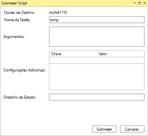

   Executar consultas interativas do Hive

   * Clique na seta para baixo para escolher **interativo**. 
   
   * Clique em **Executar**.

   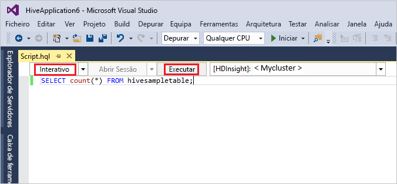

Para criar e executar uma solução do Hive:

1. No menu **Ficheiro**, selecione **Novo** e, em seguida, selecione **Projeto**.
2. No painel da esquerda, selecione **HDInsight**. No painel do meio, selecione **Aplicação do Hive**. Introduza as propriedades e, em seguida, selecione **OK**.
   
    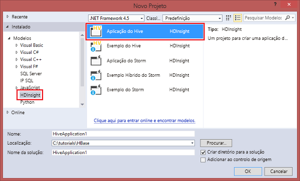
3. No **Explorador de Soluções**, faça duplo clique em **Script.hql** para abrir o script.
4. Introduza as consultas do Hive e submeta. (Consulte o passo 3 e 4 acima)  


## <a name="run-hive-queries"></a>Executar consultas do Hive

O [Apache Hive](hdinsight-use-hive.md) é o componente mais popular utilizado no HDInsight. Existem várias formas de executar tarefas do Hive no HDInsight. Neste tutorial, vai utilizar a vista Ambari Hive do portal. Para conhecer outros métodos de submissão de tarefas do Hive, consulte [Utilizar o Hive no HDInsight](hdinsight-use-hive.md).

1. Para abrir o Ambari, a partir da captura de ecrã anterior, selecione **Dashboard de Clusters**.  Também pode procurar em **https://&lt;ClusterName>.azurehdinsight.net**, onde &lt;ClusterName> é o cluster que criou na secção anterior.

    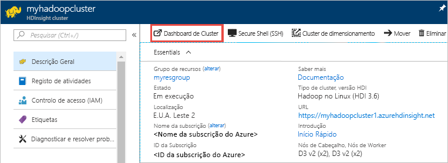

2. Introduza o nome de utilizador e a palavra-passe do Hadoop que especificou ao criar o cluster. O nome de utilizador predefinido é **admin**.

3. Abra a **Vista do Hive** conforme mostrado na captura de ecrã seguinte:
   
    

4. No separador **CONSULTAS**, cole as seguintes declarações HiveQL na folha de cálculo:
   
        SHOW TABLES;

    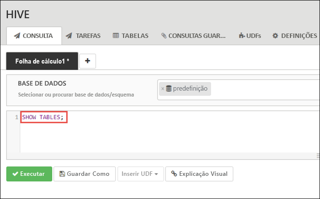
   
   > [!NOTE]
   > O Hive requer a utilização do ponto e vírgula.       
   > 
   > 

5. Selecione **Executar**. O separador **RESULTADOS** aparece por baixo do separador **CONSULTA** e apresenta informações sobre a tarefa. 
   
    Assim que a consulta estiver concluída, o separador **CONSULTA** apresenta os resultados da operação. Deverá ver uma tabela denomizada **hivesampletable**. Esta tabela do Hive de exemplo inclui todos os clusters do HDInsight.
   
    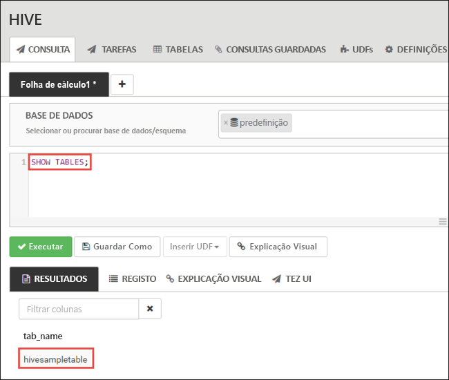

6. Repita os passos 4 e 5 para executar a seguinte consulta:
   
        SELECT * FROM hivesampletable;
   
7. Também pode guardar os resultados da consulta. Selecione o botão de menu à direita e especifique se quer transferir os resultados como um ficheiro CSV ou armazená-los na conta de armazenamento associada ao cluster.

    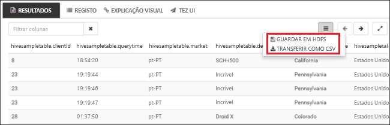

Depois de concluir uma tarefa deo Hive, pode [exportar os resultados para a SQL Database do Azure ou a base de dados do SQL Server](apache-hadoop-use-sqoop-mac-linux.md). Do mesmo modo, pode [visualizar os resultados com o Excel](apache-hadoop-connect-excel-power-query.md). Para obter mais informações sobre como utilizar o Hive no HDInsight, consulte [Utilizar o Hive e o HiveQL com o Hadoop no HDInsight para analisar um ficheiro Apache log4j de exemplo](hdinsight-use-hive.md).

## <a name="troubleshoot"></a>Resolução de problemas

Caso se depare com problemas com a criação de clusters do HDInsight, veja [aceder aos requisitos de controlo](../hdinsight-administer-use-portal-linux.md#create-clusters).

## <a name="clean-up-resources"></a>Limpar recursos
Depois de concluir o artigo, pode achar conveniente eliminar o cluster. Com o HDInsight, os dados são armazenados no Storage do Azure, pelo que pode eliminar um cluster em segurança quando este não está a ser utilizado. Também lhe é cobrado o valor de um cluster do HDInsight mesmo quando não o está a utilizar. Uma vez que os custos do cluster são muito superiores aos custos do armazenamento, faz sentido do ponto de vista económico eliminar os clusters quando não estiverem a ser utilizados. 

> [!NOTE]
> Se avançar *imediatamente* para o tutorial seguinte para saber como executar operações de ETL com o Hadoop no HDInsight, é recomendado que mantenha o cluster em execução. Isto porque tem de voltar a criar um cluster do Hadoop no tutorial. No entanto, se não avançar já para o tutorial seguinte, tem de eliminar o cluster agora.
> 
> 

**Para eliminar o cluster e/ou a conta de armazenamento predefinida**

1. Volte ao separador do browser onde tem o portal do Azure. Deverá estar na página de descrição geral do cluster. Se apenas quiser eliminar o cluster, mas quiser manter a conta de armazenamento predefinida, selecione **Eliminar**.

    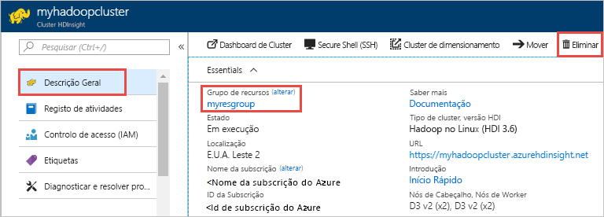

2. Se quiser eliminar o cluster e a conta de armazenamento predefinida, selecione o nome do grupo de recursos (realçado na captura de ecrã anterior) para abrir a página do grupo de recursos.

3. Selecione **Eliminar grupo de recursos** para eliminar o grupo de recursos, o qual contém o cluster e a conta de armazenamento predefinida. Tenha em atenção que a eliminação do grupo de recursos elimina a conta de armazenamento. Se pretender manter a conta do Storage, opte por eliminar apenas o cluster.

## <a name="next-steps"></a>Passos seguintes
Neste artigo, aprendeu a criar um cluster do HDInsight baseado em Linux com um modelo do Resource Manager, bem como a realizar consultas básicas do Hive. No artigo seguinte, vai aprender a realizar uma operação de ETL (extração, transformação e carregamento) com o Hadoop no HDInsight.

> [!div class="nextstepaction"]
>[Extrair, transformar e carregar dados com o Apache Hive no HDInsight](../hdinsight-analyze-flight-delay-data-linux.md)

Se estiver pronto para começar a trabalhar com os seus próprios dados e precisar de saber mais sobre a forma como o HDInsight armazena os dados ou como carregar dados para o HDInsight, consulte os seguintes artigos:

* Para obter informações sobre como o HDInsight utiliza o Armazenamento do Azure, consulte [Utilizar o Armazenamento do Azure com o HDInsight](../hdinsight-hadoop-use-blob-storage.md).
* Para obter informações sobre como criar um cluster do HDInsight com o Armazenamento do Data Lake, veja [Início Rápido: Configurar clusters no HDInsight](../../storage/data-lake-storage/quickstart-create-connect-hdi-cluster.md)
* Para obter informações sobre como carregar dados para o HDInsight, veja [Upload data to HDInsight](../hdinsight-upload-data.md) (Carregar dados para o HDInsight).

Saiba mais sobre como analisar os dados com o HDInsight, veja os seguintes artigos:

* Para saber mais sobre como utilizar o Hive com o HDInsight, incluindo como executar consultas do Hive a partir do Visual Studio, veja [Use Hive with HDInsight](hdinsight-use-hive.md) (Utilizar o Hive com o HDInsight).
* Para saber mais sobre o Pig, uma linguagem utilizada para transformar dados, veja [Use Pig with HDInsight](hdinsight-use-pig.md) (Utilizar o Pig com o HDInsight).
* Para saber mais sobre o MapReduce, uma forma de escrever programas que processam dados no Hadoop, veja [Use MapReduce with HDInsight](hdinsight-use-mapreduce.md) (Utilizar o MapReduce com o HDInsight).
* Para saber mais sobre como utilizar as Ferramentas do HDInsight para o Visual Studio para analisar dados no HDInsight, consulte [Começar a utilizar as ferramentas Hadoop do Visual Studio para o HDInsight](apache-hadoop-visual-studio-tools-get-started.md).
* Para saber mais sobre como utilizar as Ferramentas do HDInsight para o VSCode para analisar dados no HDInsight, consulte [Utilizar as Ferramentas do HDInsight para o Visual Studio Code](../hdinsight-for-vscode.md).


Se gostaria de saber mais sobre como criar ou gerir um cluster do HDInsight, consulte os seguintes artigos:

* Para saber mais sobre a gestão do seu cluster do HDInsight baseado em Linux, consulte [Gerir clusters do HDInsight com o Ambari](../hdinsight-hadoop-manage-ambari.md).
* Para saber mais sobre as opções que pode selecionar ao criar um cluster do HDInsight, consulte [Criar HDInsight no Linux utilizando opções personalizadas](../hdinsight-hadoop-provision-linux-clusters.md).


[1]: ../HDInsight/apache-hadoop-visual-studio-tools-get-started.md

[hdinsight-provision]: hdinsight-provision-linux-clusters.md
[hdinsight-upload-data]: hdinsight-upload-data.md
[hdinsight-use-hive]: hdinsight-use-hive.md
[hdinsight-use-pig]: hdinsight-use-pig.md


