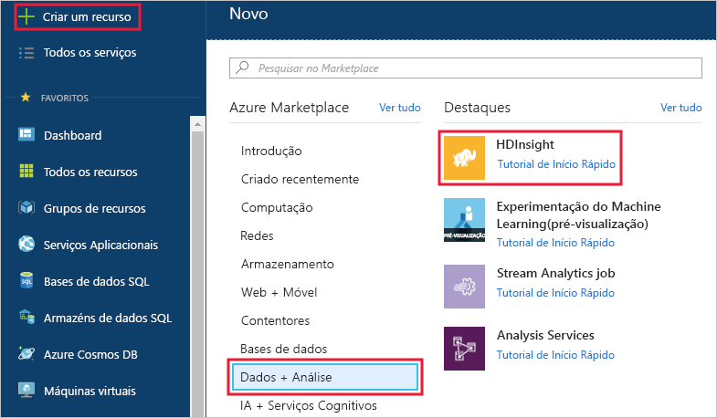
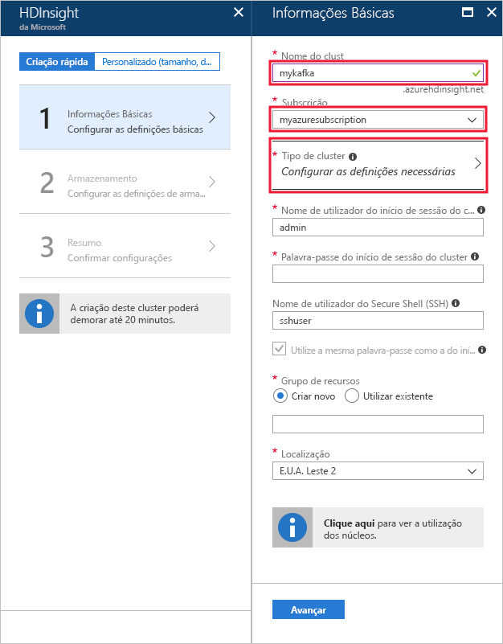
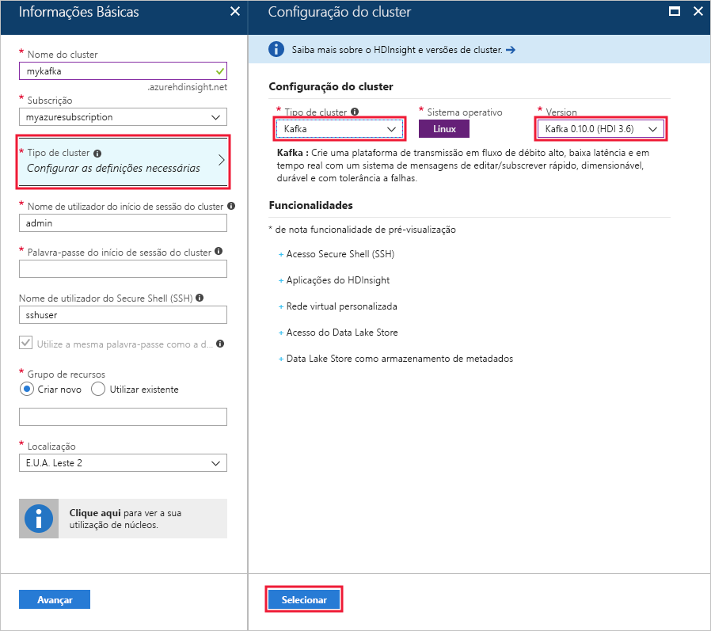
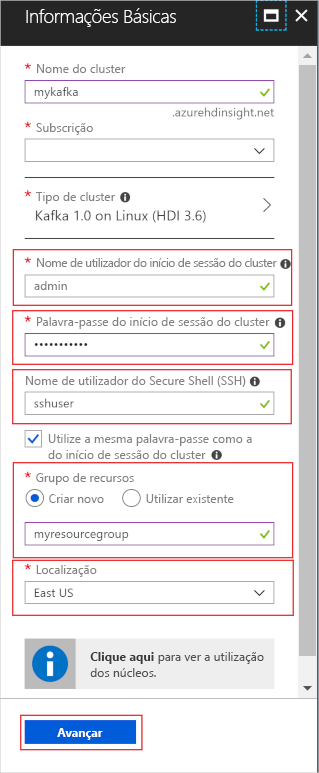
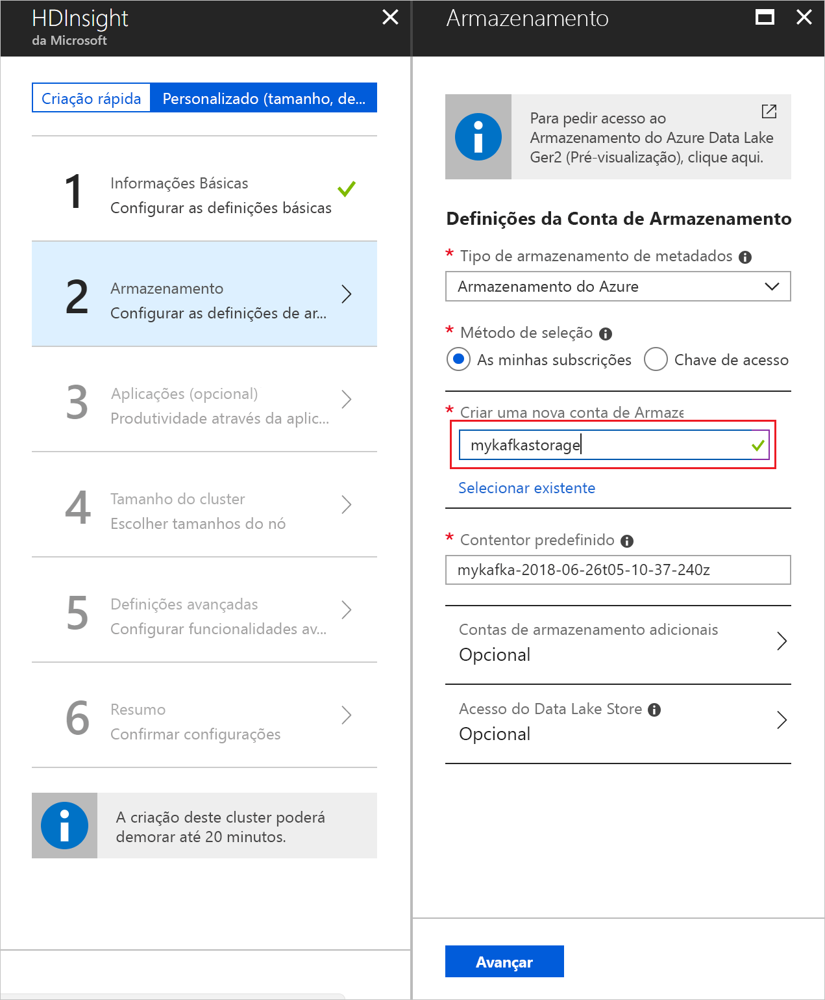
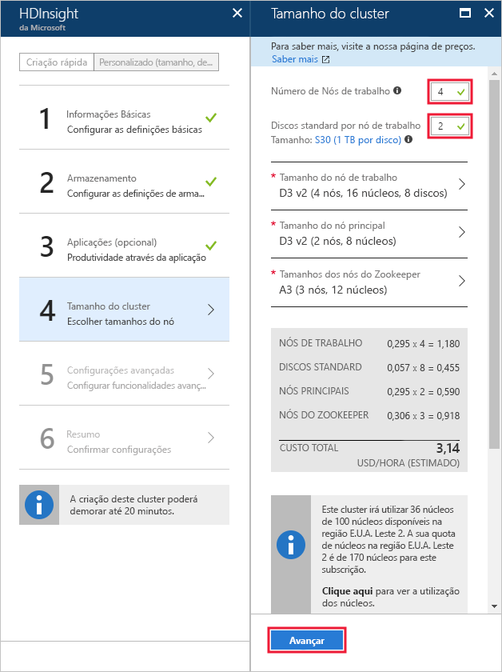
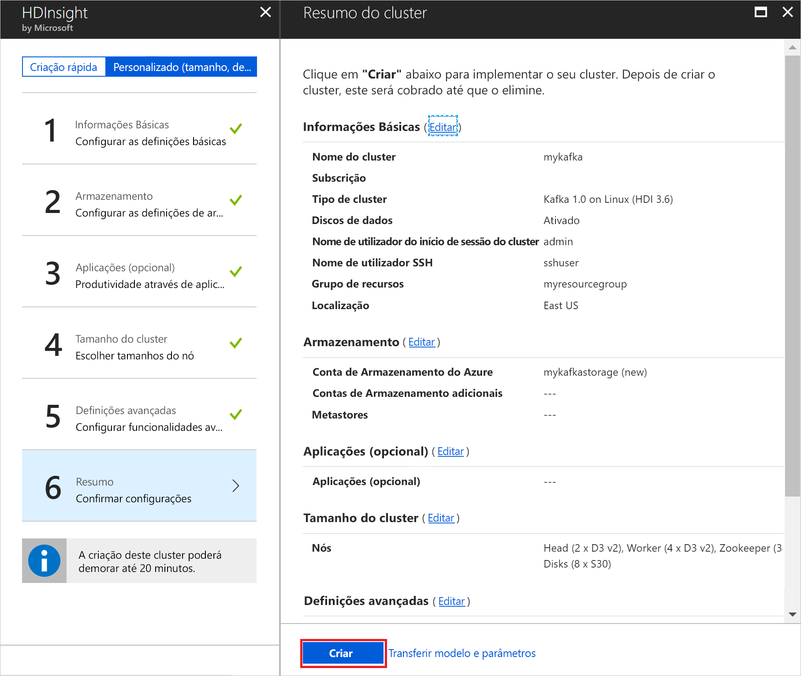

# <a name="quickstart-create-a-kafka-on-hdinsight-cluster"></a>Guia de Início Rápido: Criar um Kafka num cluster do HDInsight

O Kafka é uma plataforma open source de transmissão em fluxo distribuída. É frequentemente utilizado como mediador de mensagens, uma vez que fornece funcionalidades semelhantes a uma fila de mensagens de publicação-subscrição. 

Neste início rápido, vai aprender a criar um cluster do [Apache Kafka](https://kafka.apache.org) com o portal do Azure. Também vai saber como utilizar utilitários incluídos para enviar e receber mensagens com o Kafka.

[!INCLUDE [delete-cluster-warning](../../../includes/hdinsight-delete-cluster-warning.md)]

> [!IMPORTANT]
> Só os recursos dentro da mesma rede virtual podem aceder à API Kafka. Neste guia de início rápido, irá aceder ao cluster diretamente através de SSH. Para ligar outros serviços, redes ou máquinas virtuais ao Kafka, tem primeiro de criar uma rede virtual e, em seguida, criar os recursos dentro da rede.
>
> Para obter mais informações, veja o documento [Ligar ao Kafka com uma rede virtual](apache-kafka-connect-vpn-gateway.md).

## <a name="prerequisites"></a>Pré-requisitos

* Uma subscrição do Azure. Se não tiver uma subscrição do Azure, crie uma [conta gratuita](https://azure.microsoft.com/free/?WT.mc_id=A261C142F) antes de começar.

* Um cliente SSH. Os passos neste documento utilizam SSH para se ligar ao cluster.

    O comando `ssh` é fornecido por predefinição nos sistemas Linux, Unix e macOS. No Windows 10, utilize um dos seguintes métodos para instalar o comando `ssh`:

    * Utilize o [Azure Cloud Shell](https://docs.microsoft.com/azure/cloud-shell/quickstart). O cloud shell fornece o comando `ssh` e pode ser configurado para utilizar o Bash ou o PowerShell como ambiente de shell.

    * [Instale o Subsistema Windows para Linux](https://docs.microsoft.com/windows/wsl/install-win10). As distribuições de Linux disponíveis na Microsoft Store fornecem o comando `ssh`.

    > [!IMPORTANT]
    > Os passos neste documento pressupõem que está a utilizar um dos clientes SSH mencionados acima. Se estiver a utilizar outro cliente SSH e encontrar problemas, consulte a documentação do seu cliente SSH.
    >
    > Para obter mais informações, veja o documento [Utilizar SSH com o HDInsight](../hdinsight-hadoop-linux-use-ssh-unix.md).

## <a name="create-a-kafka-cluster"></a>Criar um cluster Kafka

Utilize os seguintes passos para criar um Kafka no cluster HDInsight:

1. No [portal do Azure](https://portal.azure.com), selecione **+ Criar um recurso**, **Dados + Análise** e, em seguida, selecione **HDInsight**.
   
    

2. Em **Informações Básicas**, introduza ou selecione as seguintes informações:

    | Definição | Valor |
    | --- | --- |
    | Nome do Cluster | Um nome exclusivo para o cluster do HDInsight. |
    | Subscrição | Selecione a sua subscrição. |
    
    Selecione __Tipo de Cluster__ para apresentar a **Configuração do Cluster**.

    

3. Em __Configuração do Cluster__, selecione os seguintes valores:

    | Definição | Valor |
    | --- | --- |
    | Tipo de Cluster | Kafka |
    | Versão | Kafka 0.10.0 (HDI 3.6) |

    Utilize o botão **Selecionar** para guardar as definições do tipo de cluster e regresse a __Informações Básicas__.

    

4. Em __Informações Básicas__, introduza ou selecione as seguintes informações:

    | Definição | Valor |
    | --- | --- |
    | Nome de utilizador de início de sessão do cluster | O nome de início de sessão ao aceder a serviços Web ou a APIs REST alojadas no cluster. Mantenha o valor predefinido (administrador). |
    | Palavra-passe de início de sessão do cluster | A palavra-passe de início de sessão ao aceder a serviços Web ou a APIs REST alojadas no cluster. |
    | Nome de utilizador de Secure Shell (SSH) | O início de sessão utilizado ao aceder ao cluster através de SSH. Por predefinição, a palavra-passe é igual à palavra-passe de início de sessão do cluster. |
    | Grupo de Recursos | O grupo de recursos em que o cluster é criado. |
    | Localização | A região do Azure em que o cluster é criado. |

    > [!TIP]
    > Cada região do Azure (localização) fornece _domínios de falha_. Um domínio de falha é um agrupamento lógico de hardware subjacente num centro de dados do Azure. Cada domínio de falha partilha um comutador de rede e uma fonte de alimentação. As máquinas virtuais e os discos geridos que implementam os nós num cluster HDInsight são distribuídos por esses domínios de falha. Esta arquitetura limita o possível impacto de falhas físicas de hardware.
    >
    > Para obter uma elevada disponibilidade de dados, selecione uma região (localização) que contenha __três domínios de falha__. Para obter informações sobre o número de domínios de falha numa região, consulte o documento [Disponibilidade das máquinas virtuais Linux](../../virtual-machines/windows/manage-availability.md#use-managed-disks-for-vms-in-an-availability-set).

    

    Utilize o botão __Seguinte__ para concluir a configuração básica.

5. Em **Armazenamento**, selecione ou crie uma Conta de armazenamento. Para seguir os passos neste documento, deixe os outros campos com os valores predefinidos. Utilize o botão __Seguinte__ para guardar a configuração do armazenamento.

    

6. Em __Aplicações (opcional)__, selecione __Seguinte__ para continuar com as predefinições.

7. Em __Tamanho do cluster__, selecione __Seguinte__ para continuar com as predefinições.

    > [!IMPORTANT]
    > Para garantir a disponibilidade do Kafka no HDInsight, a entrada do __número de nós de trabalho__ tem de ser definida como 3 ou superior. O valor predefinido é 4.
    
    > [!TIP]
    > A entrada **discos por nó de trabalho** configura a escalabilidade do Kafka no HDInsight. O Kafka no HDInsight utiliza o disco local das máquinas virtuais no cluster para armazenar dados. O Kafka recebe um fluxo intensivo de dados de E/S, pelo que o [Azure Managed Disks](../../virtual-machines/windows/managed-disks-overview.md) é utilizado para garantir um elevado débito e uma maior capacidade de armazenamento por nó. O tipo de disco gerido pode ser __Standard__ (HDD) ou __Premium__ (SSD). O tipo de disco depende do tamanho da VM utilizado pelos nós de trabalho (mediadores do Kafka). Os discos Premium são utilizados automaticamente com as VMs das séries DS e GS. Todos os outros tipos de VM utilizam discos Standard.

    

8. Em __Definições avançadas__, selecione __Seguinte__ para continuar com as predefinições.

9. Em **Resumo**, reveja a configuração do cluster. Utilize as ligações __Editar__ para alterar quaisquer definições que estejam incorretas. Por fim, utilize o botão the__Create__ para criar o cluster.
   
    
   
    > [!NOTE]
    > A criação do cluster pode demorar até 20 minutos.

## <a name="connect-to-the-cluster"></a>Ligar ao cluster

1. Para ligar ao nó principal primário do cluster do Kafka, utilize o seguinte comando. Substitua `sshuser` pelo nome de utilizador SSH. Substitua `mykafka` pelo nome do seu cluster do Kafka

    ```bash
    ssh sshuser@mykafka-ssh.azurehdinsight.net
    ```

2. Quando se liga pela primeira vez ao cluster, o cliente SSH pode apresentar um aviso a indicar que não é possível estabelecer a autenticidade do anfitrião. Quando lhe for pedido, escreva __sim__ e, em seguida, prima __Enter__ para adicionar o anfitrião à lista de servidores fidedignos do seu cliente SSH.

3. Quando lhe for pedido, introduza a palavra-passe do utilizador SSH.

Quando estiver ligado, verá informações semelhantes ao texto seguinte:

```text
Authorized uses only. All activity may be monitored and reported.
Welcome to Ubuntu 16.04.4 LTS (GNU/Linux 4.13.0-1011-azure x86_64)

 * Documentation:  https://help.ubuntu.com
 * Management:     https://landscape.canonical.com
 * Support:        https://ubuntu.com/advantage

  Get cloud support with Ubuntu Advantage Cloud Guest:
    http://www.ubuntu.com/business/services/cloud

83 packages can be updated.
37 updates are security updates.


Welcome to Kafka on HDInsight.

Last login: Thu Mar 29 13:25:27 2018 from 108.252.109.241
ssuhuser@hn0-mykafk:~$
```

## <a id="getkafkainfo"></a>Obter as informações dos anfitriões Zookeeper e Mediador

Ao trabalhar com o Kafka, tem de conhecer os anfitriões *Zookeeper* e *Mediador*. Estes anfitriões são utilizados com a API Kafka e com muitos dos utilitários que são enviados com o Kafka.

Nesta secção, irá obter as informações do anfitrião da API REST do Ambari no cluster.

1. A partir da ligação SSH ao cluster, utilize o comando seguinte para instalar o utilitário `jq`. Este utilitário é utilizado para analisar documentos JSON e é útil para obter as informações do anfitrião:
   
    ```bash
    sudo apt -y install jq
    ```

2. Para definir uma variável de ambiente para o nome do cluster, utilize o comando seguinte:

    ```bash
    read -p "Enter the Kafka on HDInsight cluster name: " CLUSTERNAME
    ```

    Quando lhe for pedido, introduza o nome do cluster do Kafka.

3. Para definir uma variável de ambiente com as informações do anfitrião Zookeeper, utilize o comando seguinte:
    
    ```bash
    export KAFKAZKHOSTS=`curl -sS -u admin -G http://headnodehost:8080/api/v1/clusters/$CLUSTERNAME/services/ZOOKEEPER/components/ZOOKEEPER_SERVER | jq -r '["\(.host_components[].HostRoles.host_name):2181"] | join(",")' | cut -d',' -f1,2`
    ```

    > [!TIP]
    > Este comando consulta diretamente o serviço do Ambari no nó principal do cluster. Também pode aceder ao Ambari através do endereço público de `https://$CLUSTERNAME.azurehdinsight.net:80/`. Algumas configurações de rede podem impedir o acesso ao endereço público. Por exemplo, ao utilizar Grupos de Segurança de Rede (NSG) para restringir o acesso ao HDInsight numa rede virtual.

    Quando lhe for pedido, introduza a palavra-passe da conta do início de sessão do cluster (não a conta SSH).

    > [!NOTE]
    > Este comando obtém todos os anfitriões do Zookeeper e devolve apenas as primeiras duas entradas. Isto acontece porque é desejável que exista alguma redundância para o caso de um anfitrião estar inacessível.

4. Para verificar se a variável de ambiente está definida corretamente, utilize o comando seguinte:

    ```bash
     echo '$KAFKAZKHOSTS='$KAFKAZKHOSTS
    ```

    Este comando devolve informações semelhantes ao texto seguinte:

    `zk0-kafka.eahjefxxp1netdbyklgqj5y1ud.ex.internal.cloudapp.net:2181,zk2-kafka.eahjefxxp1netdbyklgqj5y1ud.ex.internal.cloudapp.net:2181`

5. Para definir uma variável de ambiente com as informações do anfitrião Zookeeper e do mediador, utilize o comando seguinte:

    ```bash
    export KAFKABROKERS=`curl -sS -u admin -G http://headnodehost:8080/api/v1/clusters/$CLUSTERNAME/services/KAFKA/components/KAFKA_BROKER | jq -r '["\(.host_components[].HostRoles.host_name):9092"] | join(",")' | cut -d',' -f1,2`
    ```

    Quando lhe for pedido, introduza a palavra-passe da conta do início de sessão do cluster (não a conta SSH).

6. Para verificar se a variável de ambiente está definida corretamente, utilize o comando seguinte:

    ```bash   
    echo '$KAFKABROKERS='$KAFKABROKERS
    ```

    Este comando devolve informações semelhantes ao texto seguinte:
   
    `wn1-kafka.eahjefxxp1netdbyklgqj5y1ud.cx.internal.cloudapp.net:9092,wn0-kafka.eahjefxxp1netdbyklgqj5y1ud.cx.internal.cloudapp.net:9092`

## <a name="manage-kafka-topics"></a>Gerir tópicos do Kafka

O Kafka armazena fluxos de dados em *tópicos*. Pode utilizar o utilitário `kafka-topics.sh` para gerir os tópicos.

* **Para criar um tópico**, utilize o seguinte comando na ligação SSH:

    ```bash
    /usr/hdp/current/kafka-broker/bin/kafka-topics.sh --create --replication-factor 3 --partitions 8 --topic test --zookeeper $KAFKAZKHOSTS
    ```

    Este comando liga ao Zookeeper com as informações do anfitrião armazenadas em `$KAFKAZKHOSTS`. Em seguida, cria um tópico do Kafka denominado **teste**. 

    * Os dados armazenados neste tópico estão particionados em oito partições.

    * Cada partição é replicada em três nós de trabalho no cluster.

        > [!IMPORTANT]
        > Se tiver criado o cluster numa região do Azure que fornece três domínios de falha, utilize um fator de replicação de 3. Caso contrário, utilize um fator de replicação de 4.
        
        Nas regiões com três domínios de falha, um fator de replicação de 3 permite que as réplicas sejam distribuídas pelos domínios de falha. Nas regiões com dois domínios de falha, um fator de replicação de 4 distribui as réplicas uniformemente pelos domínios.
        
        Para obter informações sobre o número de domínios de falha numa região, consulte o documento [Disponibilidade das máquinas virtuais Linux](../../virtual-machines/windows/manage-availability.md#use-managed-disks-for-vms-in-an-availability-set).

        > [!IMPORTANT] 
        > O Kafka não está ciente dos domínios de falha do Azure. Durante a criação de réplicas de partição para tópicos, poderá não distribuir as réplicas corretamente para fins de elevada disponibilidade.

        Para garantir a elevada disponibilidade, utilize a [ferramenta de rebalanceamento de partições de Kafka](https://github.com/hdinsight/hdinsight-kafka-tools). Esta ferramenta deve ser executada a partir de uma ligação SSH para o nó principal do cluster do Kafka.

        Para garantir a maior disponibilidade dos seus dados do Kafka, deve reequilibrar as réplicas de partições do tópico ao:

        * Criar um novo tópico ou partição

        * Aumentar verticalmente um cluster

* **Para listar os tópicos**, utilize o seguinte comando:

    ```bash
    /usr/hdp/current/kafka-broker/bin/kafka-topics.sh --list --zookeeper $KAFKAZKHOSTS
    ```

    Este comando apresenta uma lista de tópicos disponíveis no cluster do Kafka.

* **Para eliminar um tópico**, utilize o seguinte comando:

    ```bash
    /usr/hdp/current/kafka-broker/bin/kafka-topics.sh --delete --topic topicname --zookeeper $KAFKAZKHOSTS
    ```

    Este comando elimina o tópico com o nome `topicname`.

    > [!WARNING]
    > Se eliminar o tópico `test` criado anteriormente, tem de recriá-lo. O mesmo é utilizado por passos mais adiante neste documento.

Para obter mais informações sobre os comandos disponíveis com o utilitário `kafka-topics.sh`, utilize o seguinte comando:

```bash
/usr/hdp/current/kafka-broker/bin/kafka-topics.sh
```

## <a name="produce-and-consume-records"></a>Produzir e consumir registos

O Kafka armazena *registos* nos tópicos. Os registos são produzidos por *produtores* e consumidos por *consumidores*. Os produtores e consumidores comunicam com o serviço do *mediador do Kafka*. Cada nó de trabalho no cluster do HDInsight é um anfitrião do mediador do Kafka.

Utilize os seguintes passos para armazenar os registos no tópico de teste criado anteriormente e, em seguida, leia-os através de um consumidor:

1. Para escrever registos no tópico, utilize o utilitário `kafka-console-producer.sh` a partir da ligação SSH:
   
    ```bash
    /usr/hdp/current/kafka-broker/bin/kafka-console-producer.sh --broker-list $KAFKABROKERS --topic test
    ```
   
    Após este comando, chega a uma linha vazia.

2. Introduza uma mensagem de texto na linha vazia e carregue em Enter. Introduza algumas mensagens desta forma e, em seguida, utilize **Ctrl + C** para regressar à linha de comandos normal. Cada linha é enviada como um registo separado para o tópico do Kafka.

3. Para ler registos do tópico, utilize o utilitário `kafka-console-consumer.sh` a partir da ligação SSH:
   
    ```bash
    /usr/hdp/current/kafka-broker/bin/kafka-console-consumer.sh --bootstrap-server $KAFKABROKERS --topic test --from-beginning
    ```
   
    Este comando obtém os registos do tópico e apresenta-os. A utilização de `--from-beginning` indica ao consumidor para iniciar a partir do início da transmissão em fluxo, para que todos os registos sejam obtidos.

    > [!NOTE]
    > Se estiver a utilizar uma versão antiga do Kafka, substitua `--bootstrap-server $KAFKABROKERS` por `--zookeeper $KAFKAZKHOSTS`.

4. Utilize __Ctrl + C__ para parar o consumidor.

Também podem criar programaticamente produtores e consumidores. Para obter um exemplo de utilização desta API, veja o documento [Produtor Kafka e a API de Consumidor com o HDInsight](apache-kafka-producer-consumer-api.md).

## <a name="clean-up-resources"></a>Limpar recursos

Para limpar os recursos criados por este início rápido, pode eliminar o grupo de recursos. Ao eliminar o grupo de recursos também elimina o cluster do HDInsight associado e quaisquer outros recursos associados ao grupo de recursos.

Para remover o grupo de recursos através do Portal do Azure:

1. No Portal do Azure, expanda o menu no lado esquerdo para abrir o menu de serviços e, em seguida, escolha __Grupos de Recursos__, para apresentar a lista dos seus grupos de recursos.
2. Encontre o grupo de recursos a eliminar e, em seguida, clique com o botão direito do rato em __Mais__ (...) no lado direito da lista.
3. Selecione __Eliminar grupo de recursos__ e, em seguida, confirme.

> [!WARNING]
> A faturação do cluster do HDInsight tem início quando o cluster é criado e termina quando é eliminado. A faturação é rateada por minuto, pelo que deve sempre eliminar o cluster quando deixar de ser utilizado.
> 
> Eliminar um cluster do Kafka no HDInsight elimina quaisquer dados armazenados no Kafka.

## <a name="next-steps"></a>Passos seguintes

> [!div class="nextstepaction"]
> [Utilizar o Apache Spark com o Kafka](../hdinsight-apache-kafka-spark-structured-streaming.md)

