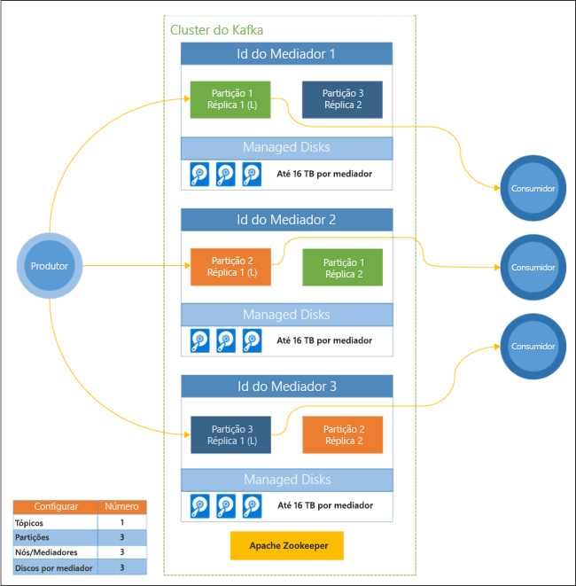

# Introdução ao Apache Kafka no HDInsight

O [Apache Kafka](https://kafka.apache.org) é uma plataforma de transmissão em fluxo distribuída de código aberto que pode ser utilizada para criar aplicações e pipelines de dados de transmissão em fluxo em tempo real. O Kafka também fornece a funcionalidade de mediador de mensagem semelhante a uma fila de mensagens, onde pode publicar e subscrever fluxos de dados nomeados. O Kafka no HDInsight fornece um serviço gerido, altamente escalável e disponível na cloud do Microsoft Azure.

## Porquê utilizar o Kaftka no HDInsight?

O Kafka no HDInsight oferece as funcionalidades :

* __99% de tempo de atividade do Contrato de Nível de Serviço (SLA) no Kafka__: para obter mais informações, veja o documento [Informações do SLA para o HDInsight](https://azure.microsoft.com/support/legal/sla/hdinsight/v1_0/).

* __Tolerância a falhas e conhecimento de bastidores__: o Kafka foi concebido com uma visão uni-dimensional de um bastidor que funciona bem em alguns ambientes. No entanto, em ambientes como o Azure, um bastidor é separado em duas dimensões - Domínios de Atualização (UDs) e Domínios de Falha (FDs). A Microsoft fornece ferramentas que garantem o reequilíbrio de réplicas e partições do Kafka em UDs e FDs. 

    Para obter mais informações, consulte [Elevada disponibilidade com o Kafka no HDInsight](apache-kafka-high-availability.md).

* **Integração com os Azure Managed Disks**: os discos geridos permitem uma maior escala e taxa de débito para os discos utilizados pelo Kafka no HDInsight, até 16 TB por nó no cluster.

    Para obter mais informações sobre como configurar os discos geridos com o Kafka no HDInsight, consulte [Increase scalability of Kafka on HDInsight](apache-kafka-scalability.md) (Aumentar a escalabilidade do Kafka no HDInsight).

    Para obter mais informações sobre os discos geridos, consulte [Azure Managed Disks](../../virtual-machines/windows/managed-disks-overview.md).

* **Alertas, monitorização e manutenção preditiva**: o Log Analytics do Azure pode ser utilizado para monitorizar o Kafka no HDInsight. O Log Analytics apresenta informações ao nível de máquinas virtuais, como métricas de discos e NIC e métricas de JMX do Kafka.

    Para obter mais informações, consulte [Analisar registos para o Kafka no HDInsight](apache-kafka-log-analytics-operations-management.md).

* **Replicação de dados do Kafka**: o Kafka proporciona o utilitário MirrorMaker, que replica os dados entre clusters do Kafka.

    Para obter mais informações sobre como utilizar o MirrorMaker, consulte [Replicar tópicos do Kafka com o Kafka no HDInsight](apache-kafka-mirroring.md).

* **Dimensionamento de clusters**: o HDInsight permite-lhe alterar o número de nós de trabalhadores (que alojam o mediador Kafka) após a criação do cluster. Aumente verticalmente um cluster à medida que as cargas de trabalho aumentam ou reduza verticalmente para diminuir os custos. O escalonamento pode ser executado a partir do portal do Azure, do Azure PowerShell e de outras interfaces de gestão do Azure. Para o Kafka, deve reequilibrar as réplicas de partições após as operações de dimensionamento. Reequilibrar partições permite ao Kafka tirar partido do novo número de nós de trabalho.

    Para obter mais informações, consulte [Elevada disponibilidade com o Kafka no HDInsight](apache-kafka-high-availability.md).

* **Padrão de mensagem de publicação-subscrição**: o Kafka fornece uma API de Produtor para publicar registos num tópico do Kafka. A API de Consumidor é utilizada ao subscrever um tópico.

    Para obter mais informações, consulte [Introdução ao Kafka no HDInsight](apache-kafka-get-started.md).

* **Processamento de fluxo**: o Kafka é muitas vezes utilizado com o Apache Storm ou Spark para processamento de fluxo em tempo real. O Kafka 0.10.0.0 (versão 3.5 e 3.6 do HDInsight) introduziu uma API de transmissão em fluxo que lhe permite criar soluções de transmissão em fluxo, sem precisar do Storm ou do Spark.

    Para obter mais informações, consulte [Introdução ao Kafka no HDInsight](apache-kafka-get-started.md).

* **Escala horizontal**: transmissões em fluxo de partições do Kafka nos nós no cluster do HDInsight. Os processos de consumidor podem estar associados a partições individuais para fornecer balanceamento de carga ao consumir registos.

    Para obter mais informações, consulte [Introdução ao Kafka no HDInsight](apache-kafka-get-started.md).

* **Entrega por ordem**: em cada partição, os registos são armazenados na transmissão em fluxo pela ordem em que foram recebidos. Ao associar um processo de consumidor por partição, pode garantir que os registos são processados por ordem.

    Para obter mais informações, consulte [Introdução ao Kafka no HDInsight](apache-kafka-get-started.md).

## Casos de utilização

* **Mensagens**: uma vez que suporta o padrão de mensagem de publicação-subscrição, o Kafka é frequentemente utilizado como um mediador de mensagem.

* **Controlo de atividades**: uma vez que o Kafka fornece os registos por ordem, pode ser utilizado para controlar e voltar a criar atividades. Por exemplo, ações do utilizador num site ou numa aplicação.

* **Agregação**: com o processamento de transmissão em fluxo, pode agregar informações a partir de várias transmissões em fluxo para combinar e centralizar as informações nos dados operacionais.

* **Transformação**: com o processamento de transmissão em fluxo, pode combinar e enriquecer os dados a partir de vários tópicos de entrada em um ou mais tópicos de saída.

## Arquitetura

Este diagrama mostra uma configuração do Kafka comum que utiliza grupos de consumidores, particionamento e replicação para oferecer leitura paralela de eventos com tolerância a falhas. O Apache ZooKeeper foi concebido para transações simultâneas, resilientes e de baixa latência, pois gere o estado do cluster do Kafka. O Kafka armazena registos em *tópicos*. Os registos são produzidos por *produtores* e consumidos por *consumidores*. Os produtores obtêm registos de *mediadores* Kafka. Cada nó de trabalho no cluster HDInsight é um mediador Kafka. É criada uma partição para cada consumidor, permitindo o processamento paralelo dos dados de transmissão em fluxo. A replicação é utilizada para espalhar as partições pelos nós, protegendo contra interrupções do nó (mediador). A partição assinalada com *(L)* é a partição líder dessa partição específica. O tráfico do produtor é encaminhado para o líder de cada nó mediante a utilização do estado gerido pelo ZooKeeper.

Cada mediador Kafka utiliza Managed Disks do Azure. O número de discos é definido pelo utilizador e pode oferecer até 16 TB de armazenamento por mediador.

> [!IMPORTANT]
> O Kafka não tem conhecimento do hardware subjacente (bastidor) no datacenter do Azure. Para garantir o correto equilíbrio das partições no hardware subjacente, veja o documento [Configurar a elevada disponibilidade dos dados (Kafka)](apache-kafka-high-availability.md).

## Passos seguintes

Utilize as seguintes ligações para saber como utilizar o Apache Kafka no HDInsight:

* [Introdução ao Kafka no HDInsight](apache-kafka-get-started.md)

* [Utilizar MirrorMaker para criar uma réplica de Kafka no HDInsight](apache-kafka-mirroring.md)

* [Utilizar o Apache Storm com Kafka no HDInsight](../hdinsight-apache-storm-with-kafka.md)

* [Utilizar o Apache Spark com Kafka no HDInsight](../hdinsight-apache-spark-with-kafka.md)

* [Ligar ao Kafka através de uma Rede Virtual do Azure](apache-kafka-connect-vpn-gateway.md)