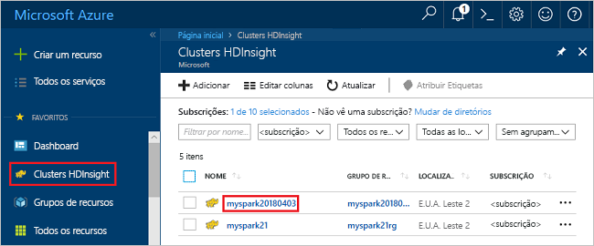
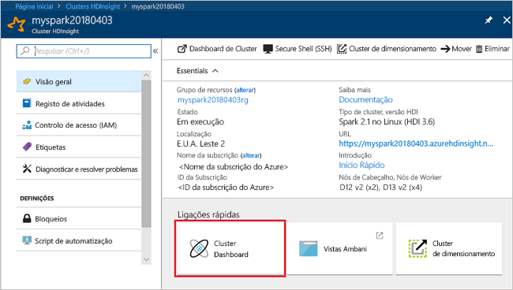
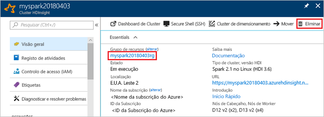

# <a name="quickstart-create-an-apache-spark-cluster-in-hdinsight-using-powershell"></a>Início rápido: Criar um cluster do Apache Spark no HDInsight com o PowerShell
Saiba como criar [Apache Spark](https://spark.apache.org/) cluster no Azure HDInsight e como executar consultas do Spark SQL relativamente [Apache Hive](https://hive.apache.org/) tabelas. O Apache Spark permite uma análise de dados e computação de clusters rápidas através do processamento dentro da memória. Para obter informações sobre o Spark no HDInsight, consulte [descrição geral: Apache Spark no HDInsight do Azure](apache-spark-overview.md).

Neste guia de início rápido, irá utilizar o Azure PowerShell para criar um cluster do Apache Spark no HDInsight. O cluster utiliza o Azure Storage Blob como a ferramenta de armazenamento de clusters. Para obter mais informações sobre como utilizar a geração 2 de armazenamento do Data Lake, veja [início rápido: Configurar clusters no HDInsight](../../storage/data-lake-storage/quickstart-create-connect-hdi-cluster.md).

> [!IMPORTANT]  
> A faturação dos clusters do HDInsight é rateada ao minuto, quer esteja a utilizá-los ou não. Confirme que elimina o cluster depois de o utilizar. Para obter mais informações, consulte a secção [Limpar recursos](#clean-up-resources) deste artigo.

Se não tiver uma subscrição do Azure, [crie uma conta gratuita](https://azure.microsoft.com/free/) antes de começar.

## <a name="create-an-hdinsight-spark-cluster"></a>Criar um cluster do Spark no HDInsight

Para criar um cluster no HDInsight, terá de criar, entre outros, os seguintes objetos e recursos do Azure:

- Um grupo de recursos do Azure. Um grupo de recursos do Azure é um contentor de recursos do Azure. 
- Uma conta de armazenamento do Azure ou o armazenamento do Azure Data Lake.  Cada cluster do HDInsight necessita de um armazenamento de dados dependente. Neste guia de início rápido, irá criar uma conta de armazenamento.
- Um cluster do HDInsight com diferentes tipos de cluster.  Neste guia de início rápido, irá criar um cluster do Apache Spark 2.3.

Irá utilizar um script do PowerShell para criar os recursos.  Quando executar o script, ser-lhe-á pedido para introduzir os seguintes valores:

|Parâmetro|Valor|
|------|------|
|Nome do grupo de recursos do Azure | Indique um nome exclusivo para o grupo de recursos.|
|Localização| Especifique a região do Azure, por exemplo "E.U.A. Central". |
|Nome predefinido da conta de armazenamento | Indique um nome único para a conta de armazenamento. |
|Nome do cluster | Indique um nome único para o cluster do Apache Spark no HDInsight.|
|Credenciais de início de sessão do cluster | Esta conta é utilizada para se ligar ao dashboard do cluster mais adiante no guia de início rápido.|
|Credenciais de utilizador SSH | Os clientes SSH podem ser utilizados para criar uma sessão de linha de comandos remota com os clusters do HDInsight.|


1. Clique em **Experimente** no canto superior direito do seguinte bloco de código para abrir o [Azure Cloud Shell](../../cloud-shell/overview.md) e siga as instruções para se ligar ao Azure.
2. Copie e cole o seguinte script do PowerShell no cloud shell. 

    ```azurepowershell-interactive
    ### Create a Spark 2.3 cluster in Azure HDInsight
        
    # Create the resource group
    $resourceGroupName = Read-Host -Prompt "Enter the resource group name"
    $location = Read-Host -Prompt "Enter the Azure region to create resources in, such as 'Central US'"
    New-AzureRmResourceGroup -Name $resourceGroupName -Location $location
    
    $defaultStorageAccountName = Read-Host -Prompt "Enter the default storage account name"
    
    # Create an Azure storae account and container
    New-AzureRmStorageAccount `
        -ResourceGroupName $resourceGroupName `
        -Name $defaultStorageAccountName `
        -Type Standard_LRS `
        -Location $location
    $defaultStorageAccountKey = (Get-AzureRmStorageAccountKey `
                                    -ResourceGroupName $resourceGroupName `
                                    -Name $defaultStorageAccountName)[0].Value
    $defaultStorageContext = New-AzureStorageContext `
                                    -StorageAccountName $defaultStorageAccountName `
                                    -StorageAccountKey $defaultStorageAccountKey
    
    # Create a Spark 2.3 cluster
    $clusterName = Read-Host -Prompt "Enter the name of the HDInsight cluster"
    # Cluster login is used to secure HTTPS services hosted on the cluster
    $httpCredential = Get-Credential -Message "Enter Cluster login credentials" -UserName "admin"
    # SSH user is used to remotely connect to the cluster using SSH clients
    $sshCredentials = Get-Credential -Message "Enter SSH user credentials"
    
    # Default cluster size (# of worker nodes), version, type, and OS
    $clusterSizeInNodes = "1"
    $clusterVersion = "3.6"
    $clusterType = "Spark"
    $clusterOS = "Linux"
    
    # Set the storage container name to the cluster name
    $defaultBlobContainerName = $clusterName
    
    # Create a blob container. This holds the default data store for the cluster.
    New-AzureStorageContainer `
        -Name $clusterName -Context $defaultStorageContext 
    
    $sparkConfig = New-Object "System.Collections.Generic.Dictionary``2[System.String,System.String]"
    $sparkConfig.Add("spark", "2.3")
    
    # Create the HDInsight cluster
    New-AzureRmHDInsightCluster `
        -ResourceGroupName $resourceGroupName `
        -ClusterName $clusterName `
        -Location $location `
        -ClusterSizeInNodes $clusterSizeInNodes `
        -ClusterType $clusterType `
        -OSType $clusterOS `
        -Version $clusterVersion `
        -ComponentVersion $sparkConfig `
        -HttpCredential $httpCredential `
        -DefaultStorageAccountName "$defaultStorageAccountName.blob.core.windows.net" `
        -DefaultStorageAccountKey $defaultStorageAccountKey `
        -DefaultStorageContainer $clusterName `
        -SshCredential $sshCredentials 
    
    Get-AzureRmHDInsightCluster -ResourceGroupName $resourceGroupName -ClusterName $clusterName
    ```
A criação do cluster demora cerca de 20 minutos. Tem de criar o cluster antes de poder avançar para a sessão seguinte.

Caso se depare com um problema ao criar clusters do HDInsight, estes poderão dever-se ao facto de não ter as permissões certas para o fazer. Para obter mais informações, veja [Access control requirements](../hdinsight-administer-use-portal-linux.md#create-clusters) (Requisitos do controlo de acesso).

## <a name="create-a-jupyter-notebook"></a>Criar um bloco de notas do Jupyter

[O bloco de notas do Jupyter](https://jupyter.org/) é um ambiente de bloco de notas interativo que suporta várias linguagens de programação. O bloco de notas permite-lhe interagir com os seus dados, combinar código com texto markdown e realizar visualizações simples. 

1. Abra o [Portal do Azure](https://portal.azure.com).
2. Selecione **Clusters do HDInsight** e, em seguida, selecione o cluster que criou.

    

3. No portal, selecione **Dashboards de cluster** e, em seguida, selecione **Jupyter Notebook**. Se lhe for pedido, introduza as credenciais de início de sessão do cluster.

   

4. Selecione **New (Novo)** > **PySpark** para criar um bloco de notas. 

   

   É criado e aberto um novo bloco de notas com o nome Untitled (Untitled.pynb).


## <a name="run-spark-sql-statements"></a>Executar instruções SQL do Spark

SQL (Structured Query Language) é a linguagem mais comum e mais utilizada para consultar e definir dados. O Spark SQL funciona como uma extensão do Apache Spark para o processamento de dados estruturados e utiliza a sintaxe familiar do SQL Server.

1. Verifique se o kernel está pronto. O kernel está pronto quando vir um círculo hollow junto ao nome do kernel no bloco de notas. O círculo sólido indica que o kernel está ocupado.

    

    Quando inicia o bloco de notas pela primeira vez, o kernel efetua algumas tarefas em segundo plano. Aguarde que o kernel esteja preparado. 
2. Cole o seguinte código numa célula vazia e, em seguida, prima **SHIFT + ENTER** para o executar. O comando lista as tabelas do Hive no cluster:

    ```PySpark
    %%sql
    SHOW TABLES
    ```
    Quando utiliza um Bloco de Notas do Jupyter com o seu cluster do HDInsight Spark, obtém um `sqlContext` predefinido que pode utilizar para executar consultas do Hive com o Spark SQL. `%%sql` indica ao Bloco de Notas do Jupyter que utilize o `sqlContext` predefinido para executar a consulta do Hive. A consulta devolve as primeiras dez linhas de uma tabela do Hive (**hivesampletable**) que vem em todos os clusters do HDInsight por predefinição. São necessários cerca de 30 segundos para receber os resultados. O resultado tem o seguinte aspeto: 

    

    Sempre que executar uma consulta no Jupyter, o título da janela do browser apresenta o estado **(Ocupado)** juntamente com o título do bloco de notas. Também vê um círculo sólido junto ao texto do **PySpark** no canto superior direito.
    
2. Execute outra consulta para ver os dados no `hivesampletable`.

    ```PySpark
    %%sql
    SELECT * FROM hivesampletable LIMIT 10
    ```
    
    O ecrã deve atualizar-se e mostrar o resultado da consulta.

    ")

2. No menu **File (Ficheiro)** do bloco de notas, selecione **Close and Halt (Fechar e Parar)**. Encerrar o bloco de notas liberta os recursos do cluster.

## <a name="clean-up-resources"></a>Limpar recursos
O HDInsight permite guardar os seus dados no Armazenamento do Azure ou no Armazenamento do Azure Data Lake, pelo que pode eliminar um cluster em segurança quando este não estiver a ser utilizado. Também lhe é cobrado o valor de um cluster do HDInsight mesmo quando não o está a utilizar. Uma vez que os custos do cluster são muito superiores aos custos do armazenamento, faz sentido do ponto de vista económico eliminar os clusters quando não estiverem a ser utilizados. Se tenciona trabalhar imediatamente no tutorial listado nos [Passos seguintes](#next-steps), convém manter o cluster.

Regresse ao portal do Azure e selecione **Eliminar**.



Também pode selecionar o nome do grupo de recursos para abrir a página do grupo de recursos e, em seguida, selecionar **Eliminar grupo de recursos**. Ao eliminar o grupo de recursos, está a eliminar o cluster do Spark no HDInsight e a conta de armazenamento predefinida.

## <a name="next-steps"></a>Passos Seguintes 

Neste guia de início rápido, aprendeu a criar um cluster do Apache Spark no HDInsight e a executar uma consulta do Spark SQL básica. Prossiga para o tutorial seguinte para saber como utilizar um cluster do Spark no HDInsight para executar consultas interativas nos dados de exemplo.

> [!div class="nextstepaction"]
>[Executar consultas interativas no Apache Spark](./apache-spark-load-data-run-query.md)
