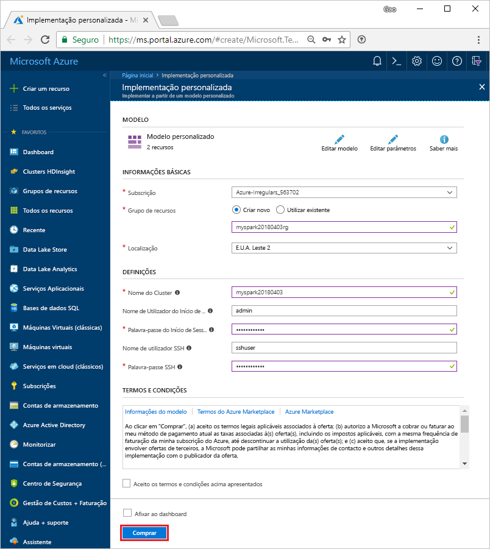

# <a name="quickstart-create-an-apache-spark-cluster-in-hdinsight-using-template"></a>Início rápido: Criar um cluster do Apache Spark no HDInsight com o modelo

Saiba como criar uma [Apache Spark](https://spark.apache.org/) cluster no Azure HDInsight e como executar consultas do Spark SQL relativamente [Apache Hive](https://hive.apache.org/) tabelas. O Apache Spark permite uma análise de dados e computação de clusters rápidas através do processamento dentro da memória. Para obter informações sobre o Spark no HDInsight, consulte [descrição geral: Apache Spark no HDInsight do Azure](apache-spark-overview.md).

Neste início rápido, vai utilizar um modelo do Resource Manager para criar um cluster do Spark no HDInsight. O cluster utiliza o Azure Storage Blob como a ferramenta de armazenamento de clusters. Para obter mais informações sobre como utilizar a geração 2 de armazenamento do Data Lake, veja [início rápido: Configurar clusters no HDInsight](../../storage/data-lake-storage/quickstart-create-connect-hdi-cluster.md).

> [!IMPORTANT]  
> A faturação dos clusters do HDInsight é rateada ao minuto, quer esteja a utilizá-los ou não. Confirme que elimina o cluster depois de o utilizar. Para obter mais informações, consulte a secção [Limpar recursos](#clean-up-resources) deste artigo.

Se não tiver uma subscrição do Azure, [crie uma conta gratuita](https://azure.microsoft.com/free/) antes de começar.

## <a name="create-an-hdinsight-spark-cluster"></a>Criar um cluster do Spark no HDInsight

Crie um cluster do Spark no HDInsight com um modelo do Azure Resource Manager. O modelo pode ser encontrado na [GitHub](https://azure.microsoft.com/resources/templates/101-hdinsight-spark-linux/). Para a sintaxe JSON e propriedades do cluster, consulte [Microsoft.HDInsight/clusters](/azure/templates/microsoft.hdinsight/clusters).

1. Selecione a seguinte ligação para abrir o modelo no portal do Azure num novo separador do browser:

    <a href="https://portal.azure.com/#create/Microsoft.Template/uri/https%3A%2F%2Fraw.githubusercontent.com%2FAzure%2Fazure-quickstart-templates%2Fmaster%2F101-hdinsight-spark-linux%2Fazuredeploy.json" target="_blank">Implementar no Azure</a>

2. Introduza os seguintes valores:

    | Propriedade | Valor |
    |---|---|
    |**Subscrição**|Selecione a subscrição do Azure utilizada para criar este cluster. A subscrição utilizada neste início rápido é **&lt;nome da subscrição do Azure>**. |
    | **Grupo de recursos**|Crie um grupo de recursos ou selecione um existente. O grupo de recursos é utilizado para gerir recursos do Azure para os seus projetos. O novo nome do grupo de recursos utilizado neste início rápido é **myspark20180403rg**.|
    | **Localização**|Selecione uma localização para o grupo de recursos. O modelo utiliza esta localização para criar o cluster, bem como para o armazenamento predefinido do mesmo. A localização utilizada neste guia de início rápido é **E.U.A. Leste 2**.|
    | **Nome do cluster**|Introduza um nome para o cluster do HDInsight que quer criar. O novo nome do cluster utilizado neste início rápido é **myspark20180403**.|
    | **Nome e palavra-passe de início de sessão no cluster**|O nome de início de sessão predefinido é admin. Escolha uma palavra-passe para o início de sessão do cluster. O nome de início de sessão utilizado neste início rápido é **admin**.|
    | **Nome de utilizador e palavra-passe do SSH**|Escolha uma palavra-passe para o utilizador do SSH. O nome de utilizador do SSH utilizado neste início rápido é **sshuser**.|

    

3. Selecione **Concordo com os termos e condições indicados acima**, selecione **Afixar ao dashboard** e, em seguida, selecione **Comprar**. Pode ver um novo mosaico intitulado **Implementação da implementação de modelos**. A criação do cluster demora cerca de 20 minutos. Tem de criar o cluster antes de poder avançar para a sessão seguinte.

Caso se depare com um problema ao criar clusters do HDInsight, estes poderão dever-se ao facto de não ter as permissões certas para o fazer. Para obter mais informações, veja [Access control requirements](../hdinsight-hadoop-create-linux-clusters-portal.md) (Requisitos do controlo de acesso).

## <a name="install-intellijeclipse-for-spark-application"></a>Instalar o IntelliJ/Eclipse para a aplicação Apache Spark
Utilizar o Azure Toolkit para IntelliJ/Eclipse Plug-in para desenvolver aplicações de Spark escritas em [Scala](https://www.scala-lang.org/)e, em seguida, enviá-los para um cluster do HDInsight Spark do Azure diretamente a partir do (de ambiente de desenvolvimento integrado no IntelliJ/Eclipse IDE). Para obter mais informações, veja [Utilizar o IntelliJ para criar/submeter a aplicação Apache Spark](./apache-spark-intellij-tool-plugin.md) e [Utilizar o Eclipse para criar/submeter a aplicação Apache Spark](./apache-spark-eclipse-tool-plugin.md).

## <a name="install-vscode-for-pysparkhive-applications"></a>Instalar o VSCode para aplicações PySpark/Hive
Saiba como utilizar as Ferramentas do Azure HDInsight para o Visual Studio Code (VSCode) para criar e submeter tarefas de lote do Hive, consultas interativas do Hive, o lote PySpark e scripts interativos PySpark. As Ferramentas do Azure HDInsight podem ser instaladas nas plataformas suportadas pelo VSCode, que incluem o Windows, o Linux e o macOS. Para obter mais informações, veja [Utilizar o VSCode para criar/submeter a aplicação PySpark](../hdinsight-for-vscode.md).

## <a name="create-a-jupyter-notebook"></a>Criar um bloco de notas do Jupyter

[O bloco de notas do Jupyter](https://jupyter.org/) é um ambiente de bloco de notas interativo que suporta várias linguagens de programação. O bloco de notas permite-lhe interagir com os seus dados, combinar código com texto markdown e realizar visualizações simples.

1. Abra o [Portal do Azure](https://portal.azure.com).
2. Selecione **Clusters do HDInsight** e, em seguida, selecione o cluster que criou.

    

3. A partir do portal, na secção **Dashboards de cluster**, clique em **Jupyter Notebook**. Se lhe for pedido, introduza as credenciais de início de sessão do cluster.

   

4. Selecione **New (Novo)** > **PySpark** para criar um bloco de notas.

   

   É criado e aberto um novo bloco de notas com o nome Untitled (Untitled.pynb).


## <a name="run-spark-sql-statements"></a>Executar instruções SQL do Spark

SQL (Structured Query Language) é a linguagem mais comum e mais utilizada para consultar e transformar dados. O Spark SQL funciona como uma extensão do Apache Spark para o processamento de dados estruturados e utiliza a sintaxe familiar do SQL Server.

1. Verifique se o kernel está pronto. O kernel está pronto quando vir um círculo hollow junto ao nome do kernel no bloco de notas. O círculo sólido indica que o kernel está ocupado.

    

    Quando inicia o bloco de notas pela primeira vez, o kernel efetua algumas tarefas em segundo plano. Aguarde que o kernel esteja preparado.
2. Cole o seguinte código numa célula vazia e, em seguida, prima **SHIFT + ENTER** para o executar. O comando lista as tabelas do Hive no cluster:

    ```sql
    %%sql
    SHOW TABLES
    ```
    Quando utiliza um Jupyter Notebook com o seu cluster do HDInsight Spark, obtém uma sessão `spark` predefinida que pode utilizar para executar consultas do Hive com o Spark SQL. `%%sql` indica ao Bloco de Notas do Jupyter que utilize a sessão `spark` predefinida para executar a consulta do Hive. A consulta devolve as primeiras dez linhas de uma tabela do Hive (**hivesampletable**) que vem em todos os clusters do HDInsight por predefinição. Ao submeter a consulta do Jupyter pela primeira vez, irá criar a Aplicação Spark para o bloco de notas. São precisos cerca de 30 segundos para concluir. Assim que a aplicação do spark estiver pronta, a consulta é executada em, aproximadamente, um segundo e produz os resultados. O resultado tem o seguinte aspeto:

    

    Sempre que executar uma consulta no Jupyter, o título da janela do browser apresenta o estado **(Ocupado)** juntamente com o título do bloco de notas. Também vê um círculo sólido junto ao texto do **PySpark** no canto superior direito.

2. Execute outra consulta para ver os dados no `hivesampletable`.

    ```sql
    %%sql
    SELECT * FROM hivesampletable LIMIT 10
    ```
    
    O ecrã deve atualizar-se e mostrar o resultado da consulta.

    ")

2. No menu **File (Ficheiro)** do bloco de notas, selecione **Close and Halt (Fechar e Parar)**. Encerrar o bloco de notas liberta os recursos do cluster, incluindo a Aplicação do Spark.

## <a name="clean-up-resources"></a>Limpar recursos
O HDInsight guarda os seus dados e os blocos de notas Jupyter no Armazenamento do Azure ou no Azure Data Lake Store, pelo que pode eliminar um cluster em segurança quando este não estiver a ser utilizado. Também lhe é cobrado o valor de um cluster do HDInsight mesmo quando não o está a utilizar. Uma vez que os custos do cluster são muito superiores aos custos do armazenamento, faz sentido do ponto de vista económico eliminar os clusters quando não estiverem a ser utilizados. Se tenciona trabalhar imediatamente no tutorial listado nos [Passos seguintes](#next-steps), convém manter o cluster.

Regresse ao portal do Azure e selecione **Eliminar**.


Também pode selecionar o nome do grupo de recursos para abrir a página do grupo de recursos e, em seguida, selecionar **Eliminar grupo de recursos**. Ao eliminar o grupo de recursos, está a eliminar o cluster do Spark no HDInsight e a conta de armazenamento predefinida.

## <a name="next-steps"></a>Passos Seguintes

Neste guia de início rápido, aprendeu a criar um cluster do Apache Spark no HDInsight e a executar uma consulta do Spark SQL básica. Prossiga para o tutorial seguinte para saber como utilizar um cluster do Spark no HDInsight para executar consultas interativas nos dados de exemplo.

> [!div class="nextstepaction"]
>[Executar consultas interativas no Apache Spark](./apache-spark-load-data-run-query.md)


