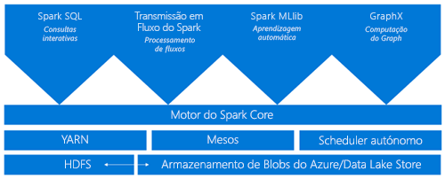
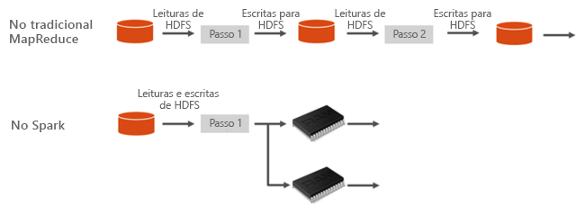
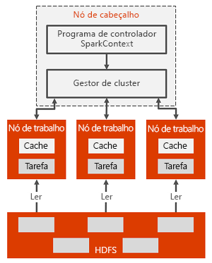

# O que é o Apache Spark no Azure HDInsight

*Apache Spark* uma estrutura de processamento paralelo de código aberto que suporta o processamento dentro da memória para melhorar o desempenho de aplicações de análise de macrodados. O Apache Spark no Azure HDInsight é a implementação da Microsoft do Apache Spark na cloud. O HDInsight permite criar e configurar clusters do Spark mais facilmente na cloud. Os clusters do Spark no HDInsight são compatíveis com o Armazenamento do Azure e com o Azure Data Lake Store. Por isso, pode utilizá-los para processar os dados armazenados no Azure. Para os componentes e as informações de controle de versão, consulte [Apache Hadoop componentes e versões no Azure HDInsight](../hdinsight-component-versioning.md).

## O que é o Spark?

O Spark fornece primitivos para a computação de cluster na memória. Os trabalhos do Spark podem carregar e colocar os dados em cache na memória e consultá-los repetidamente. A computação dentro da memória é muito mais rápida do que os sistemas baseados em discos, como o Hadoop, que partilha dados através do HDFS. O Spark também se integra na linguagem de programação Scala, o que lhe possibilita manipular conjuntos de dados distribuídos, como coleções locais. Não é necessário estruturar tudo como operações de mapa e redução.

Os clusters do Spark no HDInsight oferecem um serviço Spark completamente gerido. Os benefícios da criação de um cluster do Spark no HDInsight estão listados aqui.

| Funcionalidade | Descrição |
| --- | --- |
| Criação fácil |Pode criar um cluster do Spark novo no HDInsight em apenas alguns minutos com o portal do Azure, o Azure PowerShell ou o SDK .NET do HDInsight. Consulte [Introdução ao cluster do Spark no HDInsight](apache-spark-jupyter-spark-sql.md) |
| Facilidade de utilização |O cluster do Spark no HDInsight inclui blocos de notas do Jupyter e Zeppelin. Pode utilizar estes blocos de notas para o processamento e a visualização de dados interativos.|
| APIs REST |Clusters do Spark no HDInsight incluem [Apache Livy](https://github.com/cloudera/hue/tree/master/apps/spark/java#welcome-to-livy-the-rest-spark-server), um servidor de tarefas do Spark baseado na REST API para submeter e monitorizar remotamente tarefas. |
| Suporte para o Data Lake Store do Azure | Os clusters do Spark no HDInsight podem utilizar o Azure Data Lake Store como armazenamento primário ou armazenamento adicional. Para obter mais informações sobre o Data Lake Store, consulte [Descrição geral do Data Lake Store do Azure](../../data-lake-store/data-lake-store-overview.md). |
| Integração com os serviços do Azure |O cluster do Spark no HDInsight é fornecido com um conector para os Hubs de Eventos do Azure. Pode criar aplicações de transmissão em fluxo com os Hubs de eventos, além [Apache Kafka](http://kafka.apache.org/), que já está disponível como parte do Spark. |
| Suporte do ML Server | O suporte do ML Server no HDInsight é prestado como o tipo de cluster dos **Serviços ML**. Pode configurar um cluster dos Serviços ML para executar cálculos R distribuídos com as velocidades prometidas com um cluster do Spark. Para obter mais informações, veja [Introdução à utilização do ML Server no HDInsight](../r-server/r-server-get-started.md). |
| Integração com IDEs de terceiros | O HDInsight proporciona vários plug-ins de IDE que são úteis para criar e submeter aplicações para um cluster do Spark no HDInsight. Para obter mais informações, veja [Utilizar o IDEA do Azure Toolkit for IntelliJ](apache-spark-intellij-tool-plugin.md), [Utilizar o HDInsight para VSCode](../hdinsight-for-vscode.md) e [Utilizar o Azure Toolkit for Eclipse](apache-spark-eclipse-tool-plugin.md).|
| Consultas em Simultâneo |Os clusters do Spark no HDInsight suportam consultas em simultâneo. Esta capacidade permite que várias consultas de um utilizador ou várias consultas de vários utilizadores e aplicações partilhem os mesmos recursos de cluster. |
| Colocação em cache em SSDs |Pode optar por colocar os dados em cache na memória ou em SSDs ligados aos nós do cluster. A colocação em cache na memória oferece o melhor desempenho às consultas, mas pode ser dispendiosa. A colocação em cache em SSDs é uma excelente opção para melhorar o desempenho das consultas sem que seja necessário criar um cluster com tamanho suficiente para guardar todo o conjunto de dados na memória. |
| Integração com Ferramentas de BI |Os clusters do Spark no HDInsight fornecem conectores para ferramentas de BI, como o [Power BI](http://www.powerbi.com/), para análise de dados. |
| Bibliotecas Anaconda pré-carregadas |Os clusters do Spark no HDInsight incluem bibliotecas Anaconda pré-instaladas. O [Anaconda](http://docs.continuum.io/anaconda/) fornece cerca de 200 bibliotecas de Machine Learning, análise de dados, visualização, etc. |
| Escalabilidade | O HDInsight permite-lhe alterar o número de nós do cluster. Além disso, é possível ignorar os clusters do Spark sem perda de dados, uma vez que todos os dados são armazenados no Armazenamento do Azure ou no Azure Data Lake Store. |
| SLA |Os clusters do Spark no HDInsight incluem suporte 24 horas por dia, 7 dias por semana e um SLA de 99,9% de tempo ativo. |

Clusters do Apache Spark no HDInsight incluem os seguintes componentes que estão disponíveis nos clusters por predefinição.

* [Spark Core](https://spark.apache.org/docs/1.5.1/). Inclui o Spark Core, o Spark SQL, APIs de transmissão em fluxo do Spark, o GraphX e o MLlib.
* [Anaconda](http://docs.continuum.io/anaconda/)
* [Apache Livy](https://github.com/cloudera/hue/tree/master/apps/spark/java#welcome-to-livy-the-rest-spark-server)
* [Bloco de notas do Jupyter](https://jupyter.org)
* [O bloco de notas do Apache Zeppelin](http://zeppelin-project.org/)

Os clusters do Spark no HDInsight também fornecem um [controlador ODBC](https://go.microsoft.com/fwlink/?LinkId=616229) para a conectividade com clusters do Spark no HDInsight a partir de ferramentas de BI, como o Microsoft Power BI.

## Arquitetura de cluster do Spark

Saber de que forma é que o Spark é executado em clusters do HDInsight permite compreender mais facilmente os respetivos componentes.

As aplicações do Spark são executadas como conjuntos independentes de processos num cluster, coordenados pelo objeto SparkContext no seu programa principal (denominado “programa de controladores”).

O SparkContext pode ligar-se a vários tipos de gestores de clusters, que alocam recursos transversalmente às aplicações. Incluem estes gestores de cluster [Apache Mesos](http://mesos.apache.org/), [Apache Hadoop YARN](https://hadoop.apache.org/docs/current/hadoop-yarn/hadoop-yarn-site/YARN.html), ou o Gestor de clusters do Spark. No HDInsight, o Spark é executado com o gestor de clusters YARN. Assim que estiver ligado, o Spark adquire executores nos nós de trabalhado do cluster, que são os processos que executam cálculos e armazenam os dados da sua aplicação. Em seguida, envia o código da aplicação (definido pelos ficheiros JAR ou Python transmitidos para o SparkContext) aos executores. Por fim, o SparkContext envia tarefas para os executores executarem.

O SparkContext executa a função principal do utilizador, bem como as diversas operações paralelas nos nós de trabalho. Em seguida, recolhe os resultados das operações. Os nós de trabalho leem e escrevem dados de e para o sistema de ficheiros distribuído do Hadoop (HFDS). Também colocam em cache os dados transformados na memória como Conjuntos de Dados Distribuídos Resilientes (RDDs).

O SparkContext liga-se ao mestre do Spark e é responsável pela conversão das aplicações em gráficos dirigidos (DAG) de tarefas individuais que são executadas num processo do executor nos nós de trabalho. Cada aplicação tem os seus próprios processos de executor, que permanecem em funcionamento ao longo da duração de toda a aplicação e executam tarefas em múltiplos threads.

## Casos de utilização do Spark no HDInsight

Os clusters do Spark no HDInsight permitem os cenários-chave seguintes:

- Análise de dados interativa e BI

    O Apache Spark no HDInsight armazena dados no Armazenamento do Azure ou no Azure Data Lake Store. Os especialistas em negócio e os decisores-chave podem analisar e criar relatórios com base nesses dados e utilizar o Microsoft Power BI para criar relatórios interativos a partir dos dados analisados. Os analistas podem partir de dados não estruturados/semiestruturados no armazenamento de clusters, definir um esquema para os dados com os blocos de notas e, em seguida, criar modelos de dados através do Microsoft Power BI. Os clusters do Spark no HDInsight também suportam várias ferramentas de BI de terceiros, como o Tableau, o que os torna ideais para analistas de dados, especialistas em negócios e decisores-chave.

    [Tutorial: Visualize Spark data using Power BI](apache-spark-use-bi-tools.md) (Tutorial: Utilizar o Power BI para ver dados do Spark)
- Spark Machine Learning

    O Apache Spark inclui o [MLlib](http://spark.apache.org/mllib/), uma biblioteca de aprendizagem automática baseada no Spark, que pode utilizar a partir de um cluster do Spark no HDInsight. Além disso, o cluster do Spark no HDInsight também inclui o Anaconda, uma distribuição de Python com vários pacotes de aprendizagem automática. Associe a isto o suporte incorporado para blocos de notas do Jupyter e do Zeppelin e obtém um ambiente para a criação de aplicações de machine learning.

    [Tutorial: Predict building temperatures using HVAC data](apache-spark-ipython-notebook-machine-learning.md) [Tutorial: Predict food inspection results](apache-spark-machine-learning-mllib-ipython.md) (Tutorial: Prever resultados de inspeções alimentares)    
- Análise de dados de transmissão em fluxo e em tempo real do Spark

    Os clusters do Spark no HDInsight oferecem um suporte avançado para a criação de soluções de análise em tempo real. Embora o Spark já tenha conectores para ingerir dados de várias fontes, como o Kafka, o Flume, o Twitter, o ZeroMQ ou os sockets de TCP, o Spark no HDInsight acrescenta um suporte de primeira classe para a ingestão de dados a partir de Event Hubs do Azure. Os Hubs de Eventos são o serviço de colocação em fila mais utilizado no Azure. O facto de ter um suporte imediato para os Hubs de Eventos faz com que os clusters do Spark no HDInsight sejam uma plataforma ideal para a criação de pipelines de análise em tempo real.
    
## Por onde devo começar?

Pode utilizar os seguintes artigos para saber mais sobre o Apache Spark no HDInsight:

- [Início rápido: criar um cluster do Apache Spark no HDInsight e executar a consulta interativa com o Jupyter](./apache-spark-jupyter-spark-sql.md)
- [Tutorial: executar uma tarefa do Apache Spark com o Jupyter](./apache-spark-load-data-run-query.md)
- [Tutorial: analyze data using BI tools](./apache-spark-use-bi-tools.md) (Tutorial: Analisar dados com ferramentas de BI)
- [Tutorial: machine learning utilizando o Apache Spark](./apache-spark-ipython-notebook-machine-learning.md)
- [Tutorial: create a Scala Maven application using IntelliJ](./apache-spark-create-standalone-application.md) (Tutorial: Criar uma aplicação Scala Maven com IntelliJ)

## Próximos Passos

Nesta descrição geral, obteve algumas noções básicas do Apache Spark no Azure HDInsight. Avance para o próximo artigo para saber como utilizar um cluster do Spark no HDInsight e executar algumas consultas do Spark SQL:

- [Criar um cluster do Apache Spark no HDInsight](./apache-spark-jupyter-spark-sql.md)

