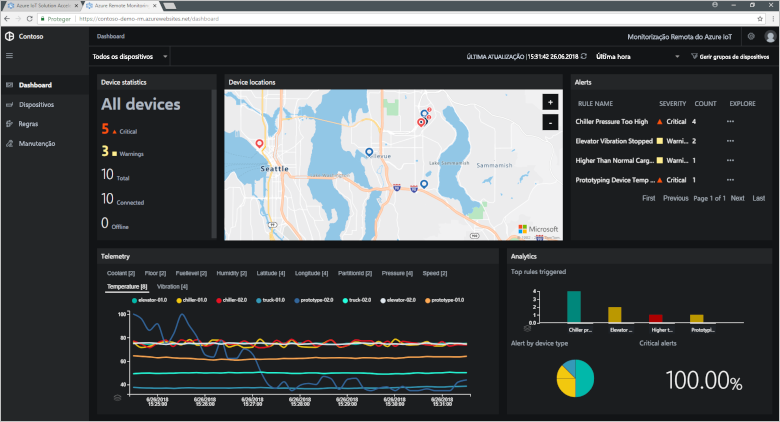
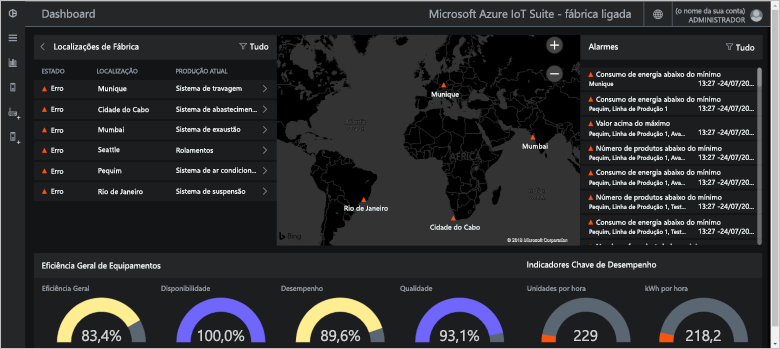
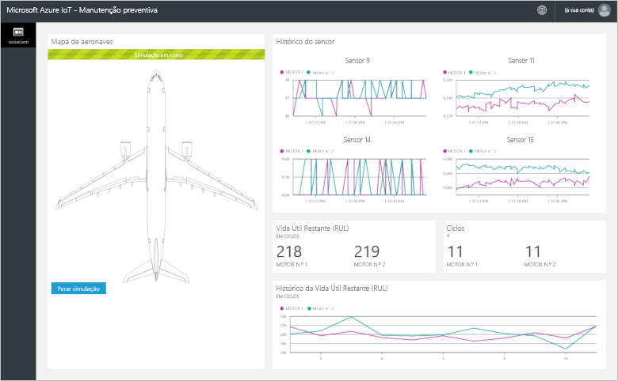

# O que são os aceleradores de soluções IoT do Azure?

Uma solução IoT baseada na cloud utiliza normalmente código personalizado e vários serviços cloud para gerir a conectividade do dispositivo, o processamento de dados e a análise e apresentação.

Os aceleradores de soluções IoT são uma coleção de soluções IoT completas e prontas a implementar, que implementam cenários IoT comuns, como a monitorização remota, a fábrica ligada, a manutenção preditiva e a simulação de dispositivos. Quando implementa um acelerador de soluções, a implementação inclui todos os serviços baseados na cloud que são precisos, juntamente com qualquer código de aplicação exigido.

Os aceleradores de soluções são pontos de partida para as suas próprias soluções IoT. O código de origem de todos os aceleradores de soluções é aberto e está disponível no GitHub. Pode transferir e personalizar os aceleradores de soluções para satisfazer os seus requisitos.

Também pode utilizar os aceleradores de soluções como ferramentas de aprendizagem antes de compilar uma solução de IoT personalizada do zero. Os aceleradores de solução implementam práticas comprovadas para soluções IoT baseadas na cloud para acompanhar.

O código da aplicação em cada acelerador de soluções inclui uma aplicação Web que lhe permite gerir o mesmo.

## Cenários IoT suportados

Atualmente, existem quatro aceleradores de soluções disponíveis para implementar:

### Monitorização Remota

Utilize este acelerador de soluções para recolher telemetria de vários dispositivos remotos e controlá-los. Os dispositivos de exemplo incluem sistemas de arrefecimento instalados nas instalações dos seus clientes ou válvulas instaladas em estações de bombeamento remotas.

Pode utilizar o dashboard de monitorização remota para ver a telemetria dos seus dispositivos ligados, aprovisionar novos dispositivos ou atualizar o firmware nos seus dispositivos ligados:

### Fábrica Ligada

Utilize este acelerador de soluções para recolher telemetria de ativos industriais com uma interface de [Arquitetura Unificada de OPC](https://opcfoundation.org/about/opc-technologies/opc-ua/) e para controlá-los. Os ativos industriais podem incluir estações de assemblagem e teste numa linha de produção de fábrica.

Pode utilizar o dashboard da fábrica ligada para monitorizar e gerir os seus dispositivos industriais:

### Manutenção Preditiva

Utilize este acelerador de soluções para prever quando um dispositivo remoto deverá falhar, para que possa fazer a manutenção antes de ocorrer a falha prevista. Este acelerador de soluções utiliza algoritmos de aprendizagem automática para prever falhas de telemetria do dispositivo. Os dispositivos de exemplo podem ser motores de avião ou elevadores.

Pode utilizar o dashboard da manutenção preditiva para ver análises de manutenção preditiva:

### Simulação do Dispositivo

Utilize este acelerador de soluções para executar vários dispositivos simulados que geram telemetria realista. Pode utilizar este acelerador de soluções para testar o comportamento de outros aceleradores de soluções ou para testar as suas próprias soluções IoT personalizadas.

Pode utilizar a aplicação Web de simulação de dispositivos para configurar e executar simulações:

## Princípios de conceção

Todos os aceleradores de soluções seguem os mesmos princípios de design e objetivos. Foram criados para serem:

* **Dimensionáveis**, permitindo-lhe ligar e gerir milhões de dispositivos ligados.
* **Extensíveis**, permitindo-lhe personalizá-los para satisfazer os seus requisitos.
* **Compreensíveis**, permitindo-lhe entender como funcionam e como são implementados.
* **Modulares**, permitindo-lhe trocar serviços por alternativas.
* **Seguros**, ao combinar a segurança do Azure com funcionalidades de segurança de dispositivo e conectividade incorporadas.

## Arquiteturas e linguagens

Os aceleradores de soluções originais foram escritos com .NET através de uma arquitetura do modelo-vista-controlador (MVC). A Microsoft está a atualizar os aceleradores de soluções para uma nova arquitetura de microsserviços. A tabela abaixo mostra o estado atual dos aceleradores de soluções, com ligações para os repositórios do GitHub:

| Acelerador de soluções   | Arquitetura  | Linguagens     |
| ---------------------- | ------------- | ------------- |
| Monitorização Remota      | Microsserviços | [Java](https://github.com/Azure/azure-iot-pcs-remote-monitoring-java) e [.NET](https://github.com/Azure/azure-iot-pcs-remote-monitoring-dotnet) |
| Manutenção Preditiva | MVC           | [.NET](https://github.com/Azure/azure-iot-predictive-maintenance)          |
| Fábrica Ligada      | MVC           | [.NET](https://github.com/Azure/azure-iot-connected-factory)          |
| Simulação do Dispositivo      | Microsserviços | [.NET](https://github.com/Azure/device-simulation-dotnet)          |

Para saber mais sobre as arquiteturas de microsserviços, veja [.NET Application Architecture](https://www.microsoft.com/net/learn/architecture) (Arquitetura de Aplicações .NET) e [Microservices: An application revolution powered by the cloud](https://azure.microsoft.com/blog/microservices-an-application-revolution-powered-by-the-cloud/) (Microsserviços: uma revolução nas aplicações com tecnologia da cloud).

## Opções de implementação

Pode implementar os aceleradores de soluções a partir do site [Aceleradores de Soluções do Microsoft Azure IoT](https://www.azureiotsolutions.com/Accelerators#) ou com a linha de comandos.

Pode implementar o acelerador de soluções Monitorização Remota nas seguintes configurações:

* **Standard:** implementação de infraestrutura expandida para desenvolver uma implementação de produção. O Azure Container Service implementa os microsserviços em várias máquinas virtuais do Azure. O Kubernetes orquestra os contentores do Docker que alojam os microsserviços individuais.
* **Básica:** versão com custo reduzido para demonstração ou para testar implementações. Todos os microsserviços são implementados numa máquina virtual do Azure individual.
* **Local:** implementação de computador local para teste e desenvolvimento. Esta abordagem implementa os microsserviços num contentor do Docker local e é ligada ao Hub IoT, ao Azure Cosmos DB e aos serviços de armazenamento do Azure na cloud.

O custo da execução de um acelerador de soluções é um agregado do [custo dos serviços subjacentes do Azure](https://azure.microsoft.com/pricing). Verá os detalhes dos serviços do Azure utilizados ao escolher as suas opções de implementação.

## Passos seguintes

Para experimentar um dos aceleradores de soluções de IoT, veja os inícios rápidos:

* [Try a remote monitoring solution](quickstart-remote-monitoring-deploy.md) (Experimentar uma solução de monitorização remota)
* [Try a connected factory solution](quickstart-connected-factory-deploy.md) (Experimentar uma solução de fábrica ligada)
* [Try a predictive maintenance solution](quickstart-predictive-maintenance-deploy.md) (Experimentar uma solução de manutenção preditiva)
* [Try a device simulation solution](quickstart-device-simulation-deploy.md) (Testar uma solução de simulação de dispositivos)
