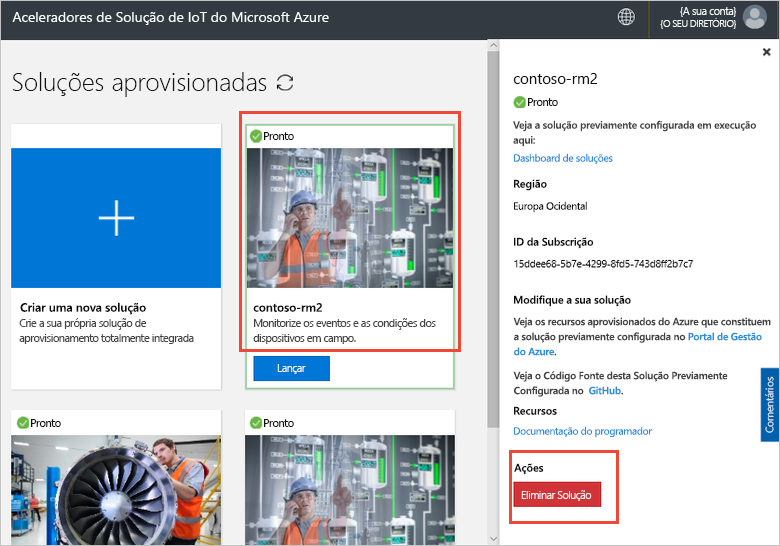

# Ligue um dispositivo de IoT DevKit ao acelerador de solução de monitorização remota

[!INCLUDE [iot-suite-selector-connecting](../../includes/iot-suite-selector-connecting.md)]

Este guia de procedimentos mostra como executar um aplicativo de exemplo no seu dispositivo IoT DevKit. O código de exemplo envia a telemetria de sensores no dispositivo DevKit do solution accelerator.

O [MXChip IoT DevKit](https://aka.ms/iot-devkit) é uma área de compatível de Arduino tudo-em-um com periféricos avançados e sensores. Pode desenvolver para ele usando [Bancada de trabalho de dispositivo do Azure IoT](https://aka.ms/iot-workbench) ou [ferramentas do Azure IoT](https://aka.ms/azure-iot-tools) pacote de extensão no Visual Studio Code. O [catálogo de projetos](https://microsoft.github.io/azure-iot-developer-kit/docs/projects/) contém aplicativos de exemplo para ajudá-lo a soluções de IoT de protótipo.

## Antes de começar

Para concluir os passos neste tutorial, primeiro faça as seguintes tarefas:

* Preparar seu DevKit ao seguir os passos em [ligar IoT DevKit AZ3166 hub do IoT do Azure na cloud](/azure/iot-hub/iot-hub-arduino-iot-devkit-az3166-get-started).

## Projeto de exemplo aberto

Para abrir o exemplo de monitorização remota no VS Code:

1. Certifique-se de que o seu IoT DevKit não é para o seu computador. Inicie o VS Code primeiro e, em seguida, ligue o DevKit para o seu computador.

1. Clique em `F1` para abrir a paleta de comandos, escreva e selecione **Bancada de trabalho de dispositivo do Azure IoT: Abrir os exemplos...** . Em seguida, selecione **IoT DevKit** como quadro.

1. Encontrar **monitorização remota** e clique em **exemplo aberto**. Uma nova janela do VS Code abre-se de que mostra a pasta do projeto:

  

## Configurar o dispositivo

Para configurar a cadeia de ligação de dispositivos do IoT Hub no seu dispositivo DevKit:

1. Mude a IoT DevKit em **modo de configuração**:

    * Mantenha premida botão **A**.
    * Push e de versão da **repor** botão.

1. A tela exibe o ID de DevKit e `Configuration`.

    

1. Prima **F1** para abrir a paleta de comandos, escreva e selecione **Bancada de trabalho de dispositivo do Azure IoT: Configurar as definições de dispositivos... > cadeia de ligação do dispositivo de configuração**.

1. Cole a cadeia de ligação que copiou anteriormente e prima **Enter** para configurar o dispositivo.

## Compilar o código

Para criar e carregar o código de dispositivo:

1. Prima `F1` para abrir a paleta de comandos, escreva e selecione **Bancada de trabalho de dispositivo do Azure IoT: Carregar o código de dispositivo**:

1. O VS Code compila e carrega o código para o seu dispositivo DevKit:

    

1. O dispositivo de DevKit reinicia e execute o código que carregou.

## O exemplo de teste

Para verificar se o aplicativo de exemplo que carregou para o dispositivo DevKit está a funcionar, conclua os seguintes passos:

### Ver a telemetria enviada para a solução de monitorização remota

Quando a aplicação de exemplo é executado, o dispositivo de DevKit envia telemetria dos seus dados de sensores por Wi-Fi do solution accelerator. Para ver a telemetria:

1. Aceda ao seu dashboard de solução e clique em **dispositivos**.

1. Clique no nome do dispositivo do seu dispositivo DevKit. no separador da direita, pode ver a telemetria da DevKit em tempo real:

    

### Controlar o dispositivo DevKit

O acelerador de solução de monitorização remota permite-lhe controlar remotamente o seu dispositivo. O código de exemplo implementa três métodos que pode ver na **método** secção ao selecionar o dispositivo na **dispositivos** página:

Para alterar a cor de um dos LEDs DevKit, utilize o **LedColor** método:

1. Selecione o nome do dispositivo da lista de dispositivos e clique nas **tarefas**:

    

1. Configurar as tarefas com os seguintes valores e clique em **aplicar**:

    * Selecione a tarefa: **Executar o método**
    * Nome do método: **LedColor**
    * Nome da tarefa: **ChangeLedColor**

    

1. Após alguns segundos, altera a cor do RGB LED (abaixo do botão A) na sua DevKit:

    

## Limpar recursos

Se planear avançar para os tutoriais, deixe o acelerador de soluções de Monitorização Remota implementado.

Se já não precisar do solution accelerator, elimine-o partir da página de soluções aprovisionado, selecioná-la e, em seguida, clicando em Eliminar solução:

## Problemas e comentários

Caso se depare com problemas, consulte [perguntas frequentes sobre do IoT DevKit](https://microsoft.github.io/azure-iot-developer-kit/docs/faq/) ou contacte-nos com os seguintes canais:

* [Gitter.im](https://gitter.im/Microsoft/azure-iot-developer-kit)
* [Stackoverflow](https://stackoverflow.com/questions/tagged/iot-devkit)

## Passos Seguintes

Agora que aprendeu como ligar um dispositivo de DevKit ao seu acelerador de solução de monitorização remota, seguem-se alguns passos seguintes sugeridos:

* [Azure descrição geral do Aceleradores de solução IoT](https://docs.microsoft.com/azure/iot-accelerators/)
* [Personalizar a IU](iot-accelerators-remote-monitoring-customize.md)
* [Ligar o IoT DevKit à sua aplicação do Azure IoT Central](../iot-central/howto-connect-devkit.md)