# Início rápido: Tente uma solução baseada na nuvem para gerir os meus dispositivos de IoT industriais

Este início rápido mostra como implementar o acelerador de soluções de Fábrica Ligada de IoT do Azure para executar uma simulação de monitorização e gestão com base na cloud para dispositivos IoT industriais. Quando implementa o acelerador de soluções Fábrica Ligada, este é pré-povoado com recursos simulados que lhe permitem aceder a um cenário de IoT industrial comum. Várias fábricas simuladas são ligadas à solução e reportam os valores de dados necessários para calcular a eficiência geral de equipamentos (OEE) e os indicadores chave de desempenho (KPI). Este início rápido mostra-lhe como utilizar o dashboard de soluções para:

* Monitorizar valores de fábrica, linhas de produção, OEEs de estações e KPIs.
* Analisar os dados telemétricos gerados a partir desses dispositivos.
* Responder a alarmes.

Para concluir este início rápido, precisa de uma subscrição ativa do Azure.

Se não tiver uma subscrição do Azure, crie uma [conta gratuita](https://azure.microsoft.com/free/?WT.mc_id=A261C142F) antes de começar.

## Implementar a solução

Ao implementar o acelerador de soluções na sua subscrição do Azure, tem de definir algumas opções de configuração.

Navegue para [Aceleradores de soluções do Microsoft Azure IoT](https://www.azureiotsolutions.com) e inicie sessão com as credenciais da sua conta do Azure.

Clique no mosaico **Fábrica Ligada**. Na página **Fábrica Ligada**, clique em **Experimente Agora**:

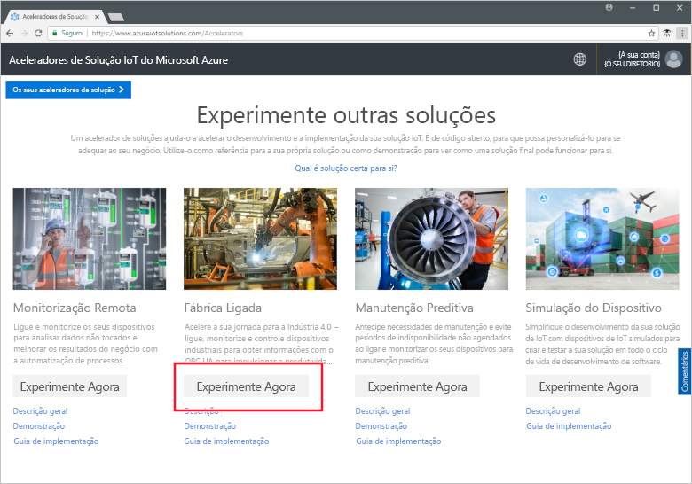

Na página **Criar solução de Fábrica Ligada**, introduza um **Nome da solução** exclusivo para o acelerador de soluções de Fábrica Ligada. Este nome é o nome do grupo de recursos do Azure que contém todos os recursos do acelerador de soluções. Este início rápido utiliza o nome **MyDemoConnectedFactory**.

Selecione a **Subscrição** e a **Região** que quer utilizar para implementar o acelerador de soluções. Normalmente, pode escolher a região mais próxima para si. Neste início rápido, estamos a utilizar **Visual Studio Enterprise** e **E.U.A. Leste**. Tem de ser um [administrador global ou de utilizador](iot-accelerators-permissions.md) na subscrição.

Clique em **criar** para iniciar a implementação. Este processo demora, pelo menos, cinco minutos a ser executado:

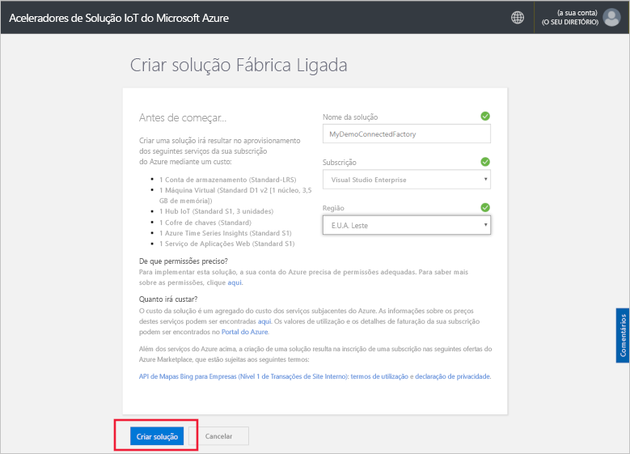

## Iniciar sessão na solução

Quando a implementação na sua subscrição do Azure estiver concluída, verá uma marca de verificação verde e **Preparado** no mosaico da solução. Pode agora iniciar sessão no dashboard do acelerador de soluções de Fábrica Ligada.

Na página **Soluções aprovisionadas**, clique no novo acelerador de soluções de Fábrica Ligada:

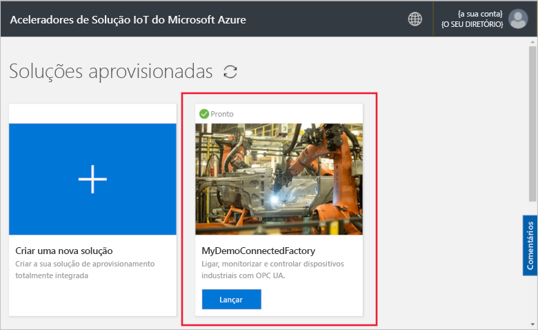

Pode ver informações sobre seu acelerador de solução de fábrica ligada na página que aparece. Escolher **ir do Solution accelerator** para ver o seu acelerador de solução de fábrica ligada:

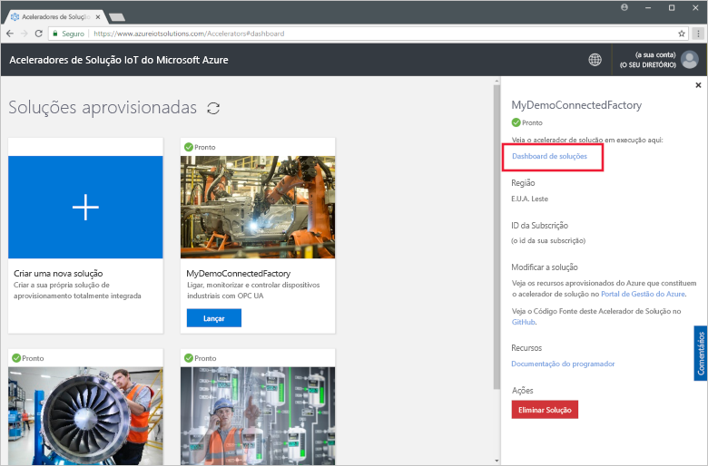

Clique em **Aceitar** para aceitar o pedido de permissões. O dashboard de soluções de Fábrica Ligada é apresentado no browser. Mostra um conjunto de fábricas, linhas de produção e estações simuladas.

## Ver o dashboard

A vista predefinida é o *dashboard*. Para navegar para outras áreas do portal, utilize o menu do lado esquerdo da página:

[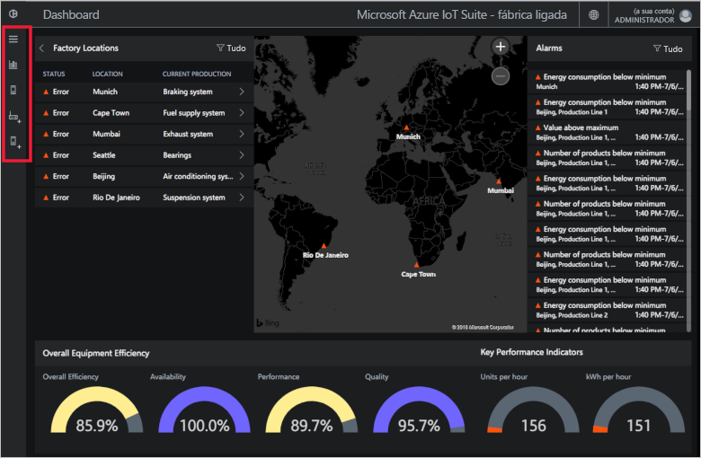](./media/quickstart-connected-factory-deploy/dashboard-expanded.png#lightbox)

Pode utilizar o dashboard para gerir os seus dispositivos IoT industriais. A solução Fábrica Ligada utiliza uma hierarquia para mostrar uma configuração de fábrica global. O nível superior da hierarquia é a empresa que contém uma ou mais fábricas. Cada fábrica contém linhas de produção, e cada linha de produção é constituída por estações. Em cada nível, pode ver OEEs e KPIs, publicar nós novos para telemetria e responder a alarmes.

No dashboard, pode ver:

## A eficiência geral de equipamentos

O painel **Eficiência Geral de Equipamentos** mostra os valores de OEE de toda a empresa ou da fábrica/linha de produção/estação que está a ver. Este valor é agregado da vista de estação para o nível de empresa. O número de OEE e os elementos que o constituem podem ser ainda mais analisados.

[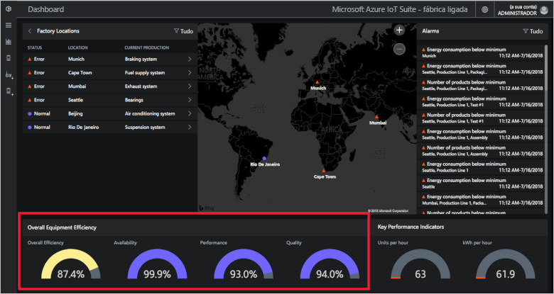](./media/quickstart-connected-factory-deploy/oee-expanded.png#lightbox)

O OEE classifica a eficiência do processo de fabrico através de parâmetros operacionais relacionados com a produção. OEE é uma medida padrão calculada ao multiplicar a tarifa de disponibilidade, a taxa de desempenho e a taxa de qualidade da indústria: OEE = disponibilidade x desempenho x qualidade.

Pode analisar mais detalhadamente o OEE relativamente a qualquer nível nos dados da hierarquia. Clique no OEE, na disponibilidade, no desempenho ou na percentagem de qualidade. É apresentado um painel de contexto com visualizações que mostram os dados em diferentes períodos de tempo:

[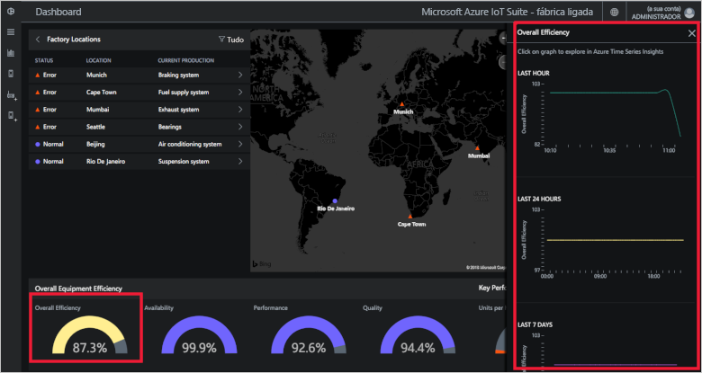](./media/quickstart-connected-factory-deploy/oeedetail-expanded.png#lightbox)

Pode clicar num gráfico para fazer ainda mais análises aos dados.

### Indicadores chave de desempenho

O painel **Indicadores Chave de Desempenho** apresenta o número de unidades produzidas por hora e a energia (kWh) utilizada por toda a empresa ou pela fábrica/linha de produção/estação que está a ver. Estes valores são agregados de uma vista de estação para o nível de empresa.

[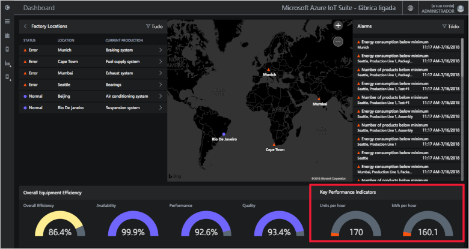](./media/quickstart-connected-factory-deploy/kpis-expanded.png#lightbox)

Pode analisar mais detalhadamente os KPIs relativamente a qualquer nível nos dados da hierarquia. Clique no OEE, na disponibilidade, no desempenho ou na percentagem de qualidade. É apresentado um painel de contexto com visualizações que mostram os dados em diferentes períodos de tempo:

[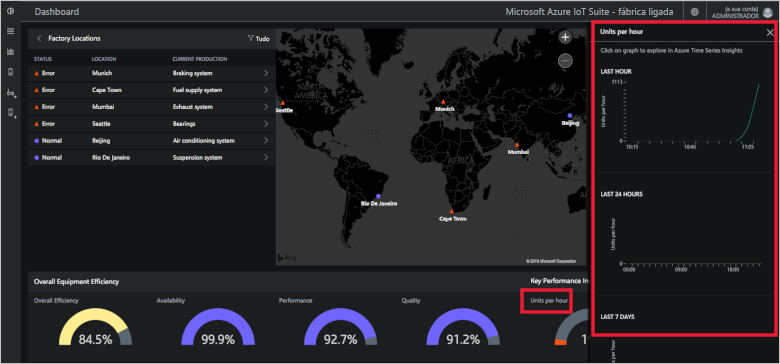](./media/quickstart-connected-factory-deploy/kpidetail-expanded.png#lightbox)

Pode clicar num gráfico para fazer ainda mais análises aos dados.

### Localizações de Fábricas

Um painel **Localizações de fábricas** que mostra o estado, a localização e a configuração de produção atual da solução. Quando executar o acelerador de soluções pela primeira vez, o dashboard mostra um conjunto simulado de fábricas. Cada simulação de linha de produção é composta por três servidores OPC UA reais que realizam tarefas simuladas e partilham dados. Para obter mais informações sobre OPC UA, veja as [FAQ sobre a Fábrica Ligada](iot-accelerators-faq-cf.md):

Pode navegar pela hierarquia da solução e ver os valores de OEE e os KPIs em cada nível:

1. Em **Localizações de Fábricas**, clique em **Mumbai**. Pode ver as linhas de produção nesta localização.

1. Clique em **Production Line 1** (Linha de Produção 1). Pode ver as estações nesta linha de produção.

1. Clique em **Packaging** (Empacotamento). Pode ver os nós de OPC UA publicados por esta estação.

1. Clique em **EnergyConsumption**. Pode ver alguns gráficos com este valor ao longo de diferentes períodos de tempo. Pode clicar num gráfico para fazer ainda mais análises aos dados.

[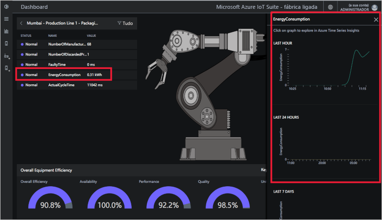](./media/quickstart-connected-factory-deploy/explorelocations-expanded.png#lightbox)

### Mapa

Se a sua subscrição tiver acesso à [API dos Mapas Bing](iot-accelerators-faq-cf.md), o mapa *Fábricas* mostra-lhe a localização geográfica e o estado de todas as fábricas da solução. Para analisar detalhadamente os detalhes de uma localização, clique nas localizações apresentadas no mapa.

[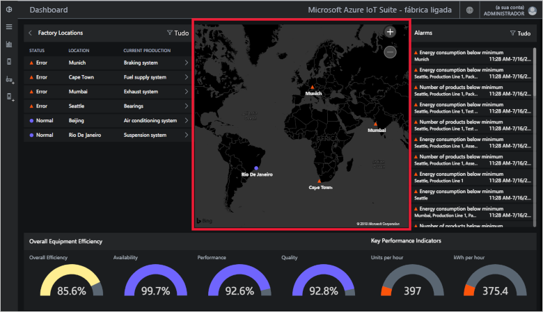](./media/quickstart-connected-factory-deploy/map-expanded.png#lightbox)

### Alarmes

O painel **Alarmes** mostra os alarmes gerados quando um valor reportado ou um valor OEE/KPI calculado excede um limiar configurado. Este painel apresenta alarmes em cada nível da hierarquia, do nível da estação ao nível da empresa. Cada alarme inclui uma descrição, data, hora, localização e número de ocorrências:

[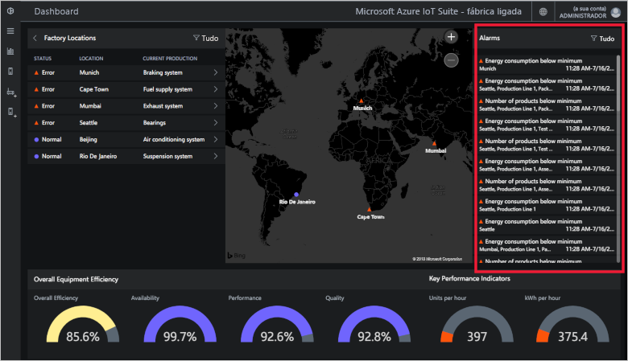](./media/quickstart-connected-factory-deploy/alarms-expanded.png#lightbox)

Pode analisar os dados que provocaram o alarme no dashboard. Se for Administrador, pode tomar medidas predefinidas nos alarmes, como:

* Feche o alarme.
* Reconhecer o alarme.

Clique num dos alarmes, no menu pendente **Escolher ação**, selecione **Alerta de reconhecimento** e, em seguida, clique em **Aplicar**:

[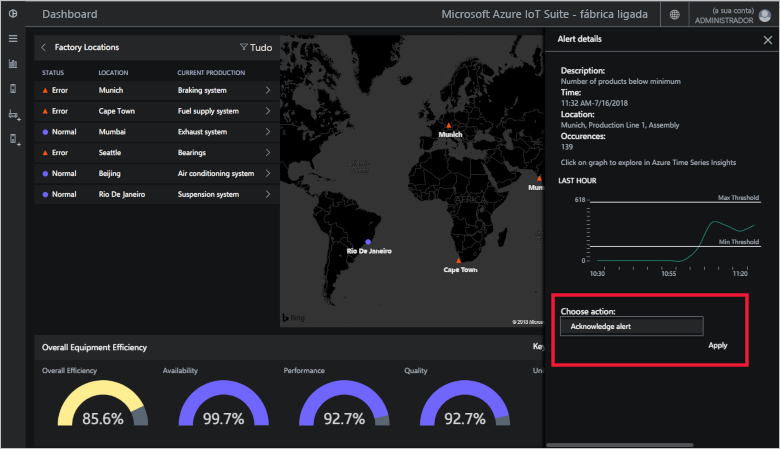](./media/quickstart-connected-factory-deploy/acknowledge-expanded.png#lightbox)

Para analisar mais aprofundadamente os dados do alarme, clique no gráfico no painel Alarmes.

Estes alarmes são gerados por regras que estão especificadas num ficheiro de configuração do acelerador da solução. Estas regras podem gerar alarmes quando os valores de OEE ou KPI ou do Nó OPC UA excedem um limiar. Pode definir este valor de limiar.

## Limpar recursos

Se quiser explorar ainda mais, deixe o acelerador de soluções de Fábrica Ligada implementado.

Se já não precisar do acelerador de soluções, elimine-o na página [Soluções aprovisionadas](https://www.azureiotsolutions.com/Accelerators#dashboard) ao selecioná-lo e, em seguida, clique em **Eliminar Solução**:

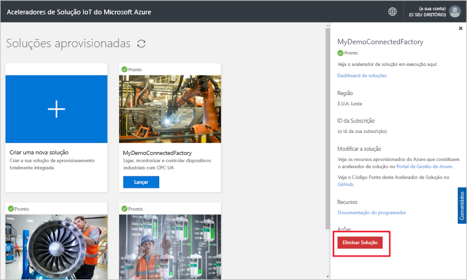

## Passos Seguintes

Neste início rápido, implementou o acelerador de soluções de Fábrica Ligada e aprendeu a navegar pelas suas fábricas, linhas de produção e estações. Também aprendeu a ver os valores de OEE e KPI em qualquer nível na hierarquia e a responder a alarmes.

Para saber como utilizar outras funcionalidades no dashboard para gerir os seus dispositivos IoT industriais, avance para o guia de procedimentos seguinte:

> [!div class="nextstepaction"]
> [Utilizar o dashboard de Fábrica Ligada](iot-accelerators-connected-factory-dashboard.md)