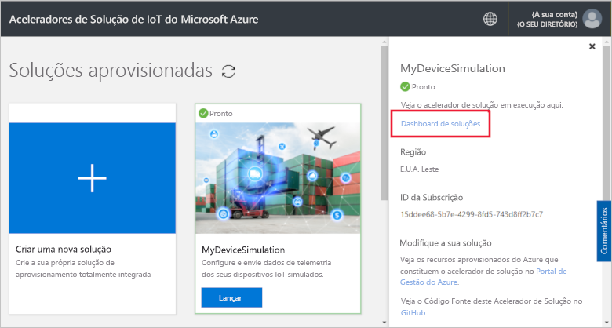
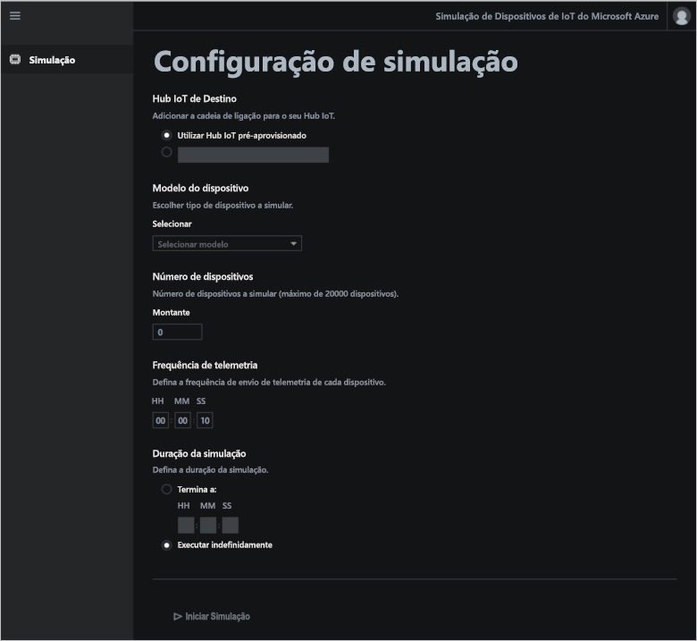
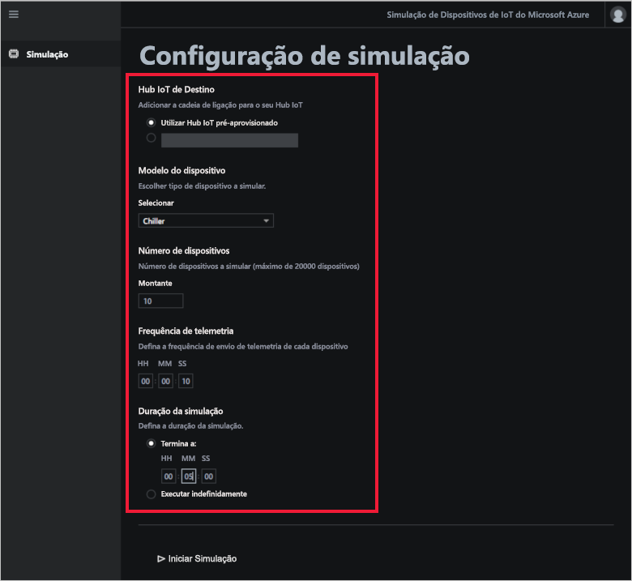
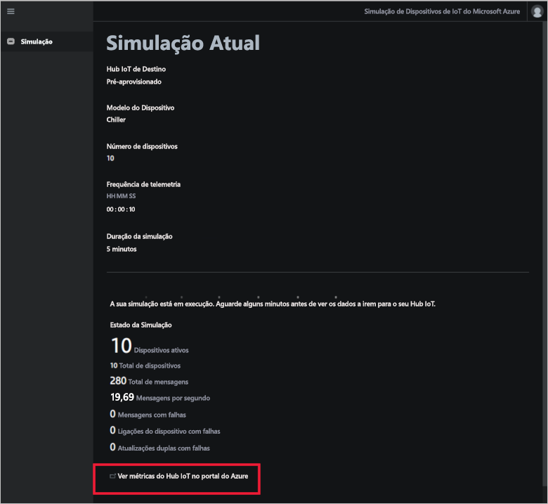

# Início Rápido: implementar e executar uma solução de simulação de dispositivo com base na cloud

Este início rápido mostra como implementar o acelerador de soluções de Simulação de Dispositivo de IoT do Azure para testar a sua solução de IoT. Depois de implementar o acelerador de soluções, utilize a página **Simulação** para criar e executar uma simulação.

Para concluir este início rápido, precisa de uma subscrição ativa do Azure.

Se não tiver uma subscrição do Azure, crie uma [conta gratuita](https://azure.microsoft.com/free/?WT.mc_id=A261C142F) antes de começar.

## Implementar a solução

Ao implementar o acelerador de soluções na sua subscrição do Azure, tem de definir algumas opções de configuração.

Inicie sessão em [azureiotsolutions.com](https://www.azureiotsolutions.com/Accelerators) com as credenciais da conta do Azure.

Clique em **Experimente Agora** no mosaico **Simulação de Dispositivo**.

Na página **Criar solução de Simulação de Dispositivo**, introduza um **Nome de solução** exclusivo. Anote o nome da solução, pois é o nome do grupo de recursos do Azure que contém todos os recursos da solução.

Selecione a **Subscrição** e a **Região** que quer utilizar para implementar o acelerador de soluções. Normalmente, pode escolher a região mais próxima para si. Tem de ser um [administrador global ou de utilizador](iot-accelerators-permissions.md) na subscrição.

Selecione a caixa para implementar um hub IoT para utilizar com a sua solução de simulação de dispositivo. Pode sempre alterar o hub IoT que a simulação utilizará mais tarde.

Clique em **Criar Solução** para começar a aprovisionar a solução. Este processo demora, pelo menos, cinco minutos a ser executado:

## Iniciar sessão na solução

Quando o processo de aprovisionamento estiver concluído, pode iniciar sessão no dashboard do acelerador de soluções de simulação de dispositivo.

Na página **Soluções aprovisionadas**, clique no novo acelerador de soluções de Simulação de Dispositivo:

Pode ver informações sobre o acelerador de soluções de Simulação de Dispositivo no painel apresentado. Selecione **Dashboard de soluções** para ver o acelerador de soluções de Simulação de Dispositivo:

Clique em **Aceitar** para aceitar o pedido de permissões. O dashboard da solução de Simulação de Dispositivo é apresentado no browser:

## Configurar a simulação

Configurou e executou uma simulação a partir do dashboard. Utilize os valores na tabela seguinte para configurar a simulação:

| Definição             | Valor                       |
| ------------------- | --------------------------- |
| Hub IoT de destino      | Utilizar Hub IoT pré-aprovisionado |
| Modelo do dispositivo        | Sistema de arrefecimento                     |
| Número de dispositivos   | 10                          |
| Frequência da telemetria | 10 segundos                  |
| Duração da simulação | 5 minutos                   |

## Executar a simulação

Clique em **Iniciar Simulação**. A simulação é executada durante o período que escolheu. Pode parar a simulação em qualquer altura ao clicar em **Parar Simulação**. A simulação mostra as estatísticas da execução atual. Clique em **Ver as métricas do Hub IoT no portal do Azure** para ver as métricas comunicadas pelo IoT hub:

Só pode executar uma simulação de cada vez a partir de uma instância aprovisionada do acelerador de soluções.

## Limpar recursos

Se quiser explorar ainda mais, deixe o acelerador de soluções de Simulação de Dispositivo implementado.

Se já não precisar do acelerador de soluções, elimine-o na página [Soluções aprovisionadas](https://www.azureiotsolutions.com/Accelerators#dashboard) ao selecioná-lo e, em seguida, clique em **Eliminar Solução**:

## Passos seguintes

Neste início rápido, implementou o acelerador de soluções de Simulação de Dispositivo e executou uma simulação de dispositivo IoT.

Para saber como utilizar o Hub IoT existente numa simulação, siga o seguinte guia de procedimentos:

> [!div class="nextstepaction"]
> [Utilizar um hub IoT existente com o acelerador de soluções de Simulação de Dispositivo](iot-accelerators-device-simulation-choose-hub.md)
