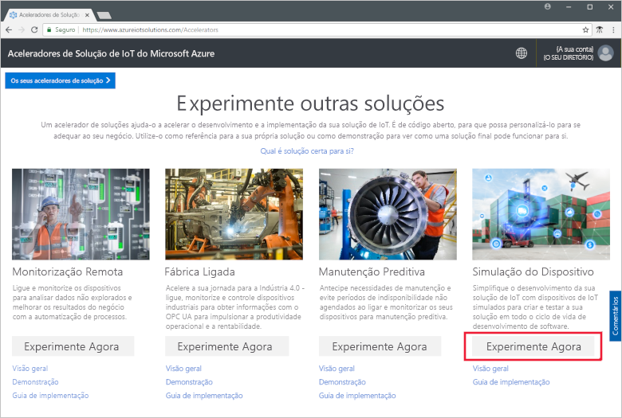
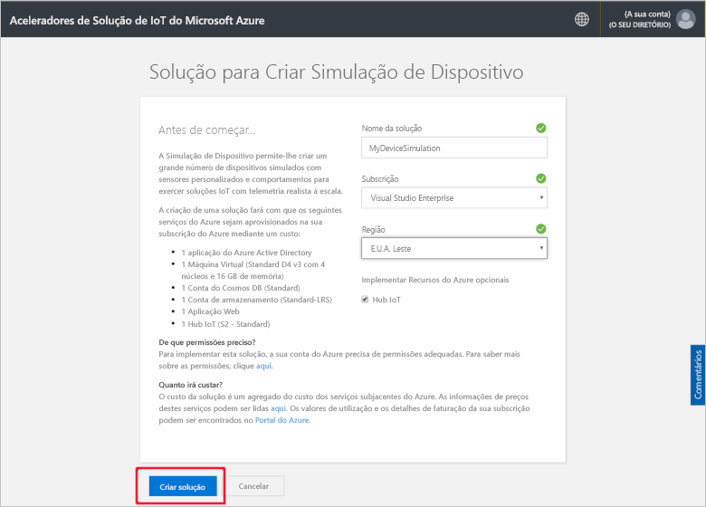
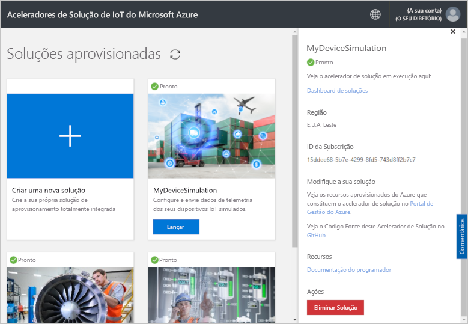

# Início Rápido: implementar e executar uma solução de dispositivo de IoT no Azure

Este início rápido mostra como implementar a Simulação de Dispositivo de IoT do Azure para testar a sua solução de IoT. Depois de implementar o acelerador de soluções, execute uma simulação de exemplo para começar.

Para concluir este início rápido, precisa de uma subscrição ativa do Azure.

Se não tiver uma subscrição do Azure, crie uma [conta gratuita](https://azure.microsoft.com/free/?WT.mc_id=A261C142F) antes de começar.

## Implementar a Simulação do Dispositivo

Ao implementar a Simulação do Dispositivo na sua subscrição do Azure, tem de definir algumas opções de configuração.

Inicie sessão em [azureiotsolutions.com](https://www.azureiotsolutions.com/Accelerators) com as credenciais da conta do Azure.

Clique no mosaico **Simulação de Dispositivo**:

Clique em **Experimente agora** na página de descrição Simulação de Dispositivo:

Na página **Criar solução de Simulação de Dispositivo**, introduza um **Nome de solução** exclusivo.

Selecione a **Subscrição** e a **Região** que quer utilizar para implementar o acelerador de soluções. Normalmente, pode escolher a região mais próxima para si. Tem de ser um [administrador global ou de utilizador](iot-accelerators-permissions.md) na subscrição.

Selecione a caixa para implementar um hub IoT para utilizar com a sua solução de simulação de dispositivo. Pode sempre alterar o hub IoT que a simulação utilizará mais tarde.

Clique em **Criar Solução** para começar a aprovisionar a solução. Este processo demora, pelo menos, cinco minutos a ser executado:

## Iniciar sessão na solução

Quando o processo de aprovisionamento estiver concluído, pode iniciar sessão na instância da Simulação de Dispositivo ao clicar no botão **Iniciar**:

Clique em **Aceitar** para aceitar o pedido de permissões. O dashboard da solução de Simulação de Dispositivo é apresentado no browser.

Quando aberto pela primeira vez, verá o dashboard Simulação de Dispositivo com um guia **Introdução**. Clique no primeiro mosaico para abrir uma simulação de exemplo. Se fechar o guia **Introdução**, pode abrir a **Simulação Simples de Exemplo** a partir do dashboard ao clicar no respetivo bloco:

## Simulação de Exemplo

Não pode ser editada enquanto simulação de exemplo. A simulação é configurada com as seguintes definições:

| Definição             | Valor                       |
| ------------------- | --------------------------- |
| Hub IoT de destino      | Utilizar Hub IoT pré-aprovisionado |
| Modelo do dispositivo        | Camião                       |
| Número de dispositivos   | 10                          |
| Frequência da telemetria | 10 segundos                  |
| Duração da simulação | Executar indefinidamente            |

## Executar a simulação

Clique em **Iniciar Simulação**. A simulação será executada indefinidamente, conforme configurado. Pode parar a simulação em qualquer altura ao clicar em **Parar Simulação**. A simulação mostra as estatísticas da execução atual.

Só pode executar uma simulação de cada vez a partir de uma instância de Simulação do Dispositivo.

## Limpar recursos

Se quiser explorar ainda mais, deixe a Simulação de Dispositivo implementada.

Se já não precisar da Simulação de Dispositivo, elimine-a na página [Soluções aprovisionadas](https://www.azureiotsolutions.com/Accelerators#dashboard) ao clicar no respetivo mosaico e, em seguida, clique em **Eliminar Solução**:

## Passos seguintes

Neste início rápido, vai implementar a Simulação de Dispositivo e executar uma simulação de dispositivo IoT.

> [!div class="nextstepaction"]
> [Criar uma simulação com um ou mais tipos de dispositivo](iot-accelerators-device-simulation-create-simulation.md)