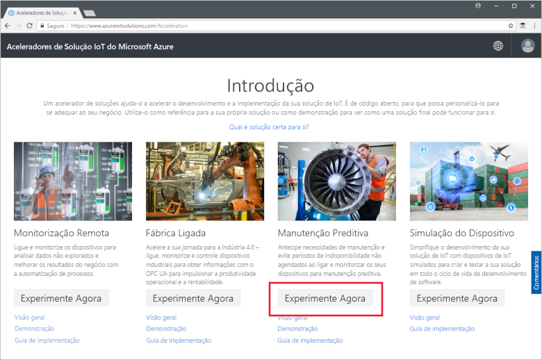
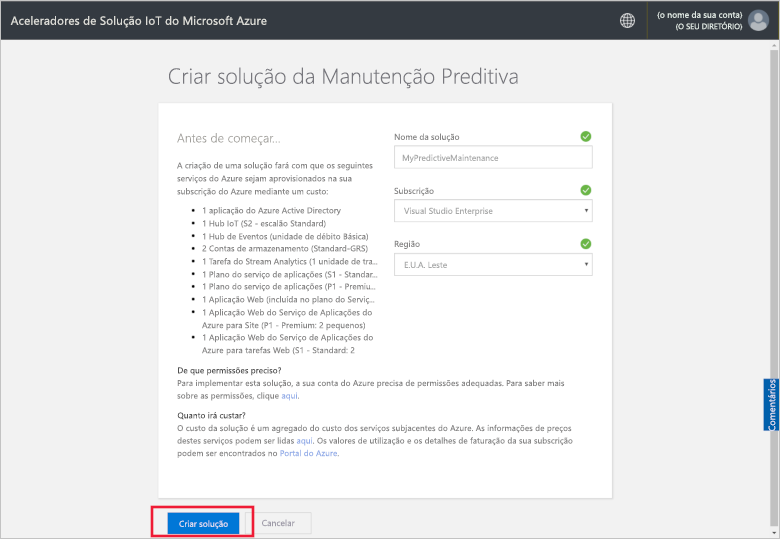
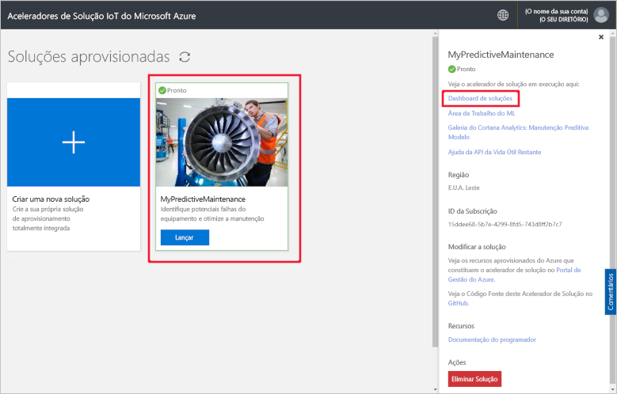
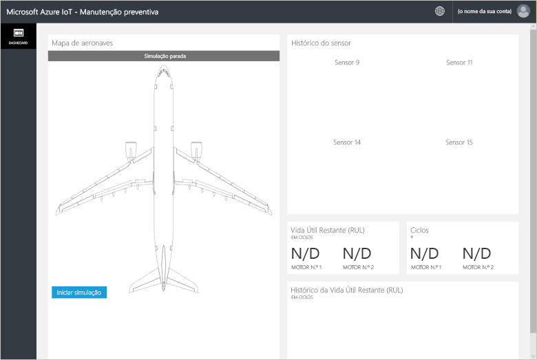
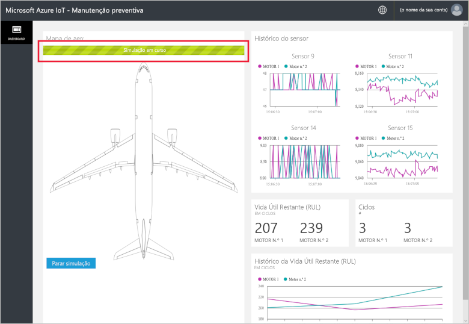
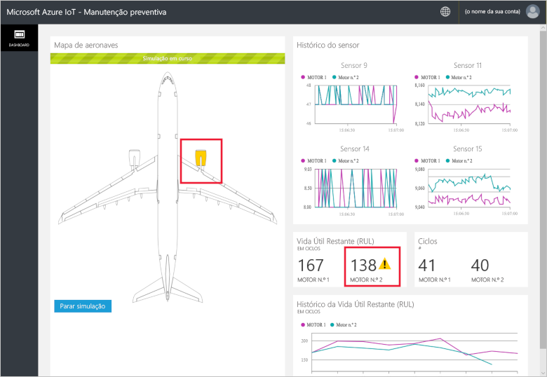
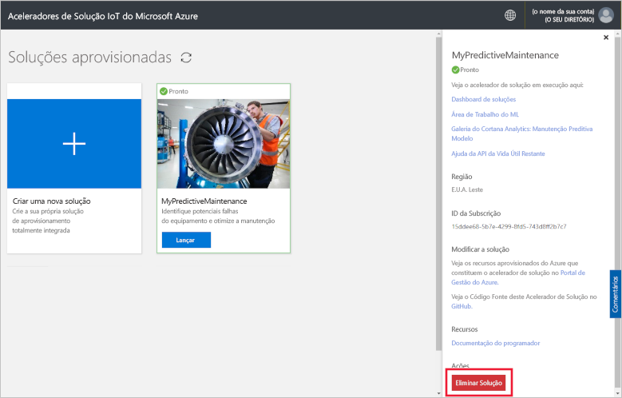

# Início Rápido: Experimentar uma solução baseada na cloud para executar uma análise de manutenção preditiva nos meus dispositivos ligados

Este início rápido mostra como implementar o acelerador de soluções de Manutenção Preditiva de IoT do Azure para executar uma simulação de manutenção preditiva. Depois de implementar o acelerador de soluções, utilize a página **Dashboard** da solução para executar uma análise de manutenção preditiva em dados de um motor de aeronave simulado. Pode utilizar este acelerador de soluções como o ponto de partida para a sua própria implementação ou como uma ferramenta de aprendizagem.

Na simulação, a Fabrikam é uma companhia aérea regional que se concentra na satisfação do cliente a preços competitivos. Uma das causas dos atrasos dos voos está relacionada com problemas de manutenção, sendo a manutenção de motores de aeronaves uma tarefa particularmente difícil. A Fabrikam tem de evitar falhas de motores durante os voos custe o que custar, pelo que os inspeciona regularmente e agenda manutenções de acordo com um plano. Contudo, o desgaste dos motores das aeronaves nem sempre é idêntico. É efetuada alguma manutenção desnecessária nos motores. Mais importante ainda, os problemas que surgirem podem manter uma aeronave em terra até ser efetuada a manutenção. Estes problemas podem ser particularmente dispendiosos se uma aeronave estiver numa localização em que não haja técnicos ou peças sobressalentes disponíveis.

Os motores das aeronaves da Fabrikam são equipados com sensores que controlam o estado do motor durante o voo. Depois de ter acumulado anos de dados sobre as falhas e dados operacionais sobre o motor, os cientistas de dados da Fabrikam desenvolveram um modelo para prever a Vida Útil Remanescente (RUL) do motor de uma aeronave. O módulo utiliza uma correlação entre os dados de quatro sensores do motor com o desgaste do motor que pode eventualmente levar a uma falha. Enquanto a Fabrikam continua a fazer inspeções frequentes para garantir a segurança, pode utilizar os modelos para calcular a RUL de cada motor depois de cada voo. A Fabrikam pode agora prever pontos de falha futuros e planear a manutenção para minimizar o período da aeronave em terra e reduzir os custos operacionais, garantindo, simultaneamente, a segurança dos passageiros e da tripulação.

Para concluir este início rápido, precisa de uma subscrição ativa do Azure.

Se não tiver uma subscrição do Azure, crie uma [conta gratuita](https://azure.microsoft.com/free/?WT.mc_id=A261C142F) antes de começar.

## Implementar a solução

Ao implementar o acelerador de soluções na sua subscrição do Azure, tem de definir algumas opções de configuração.

Inicie sessão em [azureiotsolutions.com](https://www.azureiotsolutions.com/Accelerators) com as credenciais da conta do Azure.

Clique em **Experimentar Agora** no mosaico **Manutenção Preditiva**.

Na página **Criar Manutenção Preditiva**, introduza um **Nome da solução** exclusivo para o seu acelerador de soluções de Manutenção Preditiva. Para este início, vamos utilizar **MyPredictiveMaintenance**.

Selecione a **Subscrição** e a **Região** que quer utilizar para implementar o acelerador de soluções. Normalmente, pode escolher a região mais próxima para si. Neste início rápido, estamos a utilizar **Visual Studio Enterprise** e **E.U.A. Leste**. Tem de ser um [administrador global ou de utilizador](iot-accelerators-permissions.md) na subscrição.

Clique em **Criar Solução** para iniciar a implementação. Este processo demora, pelo menos, cinco minutos a ser executado:

## Iniciar sessão na solução

Quando a implementação na sua subscrição do Azure estiver concluída, verá uma marca de verificação verde e **Preparado** no mosaico da solução. Pode agora iniciar sessão no dashboard do acelerador de soluções de Manutenção Preditiva.

Na página **Soluções aprovisionadas**, clique no novo acelerador de soluções de Manutenção Preditiva. Pode ver informações sobre o acelerador de soluções no painel apresentado. Selecione **Dashboard de soluções** para ver o acelerador de soluções de Manutenção Preditiva:

Clique em **Aceitar** para aceitar o pedido de permissões. O dashboard da solução de Manutenção Preditiva é apresentado no browser:

Clique em **Iniciar simulação** para começar a simulação. O dashboard é preenchido pelo histórico dos sensores, pela RUL, pelos Ciclos e pelo histórico da RUL:

Quando a RUL for inferior a 160 (limiar arbitrário escolhido para fins de demonstração), o portal de solução apresenta um símbolo de aviso junto da apresentação da RU. O portal da solução também realça o motor de aeronave a amarelo. Repare como os valores da RUL têm uma tendência descendente geral, tendendo no entanto a saltar para cima e para baixo. Este comportamento decorre das durações variáveis dos ciclos e da precisão do modelo.

A simulação completa demora cerca de 35 minutos a concluir 148 ciclos. O limiar da RUL 160 é atingido pela primeira vez em cerca de 5 minutos e ambos os motores atingem o limiar em cerca de 8 minutos.

A simulação é executada através do conjunto de dados completos para 148 ciclos e assenta nos valores da RUL final e ciclo.

Pode parar a simulação a qualquer momento mas, se clicar em **Iniciar Simulação**, a simulação partirá novamente do início do conjunto de dados.

## Limpar recursos

Se quiser explorar ainda mais, deixe o acelerador de soluções de Manutenção Preditiva implementado.

Se já não precisar do acelerador de soluções, elimine-o na página [Soluções aprovisionadas](https://www.azureiotsolutions.com/Accelerators#dashboard) ao selecioná-lo e, em seguida, clique em **Eliminar Solução**:

## Passos seguintes

Neste início rápido, implementou o acelerador de soluções de Manutenção Preditiva e executou uma simulação.

Para saber mais sobre o acelerador de soluções e sobre os motores de aeronaves simulados, avance para o artigo seguinte.

> [!div class="nextstepaction"]
> [Descrição geral do acelerador de soluções de Manutenção Preditiva](iot-accelerators-predictive-walkthrough.md)
