# Início Rápido: Implementar uma solução de monitorização remota baseada na cloud

Este início rápido mostra como implementar o acelerador de soluções de Monitorização Remota de IoT do Azure para utilizar como uma solução de monitorização remota baseada na cloud para os seus dispositivos IoT. Depois de implementar o acelerador de soluções, utilize a página **Dashboard** da solução para visualizar os dispositivos simulados num mapa e página **Manutenção** para responder a um alerta de pressão de um dispositivo chiller simulado.

A implementação predefinida configura o acelerador de soluções de Monitorização Remota para uma empresa denominada Contoso. A Contoso gere uma seleção de diferentes tipos de dispositivos, como chillers, implementados em ambientes físicos diferentes. Um dispositivo chiller envia telemetria de temperatura, humidade e pressão para o acelerador de soluções de Monitorização Remota.

## Pré-requisitos

Para concluir este início rápido, precisa de uma subscrição ativa do Azure.

Se não tiver uma subscrição do Azure, crie uma [conta gratuita](https://azure.microsoft.com/free/?WT.mc_id=A261C142F) antes de começar.

## Implementar a solução

Ao implementar o acelerador de soluções na sua subscrição do Azure, tem de definir algumas opções de configuração.

Inicie sessão em [azureiotsolutions.com](https://www.azureiotsolutions.com/Accelerators) com as credenciais da conta do Azure.

Clique em **Experimentar Agora** no mosaico **Monitorização Remota**.

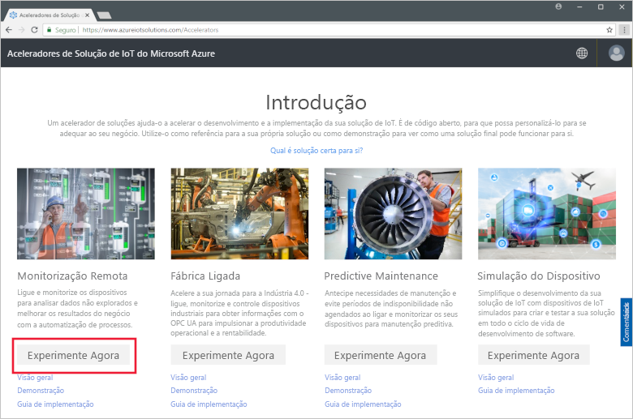

Na página **Criar solução de Monitorização Remota**, selecione uma implementação **Básica**. Se estiver a implementar o acelerador de soluções para saber como funciona ou executar uma demonstração, selecione a opção **Básica** para minimizar os custos.

Selecione **.NET** como linguagem. As implementações de Java e .NET têm funcionalidades idênticas.

Introduza um **Nome da solução** exclusivo para o acelerador de soluções de Monitorização Remota.

Selecione a **Subscrição** e a **Região** que quer utilizar para implementar o acelerador de soluções. Normalmente, pode escolher a região mais próxima para si. Tem de ser um [administrador global ou de utilizador](iot-accelerators-permissions.md) na subscrição.

Clique em **Criar Solução** para iniciar a implementação. Este processo demora, pelo menos, cinco minutos a ser executado:

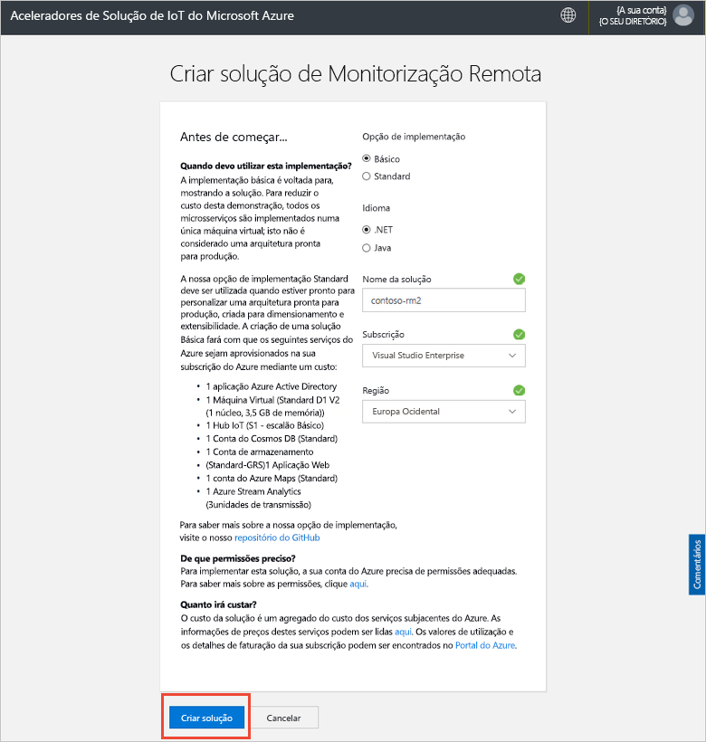

## Iniciar sessão na solução

Quando a implementação da sua subscrição do Azure estiver concluída, pode iniciar sessão no dashboard do acelerador de soluções de Monitorização Remota.

Na página **Soluções aprovisionadas**, clique no novo acelerador de soluções de Monitorização Remota:

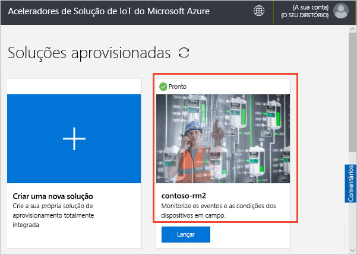

Pode ver informações sobre o acelerador de soluções de Monitorização Remota no painel apresentado. Selecione **Dashboard de soluções** para ver o acelerador de soluções de Monitorização Remota:

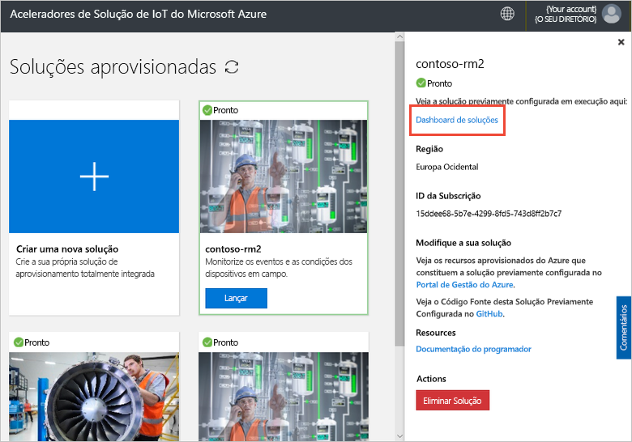

Clique em **Aceitar** para aceitar o pedido de permissões. O dashboard da solução de Monitorização Remota é apresentado no browser:

## Ver os seus dispositivos

O dashboard de soluções mostra as seguintes informações sobre os dispositivos da Contoso:

* **Estatísticas dos dispositivos** mostra informações de resumo sobre alertas e o número total de dispositivos. Na implementação predefinida, a Contoso tem 10 tipos diferentes de dispositivos simulados.

* **Localizações dos dispositivos** mostra onde os dispositivos estão localizados fisicamente. A cor do alfinete mostra quando existem alertas do dispositivo.

* **Alertas** mostra os detalhes de alertas dos dispositivos.

* **Telemetria** mostra a telemetria dos dispositivos. Pode ver os diferentes fluxos de telemetria ao clicar nos tipos de telemetria na parte superior.

* **Análise** mostra informações combinadas sobre os alertas dos dispositivos.

## Responder a um alerta

Como operador na Contoso, pode monitorizar os dispositivos no dashboard de soluções. O painel **Estatísticas dos dispositivos** mostra que ocorreu um número de alertas críticos e o painel **Alertas** mostra que a maioria deles é proveniente de um dispositivo chiller. Para dispositivos chiller da Contoso, uma pressão interna superior a 250 PSI indica que o dispositivo não está a funcionar corretamente.

### Identificar o problema

Na página **Dashboard**, no painel **Alertas**, pode ver o alerta **Pressão do chiller demasiado elevada**. O chiller tem um alfinete vermelho no mapa (pode ter de aplicar zoom ao mapa):

[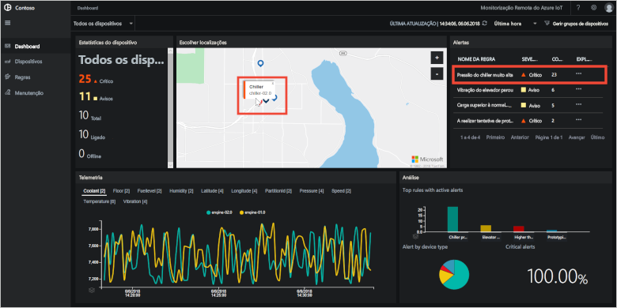](./media/quickstart-remote-monitoring-deploy/dashboardalarm-expanded.png#lightbox)

No painel **Alertas**, clique em **...** na coluna **Explorar** junto à regra **Pressão do chiller demasiado elevada**. Esta ação leva-o para a página **Manutenção** onde pode ver os detalhes da regra que acionou o alerta.

A página de manutenção **Pressão do chiller demasiado elevada** mostra os detalhes da regra que acionou os alertas. A página também indica quando os alertas ocorreram e o dispositivo que os acionaram:

[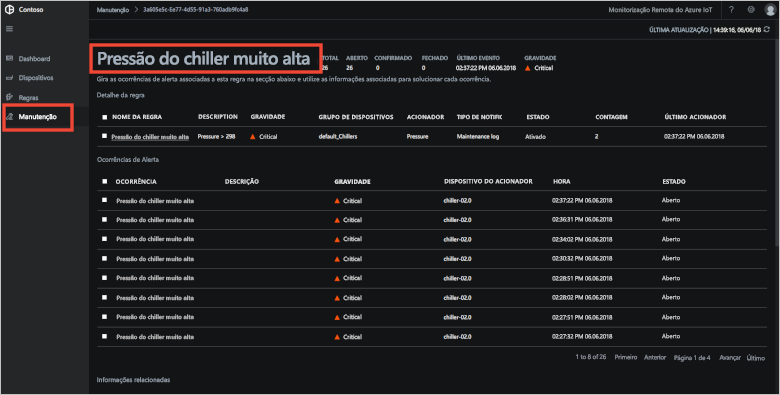](./media/quickstart-remote-monitoring-deploy/maintenancealarmlist-expanded.png#lightbox)

Identificou agora o problema que acionou o alerta e o dispositivo associado. Como operador, os passos seguintes são para reconhecer o alerta e corrigir o problema.

### Corrigir o problema

Para indicar a outros operadores que está a trabalhar no alerta, selecione-o e altere o **Estado do alerta** para **Reconhecido**:

[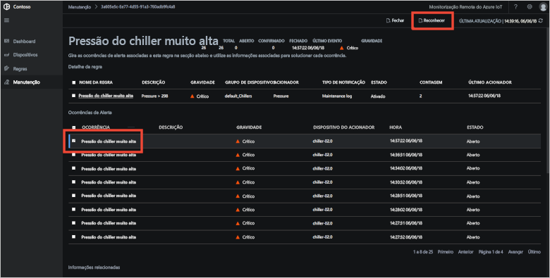](./media/quickstart-remote-monitoring-deploy/maintenanceacknowledge-expanded.png#lightbox)

O valor na coluna de estado muda para **Reconhecido**.

Para agir sobre o chiller, desloque-se para baixo para **Informações relacionadas**, selecione o dispositivo chiller na lista **Dispositivos alertados** e, em seguida, selecione **Tarefas**:

[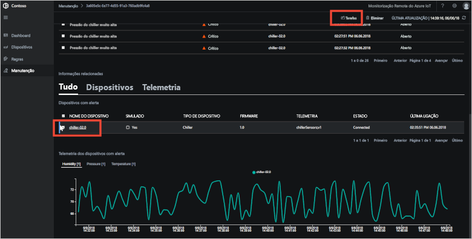](./media/quickstart-remote-monitoring-deploy/maintenanceschedule-expanded.png#lightbox)

No painel **Tarefas**, selecione **Executar método**, em seguida, o método **EmergencyValveRelease**, adicione o nome da tarefa **ChillerPressureRelease** e clique em **Aplicar**. Estas definições criam uma tarefa executada imediatamente.

Para ver o estado da tarefa, volte à página **Manutenção** e veja a lista de tarefas na vista **Tarefas**. Pode ter de aguardar alguns segundos antes de poder ver que a tarefa foi executada para libertar a pressão da válvula no chiller:

[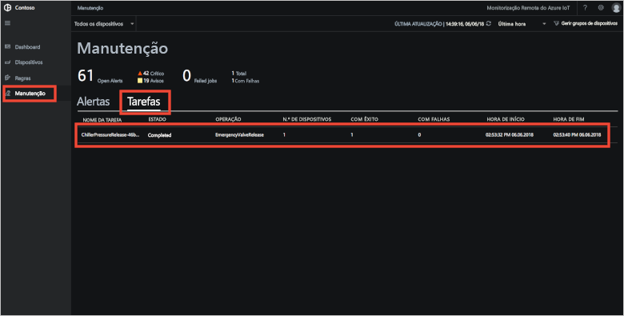](./media/quickstart-remote-monitoring-deploy/maintenancerunningjob-expanded.png#lightbox)

### Verificar se a pressão voltou ao normal

Para ver a telemetria de pressão do chiller, navegue para a página **Dashboard**, selecione **Pressão** no painel de telemetria e confirme se a pressão de **chiller-02.0** voltou ao normal:

[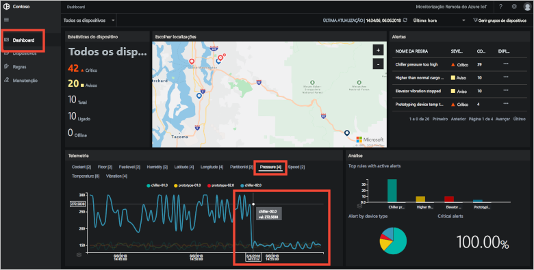](./media/quickstart-remote-monitoring-deploy/pressurenormal-expanded.png#lightbox)

Para fechar o incidente, navegue para a página **Manutenção**, selecione o alerta e defina o estado como **Fechado**:

[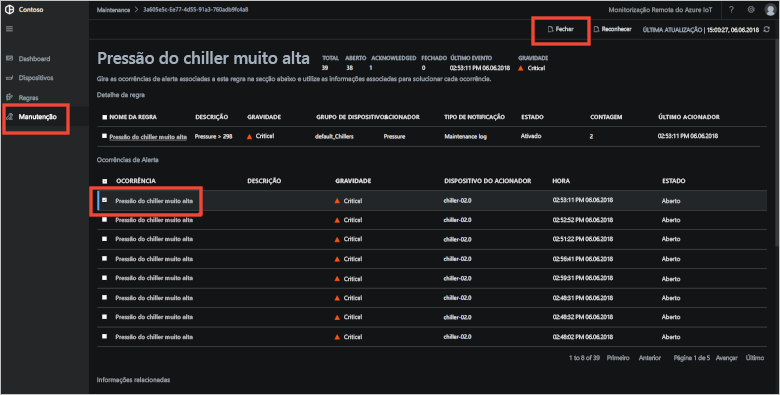](./media/quickstart-remote-monitoring-deploy/maintenanceclose-expanded.png#lightbox)

O valor na coluna de estado muda para **Fechado**.

## Limpar recursos

Se planear avançar para os tutoriais, deixe o acelerador de soluções de Monitorização Remota implementado.

Se já não precisar do acelerador de soluções, elimine-o na página [Soluções aprovisionadas](https://www.azureiotsolutions.com/Accelerators#dashboard):

## Passos seguintes

Neste início rápido, implementou o acelerador de soluções de Monitorização Remota e concluiu uma tarefa de monitorização com os dispositivos simulados na implementação predefinida da Contoso.

Para saber como atualizar o firmware nos seus dispositivos ligados e organizar os recursos no acelerador de soluções, avance para o próximo tutorial.

> [!div class="nextstepaction"]
> [Tutorial: Monitorizar os seus dispositivos IoT](iot-accelerators-remote-monitoring-monitor.md)