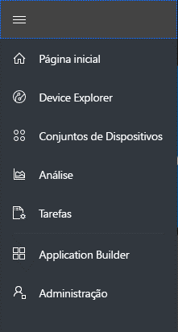
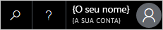
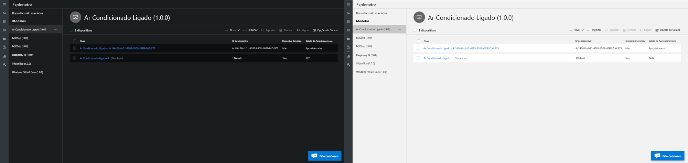
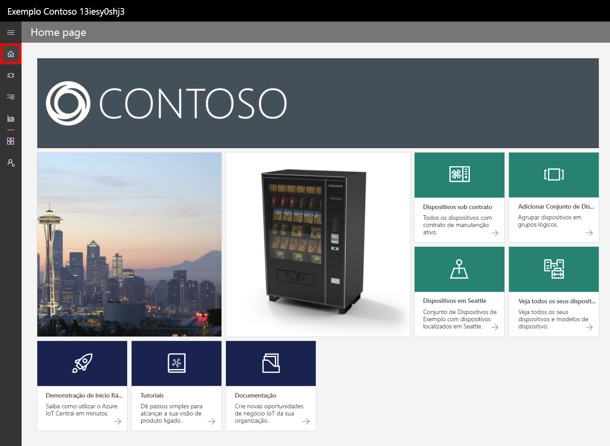
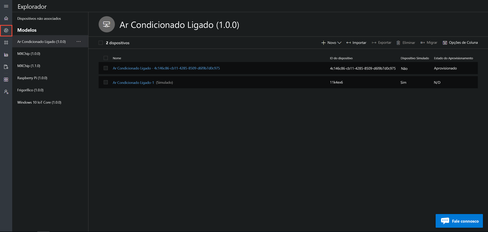
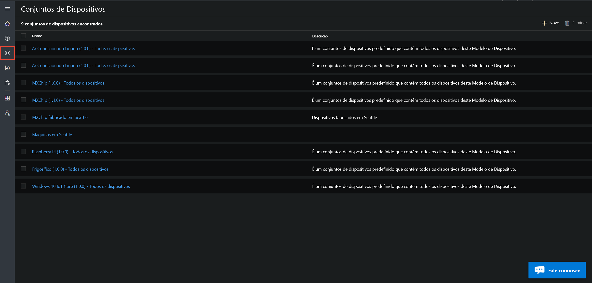
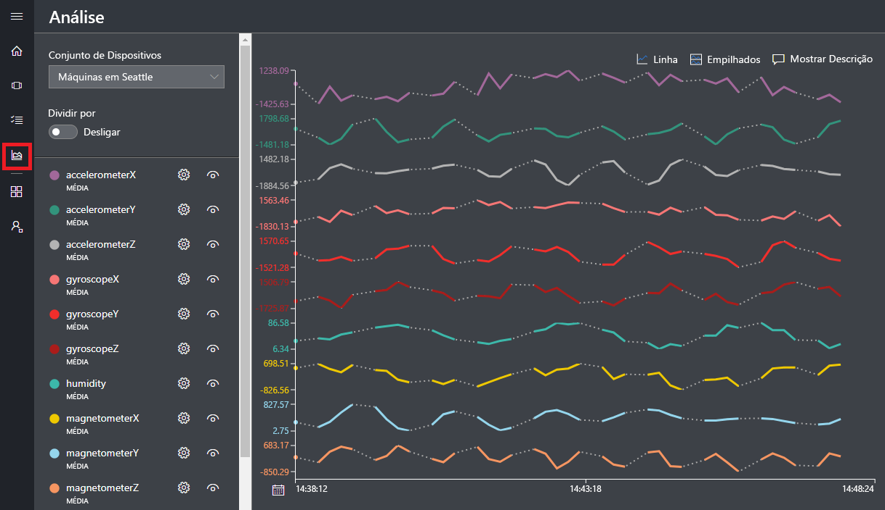
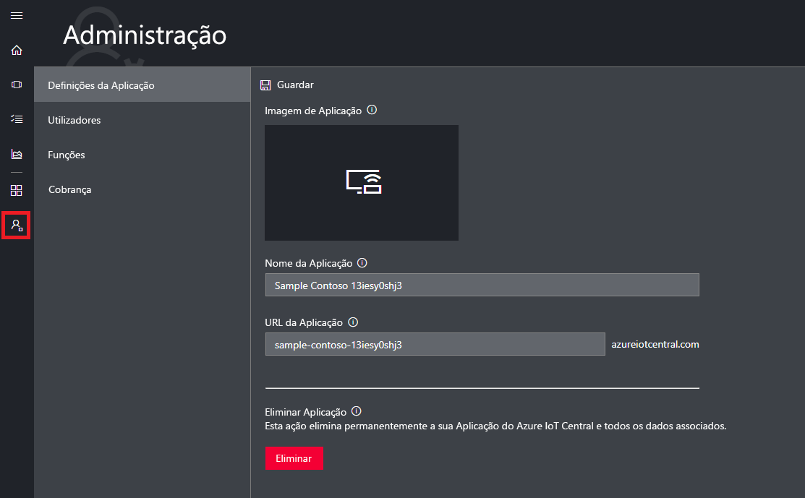

# Apresentação da IU do Azure IoT Central

Este artigo apresenta-lhe a IU do Microsoft Azure IoT Central. Pode utilizar a IU para criar, gerir e utilizar uma solução do Azure IoT Central e os respetivos dispositivos ligados.

Como _construtor_, utilize a IU do Azure IoT Central para definir a sua solução do Azure IoT Central. Pode utilizar a IU para:

- Definir os tipos de dispositivos que ligam à solução.
- Configurar as regras e ações para os seus dispositivos.
- Personalizar a IU para um _operador_ que utiliza a solução.

Como _operador_, utilize a IU do Azure IoT Central para gerir a sua solução do Azure IoT Central. Pode utilizar a IU para:

- Monitorizar os seus dispositivos.
- Configurar os seus dispositivos.
- Resolver e remediar problemas nos seus dispositivos.
- Aprovisionar novos dispositivos.

## Utilizar o menu de navegação à esquerda

Utilize o menu de navegação à esquerda para aceder às diferentes áreas da aplicação:

| Menu | Descrição |
| ---- | ----------- |
|  | <ul><li>O botão **Home** apresenta a página de boas-vindas da sua aplicação. Como construtor, pode personalizar esta página de boas-vindas para os operadores.</li><li>O botão **Device Explorer** lista os modelos de dispositivo definidos na sua aplicação e os dispositivos simulados e reais associados a cada modelo de dispositivo. Como operador, utilize o **Device Explorer** para gerir os dispositivos ligados.</li><li>O botão **Device Sets** permite-lhe ver e criar conjuntos de dispositivos. Como operador, pode criar conjuntos de dispositivos como uma coleção lógica de dispositivos especificados por uma consulta.</li><li>O botão **Analytics** mostra a análise derivada da telemetria dos dispositivos, para dispositivos e conjuntos de dispositivo. Como operador, pode criar vistas personalizadas com base nos dados dos dispositivos para obter informações da aplicação.</li><li>O botão **Application Builder** mostra as ferramentas utilizadas por um construtor, como a ferramenta **Criar Modelo de Dispositivo**.</li><li>O botão **Administration** mostra as páginas de administração da aplicação, onde um administrador pode gerir as definições, os utilizadores e as funções da aplicação.</li></ul> |

## Pesquisa, ajuda e suporte

O menu superior é apresentado em todas as páginas:

- Para procurar modelos de dispositivos e dispositivos, escolha o ícone **Pesquisar**.
- Para obter ajuda e suporte, escolha o menu pendente **Ajuda** para obter uma lista de recursos.
- Para controlar os tutoriais, altere o tema da IU ou terminar sessão na aplicação, escolha o ícone **Conta**.

Pode escolher entre um tema claro ou um tema escuro para a IU:

## Página de boas-vindas

A página de boas-vindas é a primeira página que vê ao iniciar sessão na sua aplicação do Azure IoT Central. Como construtor, pode personalizar a página de boas-vindas para outros utilizadores da aplicação através da adição de mosaicos. Para obter mais informações, veja o tutorial [Personalizar a vista de operador do Azure IoT Central](tutorial-customize-operator.md).

## Explorador de dispositivos

A página do explorador apresenta os _modelos de dispositivos_ e os _dispositivos_ na aplicação do Azure IoT Central.

* Um modelo do dispositivo define um tipo de dispositivo que pode ligar à aplicação. Para obter mais informações, veja [Definir um novo tipo de dispositivo na aplicação do Azure IoT Central](tutorial-define-device-type.md).
* Um dispositivo representa um dispositivo real ou simulado na aplicação. Para obter mais informações, veja [Adicionar um novo dispositivo à aplicação do Azure IoT Central](tutorial-add-device.md).

## Conjuntos de dispositivos

A página _conjuntos de dispositivo_ apresenta os conjuntos de dispositivos criados pelo construtor. Um conjunto de dispositivos é uma coleção de dispositivos relacionados. Um construtor define uma consulta para identificar os dispositivos que estão incluídos num conjunto de dispositivos. Utilize conjuntos de dispositivos quando personalizar a análise na aplicação. Para obter mais informações, veja o artigo [Utilizar conjuntos de dispositivos na aplicação do Azure IoT Central](howto-use-device-sets.md).

## Análise

A página de análise apresenta gráficos que o ajudam a compreender como se comportam os dispositivos ligados à sua aplicação. Um operador utiliza esta página para monitorizar e investigar problemas dos dispositivos ligados. O construtor pode definir os gráficos apresentados nesta página. Para obter mais informações, veja o artigo [Criar análise personalizada para a aplicação do Azure IoT Central](howto-create-analytics.md).

## Application Builder

A página do construtor de aplicação contém ligações para as ferramentas utilizadas pelo construtor para criar uma aplicação do Azure IoT Central, tais como criar modelos de dispositivos e configurar a página de boas-vindas. Para obter mais informações, veja o tutorial [Definir um novo tipo de dispositivo na aplicação do Azure IoT Central](tutorial-define-device-type.md).

## Administração

A página de administração contém ligações para as ferramentas utilizadas pelo administrador, por exemplo, para definir utilizadores e funções nas aplicações. Para obter mais informações, veja o artigo [Administrar a aplicação do Azure IoT Central](howto-administer.md).

## Passos seguintes

Agora que tem uma descrição geral do Azure IoT Central e está familiarizado com o esquema da IU, o passo seguinte sugerido é concluir o início rápido [Criar uma aplicação do Azure IoT Central](quick-deploy-iot-central.md).