# Criar uma aplicação do Azure IoT Central

Como _construtor_, utilize a IU do Azure IoT Central para definir a sua aplicação do Microsoft Azure IoT Central. Este manual de início rápido mostra-lhe como:

- Crie uma aplicação do Azure IoT Central que contenha um exemplo do _modelo de dispositivo_ e _dispositivos_ simulados.
- Veja as funcionalidades do modelo de dispositivo da **Máquina de Venda Refrigerada** na sua aplicação.
- Veja a telemetria e a análise a partir dos seus dispositivos do **Refrigerador**.

Neste início rápido, verá um dispositivo do **Refrigerador** simulado a partir de um modelo de dispositivo. O dispositivo simulado:

* Envia telemetria, como a temperatura e a pressão, para a sua aplicação.
* Comunica os valores de propriedade do dispositivo, como um alerta de movimento para a aplicação.
* Tem definições de dispositivo, como a velocidade da ventoinha, que pode definir na aplicação.

Quando cria um dispositivo simulado a partir de um modelo de dispositivo numa aplicação do Azure IoT Central, o dispositivo simulado permite-lhe testar a aplicação antes de ligar a um dispositivo real.

## Criar a aplicação

Para concluir este início rápido, tem de criar uma aplicação do Azure IoT Central a partir do modelo da aplicação de **Exemplo do Contoso**.

Navegue para a página do [Gestor de Aplicações](https://aka.ms/iotcentral) do Azure IoT Central. Em seguida, introduza o endereço de e-mail e a palavra-passe que utiliza para aceder à sua subscrição do Azure:

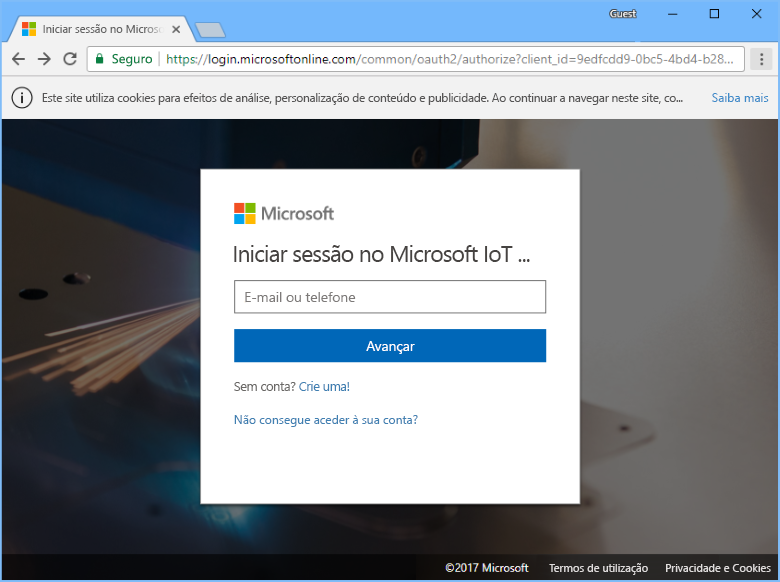

Para começar a criar uma nova aplicação do Azure IoT Central, escolha **Nova Aplicação**:

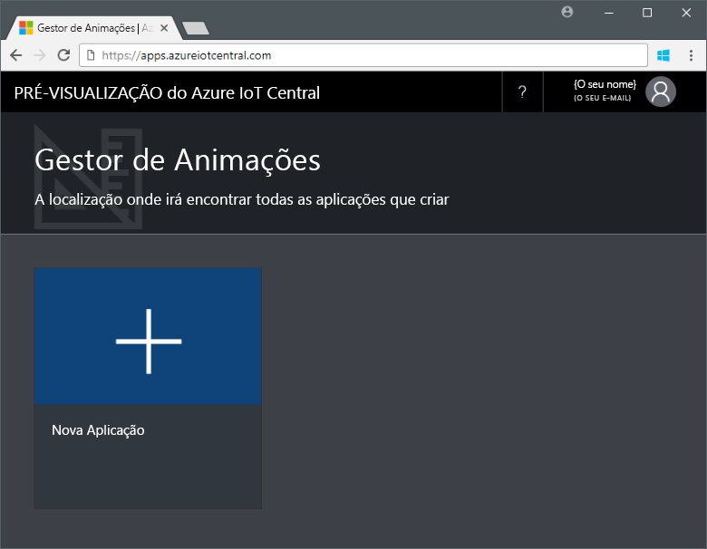

Para criar uma nova aplicação do Azure IoT Central:

1. Escolha o plano de pagamento **Aplicação de Avaliação Gratuita**.
1. Escolha um nome simpático para a aplicação, como **Contoso IoT**. O Azure IoT Central gera um prefixo de URL exclusivo para si. Pode alterar este prefixo de URL para algo mais memorável.
1. Escolha o modelo da aplicação de **Exemplo do Contoso** .
1. Em seguida, escolha **Criar**.

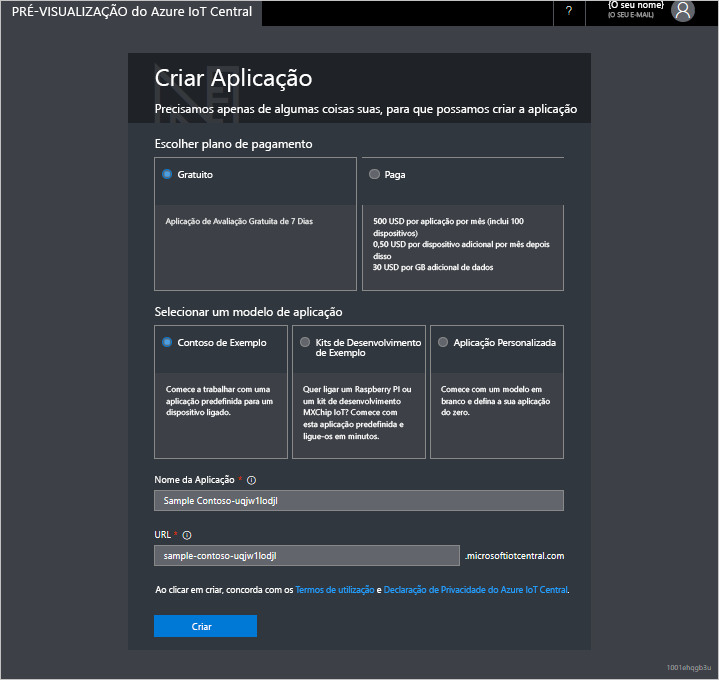

## Navegue para a aplicação

Quando a aplicação estiver pronta, a **Homepage** da sua aplicação é apresentada. O _Modo de Design_ no canto superior direito pode ser ativado para editar a Homepage. O URL da aplicação é o URL que especificou no passo anterior:

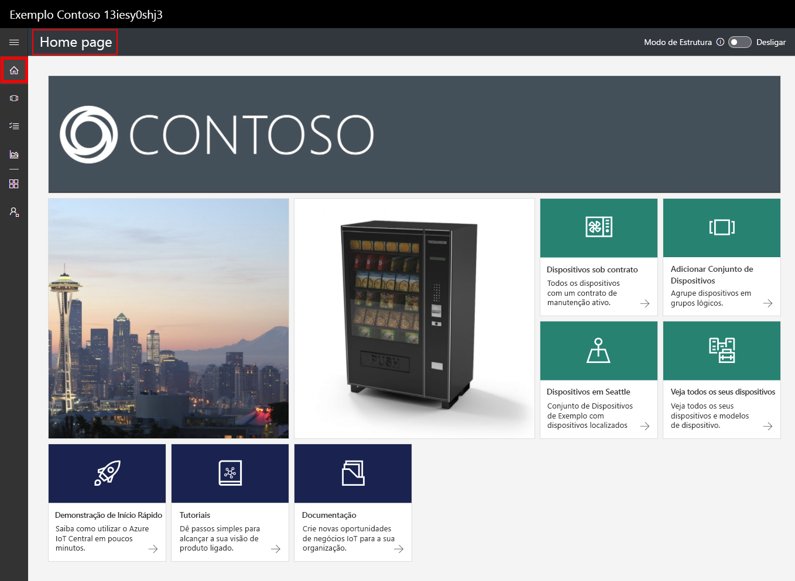

Utilize o _menu de navegação à esquerda_ para aceder às diferentes áreas da sua nova aplicação do Azure IoT Central:

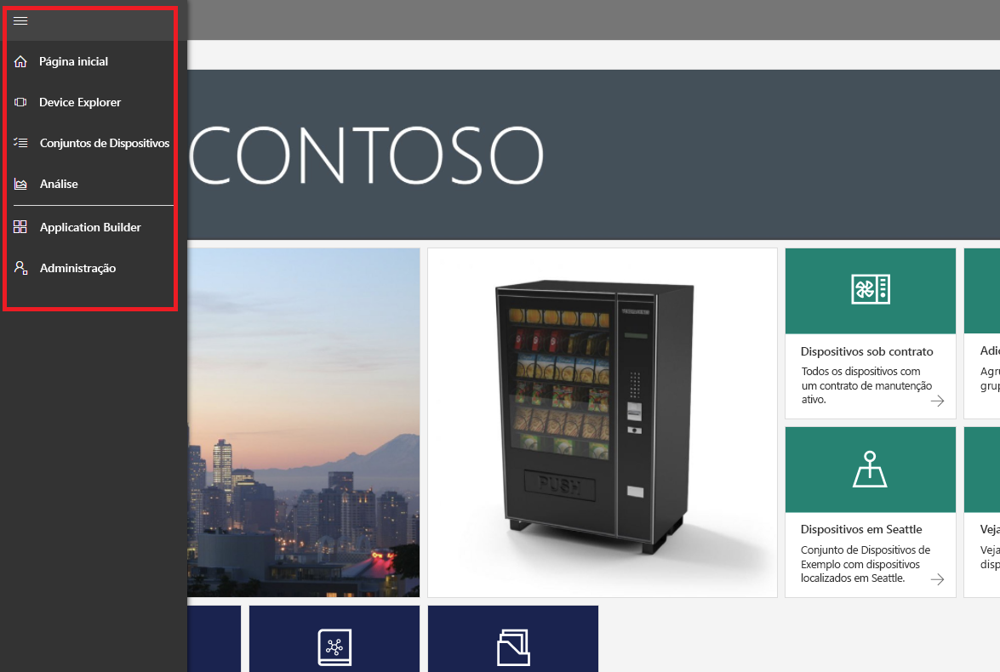

Para ver os modelos de dispositivos e os dispositivos na sua aplicação, escolha **Explorador de Dispositivos** no menu de navegação à esquerda. O exemplo de aplicação inclui o modelo de dispositivo da **Máquina de Venda Refrigerada**. Já existem três dispositivos simulados criados através deste modelo de dispositivo:

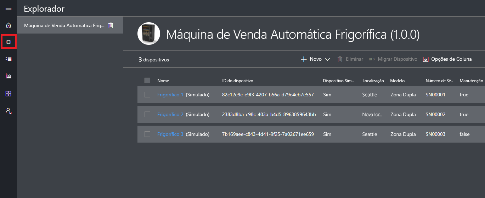

## Ver o modelo de dispositivo e dispositivos

Utilize os seguintes passos para ver um dispositivo de refrigerador que foi criado a partir do modelo de dispositivo da **Máquina de Venda Refrigerada**. Um modelo de dispositivo define:

* _Medidas_, como a telemetria de temperatura, enviada a partir de um dispositivo.
* _Definições_, como a velocidade da ventoinha, que lhe permite controlar o dispositivo.
* _Propriedades_, como o número de série, que armazenam informações sobre o dispositivo.
* [Regras](howto-create-telemetry-rules.md) que lhe permitem automatizar ações com base no comportamento do dispositivo.
* Um _dashboard_ personalizável que apresenta informações sobre o dispositivo.

Pode criar os dispositivos simulados e reais a partir de um modelo de dispositivo.

### Medições

A página **Medidas** para o dispositivo do **Refrigerador 1** é apresentada. Pode ver a lista de medidas enviadas do dispositivo simulado. A página também apresenta um gráfico personalizável das medidas visíveis:

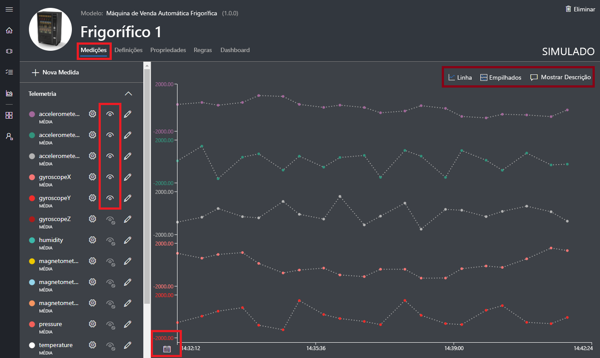

Pode alternar a visibilidade dos elementos individuais e personalizar o gráfico. O gráfico atual mostra a telemetria de um dispositivo simulado. Pode adicionar novas medidas ao modelo de dispositivo se tiver as permissões adequadas.

> [!NOTE]
> Poderá ter de aguardar durante um curto período antes dos dados simulados serem apresentados no gráfico.

### Definições

Escolha **Definições**. Na página **Definições**, pode controlar o dispositivo. Por exemplo, pode atualizar a velocidade da ventoinha no refrigerador:

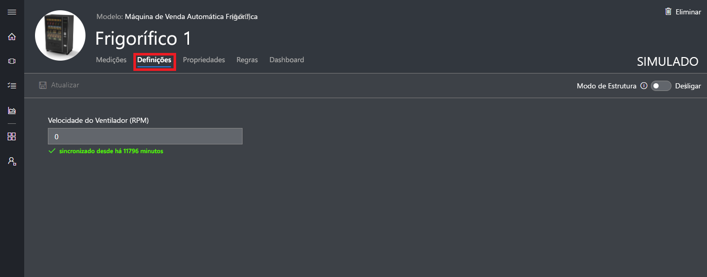

É apresentada uma definição como **sincronizada** quando um dispositivo reconhece a alteração.

### Propriedades

Escolha **Propriedades**. Na página **Propriedades**, pode:

* Manter informações sobre o seu dispositivo, como o nome de cliente.
* Ver os valores de propriedade comunicados pelo dispositivo, por exemplo, como um alerta de movimento.

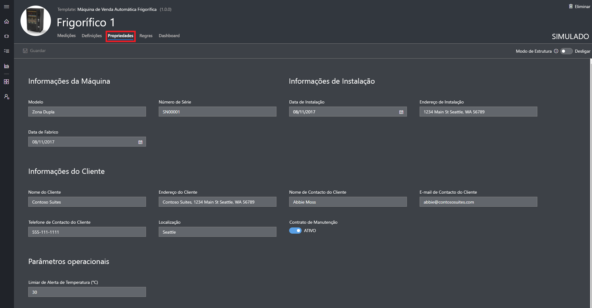

### Dashboard

Escolha **Dashboard**. O dashboard é uma vista personalizável de informações sobre o seu dispositivo, como medidas, KPIs e propriedades:

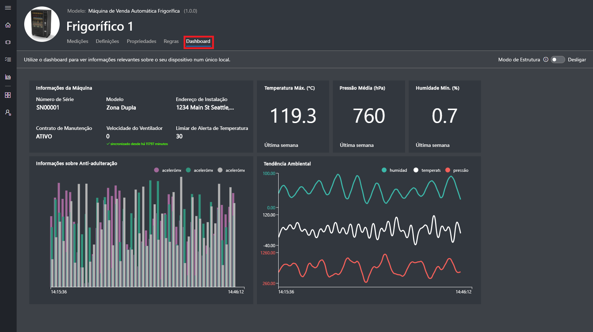

## Ver análise

A secção anterior mostrou como ver informações sobre um dispositivo individual. Pode utilizar [conjuntos de dispositivos](howto-use-device-sets.md) e [análise](howto-create-analytics.md) para ver informações consolidadas a partir de vários dispositivos.

Um conjunto de dispositivos utiliza uma consulta para selecionar dinamicamente um conjunto de dispositivos que correspondem aos critérios. Por exemplo, o conjunto de dispositivos **Máquinas em Seattle** seleciona dispositivos do refrigerador cuja localização é Seattle. Para ver o conjunto de dispositivos **Máquinas em Seattle**, escolha **Conjuntos de Dispositivos** no menu de navegação à esquerda e, em seguida, escolha **Máquinas em Seattle**:

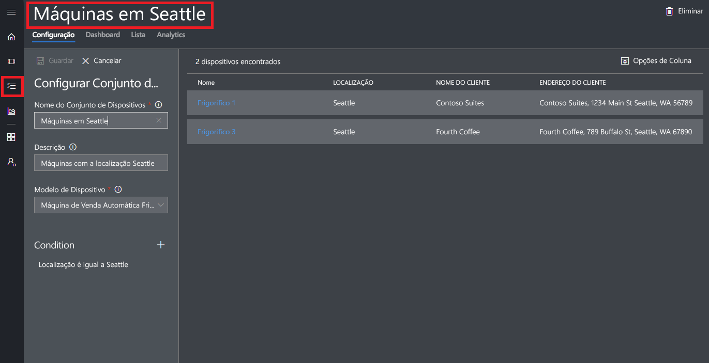

Pode ver os dados de análise para os dispositivos num conjunto de dispositivos na página **Análise**:

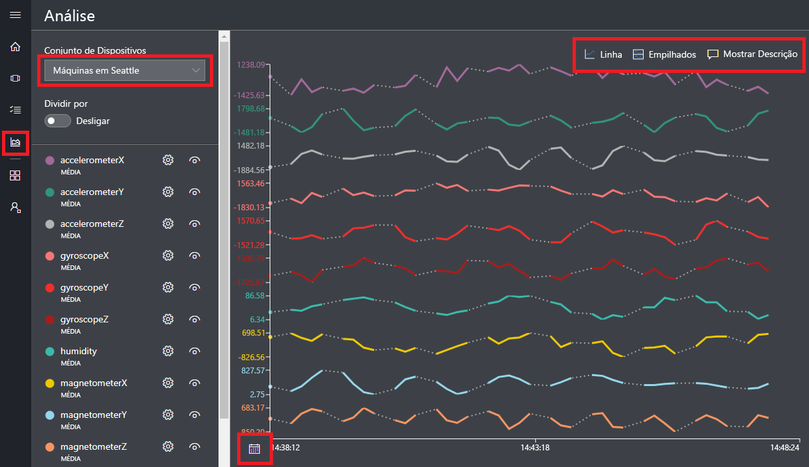

## Passos seguintes

Neste início rápido criou uma aplicação do Azure IoT Central pré-preenchida que contém um modelo de dispositivo e dispositivos simulados da **Máquina de Venda Refrigerada**. Veja [Definir um novo modelo de dispositivo na sua aplicação](tutorial-define-device-type.md) para saber mais, enquanto construtor, sobre como definir os seus próprios modelos de dispositivos.
