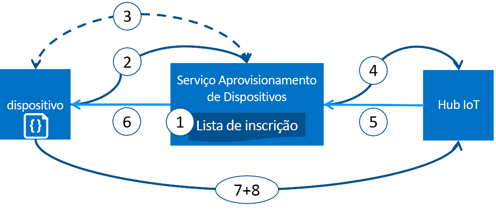

# Aprovisionar dispositivos com o Serviço Aprovisionamento de Dispositivos no Hub IoT do Azure
O Microsoft Azure fornece um conjunto avançado de serviços de cloud pública integrada para todas as suas necessidades de solução IoT. O Serviço Aprovisionamento de Dispositivos no Hub IoT é um serviço auxiliar para o Hub IoT que permite o aprovisionamento sem toques e just-in-time no hub IoT certo sem que seja necessária a intervenção humana, permitindo aos clientes aprovisionar milhões de dispositivos de forma segura e dimensionável.

## Quando utilizar o Serviço de Aprovisionamento de Dispositivos
Existem vários cenários de aprovisionamento em que o Serviço de Aprovisionamento de Dispositivos é uma excelente opção para ligar e configurar dispositivos no Hub IoT, tais como:

* Aprovisionamento sem toques numa solução de IoT única sem codificar informações de ligação do Hub IoT na fábrica de (configuração inicial)
* Balanceamento de carga de dispositivos em vários hubs
* Ligação de dispositivos à solução de IoT do respetivo proprietário com base em dados de transações de venda (arquitetura "multitenancy")
* Ligação de dispositivos a uma solução de IoT específica, consoante o caso de utilização (isolamento da solução)
* Ligação de um dispositivo ao hub IoT com a latência mais baixa (fragmentação geográfica)
* Reaprovisionamento com base numa alteração no dispositivo
* Implementar as chaves utilizadas pelo dispositivo para estabelecer ligação ao Hub IoT (quando não utilizar certificados x.509 para ligar)

## Nos bastidores
Todos os cenários listados na secção anterior podem ser executados com o serviço de aprovisionamento para o aprovisionamento sem toques com o mesmo fluxo. Muitos dos passos manuais tradicionalmente envolvidos no aprovisionamento são automatizados com o Serviço de Aprovisionamento de Dispositivos para diminuir o tempo de implementação de dispositivos IoT e reduzir o risco de erro manual. A secção seguinte descreve o que acontece nos bastidores para que um dispositivo seja aprovisionado. O primeiro passo é manual e todos os passos seguintes são automatizados.

1. O fabricante do dispositivo adiciona as informações de registo do dispositivo à lista de inscrição no portal do Azure.
2. O dispositivo contacta o ponto final do serviço de aprovisionamento definido na fábrica. O dispositivo transmite as informações de identificação para o serviço de aprovisionamento para comprovar a sua identidade.
3. O serviço de aprovisionamento valida a identidade do dispositivo ao validar o ID de registo e a chave contra a entrada da lista de inscrição, utilizando um desafio nonce ([Trusted Platform Module](https://trustedcomputinggroup.org/work-groups/trusted-platform-module/)) ou verificação de X.509 standard (X.509).
4. O serviço de aprovisionamento regista o dispositivo com um hub IoT e preenche o [estado de duplicação pretendido](../iot-hub/iot-hub-devguide-device-twins.md) do dispositivo.
5. O hub IoT devolve as informações de ID do dispositivo ao serviço de aprovisionamento.
6. O serviço de aprovisionamento devolve as informações de ligação do hub IoT ao dispositivo. O dispositivo pode agora começar a enviar dados diretamente para o hub IoT.
7. O dispositivo estabelece ligação ao hub IoT.
8. O dispositivo obtém o estado pretendido do respetivo dispositivo duplo no hub IoT.

## Processo de aprovisionamento
Existem dois passos distintos no processo de implementação de um dispositivo em que o Serviço de Aprovisionamento de Dispositivos participa que podem ser executados de forma independente:

* O **passo de fabrico** no qual o dispositivo é criado e preparado na fábrica, e
* O **passo de configuração da cloud** no qual o Serviço de Aprovisionamento de Dispositivos é configurado para o aprovisionamento automatizado.

Ambos os passos enquadram-se de forma totalmente integrada com os processos de implementação e fabrico existentes. O Serviço de Aprovisionamento de Dispositivos simplifica até alguns processos de implementação que envolvem muito trabalho manual para obter informações de ligação no dispositivo.

### Passo de fabrico
Este passo envolve o que acontece na linha de fabrico. As funções envolvidas neste passo incluem o designer de silício, o fabricante de silício, o integrador e/ou o fabricante final do dispositivo. Este passo está relacionado com a criação do próprio hardware.

O Serviço de Aprovisionamento de Dispositivos não introduz um novo passo no processo de fabrico; em vez disso, vincula-se ao passo existente que instala o software inicial e (idealmente) o HSM no dispositivo. Em vez de criar um ID de dispositivo neste passo, o dispositivo é programado com as informações do serviço de aprovisionamento, permitindo-lhe chamar o serviço de aprovisionamento para obter a respetiva informação de ligação/ atribuição de solução IoT quando é ligado.

Também neste passo, o fabricante fornece informações sobre a chave de identificação ao implementador/operador do dispositivo. O fornecimento dessas informações pode ser tão simples como confirmar que todos os dispositivos têm um certificado X.509 gerado a partir de um certificado de assinatura fornecido pelo implementador/operador do dispositivo ou tão complicado como extrair a parte pública de uma chave de endossamento TPM de cada dispositivo TPM. Estes serviços são oferecidos atualmente por muitos fabricantes de silício.

### Passo de configuração da cloud
Este passo diz respeito à configuração da cloud para o aprovisionamento automático adequado. Geralmente, existem dois tipos de utilizadores envolvidos no passo de configuração da cloud: alguém que saiba como os dispositivos têm de ser inicialmente configurados (um operador do dispositivo) e alguém que saiba como os dispositivos devem ser divididos entre os hubs IoT (um operador da solução).

Há uma configuração inicial única do aprovisionamento que tem de ocorrer, que normalmente é processada pelo operador da solução. Depois de o serviço de aprovisionamento ser configurado, não tem de ser modificado, a não ser que o caso de utilização mude.

Depois de o serviço ser configurado para o aprovisionamento automático, tem de ser preparado para inscrever dispositivos. Este passo é executado pelo operador do dispositivo, que conhece a configuração desejada dos dispositivos e é responsável por certificar-se de que o serviço de aprovisionamento pode atestar corretamente a identidade do dispositivo quando vai à procura do respetivo hub IoT. O operador do dispositivo utiliza as informações da chave de identificação do fabricante e adiciona-as à lista de inscrição. Podem existir atualizações subsequentes à lista de inscrição à medida que são adicionadas novas entradas ou que as entradas existentes são atualizadas com as informações mais recentes sobre os dispositivos.

## Registo e aprovisionamento
*Aprovisionamento* tem significados diferentes consoante a indústria em que o termo é utilizado. No contexto do aprovisionamento de dispositivos IoT na respetiva solução de cloud, o aprovisionamento é um processo composto por duas partes:

1. A primeira parte consiste em estabelecer a ligação inicial entre o dispositivo e a solução de IoT ao registar o dispositivo.
2. A segunda parte consiste em aplicar a configuração adequada ao dispositivo com base nos requisitos específicos da solução na qual foi registado.

Após a conclusão desses dois passos, podemos afirmar que o dispositivo foi totalmente aprovisionado. Alguns serviços cloud fornecem apenas o primeiro passo do processo de aprovisionamento, ou seja, registam os dispositivos no ponto final da solução de IoT, mas não fornecem a configuração inicial. O Serviço de Aprovisionamento de Dispositivos automatiza os dois passos para fornecer uma experiência totalmente integrada de aprovisionamento do dispositivo.

## Funcionalidades do Serviço de Aprovisionamento de Dispositivos
O Serviço de Aprovisionamento de Dispositivos tem muitas funcionalidades, o que o torna ideal para aprovisionar dispositivos.

* Suporte de **atestado seguro** para identidades baseadas em X.509 e TPM.
* **Lista de inscrição** que contém o registo completo de dispositivos/grupos de dispositivos que podem ser registados em qualquer momento. A lista de inscrição contém informações sobre a configuração pretendida do dispositivo, depois de ser registado, e pode ser atualizada em qualquer altura.
* **Várias políticas de alocação** para controlar a forma como o Serviço de Aprovisionamento de Dispositivos atribui dispositivos aos hubs IoT para suportar os seus cenários.
* **Monitorização e registo de diagnóstico** para garantir que tudo está a funcionar corretamente.
* O **suporte de vários hubs** permite que o Serviço de Aprovisionamento de Dispositivos atribua dispositivos a mais do que um hub IoT. O Serviço de Aprovisionamento de Dispositivos pode comunicar com hubs em várias subscrições do Azure.
* O **suporte de várias regiões** permite que o Serviço de Aprovisionamento de Dispositivos atribua dispositivos a hubs IoT noutras regiões.

Pode saber mais sobre os conceitos e as funcionalidades envolvidas no aprovisionamento de dispositivos em [conceitos de dispositivo](concepts-device.md), [conceitos de serviço](concepts-service.md) e [conceitos de segurança](concepts-security.md).

## Suporte de várias plataformas
O Serviço de Aprovisionamento de Dispositivos, como todos os serviços IoT do Azure, funciona em várias plataformas com diversos sistemas operativos. O Azure disponibiliza SDKs open source em várias [linguagens](https://github.com/Azure/azure-iot-sdks) para facilitar a ligação dos dispositivos e a gestão do serviço. O Serviço de Aprovisionamento de Dispositivos suporta os seguintes protocolos para ligar dispositivos:

* HTTPS
* AMQP
* AMQP através de sockets web
* MQTT
* MQTT através de sockets web

O Serviço de Aprovisionamento de Dispositivos só suporta ligações HTTPS para operações de serviço.

## Regiões
O Serviço de Aprovisionamento de Dispositivos está disponível em muitas regiões. A lista atualizada das regiões existentes e recentemente anunciadas para todos os serviços encontra-se em [Regiões do Azure](https://azure.microsoft.com/regions/). Pode verificar a disponibilidade do Serviço de Aprovisionamento de Dispositivos na página [Estado do Azure](https://azure.microsoft.com/status/).

> [!NOTE]
> O Serviço de Aprovisionamento de Dispositivos é global e não está vinculado a uma localização. No entanto, tem de especificar uma região na qual os metadados associados ao seu perfil do Serviço de Aprovisionamento de Dispositivos irão residir.

## Disponibilidade
Existe um Contrato de Nível de Serviço de 99,9% para o Serviço de Aprovisionamento de Dispositivos e pode [ler o SLA](https://azure.microsoft.com/support/legal/sla/iot-hub/). O [SLA do Azure](https://azure.microsoft.com/support/legal/sla/) completo explica a disponibilidade garantida do Azure em termos globais.

## Quotas
Cada subscrição do Azure possui limites de quota predefinidos que podem afetar o âmbito da sua solução de IoT. O limite atual por subscrição é de 10 Serviços de Aprovisionamento de Dispositivos por subscrição.

Para obter mais detalhes sobre os limites de quotas:

* [Limites do Serviço das Subscrições do Azure](../azure-subscription-service-limits.md)

## Componentes do Azure relacionados
O Serviço de Aprovisionamento de Dispositivos automatiza o aprovisionamento de dispositivos com o Hub IoT do Azure. Saiba mais sobre o [Hub IoT](https://docs.microsoft.com/azure/iot-hub/).

## Passos seguintes
Agora já tem uma descrição geral do aprovisionamento de dispositivos IoT no Azure. O passo seguinte é experimentar um cenário de IoT ponto a ponto.
> [!div class="nextstepaction"]
> [Configurar o Serviço Aprovisionamento de Dispositivos no Hub IoT com o portal do Azure](quick-setup-auto-provision.md)
> [Criar e aprovisionar um dispositivo simulado](quick-create-simulated-device.md)
> [Configurar o dispositivo para aprovisionamento](tutorial-set-up-device.md)
