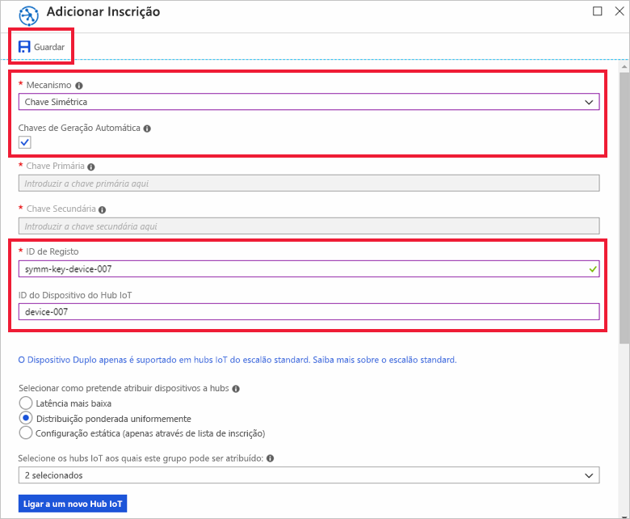

# <a name="quickstart-provision-a-simulated-device-with-symmetric-keys"></a>Início rápido: Aprovisionar um dispositivo simulado com chaves simétricas

Neste guia de início rápido, vai aprender a criar e executar um simulador de dispositivos numa máquina de desenvolvimento do Windows. Irá configurar este dispositivo simulado para utilizar uma chave simétrica para autenticação com uma instância do Serviço de Aprovisionamento de Dispositivos e atribuição a um hub IoT. Será utilizado código de exemplo do [SDK C do Azure IoT](https://github.com/Azure/azure-iot-sdk-c) para simular uma sequência de arranque do dispositivo que inicia o aprovisionamento. O dispositivo será reconhecido com base numa inscrição individual com uma instância do serviço de aprovisionamento e atribuído a um hub IoT.

Embora este artigo demonstre o aprovisionamento com uma inscrição individual, pode utilizar os mesmos procedimentos com grupos de inscrições. A única diferença é que tem de utilizar uma chave de dispositivo derivada com um ID de registo exclusivo para o dispositivo. Com os grupos de inscrições, a chave simétrica da inscrição não é utilizada diretamente. Embora os grupos de inscrições de chave simétrica não estejam limitados a dispositivos legados, o artigo [Como aprovisionar dispositivos legados com o atestado de chave simétrica](how-to-legacy-device-symm-key.md) fornece um exemplo de grupo de inscrições. Para obter mais informações, veja [Inscrições em grupo para o Atestado de Chave Simétrica](concepts-symmetric-key-attestation.md#group-enrollments).

Se não estiver familiarizado com o processo de aprovisionamento automático, reveja [Conceitos de aprovisionamento automático](concepts-auto-provisioning.md). 

Certifique-se também de que executa os passos descritos em [Configurar o Serviço de Aprovisionamento de Dispositivos no Hub IoT com o portal do Azure](./quick-setup-auto-provision.md) antes de continuar este início rápido. Este guia de início rápido exige que já tenha criado a instância do Serviço de Aprovisionamento de Dispositivos.

Este artigo é orientado para uma estação de trabalho baseada no Windows. No entanto, pode efetuar os procedimentos no Linux. Para obter um exemplo para Linux, veja [Como aprovisionar para multi-inquilinos](how-to-provision-multitenant.md).


[!INCLUDE [quickstarts-free-trial-note](../../includes/quickstarts-free-trial-note.md)]


## <a name="prerequisites"></a>Pré-requisitos

* Visual Studio 2015 ou [Visual Studio 2017](https://www.visualstudio.com/vs/) com a carga de trabalho ["Desenvolvimento do ambiente de trabalho em C++"](https://www.visualstudio.com/vs/support/selecting-workloads-visual-studio-2017/) ativada.
* Versão mais recente do [Git](https://git-scm.com/download/) instalada.


<a id="setupdevbox"></a>

## <a name="prepare-an-azure-iot-c-sdk-development-environment"></a>Preparar um ambiente de programação para o SDK C do Azure IoT

Nesta secção, irá preparar um ambiente de programação utilizado para criar o [SDK C do Azure IoT](https://github.com/Azure/azure-iot-sdk-c). 

O SDK inclui o código de exemplo para um dispositivo simulado. Esse dispositivo simulado irá tentar fazer o aprovisionamento durante a respetiva sequência de arranque.

1. Transfira a versão 3.11.4 do [sistema de compilação CMake](https://cmake.org/download/). Verifique o binário transferido com o valor de hash criptográfico correspondente. O exemplo seguinte utilizou o Windows PowerShell para verificar o hash criptográfico para a versão 3.11.4 da distribuição de MSI x64:

    ```PowerShell
    PS C:\Downloads> $hash = get-filehash .\cmake-3.11.4-win64-x64.msi
    PS C:\Downloads> $hash.Hash -eq "56e3605b8e49cd446f3487da88fcc38cb9c3e9e99a20f5d4bd63e54b7a35f869"
    True
    ```
    
    Os seguintes valores hash para a versão 3.11.4 foram listados no site do CMake no momento da redação deste artigo:

    ```
    6dab016a6b82082b8bcd0f4d1e53418d6372015dd983d29367b9153f1a376435  cmake-3.11.4-Linux-x86_64.tar.gz
    72b3b82b6d2c2f3a375c0d2799c01819df8669dc55694c8b8daaf6232e873725  cmake-3.11.4-win32-x86.msi
    56e3605b8e49cd446f3487da88fcc38cb9c3e9e99a20f5d4bd63e54b7a35f869  cmake-3.11.4-win64-x64.msi
    ```

    É importante que os pré-requisitos do Visual Studio (Visual Studio e a carga de trabalho "Desenvolvimento do ambiente de trabalho em C++") estejam instalados no computador, **antes** de iniciar a instalação de `CMake`. Depois de os pré-requisitos estarem assegurados e a transferência verificada, instale o sistema de compilação CMake.

2. Abra uma linha de comandos ou a shell do Git Bash. Execute o seguinte comando para clonar o SDK C do Azure IoT no repositório do GitHub:
    
    ```cmd/sh
    git clone https://github.com/Azure/azure-iot-sdk-c.git --recursive
    ```
    Atualmente, o tamanho deste repositório é de cerca de 220 MB. Esta operação deve demorar vários minutos a ser concluída.


3. Crie um subdiretório `cmake` no diretório de raiz do repositório git e navegue para essa pasta. 

    ```cmd/sh
    cd azure-iot-sdk-c
    mkdir cmake
    cd cmake
    ```

4. Execute o seguinte comando para compilar uma versão do SDK específica da plataforma de cliente de desenvolvimento. Será gerada uma solução do Visual Studio para o dispositivo simulado no diretório `cmake`. 

    ```cmd
    cmake -Dhsm_type_symm_key:BOOL=ON -Duse_prov_client:BOOL=ON  ..
    ```
    
    Se `cmake` não encontrar o compilador de C++, poderá obter erros de compilação ao executar o comando acima. Se isto acontecer, tente executar o comando seguinte na [linha de comandos do Visual Studio](https://docs.microsoft.com/dotnet/framework/tools/developer-command-prompt-for-vs). 

    Assim que a compilação for concluída com êxito, as últimas linhas de saída terão um aspeto semelhante ao seguinte:

    ```cmd/sh
    $ cmake -Dhsm_type_symm_key:BOOL=ON -Duse_prov_client:BOOL=ON  ..
    -- Building for: Visual Studio 15 2017
    -- Selecting Windows SDK version 10.0.16299.0 to target Windows 10.0.17134.
    -- The C compiler identification is MSVC 19.12.25835.0
    -- The CXX compiler identification is MSVC 19.12.25835.0

    ...

    -- Configuring done
    -- Generating done
    -- Build files have been written to: E:/IoT Testing/azure-iot-sdk-c/cmake
    ```


## <a name="create-a-device-enrollment-entry-in-the-portal"></a>Criar uma entrada de inscrição de dispositivos no portal

1. Inicie sessão no portal do Azure, clique no botão **Todos os recursos**, no menu do lado esquerdo, e abra o Serviço Aprovisionamento de Dispositivos.

2. Selecione o separador **Gerir inscrições** e, em seguida, clique no botão **Adicionar inscrição individual** na parte superior. 

3. Em **Adicionar inscrição**, introduza as seguintes informações e clique no botão **Guardar**.

    - **Mecanismo**: Selecione **chave simétrica** como o atestado de identidades *mecanismo*.

    - **Chaves de geração automática**: Esta caixa de verificação.

    - **ID de registo**: Introduza um ID de registo para identificar a inscrição. Utilize apenas carateres alfanuméricos em minúsculas e travessões ("-"). Por exemplo, `symm-key-device-007`.

    - **ID de dispositivo do IoT Hub:** Introduza um identificador de dispositivo. Por exemplo, **device-007**.

    

4. Depois de guardar a inscrição, a **Chave Primária** e a **Chave Secundária** serão geradas e adicionadas à entrada de inscrição. A inscrição do dispositivo de chave simétrica é apresentada como **symm-key-device-007** na coluna *ID de Registo* do separador *Inscrições Individuais*. 

    Abra a inscrição e copie o valor da **Chave Primária** gerada.


<a id="firstbootsequence"></a>

## <a name="simulate-first-boot-sequence-for-the-device"></a>Simular a sequência de primeiro arranque para o dispositivo

Nesta secção, atualize o código de exemplo para enviar a sequência de arranque do dispositivo para a instância do Serviço de Aprovisionamento de Dispositivos. Esta sequência de arranque fará com que o dispositivo seja reconhecido e atribuído a um hub IoT ligado à instância do Serviço de Aprovisionamento de Dispositivos.


1. No portal do Azure, selecione o separador **Descrição Geral** do Serviço de Aprovisionamento de Dispositivos e anote o valor de **_Âmbito do ID_**.

     

2. No Visual Studio, abra o ficheiro de solução **azure_iot_sdks.sln** gerado ao executar o CMake. O ficheiro de solução deve estar na seguinte localização:

    ```
    \azure-iot-sdk-c\cmake\azure_iot_sdks.sln
    ```

3. Na janela *Solution Explorer* (Explorador de Soluções) do Visual Studio, navegue para a pasta **Provision\_Samples**. Expanda o projeto de exemplo com o nome **prov\_dev\_client\_sample**. Expanda **Source Files** (Ficheiros de Origem) e abra **prov\_dev\_client\_sample.c**.

4. Localize a constante `id_scope` e substitua o valor pelo seu **Âmbito do ID** que copiou anteriormente. 

    ```c
    static const char* id_scope = "0ne00002193";
    ```

5. Localize a definição da função `main()` no mesmo ficheiro. Certifique-se de que a variável `hsm_type` está definida como `SECURE_DEVICE_TYPE_SYMMETRIC_KEY`, conforme mostrado abaixo:

    ```c
    SECURE_DEVICE_TYPE hsm_type;
    //hsm_type = SECURE_DEVICE_TYPE_TPM;
    //hsm_type = SECURE_DEVICE_TYPE_X509;
    hsm_type = SECURE_DEVICE_TYPE_SYMMETRIC_KEY;
    ```

6. Encontre a chamada para `prov_dev_set_symmetric_key_info()` no **prov\_dev\_cliente\_Sample** que é comentado.

    ```c
    // Set the symmetric key if using they auth type
    //prov_dev_set_symmetric_key_info("<symm_registration_id>", "<symmetric_Key>");
    ```

    Anule os comentários a chamada de função e substitua os valores de marcador de posição (incluindo os parênteses angulares) com o seu ID de registo e valores de chave primárias.

    ```c
    // Set the symmetric key if using they auth type
    prov_dev_set_symmetric_key_info("symm-key-device-007", "your primary key here");
    ```
   
    Guarde o ficheiro.

7. Clique com o botão direito do rato no projeto **prov\_dev\_client\_sample** e selecione **Definir como Projeto de Arranque**. 

8. No menu do Visual Studio, selecione **Debug** (Depurar)  > **Start without debugging** (Iniciar sem depuração) para executar a solução. Na linha de comandos para recriar o projeto, clique em **Yes** (Sim) para recriar o projeto antes da execução.

    O resultado seguinte é um exemplo do dispositivo simulado a arrancar com êxito e a ligar à instância do serviço de aprovisionamento para atribuição a um hub IoT:

    ```cmd
    Provisioning API Version: 1.2.8

    Registering Device

    Provisioning Status: PROV_DEVICE_REG_STATUS_CONNECTED
    Provisioning Status: PROV_DEVICE_REG_STATUS_ASSIGNING
    Provisioning Status: PROV_DEVICE_REG_STATUS_ASSIGNING

    Registration Information received from service: 
    test-docs-hub.azure-devices.net, deviceId: device-007    
    Press enter key to exit:
    ```

9. No portal, navegue até ao hub IoT ao qual o dispositivo simulado foi atribuído e clique no separador **Dispositivos IoT**. Após o aprovisionamento bem-sucedido do dispositivo simulado no hub, o ID de dispositivo aparece no painel **Dispositivos IoT**, com o *ESTADO* **ativado**. Poderá ter de clicar no botão **Atualizar** na parte superior. 

     


## <a name="clean-up-resources"></a>Limpar recursos

Se quiser continuar a trabalhar e a explorar o exemplo de cliente do dispositivo, não limpe os recursos criados neste Guia Rápido. Se não planear continuar, utilize os passos seguintes para eliminar todos os recursos criados no Guia Rápido.

1. Feche a janela da saída do exemplo de dispositivo cliente no seu computador.
1. No menu do lado esquerdo do portal do Azure, clique em **Todos os recursos** e selecione o seu Serviço Aprovisionamento de Dispositivos. Abra **Gerir Inscrições** para o seu serviço e, em seguida, clique no separador **Inscrições Individuais**. Selecione o *ID DE REGISTO* do dispositivo que inscreveu neste Início Rápido e clique no botão **Eliminar** na parte superior. 
1. No menu do lado esquerdo do portal do Azure, clique em **Todos os recursos** e selecione o seu hub IoT. Abra **Dispositivos IoT** para o seu hub, selecione o *ID DE DISPOSITIVO* do dispositivo que registou neste Início Rápido e, em seguida, clique no botão **Eliminar** na parte superior.

## <a name="next-steps"></a>Passos Seguintes

Neste Guia de Início Rápido, criou um dispositivo simulado no seu computador Windows e aprovisionou-o no seu hub IoT ao utilizar a Chave simétrica com o Serviço Aprovisionamento de Dispositivos no Hub IoT do Azure, no portal. Para saber como inscrever o seu dispositivo programaticamente, continue para o Guia de Início Rápido para inscrição programática de dispositivos X.509. 

> [!div class="nextstepaction"]
> [Manual de Início Rápido do Azure - Inscrever dispositivos X.509 no Serviço de Aprovisionamento de Dispositivos no Hub IoT do Azure](quick-enroll-device-x509-java.md)
