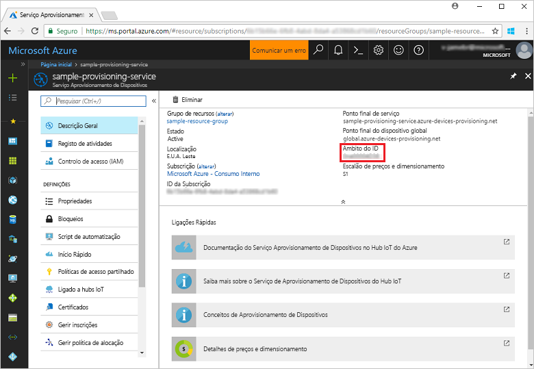
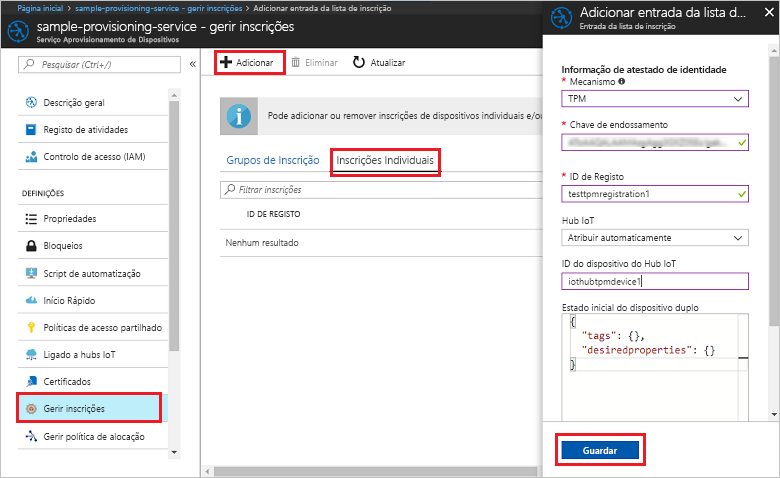
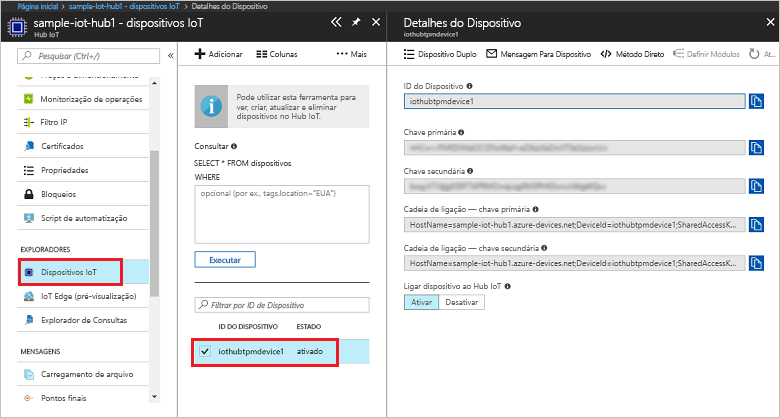

# <a name="create-and-provision-a-simulated-tpm-device-using-c-device-sdk-for-iot-hub-device-provisioning-service"></a>Criar e aprovisionar um dispositivo TPM simulado com o SDK de dispositivo C# com o Serviço de Aprovisionamento de Dispositivos no Hub IoT
> [!div class="op_single_selector"]
> * [C](quick-create-simulated-device.md)
> * [Java](quick-create-simulated-device-tpm-java.md)
> * [C#](quick-create-simulated-device-tpm-csharp.md)
> * [Python](quick-create-simulated-device-tpm-python.md)

Estes passos mostram-lhe como criar o exemplo de dispositivo TPM simulado do Azure IoT Hub C# SKD na máquina de desenvolvimento que executa o SO Windows e ligar o dispositivo ao Serviço Aprovisionamento de Dispositivos e ao seu Hub IoT. O código de exemplo utiliza o simulador de TPM do Windows como o [Módulo de Segurança de Hardware (HSM)](https://azure.microsoft.com/blog/azure-iot-supports-new-security-hardware-to-strengthen-iot-security/) do dispositivo. 

Certifique-se de que concluir os passos em [Set up IoT Hub Device Provisioning Service with the Azure portal](./quick-setup-auto-provision.md) (Configurar o Serviço Aprovisionamento de Dispositivos com o portal do Azure).

<a id="setupdevbox"></a>
## <a name="prepare-the-development-environment"></a>Preparar o ambiente de desenvolvimento 

1. Certifique-se de que tem o [.Net Core SDK](https://www.microsoft.com/net/download/windows) instalado no computador. 

1. Verifique se `git` está instalado no computador e que é adicionado às variáveis de ambiente às quais a janela de comandos pode aceder. Veja as [ferramentas de cliente Git da Software Freedom Conservancy](https://git-scm.com/download/) relativamente à mais recente versão das ferramentas de `git` a instalar, que incluem o **Git Bash**, a aplicação de linha de comandos que pode utilizar para interagir com o seu repositório Git local. 

4. Abra uma linha de comandos ou o Git Bash. Clone o SDK do IoT do Azure para o repositório do GitHub C#:
    
    ```cmd
    git clone --recursive https://github.com/Azure/azure-iot-sdk-csharp.git
    ```

## <a name="provision-the-simulated-device"></a>Aprovisionar o dispositivo simulado


1. Inicie sessão no portal do Azure. Clique no botão **Todos os recursos**, no menu do lado esquerdo, e abra o Serviço Aprovisionamento de Dispositivos. No painel **Descrição Geral**. tome nota do valor **_Âmbito de ID_**.

     


2. Numa linha de comandos, altere os diretórios para o diretório de projeto para o exemplo de aprovisionamento de dispositivos TPM.

    ```cmd
    cd .\azure-iot-sdk-csharp\provisioning\device\samples\ProvisioningDeviceClientTpm
    ```

2. Escreva o seguinte comando para criar e executar o exemplo de aprovisionamento de dispositivos TPM. Substitua o valor `<IDScope>` pelo Âmbito de ID para o serviço de aprovisionamento. 

    ```cmd
    dotnet run <IDScope>
    ```

1. A janela de comandos apresenta a **_Chave de Endossamento_**, o **_ID de Registo_** e um **_ID de Dispositivo_** necessários para a inscrição do dispositivo. Anote estes valores. 
   > [!NOTE]
   > Não confunda a janela que contém a saída do comando com a janela que contém a saída do simulador do TPM. Poderá ter de clicar na janela de comando para colocá-lo em primeiro plano.

     


4. No portal do Azure, no painel de resumo do Serviço de Aprovisionamento de Dispositivos, selecione **Gerir inscrições**. Selecione o separador **Inscrições Individuais** e clique no botão **Adicionar**, na parte superior. 

5. Em **Adicionar entrada da lista de inscrições**, introduza as informações seguintes:
    - Selecione **TPM** como o *Mecanismo* de atestado de identidades.
    - Introduza o *ID de Registo* e a *Chave de endossamento* do seu dispositivo TPM. 
    - Opcionalmente, selecione um hub IoT ligado ao seu serviço de aprovisionamento.
    - Introduza um ID de dispositivo exclusivo. Pode introduzir o ID de dispositivo sugerido na saída de exemplo ou introduza o seu próprio. Se utilizar o seu próprio, certifique-se de que evita dados confidenciais quando der o nome ao seu dispositivo. 
    - Atualize o **estado inicial do dispositivo duplo** com a configuração inicial pretendida para o dispositivo.
    - Quando tiver terminado, clique no botão **Guardar**. 

      

   Após a instalação bem-sucedida, o *ID de Registo* do seu dispositivo aparece na lista, no separador *Inscrições Individuais*. 

6. Clique em Enter para inscrever o dispositivo simulado. Repare nas mensagens que simulam o arranque e a ligação do dispositivo ao Serviço Aprovisionamento de Dispositivos para obter as informações do seu hub IoT. 

1. Certifique-se de que o dispositivo foi aprovisionado. Após o aprovisionamento bem-sucedido do dispositivo simulado no hub IoT que está associado ao seu serviço de aprovisionamento, o ID aparece no painel **IoT Device** do hub. 

     

    Se tiver alterado o *estado inicial do dispositivo duplo* face ao valor predefinido na entrada de inscrição do seu dispositivo, este pode extrair o estado pretendido do dispositivo duplo a partir do hub e agir em conformidade. Para obter mais informações, veja [Understand and use device twins in IoT Hub](../iot-hub/iot-hub-devguide-device-twins.md) (Compreender e utilizar dispositivos duplos no Hub IoT)


## <a name="clean-up-resources"></a>Limpar recursos

Se quiser continuar a trabalhar e a explorar o exemplo de cliente do dispositivo, não limpe os recursos criados neste Guia Rápido. Se não planear continuar, utilize os passos seguintes para eliminar todos os recursos criados no Guia Rápido.

1. Feche a janela da saída do exemplo de dispositivo cliente no seu computador.
1. Feche a janela do simulador TPM no seu computador.
1. No menu do lado esquerdo do portal do Azure, clique em **Todos os recursos** e selecione o seu Serviço Aprovisionamento de Dispositivos. Na parte superior do painel **Todos os recursos**, clique em **Eliminar**.  
1. No menu do lado esquerdo do portal do Azure, clique em **Todos os recursos** e selecione o seu hub IoT. Na parte superior do painel **Todos os recursos**, clique em **Eliminar**.  

## <a name="next-steps"></a>Passos seguintes

Neste guia de início rápido, criou um dispositivo simulado TPM no seu computador e aprovisionou-o no seu hub IoT com o Serviço Aprovisionamento de Dispositivos no Hub IoT. Para saber como inscrever o seu dispositivo TPM programaticamente, continue para o Manual de Início Rápido para inscrição programática de um dispositivo TPM. 

> [!div class="nextstepaction"]
> [Manual de Início Rápido do Azure - Inscrever o dispositivo TPM no Serviço de Aprovisionamento de Dispositivos no Hub IoT do Azure](quick-enroll-device-tpm-node.md)
