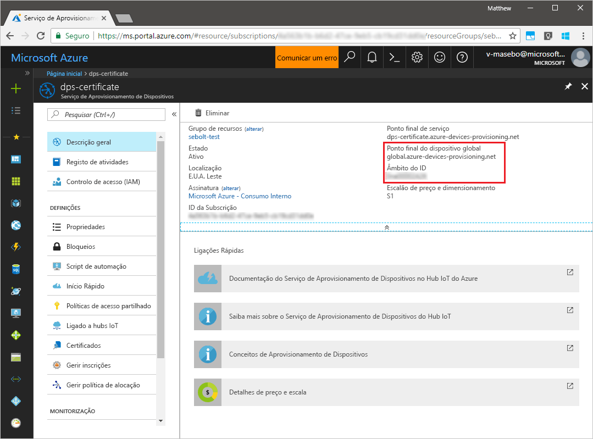
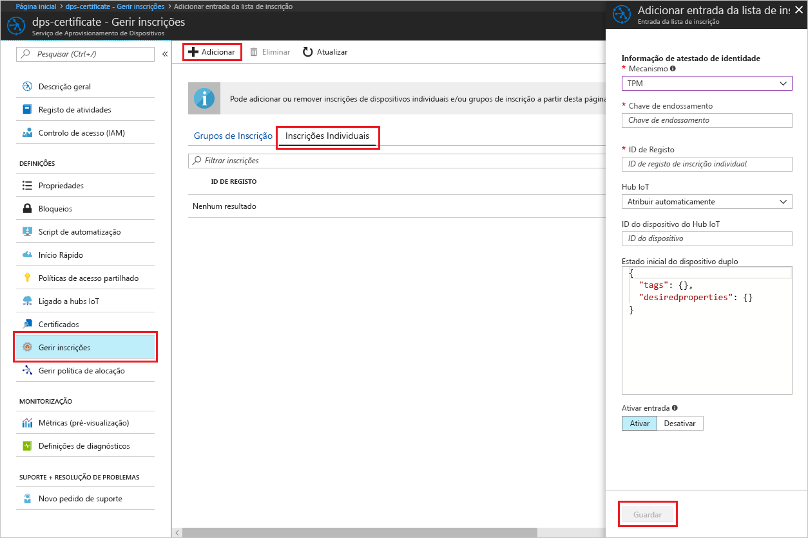

# <a name="create-and-provision-a-simulated-tpm-device-using-java-device-sdk-for-azure-iot-hub-device-provisioning-service"></a>Criar e aprovisionar um dispositivo TPM simulado com o SDK de dispositivo Java com o Serviço de Aprovisionamento de Dispositivos no Hub IoT do Azure
> [!div class="op_single_selector"]
> * [C](quick-create-simulated-device.md)
> * [Java](quick-create-simulated-device-tpm-java.md)
> * [C#](quick-create-simulated-device-tpm-csharp.md)
> * [Python](quick-create-simulated-device-tpm-python.md)

Estes passos mostram como criar um dispositivo simulado no seu computador de desenvolvimento que executa o SO Windows, executa o simulador Windows TPM como o [Módulo de Segurança de Hardware (HSM)](https://azure.microsoft.com/blog/azure-iot-supports-new-security-hardware-to-strengthen-iot-security/) do dispositivo e utiliza o código de exemplo para ligar esse dispositivo com o Serviço Aprovisionamento de Dispositivos e o seu hub IoT. 

Antes de avançar, certifique-se de que executa os passos descritos em [Configurar o Serviço de Aprovisionamento de Dispositivos no Hub IoT com o portal do Azure](./quick-setup-auto-provision.md).


## <a name="prepare-the-environment"></a>Preparar o ambiente 

1. Certifique-se de que tem o [Java SE Development Kit 8](http://www.oracle.com/technetwork/java/javase/downloads/jdk8-downloads-2133151.html) instalado no seu computador.

1. Transfira e instale o [Maven](https://maven.apache.org/install.html).

1. Verifique se `git` está instalado no computador e que é adicionado às variáveis de ambiente às quais a janela de comandos pode aceder. Veja as [ferramentas de cliente Git da Software Freedom Conservancy](https://git-scm.com/download/) relativamente à mais recente versão das ferramentas de `git` a instalar, que incluem o **Git Bash**, a aplicação de linha de comandos que pode utilizar para interagir com o seu repositório Git local. 

1. Abra uma linha de comandos. Clone o repositório do GitHub para exemplo de código de simulação de dispositivo.
    
    ```cmd/sh
    git clone https://github.com/Azure/azure-iot-sdk-java.git --recursive
    ```

1. Execute o simulador [TPM](https://docs.microsoft.com/windows/device-security/tpm/trusted-platform-module-overview). Clique em **Permitir acesso** para permitir que as alterações às definições da _Firewall do Windows_. O simulador escuta através de um socket nas portas 2321 e 2322. Não feche esta janela; terá de manter este simulador em execução até ao fim deste Guia de início rápido. 

    ```cmd/sh
    .\azure-iot-sdk-java\provisioning\provisioning-tools\tpm-simulator\Simulator.exe
    ```

    

1. Numa linha de comandos separada, navegue para a pasta de raiz e crie as dependências de exemplo.

    ```cmd/sh
    cd azure-iot-sdk-java
    mvn install -DskipTests=true
    ```

1. Navegue para a pasta de exemplo.

    ```cmd/sh
    cd provisioning/provisioning-samples/provisioning-tpm-sample
    ```

1. Inicie sessão no portal do Azure, clique no botão **Todos os recursos**, no menu do lado esquerdo, e abra o Serviço Aprovisionamento de Dispositivos. Anote o _Âmbito do ID_ e o _Ponto Final Global do Serviço de Aprovisionamento_.

    

1. Edite `src/main/java/samples/com/microsoft/azure/sdk/iot/ProvisioningTpmSample.java` para incluir o _Âmbito do ID_ e o _Ponto Final Global do Serviço de Aprovisionamento_ conforme indicado anteriormente.  

    ```java
    private static final String idScope = "[Your ID scope here]";
    private static final String globalEndpoint = "[Your Provisioning Service Global Endpoint here]";
    private static final ProvisioningDeviceClientTransportProtocol PROVISIONING_DEVICE_CLIENT_TRANSPORT_PROTOCOL = ProvisioningDeviceClientTransportProtocol.HTTPS;
    ```

1. Crie o projeto. Navegue até à pasta de destino e execute o ficheiro jar criado.

    ```cmd/sh
    mvn clean install
    cd target
    java -jar ./provisioning-tpm-sample-{version}-with-deps.jar
    ```

1. A execução do programa é iniciada. Tenha em atenção a _Chave de Endossamento_ e o _ID de Registo_ para a secção seguinte e deixe o programa em execução.

    
    

## <a name="create-a-device-enrollment-entry"></a>Criar uma entrada de inscrição de dispositivos

1. Inicie sessão no portal do Azure, clique no botão **Todos os recursos**, no menu do lado esquerdo, e abra o Serviço Aprovisionamento de Dispositivos.

1. No painel de resumo do Serviço Aprovisionamento de Dispositivos, selecione **Gerir inscrições**. Selecione o separador **Inscrições Individuais** e clique no botão **Adicionar**, na parte superior. 

1. Em **Adicionar entrada da lista de inscrições**, introduza as informações seguintes:
    - Selecione **TPM** como o *Mecanismo* de atestado de identidades.
    - Introduza o *ID de Registo* e a *Chave de endossamento* do seu dispositivo TPM, como indicado anteriormente. 
    - Selecione um hub IoT ligado ao seu serviço de aprovisionamento.
    - Introduza um ID de dispositivo exclusivo. Certifique-se de que evita dados confidenciais quando der o nome ao seu dispositivo.
    - Atualize o **estado inicial do dispositivo duplo** com a configuração inicial pretendida para o dispositivo.
    - Quando tiver terminado, clique no botão **Guardar**. 

      

   Após a instalação bem-sucedida, o *ID de Registo* do seu dispositivo aparece na lista, no separador *Inscrições Individuais*. 


## <a name="simulate-the-device"></a>Simular o dispositivo

1. Na janela de comando a executar o código de exemplo de Java no computador, clique em Enter para continuar a executar a aplicação. Repare nas mensagens que simulam o arranque e a ligação do dispositivo ao Serviço Aprovisionamento de Dispositivos para obter as informações do seu hub IoT.  

    

1. Após o aprovisionamento bem-sucedido do dispositivo simulado no hub IoT que está associado ao seu serviço de aprovisionamento, o ID aparece no painel **Device Explorer** do hub.

     

    Se tiver alterado o *estado inicial do dispositivo duplo* face ao valor predefinido na entrada de inscrição do seu dispositivo, este pode extrair o estado pretendido do dispositivo duplo a partir do hub e agir em conformidade. Para obter mais informações, veja [Understand and use device twins in IoT Hub](../iot-hub/iot-hub-devguide-device-twins.md) (Compreender e utilizar dispositivos duplos no Hub IoT)


## <a name="clean-up-resources"></a>Limpar recursos

Se quiser continuar a trabalhar e a explorar o exemplo de cliente do dispositivo, não limpe os recursos criados neste Guia Rápido. Se não planear continuar, utilize os passos seguintes para eliminar todos os recursos criados no Guia Rápido.

1. Feche a janela da saída do exemplo de dispositivo cliente no seu computador.
1. Feche a janela do simulador TPM no seu computador.
1. No menu do lado esquerdo do portal do Azure, clique em **Todos os recursos** e selecione o seu Serviço Aprovisionamento de Dispositivos. Abra o painel **Gerir Inscrições** para o seu serviço e, em seguida, clique no separador **Inscrições Individuais**. Selecione o *ID DE REGISTO* do dispositivo que inscreveu neste Início Rápido e clique no botão **Eliminar** na parte superior. 
1. No menu do lado esquerdo do portal do Azure, clique em **Todos os recursos** e selecione o seu hub IoT. Abra o painel **Dispositivos IoT** do seu hub, selecione o *ID DE DISPOSITIVO* do dispositivo que registou neste Início Rápido e, em seguida, clique no botão **Eliminar** Na parte superior.

## <a name="next-steps"></a>Passos seguintes

Neste guia de início rápido, criou um dispositivo simulado TPM no seu computador e aprovisionou-o no seu hub IoT com o Serviço Aprovisionamento de Dispositivos no Hub IoT. Para saber como inscrever o seu dispositivo TPM programaticamente, continue para o Manual de Início Rápido para inscrição programática de um dispositivo TPM. 

> [!div class="nextstepaction"]
> [Manual de Início Rápido do Azure - Inscrever o dispositivo TPM no Serviço de Aprovisionamento de Dispositivos no Hub IoT do Azure](quick-enroll-device-tpm-java.md)
