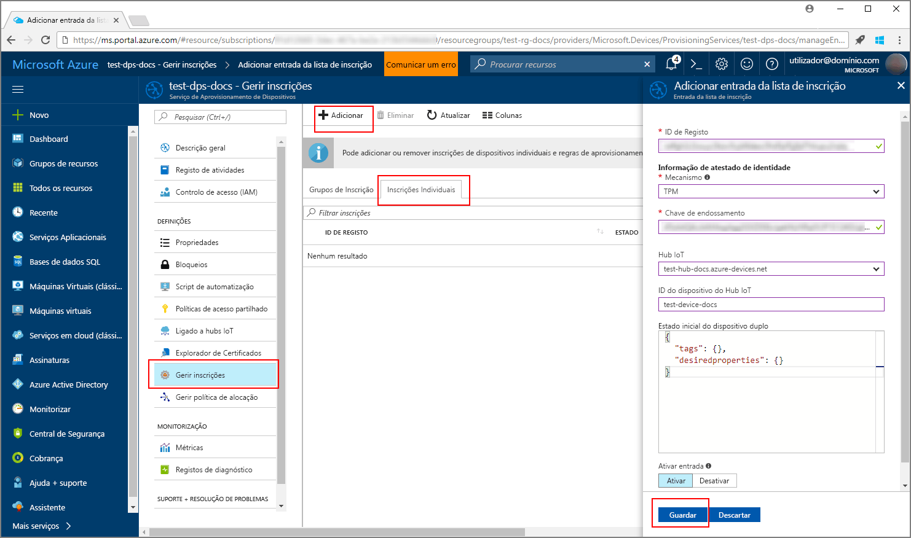
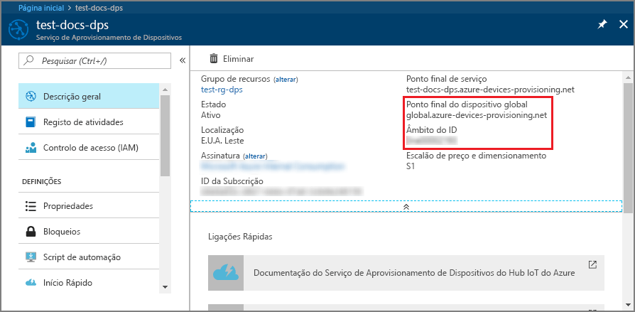
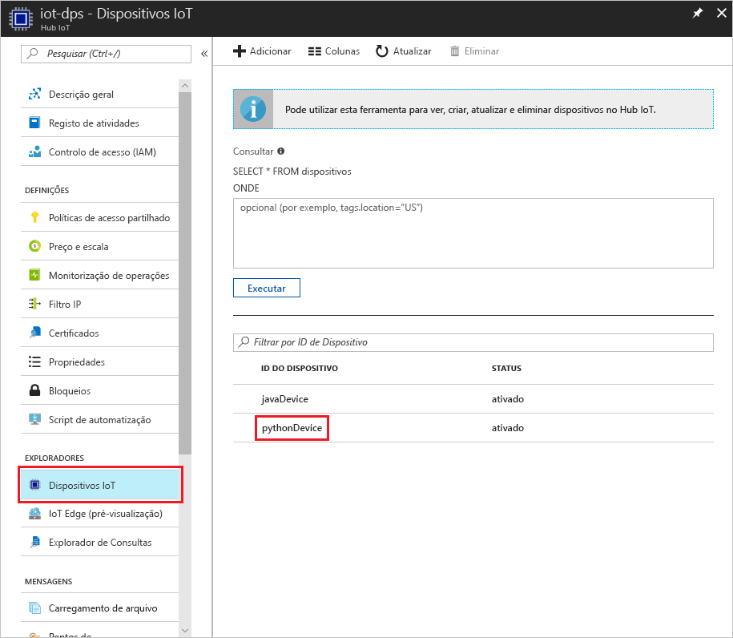

# <a name="create-and-provision-a-simulated-tpm-device-using-java-device-sdk-for-iot-hub-device-provisioning-service"></a>Criar e aprovisionar um dispositivo TPM simulado com o SDK de dispositivo Java com o Serviço de Aprovisionamento de Dispositivos no Hub IoT
> [!div class="op_single_selector"]
> * [C](quick-create-simulated-device.md)
> * [Java](quick-create-simulated-device-tpm-java.md)
> * [C#](quick-create-simulated-device-tpm-csharp.md)
> * [Python](quick-create-simulated-device-tpm-python.md)

Estes passos explicam como criar um dispositivo simulado na máquina de desenvolvimento com o sistema operativo Windows, executar o simulador de TPM do Windows como [Módulo de Segurança de Hardware (HSM)](https://azure.microsoft.com/blog/azure-iot-supports-new-security-hardware-to-strengthen-iot-security/) do dispositivo e utilizar o exemplo de código do Python para ligar este dispositivo simulado com o Serviço de Aprovisionamento de Dispositivos e o hub IoT. 

Certifique-se de que concluir os passos em [Set up IoT Hub Device Provisioning Service with the Azure portal](./quick-setup-auto-provision.md) (Configurar o Serviço Aprovisionamento de Dispositivos com o portal do Azure).


## <a name="prepare-the-environment"></a>Preparar o ambiente 

1. Certifique-se de que tem o [Visual Studio 2015](https://www.visualstudio.com/vs/older-downloads/) ou o [Visual Studio 2017](https://www.visualstudio.com/vs/) instalado no seu computador. Tem de ter a carga de trabalho do "Ambiente de trabalho de desenvolvimento com C++" ativada para a sua instalação do Visual Studio.

1. Transfira e instale o [sistema de compilação CMake](https://cmake.org/download/).

1. Verifique se `git` está instalado no computador e que é adicionado às variáveis de ambiente às quais a janela de comandos pode aceder. Veja as [ferramentas de cliente Git da Software Freedom Conservancy](https://git-scm.com/download/) relativamente à mais recente versão das ferramentas de `git` a instalar, que incluem o **Git Bash**, a aplicação de linha de comandos que pode utilizar para interagir com o seu repositório Git local. 

1. Abra uma linha de comandos ou o Git Bash. Clone o repositório do GitHub para exemplo de código de simulação de dispositivo.
    
    ```cmd/sh
    git clone https://github.com/Azure/azure-iot-sdk-python.git --recursive
    ```

1. Crie uma pasta na sua cópia local deste repositório do GitHub para o processo de compilação CMake. 

    ```cmd/sh
    cd azure-iot-sdk-python/c
    mkdir cmake
    cd cmake
    ```

1. O exemplo de código utiliza um simulador Windows TPM. Execute o seguinte comando para ativar a autenticação de token SAS. Também gera uma solução do Visual Studio para o dispositivo simulado.

    ```cmd/sh
    cmake -Duse_prov_client:BOOL=ON -Duse_tpm_simulator:BOOL=ON ..
    ```

1. Numa linha de comandos separada, navegue para a pasta do simulador TPM e execute o simulador [TPM](https://docs.microsoft.com/windows/device-security/tpm/trusted-platform-module-overview). Clique em **Permitir o acesso**. O simulador escuta através de um socket nas portas 2321 e 2322. Não feche esta janela de comando; terá de manter este simulador em execução até ao fim deste Guia de início rápido. 

    ```cmd/sh
    .\azure-iot-sdk-python\c\provisioning_client\deps\utpm\tools\tpm_simulator\Simulator.exe
    ```

    


## <a name="create-a-device-enrollment-entry"></a>Criar uma entrada de inscrição de dispositivos

1. Abra a solução gerada na pasta *cmake* com o nome `azure_iot_sdks.sln` e compile-a no Visual Studio.

1. Clique com o botão direito do rato no projeto **tpm_device_provision** e selecione **Configurar como Projeto de Arranque**. Execute a solução. A janela de saída apresenta a **_Chave de Endossamento_** e o **_ID de Registo_** necessários para a inscrição do dispositivo. Anote estes valores. 

    

1. Inicie sessão no portal do Azure, clique no botão **Todos os recursos**, no menu do lado esquerdo, e abra o Serviço Aprovisionamento de Dispositivos.

1. No painel de resumo do Serviço Aprovisionamento de Dispositivos, selecione **Gerir inscrições**. Selecione o separador **Inscrições Individuais** e clique no botão **Adicionar**, na parte superior. 

1. Em **Adicionar entrada da lista de inscrições**, introduza as informações seguintes:
    - Selecione **TPM** como o *Mecanismo* de atestado de identidades.
    - Introduza o *ID de Registo* e a *Chave de endossamento* do seu dispositivo TPM. 
    - Selecione um hub IoT ligado ao seu serviço de aprovisionamento.
    - Introduza um ID de dispositivo exclusivo. Certifique-se de que evita dados confidenciais quando der o nome ao seu dispositivo.
    - Atualize o **estado inicial do dispositivo duplo** com a configuração inicial pretendida para o dispositivo.
    - Quando tiver terminado, clique no botão **Guardar**. 

      

   Após a instalação bem-sucedida, o *ID de Registo* do seu dispositivo aparece na lista, no separador *Inscrições Individuais*. 


## <a name="simulate-the-device"></a>Simular o dispositivo

1. Transfira e instale o [Python 2.x ou 3.x](https://www.python.org/downloads/). Certifique-se de que utiliza a instalação de 32 ou 64 bits, conforme exigido pela sua configuração. Quando lhe for pedido durante a instalação, confirme que adiciona Python às variáveis de ambiente específicas da sua plataforma.
    - Se estiver a utilizar o SO Windows, o [pacote redistribuível Visual C++](http://www.microsoft.com/download/confirmation.aspx?id=48145), para permitir a utilização de DLLs nativas de Python.

1. Siga [estas instruções](https://github.com/Azure/azure-iot-sdk-python/blob/master/doc/python-devbox-setup.md) para criar os pacotes Python.

    > [!NOTE]
        > Se executar `build_client.cmd` certifique-se de que utiliza o sinalizador `--use-tpm-simulator`.

    > [!NOTE]
        > Se estiver a utilizar `pip`, certifique-se de que instala também o pacote `azure-iot-provisioning-device-client`. Tenha em atenção que os pacotes PIP lançados estão a utilizar o TPM real, não o simulador. Para utilizar o simulador tem de compilar a partir da origem, utilizando o sinalizador `--use-tpm-simulator`.

1. Navegue para a pasta de exemplos.

    ```cmd/sh
    cd azure-iot-sdk-python/provisioning_device_client/samples
    ```

1. Através do IDE Python, edite o script python com o nome **provisioning\_device\_client\_sample.py**. Modifique as variáveis _GLOBAL\_PROV\_URI_ e _ID\_SCOPE_ para os valores anotados previamente.

    ```python
    GLOBAL_PROV_URI = "{globalServiceEndpoint}"
    ID_SCOPE = "{idScope}"
    SECURITY_DEVICE_TYPE = ProvisioningSecurityDeviceType.TPM
    PROTOCOL = ProvisioningTransportProvider.HTTP
    ```

    

1. Execute o exemplo. 

    ```cmd/sh
    python provisioning_device_client_sample.py
    ```

1. Repare nas mensagens que simulam o arranque e a ligação do dispositivo ao Serviço Aprovisionamento de Dispositivos para obter as informações do seu hub IoT. 

    

1. Após o aprovisionamento bem-sucedido do dispositivo simulado no hub IoT que está associado ao seu serviço de aprovisionamento, o ID aparece no painel **Device Explorer** do hub.

     

    Se tiver alterado o *estado inicial do dispositivo duplo* face ao valor predefinido na entrada de inscrição do seu dispositivo, este pode extrair o estado pretendido do dispositivo duplo a partir do hub e agir em conformidade. Para obter mais informações, veja [Understand and use device twins in IoT Hub](../iot-hub/iot-hub-devguide-device-twins.md) (Compreender e utilizar dispositivos duplos no Hub IoT)


## <a name="clean-up-resources"></a>Limpar recursos

Se quiser continuar a trabalhar e a explorar o exemplo de cliente do dispositivo, não limpe os recursos criados neste Guia Rápido. Se não planear continuar, utilize os passos seguintes para eliminar todos os recursos criados no Guia Rápido.

1. Feche a janela da saída do exemplo de dispositivo cliente no seu computador.
1. Feche a janela do simulador TPM no seu computador.
1. No menu do lado esquerdo do portal do Azure, clique em **Todos os recursos** e selecione o seu Serviço Aprovisionamento de Dispositivos. Abra o painel **Gerir Inscrições** para o seu serviço e, em seguida, clique no separador **Inscrições Individuais**. Selecione o *ID DE REGISTO* do dispositivo que inscreveu neste Início Rápido e clique no botão **Eliminar** na parte superior. 
1. No menu do lado esquerdo do portal do Azure, clique em **Todos os recursos** e selecione o seu hub IoT. Abra o painel **Dispositivos IoT** do seu hub, selecione o *ID DE DISPOSITIVO* do dispositivo que registou neste Início Rápido e, em seguida, clique no botão **Eliminar** Na parte superior.

## <a name="next-steps"></a>Passos seguintes

Neste guia de início rápido, criou um dispositivo simulado TPM no seu computador e aprovisionou-o no seu hub IoT com o Serviço Aprovisionamento de Dispositivos no Hub IoT. Para saber como inscrever o seu dispositivo TPM programaticamente, continue para o Manual de Início Rápido para inscrição programática de um dispositivo TPM. 

> [!div class="nextstepaction"]
> [Manual de Início Rápido do Azure - Inscrever o dispositivo TPM no Serviço de Aprovisionamento de Dispositivos no Hub IoT do Azure](quick-enroll-device-tpm-java.md)
