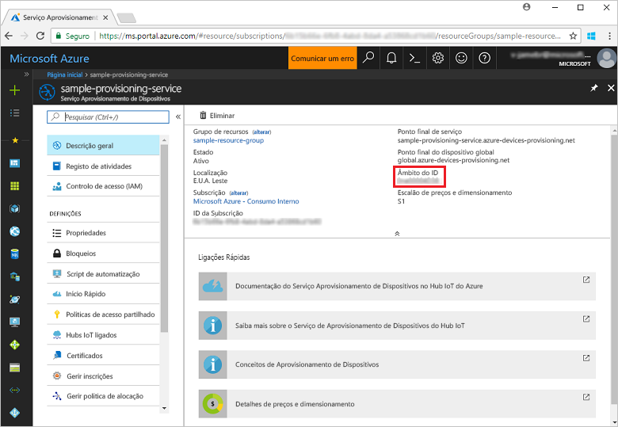
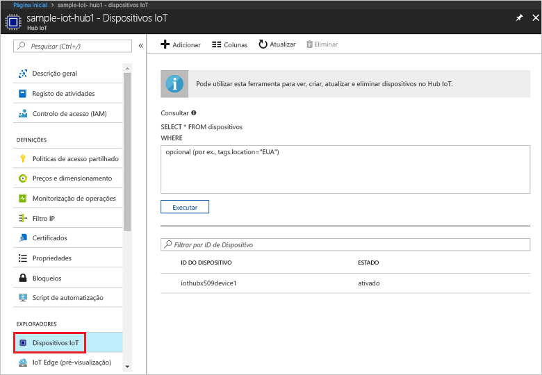

# <a name="create-and-provision-a-simulated-x509-device-using-c-device-sdk-for-iot-hub-device-provisioning-service"></a>Criar e aprovisionar um dispositivo X.509 simulado com o SDK de dispositivo C# com o Serviço de Aprovisionamento de Dispositivos no Hub IoT
> [!div class="op_single_selector"]
> * [C](quick-create-simulated-device-x509.md)
> * [Java](quick-create-simulated-device-x509-java.md)
> * [C#](quick-create-simulated-device-x509-csharp.md)
> * [Python](quick-create-simulated-device-x509-python.md)

Estes passos mostram-lhe como criar o exemplo de dispositivo X.509 simulado do [Azure IoT Hub C# SDK](https://github.com/Azure/azure-iot-sdk-csharp) na máquina de desenvolvimento que executa o SO Windows e ligar o dispositivo ao Serviço Aprovisionamento de Dispositivos e ao seu Hub IoT.

Certifique-se de que concluir os passos em [Set up IoT Hub Device Provisioning Service with the Azure portal](./quick-setup-auto-provision.md) (Configurar o Serviço Aprovisionamento de Dispositivos com o portal do Azure).

<a id="setupdevbox"></a>
## <a name="prepare-the-development-environment"></a>Preparar o ambiente de desenvolvimento 

1. Certifique-se de que tem o [SDK .Net Core](https://www.microsoft.com/net/download/windows) instalado no computador. 

1. Verifique se `git` está instalado no computador e que é adicionado às variáveis de ambiente às quais a janela de comandos pode aceder. Veja as [ferramentas de cliente Git da Software Freedom Conservancy](https://git-scm.com/download/) relativamente à mais recente versão das ferramentas de `git` a instalar, que incluem o **Git Bash**, a aplicação de linha de comandos que pode utilizar para interagir com o seu repositório Git local. 

4. Abra uma linha de comandos ou o Git Bash. Clone o [SDK do IoT do Azure para o repositório do GitHub C#](https://github.com/Azure/azure-iot-sdk-csharp):
    
    ```cmd
    git clone --recursive https://github.com/Azure/azure-iot-sdk-csharp.git
    ```

## <a name="create-a-self-signed-x509-device-certificate-and-individual-enrollment-entry"></a>Criar um certificado de dispositivo X.509 autoassinado e entrada de inscrição individual

1. Numa linha de comandos, altere os diretórios para o diretório de projeto para o exemplo de aprovisionamento de dispositivo X.509.

    ```cmd
    cd .\azure-iot-sdk-csharp\provisioning\device\samples\ProvisioningDeviceClientX509
    ```

1. O código de exemplo é configurado para utilizar certificados X.509 armazenados dentro de um ficheiro formatado PKCS12 protegido por palavra-passe (certificate.pfx). Além disso, irá precisar de um ficheiro de certificado de chave pública (certificate.cer) para criar uma inscrição individual mais tarde neste Guia Rápido. Para gerar um certificado autoassinado e respetivos ficheiros .cer e .pfx associados, execute o seguinte comando:

    ```cmd
    powershell .\GenerateTestCertificate.ps1
    ```

2. O script pede-lhe uma palavra-passe PFX. Memorize esta palavra-passe, deve utilizá-la ao executar o exemplo.

      


4. Inicie sessão no portal do Azure, clique no botão **Todos os recursos**, no menu do lado esquerdo, e abra o seu serviço de aprovisionamento.

4. No painel de resumo do Serviço Aprovisionamento de Dispositivos, selecione **Gerir inscrições**. Selecione o separador **Inscrições Individuais** e clique no botão **Adicionar**, na parte superior. 

5. Em **Adicionar entrada da lista de inscrições**, introduza as informações seguintes:
    - Selecione **X.509** como o *Mecanismo* de atestado de identidades.
    - Em *Ficheiro de certificado .pem ou .cer*, selecione o ficheiro de certificado **certificate.cer** criado nos passos anteriores mediante a utilização do widget *Explorador de Ficheiros*.
    - Deixe **ID de Dispositivo** em branco. O dispositivo será aprovisionado com o seu ID de dispositivo definido como o nome comum (CN) no certificado X.509, **iothubx509device1**. Este também será o nome utilizado para o ID de registo da entrada de inscrição individual. 
    - Opcionalmente, pode fornecer as seguintes informações:
        - Selecione um hub IoT ligado ao seu serviço de aprovisionamento.
        - Atualize o **estado inicial do dispositivo duplo** com a configuração inicial pretendida para o dispositivo.
    - Quando tiver terminado, clique no botão **Guardar**. 

      

   Após a instalação bem-sucedida, a sua entrada de inscrição X.509 aparece como **iothubx509device1** na coluna *ID de Registo* do separador *Inscrições Individuais*. 

## <a name="provision-the-simulated-device"></a>Aprovisionar o dispositivo simulado

1. No painel **Descrição Geral** do seu serviço de aprovisionamento, anote o valor de **_Âmbito do ID_**.

     


2. Escreva o seguinte comando para criar e executar o exemplo de aprovisionamento de dispositivos X.509. Substitua o valor `<IDScope>` pelo Âmbito de ID para o serviço de aprovisionamento. 

    ```cmd
    dotnet run <IDScope>
    ```

6. Quando lhe for pedido, introduza a palavra-passe para o ficheiro PFX que criou anteriormente. Repare nas mensagens que simulam o arranque e a ligação do dispositivo ao Serviço Aprovisionamento de Dispositivos para obter as informações do seu hub IoT. 

     

1. Certifique-se de que o dispositivo foi aprovisionado. Após o aprovisionamento bem-sucedido do dispositivo simulado no hub IoT que está associado ao seu serviço de aprovisionamento, o ID aparece no painel **Dispositivos IoT** do hub. 

     

    Se tiver alterado o *estado inicial do dispositivo duplo* face ao valor predefinido na entrada de inscrição do seu dispositivo, este pode extrair o estado pretendido do dispositivo duplo a partir do hub e agir em conformidade. Para obter mais informações, veja [Understand and use device twins in IoT Hub](../iot-hub/iot-hub-devguide-device-twins.md) (Compreender e utilizar dispositivos duplos no Hub IoT)


## <a name="clean-up-resources"></a>Limpar recursos

Se quiser continuar a trabalhar e a explorar o exemplo de cliente do dispositivo, não limpe os recursos criados neste Guia Rápido. Se não planear continuar, utilize os passos seguintes para eliminar todos os recursos criados no Guia Rápido.

1. Feche a janela da saída do exemplo de dispositivo cliente no seu computador.
1. Feche a janela do simulador TPM no seu computador.
1. No menu do lado esquerdo do portal do Azure, clique em **Todos os recursos** e selecione o seu Serviço Aprovisionamento de Dispositivos. Na parte superior do painel **Todos os recursos**, clique em **Eliminar**.  
1. No menu do lado esquerdo do portal do Azure, clique em **Todos os recursos** e selecione o seu hub IoT. Na parte superior do painel **Todos os recursos**, clique em **Eliminar**.  

## <a name="next-steps"></a>Passos seguintes

e para o hub IoT ligado ao seu serviçNeste Início Rápido, criou um dispositivo X.509 simulado no seu computador Windows e aprovisionou-o no seu hub IoT com o Serviço Aprovisionamento de Dispositivos no Hub IoT do Azure no portal. Para saber como inscrever o seu dispositivo X.509 programaticamente, continue para o Manual de Início Rápido para inscrição programática de dispositivos X.509. 

> [!div class="nextstepaction"]
> [Manual de Início Rápido do Azure - Inscrever dispositivos X.509 no Serviço de Aprovisionamento de Dispositivos no Hub IoT do Azure](quick-enroll-device-x509-node.md)
