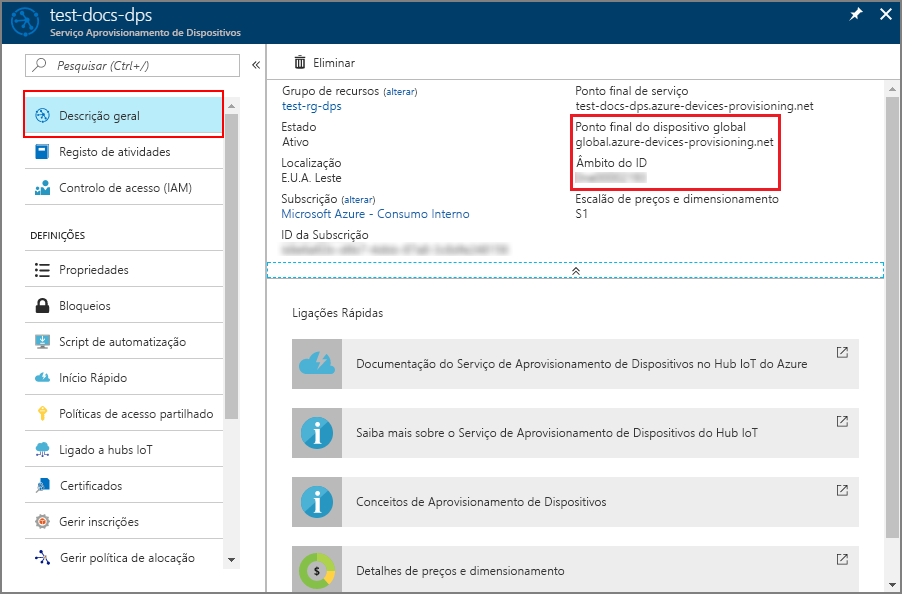
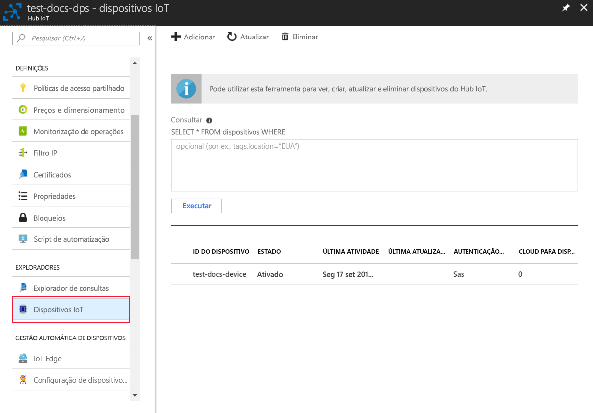

# <a name="create-and-provision-an-x509-simulated-device-using-nodejs-device-sdk-for-iot-hub-device-provisioning-service"></a>Criar e aprovisionar um dispositivo simulado X.509 com o SDK de dispositivo Node.js com o Serviço de Aprovisionamento de Dispositivos no Hub IoT
[!INCLUDE [iot-dps-selector-quick-create-simulated-device-x509](../../includes/iot-dps-selector-quick-create-simulated-device-x509.md)]

Estes passos mostram como criar uma entrada de inscrição no Serviço de Aprovisionamento de Dispositivos, simular um dispositivo x.509 no seu computador de desenvolvimento, ligar o dispositivo simulado com o Serviço de Aprovisionamento de Dispositivos e registar o dispositivo no seu hub IoT com o [SDK de Dispositivo Node.js do Hub IoT](https://github.com/Azure/azure-iot-sdk-node).

Se não estiver familiarizado com o processo de aprovisionamento automático, reveja também [Conceitos de aprovisionamento automático](concepts-auto-provisioning.md). Certifique-se também de que executa os passos descritos em [Configurar o Serviço de Aprovisionamento de Dispositivos no Hub IoT com o portal do Azure](./quick-setup-auto-provision.md) antes de continuar. 

O Serviço Aprovisionamento de Dispositivos no IoT do Azure suporta dois tipos de inscrição:
- [Grupos de inscrição](concepts-service.md#enrollment-group): utilizados para inscrever vários dispositivos relacionados.
- [Inscrições Individuais](concepts-service.md#individual-enrollment): utilizadas para inscrever um dispositivo individual.

Este artigo irá demonstrar as inscrições individuais.

[!INCLUDE [IoT Device Provisioning Service basic](../../includes/iot-dps-basic.md)]

## <a name="prepare-the-environment"></a>Preparar o ambiente 

1. Conclua os passos descritos em [Configurar o Serviço de Aprovisionamento de Dispositivos no Hub IoT com o portal do Azure](./quick-setup-auto-provision.md) antes de continuar.

2. Certifique-se de que tem o [Node.js v4.0 ou superior](https://nodejs.org) instalado no seu computador.

3. Certifique-se de que o [Git](https://git-scm.com/download/) está instalado no computador e que é adicionado às variáveis de ambiente às quais a janela de comandos pode aceder. 

4. Verifique se o [OpenSSL](https://www.openssl.org/) está instalado no computador e que é adicionado às variáveis de ambiente às quais a janela de comandos pode aceder. Esta biblioteca pode ser criada e instalada a partir da origem ou transferida e instalada a partir de [terceiros](https://wiki.openssl.org/index.php/Binaries) como [este](https://sourceforge.net/projects/openssl/). 

    > [!NOTE]
    > Se já tiver criado os certificados x.509 de _raiz_, _intermédios_, e/ou de _folha_, pode ignorar este passo e todos os passos seguintes relativos à geração de certificados.
    >

## <a name="create-a-self-signed-x509-device-certificate-and-individual-enrollment-entry"></a>Criar um certificado de dispositivo X.509 autoassinado e entrada de inscrição individual

Nesta secção, vai utilizar um certificado X.509 autoassinado e é importante ter em consideração o seguinte:

* Os certificados autoassinados são apenas para teste e não devem ser utilizados na produção.
* A data de expiração predefinida para um certificado autoassinado é de um ano.

Vai utilizar o código de exemplo do SDK do [Azure IoT para Node.js](https://github.com/Azure/azure-iot-sdk-node.git) para criar o certificado a ser utilizado na entrada de inscrição individual do dispositivo simulado.


1. Abra uma linha de comandos. Clone o repositório do GitHub para os exemplos de código:
    
    ```cmd/sh
    git clone https://github.com/Azure/azure-iot-sdk-node.git --recursive
    ```

2. Navegue até ao script de gerador de certificados e compile o projeto. 

    ```cmd/sh
    cd azure-iot-sdk-node/provisioning/tools
    npm install
    ```

3. Crie um certificado X.509 de _folha_ ao executar o script com o seu _certificate-name_. O nome comum do certificado de folha torna-se o [ID de registo](https://docs.microsoft.com/azure/iot-dps/concepts-device#registration-id), por conseguinte, não se esqueça de utilizar apenas carateres alfanuméricos em minúsculas e hífenes.

    ```cmd/sh
    node create_test_cert.js device {certificate-name}
    ```

4. Inicie sessão no [portal do Azure](https://portal.azure.com), clique no botão **Todos os recursos** no menu do lado esquerdo e abra a instância do Serviço Aprovisionamento de Dispositivos.

5. No painel de resumo do Serviço Aprovisionamento de Dispositivos, selecione **Gerir inscrições**. Selecione o separador **Inscrições Individuais** e clique no botão **Adicionar inscrição individual** na parte superior. 

6. No painel **Adicionar Inscrição**, introduza as seguintes informações:
    - Selecione **X.509** como o *Mecanismo* de atestado de identidades.
    - Em *Ficheiro de certificado primário .pem ou .cer*, clique em *Selecionar um ficheiro* para selecionar o ficheiro de certificado **{certificate-name}_cert.pem** criado nos passos anteriores.  
    - Opcionalmente, pode fornecer as seguintes informações:
      - Selecione um hub IoT ligado ao seu serviço de aprovisionamento.
      - Introduza um ID de dispositivo exclusivo. Certifique-se de que evita dados confidenciais quando der o nome ao seu dispositivo. 
      - Atualize o **estado inicial do dispositivo duplo** com a configuração inicial pretendida para o dispositivo.
   - Quando tiver terminado, clique no botão **Guardar**. 

    [](./media/quick-create-simulated-device-x509-node/device-enrollment.png#lightbox)

    Após a instalação bem-sucedida, o seu dispositivo X.509 aparece como **{certificatename}** na coluna *ID de Registo* do separador *Inscrições Individuais*. Anote este valor para utilizar mais tarde.

## <a name="simulate-the-device"></a>Simular o dispositivo

O [SDK de Dispositivo Node.js do Hub IoT do Azure](https://github.com/Azure/azure-iot-sdk-node) fornece uma forma fácil de simular um dispositivo. Para leitura adicional, veja [Conceitos do dispositivo](https://docs.microsoft.com/azure/iot-dps/concepts-device).

1. No portal do Azure, selecione o painel **Descrição Geral** do seu serviço de Aprovisionamento de Dispositivos e anote os valores de **_Ponto Final do Dispositivo Global_** e de **_Âmbito do ID_**.

     

2. Copie o _certificado_ e a _chave_ para a pasta de exemplo.

    ```cmd/sh
    copy .\{certificate-name}_cert.pem ..\device\samples\{certificate-name}_cert.pem
    copy .\{certificate-name}_key.pem ..\device\samples\{certificate-name}_key.pem
    ```

3. Navegue para o script de teste do dispositivo e compile o projeto. 

    ```cmd/sh
    cd ..\device\samples
    npm install
    ```

4. Edite o ficheiro **register\_x509.js**. Guarde o ficheiro depois de efetuar as seguintes alterações.
    - Substitua `provisioning host` pelo **_Ponto Final do Dispositivo Global_** indicado no **Passo 1** acima.
    - Substitua `id scope` pelo **_Âmbito do ID_** indicado no **Passo 1** acima. 
    - Substitua `registration id` pelo **_ID de Registo_** indicado na secção anterior.
    - Substitua `cert filename` e `key filename` pelos ficheiros que copiou no **Passo 2** acima. 

5. Execute o script e verifique se o dispositivo foi aprovisionado com êxito.

    ```cmd/sh
    node register_x509.js
    ```   

6. No portal, navegue para o hub IoT ligado ao seu serviço de aprovisionamento e abra o painel **Dispositivos IoT**. Após o aprovisionamento bem-sucedido do dispositivo X.509 simulado no hub, o ID de dispositivo aparece no painel **Dispositivos IoT**, com o *ESTADO* **ativado**. Poderá ter de clicar no botão **Atualizar**, na parte superior, se já tiver aberto o painel antes de executar a aplicação de dispositivo de exemplo. 

     

    Se tiver alterado o *estado inicial do dispositivo duplo* face ao valor predefinido na entrada de inscrição do seu dispositivo, este pode extrair o estado pretendido do dispositivo duplo a partir do hub e agir em conformidade. Para obter mais informações, veja [Understand and use device twins in IoT Hub](../iot-hub/iot-hub-devguide-device-twins.md) (Compreender e utilizar dispositivos duplos no Hub IoT).


## <a name="clean-up-resources"></a>Limpar recursos

Se quiser continuar a trabalhar e a explorar o exemplo de cliente do dispositivo, não limpe os recursos criados neste Guia Rápido. Se não planear continuar, utilize os passos seguintes para eliminar todos os recursos criados no Guia Rápido.

1. Feche a janela da saída do exemplo de dispositivo cliente no seu computador.
2. No menu do lado esquerdo do portal do Azure, clique em **Todos os recursos** e selecione o seu Serviço Aprovisionamento de Dispositivos. Abra o painel **Gerir Inscrições** para o seu serviço e, em seguida, clique no separador **Inscrições Individuais**. Selecione o *ID DE REGISTO* do dispositivo que inscreveu neste Início Rápido e clique no botão **Eliminar** na parte superior. 
3. No menu do lado esquerdo do portal do Azure, clique em **Todos os recursos** e selecione o seu hub IoT. Abra o painel **Dispositivos IoT** do seu hub, selecione o *ID DE DISPOSITIVO* do dispositivo que registou neste Início Rápido e, em seguida, clique no botão **Eliminar** Na parte superior.


## <a name="next-steps"></a>Passos seguintes

Neste Início Rápido, criou um dispositivo X.509 simulado e aprovisionou-o no seu hub IoT com o Serviço de Aprovisionamento de Dispositivos no Hub IoT do Azure no portal. Para saber como inscrever o seu dispositivo X.509 programaticamente, continue para o Manual de Início Rápido para inscrição programática de dispositivos X.509. 

> [!div class="nextstepaction"]
> [Manual de Início Rápido do Azure - Inscrever dispositivos X.509 no Serviço de Aprovisionamento de Dispositivos no Hub IoT do Azure](quick-enroll-device-x509-node.md)
