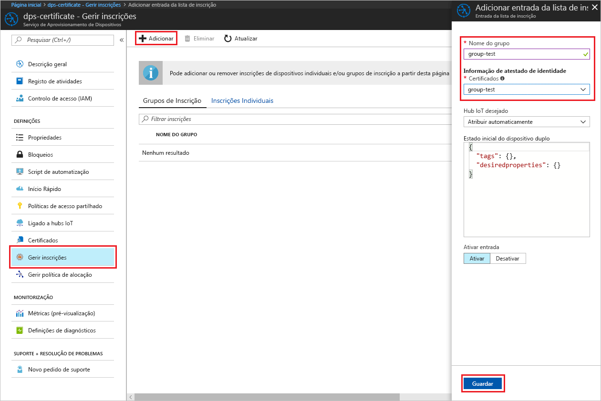
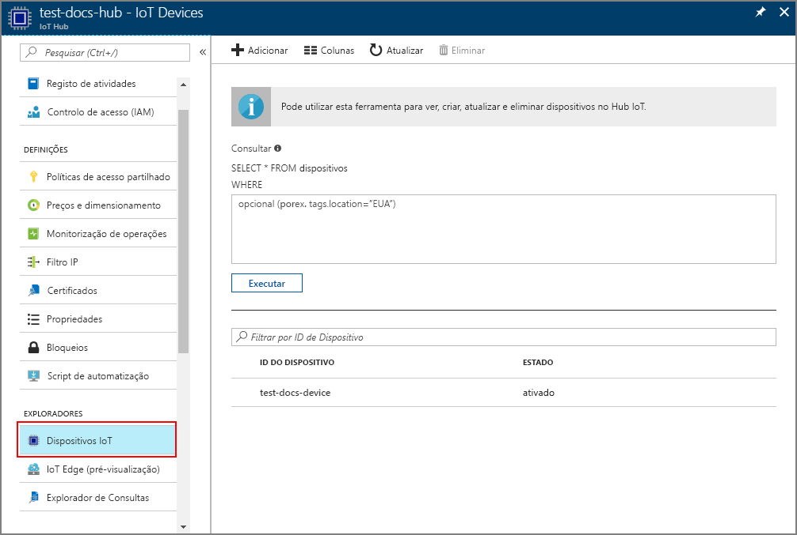

# <a name="create-and-provision-an-x509-simulated-device-using-nodejs-device-sdk-for-iot-hub-device-provisioning-service"></a>Criar e aprovisionar um dispositivo simulado X.509 com o SDK de dispositivo Node.js com o Serviço de Aprovisionamento de Dispositivos no Hub IoT
[!INCLUDE [iot-dps-selector-quick-create-simulated-device-x509](../../includes/iot-dps-selector-quick-create-simulated-device-x509.md)]

O Serviço de Aprovisionamento de Dispositivos no Hub IoT é um serviço auxiliar do Hub IoT que fornece o aprovisionamento de dispositivos sem toques para o hub IoT. Com o Serviço de Aprovisionamento de Dispositivos, pode aprovisionar milhões de dispositivos de forma segura e dimensionável.

O aprovisionamento de dispositivos consiste em dois passos. O primeiro passo é criar a entrada de inscrição adequada no Serviço de Aprovisionamento de Dispositivos, com base nos requisitos específicos da solução.  O segundo passo é estabelecer uma ligação entre o dispositivo e o Serviço de Aprovisionamento de Dispositivos, e registar o dispositivo no hub IoT. Assim que os dois passos estiverem concluídos, o dispositivo é considerado como totalmente aprovisionado. O Serviço de Aprovisionamento de Dispositivos automatiza os dois passos para fornecer uma experiência totalmente integrada de aprovisionamento do dispositivo. Para obter mais informações, veja [Conceitos do Serviço de Aprovisionamento de Dispositivos](https://docs.microsoft.com/en-us/azure/iot-dps/concepts-service).

Estes passos mostram como criar uma entrada de inscrição no Serviço de Aprovisionamento de Dispositivos, simular um dispositivo x.509 no seu computador de desenvolvimento, ligar o dispositivo simulado com o Serviço de Aprovisionamento de Dispositivos e registar o dispositivo no seu hub IoT com o [SDK de Dispositivo Node.js do Hub IoT](https://github.com/Azure/azure-iot-sdk-node).

[!INCLUDE [IoT DPS basic](../../includes/iot-dps-basic.md)]

## <a name="prepare-the-environment"></a>Preparar o ambiente 

1. Conclua os passos descritos em [Configurar o Serviço de Aprovisionamento de Dispositivos no Hub IoT com o portal do Azure](./quick-setup-auto-provision.md) antes de continuar.

1. Certifique-se de que tem o [Node.js v4.0 ou superior](https://nodejs.org) instalado no seu computador.

1. Certifique-se de que o [Git](https://git-scm.com/download/) está instalado no computador e que é adicionado às variáveis de ambiente às quais a janela de comandos pode aceder. 

1. Verifique se o [OpenSSL](https://www.openssl.org/) está instalado no computador e que é adicionado às variáveis de ambiente às quais a janela de comandos pode aceder. Esta biblioteca pode ser criada e instalada a partir da origem ou transferida e instalada a partir de [terceiros](https://wiki.openssl.org/index.php/Binaries) como [este](https://sourceforge.net/projects/openssl/). 

    > [!NOTE]
    > Se já tiver criado os certificados x.509 de _raiz_, _intermédios_, e/ou de _folha_, pode ignorar este passo e todos os passos seguintes relativos à geração de certificados.
    >


## <a name="create-an-enrollment-entry"></a>Criar uma entrada de inscrição

Uma inscrição é o registo de dispositivos ou grupos de dispositivos que pode registar a uma determinada altura, armazenados no Serviço de Aprovisionamento de Dispositivos. O registo de inscrição contém as informações sobre o dispositivo ou grupo de dispositivos, incluindo detalhes do certificado x.509 e informações de registo adicionais. O Serviço de Aprovisionamento de Dispositivos suporta dois tipos de inscrição, a _Inscrição individual_ e a _Grupo de inscrição_. Para obter mais informações, veja [Conceitos de inscrição](https://docs.microsoft.com/en-us/azure/iot-dps/concepts-service#enrollment).

Se estiver a criar os seus próprios certificados X.509 de teste, consulte os [Conceitos de segurança](https://docs.microsoft.com/en-us/azure/iot-dps/concepts-security#x509-certificates) em que são necessários certificados para a sua solução e as [Ferramentas para o SDK do Dispositivo de Aprovisionamento de Dispositivos do IoT do Azure para Node.js](https://github.com/azure/azure-iot-sdk-node/tree/master/provisioning/tools), para obter os detalhes de implementação.

1. Abra uma linha de comandos. Clone o repositório do GitHub para os exemplos de código:
    
    ```cmd/sh
    git clone https://github.com/Azure/azure-iot-sdk-node.git --recursive
    ```

1. Navegue até ao script de gerador de certificados e compile o projeto. 

    ```cmd/sh
    cd azure-iot-sdk-node/provisioning/tools
    npm install
    ```

1. Crie as informações de inscrição de qualquer uma das seguintes formas, de acordo com a sua configuração:

    - **Inscrição individual**:

        1. Crie o certificado de _folha_, executando o script com o seu _certificate-name_. Tenha em atenção que o nome comum do certificado de folha torna-se o [ID de registo](https://docs.microsoft.com/en-us/azure/iot-dps/concepts-device#registration-id), por conseguinte, não se esqueça de utilizar apenas carateres alfanuméricos em minúsculas e hífenes.

        ```cmd/sh
        node create_test_cert.js device {certificate-name}
        ```
         
        1. No portal do **Azure**, abra o painel de resumo  **Serviço de Aprovisionamento de Dispositivos**. Selecione **Gerir inscrições** e, em seguida, o separador **Inscrições Individuais** e clique no botão **Adicionar** na parte superior. 

        1. Em **Adicionar entrada da lista de inscrições**, introduza as informações seguintes:
            - Selecione **X.509** como o *Mecanismo* de atestado de identidades.
            - No *ficheiro de certificado .pem ou .cer*, selecione o ficheiro de certificado **_{certificate-name}\_cert.pem_** criado nos passos anteriores, utilizando o widget *Explorador de Ficheiros*.
            - Opcionalmente, pode fornecer as seguintes informações:
                - Selecione um hub IoT ligado ao seu serviço de aprovisionamento.
                - Introduza um ID de dispositivo exclusivo. Certifique-se de que evita dados confidenciais quando der o nome ao seu dispositivo. 
                - Atualize o **estado inicial do dispositivo duplo** com a configuração inicial pretendida para o dispositivo.
            - Quando tiver terminado, clique no botão **Guardar**. 

          

    Após a instalação bem-sucedida, o seu dispositivo X.509 aparece como **{certificatename}** na coluna *ID de Registo* do separador *Inscrições Individuais*. Anote este valor para utilizar mais tarde.

    - **Grupos de inscrição**: 

        1. Crie o certificado de _raiz_, executando o script com o seu _root-name_.

        ```cmd/sh
        node create_test_cert.js root {root-name}
        ```

        1. No portal do **Azure**, abra o painel de resumo  **Serviço de Aprovisionamento de Dispositivos**. Selecione **Certificados** e clique no botão **Adicionar** na parte superior.

        1. Em **Adicionar Certificado**, introduza as informações seguintes:
            - Introduza um nome exclusivo de certificado.
            - Selecione o ficheiro **_{root-name}\_cert.pem_** que criou anteriormente.
            - Quando tiver terminado, clique no botão **Guardar**.

        

        1. Selecione o certificado que acabou de criar:
            - Clique em **Gerar Código de Verificação**. Copie o código gerado.
            - Crie o certificado de _verificação_. Introduza o _código de verificação_ ou clique com o botão direito do rato para colar na janela do script Node em execução, com o seguinte comando:

                ```cmd/sh
                node create_test_cert.js verification {rootname_cert} {verification code}
                ```

            - No *ficheiro de certificado de verificação .pem ou .cer*, selecione o ficheiro de certificado **_verification_cert.pem_** criado nos passos anteriores utilizando o widget *Explorador de Ficheiros*. Clique em **Verificar**.

            

        1. Selecione **Gerir inscrições**. Selecione o separador **Grupos de Inscrição** e clique no botão **Adicionar** na parte superior.
            - Introduza um nome de grupo exclusivo.
            - Selecione o nome do certificado exclusivo criado anteriormente.
            - Opcionalmente, pode fornecer as seguintes informações:
                - Selecione um hub IoT ligado ao seu serviço de aprovisionamento.
                - Atualize o **estado inicial do dispositivo duplo** com a configuração inicial pretendida para o dispositivo.

        

        Se a inscrição for bem-sucedida, o grupo de dispositivos X.509 aparece sob a coluna *Nome do Grupo* no separador *Grupos de Inscrição*. Anote este valor para utilizar mais tarde.

        1. Crie o certificado de _folha_, executando o script com o seu _certficate-name_ seguido do _root-name_ utilizado anteriormente. O nome comum do certificado de folha torna-se o [ID de registo](https://docs.microsoft.com/en-us/azure/iot-dps/concepts-device#registration-id), por conseguinte, não se esqueça de utilizar apenas carateres alfanuméricos em minúsculas e hífenes.

            ```cmd/sh
            node create_test_cert.js device {certificate-name} {root-name}
            ```

        > [!NOTE]
        > Também pode criar certificados _intermédios_ com o `node create_test_cert.js intermediate {certificate-name} {parent-name}`. Certifique-se de que cria o certificado de _folha_ como o último passo, utilizando o último _intermédio_ como raiz/principal. Para obter mais informações, veja [Controlar o acesso a dispositivos](https://docs.microsoft.com/en-us/azure/iot-dps/concepts-security#controlling-device-access-to-the-provisioning-service-with-x509-certificates).
        >


## <a name="simulate-the-device"></a>Simular o dispositivo

O [SDK de Dispositivo Node.js do Hub IoT do Azure](https://github.com/Azure/azure-iot-sdk-node) fornece uma forma fácil de simular um dispositivo. Para leitura adicional, veja [Conceitos do dispositivo](https://docs.microsoft.com/en-us/azure/iot-dps/concepts-device).

1. No portal do Azure, selecione o painel **Descrição Geral** do seu serviço Aprovisionamento de Dispositivos e anote os valores de **_Ponto Final do Dispositivo Global_** e de **_Âmbito do ID_**.

     

1. Copie o _certificado_ e a _chave_ para a pasta de exemplo.

    ```cmd/sh
    copy .\{certificate-name}_cert.pem ..\device\samples\{certificate-name}_cert.pem
    copy .\{certificate-name}_key.pem ..\device\samples\{certificate-name}_key.pem
    ```

1. Navegue para o script de teste do dispositivo e compile o projeto. 

    ```cmd/sh
    cd ..\device\samples
    npm install
    ```

1. Edite o ficheiro **register\_x509.js**. Guarde o ficheiro depois de efetuar as seguintes alterações.
    - Substitua `provisioning host` pelo **_Ponto Final do Dispositivo Global_** indicado no **Passo 1** acima.
    - Substitua `id scope` pelo **_Âmbito do ID_** indicado no **Passo 1** acima. 
    - Substitua `reigstration id` pelo **_Id de Registo_** ou **_Nome do Grupo_** indicado na secção anterior.
    - Substitua `cert filename` e `key filename` pelos ficheiros que copiou no **Passo 2** acima. 

1. Execute o script e verifique se o dispositivo foi aprovisionado com êxito.

    ```cmd/sh
    node register_x509.js
    ```   

1. No portal, navegue para o hub IoT ligado ao seu serviço de aprovisionamento e abra o painel **Dispositivos IoT**. Após o aprovisionamento bem-sucedido do dispositivo X.509 simulado no hub, o ID de dispositivo aparece no painel **Dispositivos IoT**, com o *ESTADO* **ativado**. Poderá ter de clicar no botão **Atualizar**, na parte superior, se já tiver aberto o painel antes de executar a aplicação de dispositivo de exemplo. 

     

    Se tiver alterado o *estado inicial do dispositivo duplo* face ao valor predefinido na entrada de inscrição do seu dispositivo, este pode extrair o estado pretendido do dispositivo duplo a partir do hub e agir em conformidade. Para obter mais informações, veja [Understand and use device twins in IoT Hub](../iot-hub/iot-hub-devguide-device-twins.md) (Compreender e utilizar dispositivos duplos no Hub IoT).


## <a name="clean-up-resources"></a>Limpar recursos

Se quiser continuar a trabalhar e a explorar o exemplo de cliente do dispositivo, não limpe os recursos criados neste Guia Rápido. Se não planear continuar, utilize os passos seguintes para eliminar todos os recursos criados no Guia Rápido.

1. Feche a janela da saída do exemplo de dispositivo cliente no seu computador.
1. No menu do lado esquerdo do portal do Azure, clique em **Todos os recursos** e selecione o seu Serviço Aprovisionamento de Dispositivos. Abra o painel **Gerir Inscrições** para o seu serviço e, em seguida, clique no separador **Inscrições Individuais** ou **Grupos de Inscrição**. Selecione o *ID DE REGISTO* ou o *NOME DO GRUPO* do dispositivo que inscreveu neste Início Rápido e clique no botão **Eliminar** na parte superior. 
1. No menu do lado esquerdo do portal do Azure, clique em **Todos os recursos** e selecione o seu hub IoT. Abra o painel **Dispositivos IoT** do seu hub, selecione o *ID DE DISPOSITIVO* do dispositivo que registou neste Início Rápido e, em seguida, clique no botão **Eliminar** Na parte superior.


## <a name="next-steps"></a>Passos seguintes

Neste Início Rápido, criou um dispositivo X.509 simulado e aprovisionou-o no seu hub IoT com o Serviço de Aprovisionamento de Dispositivos no Hub IoT do Azure no portal. Para saber como inscrever o seu dispositivo X.509 programaticamente, continue para o Manual de Início Rápido para inscrição programática de dispositivos X.509. 

> [!div class="nextstepaction"]
> [Manual de Início Rápido do Azure - Inscrever dispositivos X.509 no Serviço de Aprovisionamento de Dispositivos no Hub IoT do Azure](quick-enroll-device-x509-node.md)
